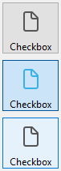
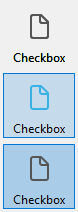
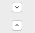

Une case à cocher est un type de bouton utilisée pour saisir ou afficher une donnée binaire (vrai-faux). Fondamentalement, elle est soit cochée, soit décochée, mais [un troisième état](#three-states-check-box) peut être défini.


Les cases à cocher sont contrôlées par des méthodes ou des [actions standard](#using-a-standard-action). La méthode associée à une case à cocher est exécutée lorsqu’elle est cochée. Comme tous les boutons, une case à cocher est initialisée à la valeur zéro lorsque le formulaire est ouvert pour la première fois.

Une case à cocher affiche généralement du texte en face de la case. Ce texte est défini dans la zone [Titre](properties_Object.md#title) du thème “Objets” de la Liste des propriétés. Vous pouvez saisir dans cette zone un libellé sous forme de référence XLIFF (cf. [Annexe B : Architecture XLIFF](https://doc.4d.com/4Dv17R5/4D/17-R5/Appendix-B-XLIFF-architecture.300-4163748.en.html)).

## Utiliser une case à cocher

Une case à cocher peut être associée à une [variable ou expression](properties_Object.md#variable-or-expression) de type entier ou booléen.

- **entier :** si la case est cochée, la variable prend la valeur 1. Lorsqu'elle n'est pas cochée, elle porte la valeur 0. Si la case à cocher a un troisième état (voir ci-dessous), elle porte la valeur 2.
- **booléen :** si la case est cochée, la variable prend la valeur `Vrai`. Lorsqu'elle n'est pas cochée, elle prend la valeur `Faux`.

Une partie ou la totalité des cases à cocher contenues dans un formulaires peut être cochée ou non cochée. Plusieurs cases à cocher permettent à l'utilisateur de cocher plusieurs options.

### Cases à cocher à trois états

Les objets case à cocher avec le [style de bouton](checkbox_overview.md#regular) [Normal](checkbox_overview.md#flat) et [Plat](properties_TextAndPicture.md#button-style) acceptent un troisième état. Ce troisième état représente un statut intermédiaire, généralement utilisé pour l’affichage. Il permet par exemple d’indiquer qu’une propriété est présente parmi une sélection d’objets mais pas dans chaque objet de la sélection.


Pour qu’une case à cocher prenne en charge ce troisième état, vous devez lui attribuer la propriété [Trois états](properties_Display.md#three-states) dans la Liste des propriétés, thème “Affichage” .

Cette propriété n’est disponible que pour les cases à cocher classiques et flat associées à des [variables ou expressions](properties_Object.md#variable-or-expression) numériques — les cases à cocher de représentation des expressions booléennes sont exclues de ce principe (une expression booléenne ne pouvant pas se trouver dans un état intermédiaire).

La variable associée à la case à cocher retourne la valeur 2 lorsque celle-ci se trouve dans le troisième état.

> En saisie, les cases à cocher à trois états affichent séquentiellement chaque état, dans l’ordre suivant : non coché / coché / intermédiaire / non coché, etc. L’état intermédiaire étant généralement inutile en saisie ; il vous suffit, dans le code, de “forcer” la valeur de la variable à 0 lorsqu’elle prend la valeur 2 afin de passer directement de l’état coché à l’état non coché.

## Utiliser une action standard

Vous pouvez affecter une [action standard](properties_Action.md#standard-action) à une case à cocher pour gérer les attributs des zones de texte. Par exemple, si vous sélectionnez l'action standard `fontBold`, à l'exécution la case à cocher permettra de gérer l'attribut "gras" du texte sélectionné dans la zone de texte courante.

Seules les actions qui peuvent représenter un statut vrai/faux (actions "à coche") sont prises en charge par cet objet :

| Actions prises en charge            | Conditions d'utilisation (le cas échéant) |
| ----------------------------------- | ------------------------------------------------------------ |
| avoidPageBreakInsideEnabled         | Zones 4D Write Pro uniquement                                |
| fontItalic                          |                                                              |
| fontBold                            |                                                              |
| fontLinethrough                     |                                                              |
| fontSubscript                       | Zones 4D Write Pro uniquement                                |
| fontSuperscript                     | Zones 4D Write Pro uniquement                                |
| fontUnderline                       |                                                              |
| font/showDialog                     | Mac uniquement                                               |
| htmlWYSIWIGEnabled                  | Zones 4D Write Pro uniquement                                |
| section/differentFirstPage          | Zones 4D Write Pro uniquement                                |
| section/differentLeftRightPages     | Zones 4D Write Pro uniquement                                |
| spell/autoCorrectionEnabled         |                                                              |
| spell/autoDashSubstitutionsEnabled  | Mac uniquement                                               |
| spell/autoLanguageEnabled           | Mac uniquement                                               |
| spell/autoQuoteSubstitutionsEnabled | Mac uniquement                                               |
| spell/autoSubstitutionsEnabled      |                                                              |
| spell/enabled                       |                                                              |
| spell/grammarEnabled                | Mac uniquement                                               |
| spell/showDialog                    | Mac uniquement                                               |
| spell/visibleSubstitutions          |                                                              |
| visibleBackground                   | Zones 4D Write Pro uniquement                                |
| visibleFooters                      | Zones 4D Write Pro uniquement                                |
| visibleHeaders                      | Zones 4D Write Pro uniquement                                |
| visibleHiddenChars                  | Zones 4D Write Pro uniquement                                |
| visibleHorizontalRuler              | Zones 4D Write Pro uniquement                                |
| visiblePageFrames                   | Zones 4D Write Pro uniquement                                |
| visibleReferences                   |                                                              |
| widowAndOrphanControlEnabled        | Zones 4D Write Pro uniquement                                |

Pour plus d'informations sur ces actions, veuillez vous reporter à la section [Actions standard](properties_Action.md#standard-action).

## Styles des boutons "Case à cocher"

Les cases à cocher utilisent [les styles de bouton](properties_TextAndPicture.md#button-style) pour contrôler l'apparence générale de la case à cocher ainsi que ses propriétés disponibles. Il est possible d'appliquer différents styles prédéfinis aux cases à cocher. Plusieurs variantes peuvent être obtenues en combinant ces propriétés/comportements.

À l'exception des [propriétés disponibles](#supported-properties), de nombreux objets case à cocher sont _structurellement_ identiques. La différence réside dans le traitement de leurs variables associées.

4D propose des cases à cocher avec les styles de bouton prédéfinis suivants :

### Classique

Le style Classique du bouton case à cocher correspond à un système de case à cocher standard (_i.e._, un rectangle avec un titre descriptif) :


#### Exemple JSON :

```
	"myCheckBox": {
		"type": "checkbox",	
		"style":"regular",
		"text": "Cancel",	
		"action": "Cancel", 	
		"left": 60,			
		"top": 160,		
		"width": 100,			
		"height": 20		
		"dataSourceTypeHint":"boolean"
		}
```

### A plat

Le style plat du bouton case à cocher a un design minimaliste. Le graphisme du style A plat est particulièrement utile pour les formulaires à imprimer.


#### Exemple JSON :

```
	"myCheckBox": {
			"type": "checkbox",	
			"style":"flat",
			"text": "Cancel",	
			"action": "cancel", 
			"left": 60,		
 			"top": 160,	
 			"width": 100,			
			"height": 20			
			}
```

### Bouton barre outils

Le style de bouton Barre d'outils est principalement destiné à l'intégration dans une barre d'outils.

Le style de bouton Barre d'outils a un arrière-plan transparent avec un titre. Il est généralement associé à une [image à 4 états](properties_TextAndPicture.md#number-of-states).

Exemples avec les états coché / non coché / surligné :


#### Exemple JSON :

```
	"myCheckBox": {
                "type": "checkbox",
                "style":"toolbar",	
                "text": "Checkbox",
				"icon": "/RESOURCES/File.png", 
				"iconFrames": 4 
                "left": 60,	
                "top": 160,	
                "width": 100,					
                "height": 20					
                }
```

### Bevel

La case à cocher Bevel combine l'apparence du style de bouton [Classique](#regular) (c'est-à-dire un rectangle avec un libellé descriptif) et le comportement du style de bouton [Barre d'outils](#toolbar-button).

Le style de bouton Bevel possède un fond gris clair et un titre. Il est généralement associé à une [image à 4 états](properties_TextAndPicture.md#number-of-states).

Exemples avec les états coché / non coché / surligné :



#### Exemple JSON :

```
	"myCheckBox": {
                "type": "checkbox",	
                "style":"bevel",
                "text": "Checkbox",	 
 				"icon": "/RESOURCES/File.png", 
				"iconFrames": 4 
              	"left": 60,	
                "top": 160,	
                "width": 100,				
                "height": 20				
                }
```

### Bevel arrondi

Le style de bouton de la case à cocher Bevel arrondi est presque identique au style de bouton [Bevel](#bevel), à l'exception des coins du bouton qui peuvent, selon le système d'exploitation, être arrondis. Comme pour le style de bouton Bevel, le style de bouton Bevel arrondi combine l'apparence du style de bouton [Classique](#regular) et le comportement du style de bouton [Barre outils](#toolbar-button).

Le style de bouton Bevel arrondi possède un fond gris clair et un titre. Il est généralement associé à une [image à 4 états](properties_TextAndPicture.md#number-of-states).

Exemple sous macOS :


> Sous Windows, le style de bouton Bevel arrondi est identique au style de bouton [Bevel](#bevel).

#### Exemple JSON :

```4d
	"myCheckBox": {
                "type": "checkbox",	
                "style":"roundedBevel",	 
                "text": "Checkbox",	
 				"icon": "/RESOURCES/File.png", 
				"iconFrames": 4 
                "left": 60,	
                "top": 160,	
                "width": 100,			
                "height": 20			
                }
```

### OS X Gradient

Le style du bouton OS X Gradient est presque identique au style du bouton [Bevel](#bevel). Comme pour le style Bevel, le style OS X Gradient combine l'apparence du style [Classique](#regular) et du style [Barre outils](#toolbar-button).

Le style Gradient OS X a un arrière-plan gris clair et un titre et s'affiche sous la forme d'un bouton système bicolore sur macOS. Il est généralement associé à une [image à 4 états](properties_TextAndPicture.md#number-of-states).


> Sous Windows, ce style est identique au style [Bevel](#bevel).

#### Exemple JSON :

```
	"myCheckBox": {
			"type": "checkbox",	
			"style":"gradientBevel", 
			"text": "Checkbox",	
			"icon": "/RESOURCES/File.png",
			"iconFrames": 4
			"left": 60,		
			"top": 160,		
			"width": 100,				
			"height": 20				
           }
```

### OS X Texture

Le style de bouton OS X Textured est presque identique au style [Bevel](#bevel) mais avec une taille plus petite (la taille maximale est celle d'un bouton système standard de macOS). Comme pour le style Bevel, le style OS X Textured combine l'apparence du style [Classique](#regular) et du style [Barre outils](#toolbar-button).

Par défaut, le style OS X Textured apparaît comme :

- _Windows_ - un bouton système standard avec un fond bleu clair et un libellé au centre.


- _macOS_ - un bouton système standard. Sa hauteur est prédéfinie : il n'est pas possible de l'agrandir ou de la réduire.


#### Exemple JSON :

```
	"myCheckBox": {
			"type": "checkbox",	
			"style":"texturedBevel", 
			"text": "Checkbox",	
			"left": 60,	
			"top": 160,	
			"width": 100,					
			"height": 20					
			}
```

### Office XP

Le style de bouton Office XP combine l'apparence du style [Classique](#regular) et du comportement du style [Barre outils](#toolbar-button).

Les couleurs (surbrillance et arrière-plan) d'une case à cocher avec le style de bouton Office XP sont basées sur les couleurs du système. L'apparence de la case à cocher peut être différente lorsque le curseur la survole, selon le système d'exploitation :

- _Sous Windows_ - son arrière-plan n'apparaît que lorsque la souris le survole. Exemples avec les états coché / non coché / surligné :



- _Sous macOS_ - son arrière-plan est toujours affiché. Exemples avec les états cochés / non cochés :


#### Exemple JSON :

```
	"myCheckBox": {
                "type": "checkbox",	
                "style":"office",
                "text": "Checkbox",	 
                "action": "fontBold",
 				"icon": "/RESOURCES/File.png", 
				"iconFrames": 4 	
               "left": 60,	
                "top": 160,		
                "width": 100,			
                "height": 20			
                }
```

### Contracter/Déployer

Ce style de case à cocher peut être utilisé pour ajouter une icône standard contracter/déployer. Ces icônes sont utilisées nativement dans les listes hiérarchiques.

- _Sous Windows_ - le bouton est semblable à [+] ou à [-]


- _Sous macOS_ - il ressemble à un triangle pointant sur vers la droite ou vers le bas.


:::info

Le style contracter/déployer est nommé "disclosure" dans la [grammaire JSON du style de bouton](properties_TextAndPicture.md#button-style).

:::

#### Exemple JSON :

```
	"myCheckBox": {
                "type": "checkbox",	
                "style":"disclosure",
				"method": "m_collapse",
				"left": 60,	
                "top": 160,	
                "width": 100,			
                "height": 20			
                }
```

### Disclosure

Sous macOS et Windows, une case à cocher avec le style "Disclosure" apparaît comme un bouton disclosure standard, généralement utilisé pour afficher/masquer des informations supplémentaires. Lorsqu'il est utilisé comme bouton radio, le symbole du bouton pointe vers le bas avec la valeur 0 et vers le haut avec la valeur 1.

- _Windows_

  

- _macOS_

  

:::info

Le style Disclosure est nommé "roundedDisclosure" dans la [grammaire JSON du style de bouton](properties_TextAndPicture.md#button-style).

:::

#### Exemple JSON :

```
	"myCheckBox": {
                "type": "checkbox",		
                "style":"roundedDisclosure",	
				"method": "m_disclose",
                "left": 60,		
                "top": 160,	
                "width": 100,			
                "height": 20			
                }
```

### Personnalisé

Le style de case à cocher personnalisé accepte une image d'arrière-plan personnalisée et permet de gérer des propriétés spécifiques :

- [Background pathname](properties_TextAndPicture.md#background-pathname)
- [Décalage de l'icône](properties_TextAndPicture.md#icon-offset)
- [Horizontal Margin](properties_TextAndPicture.md#horizontal-margin) and [Vertical Margin](properties_TextAndPicture.md#vertical-margin)

It is usually associated with a [4-state picture](properties_TextAndPicture.md#number-of-states), that can be used in conjunction with a [4-state](properties_TextAndPicture.md#number-of-states) [background picture](properties_TextAndPicture.md#background-pathname).

#### Exemple JSON :

```
	"myCheckbox": {
		"type": "checkbox",
		"style":"custom",
		"text": "OK", 
		"icon": "/RESOURCES/smiley.jpg", 
		"iconFrame": 4, 
		"customBackgroundPicture": "/RESOURCES/paper.jpg", 
		"iconOffset": 5, //custom icon offset when clicked
		"left": 60,	
		"top": 160,	
		"width": 100,		
		"height": 20,
		"customBorderX": 20,
		"customBorderY": 5
		}
```

## Propriétés prises en charge

Toutes les cases à cocher partagent une même série de propriétés de base :

[Bold](properties_Text.md#bold) - [Bottom](properties_CoordinatesAndSizing.md#bottom) - [Button Style](properties_TextAndPicture.md#button-style) - [Class](properties_Object.md#css-class) - [Enterable](properties_Entry.md#enterable) - [Expression Type](properties_Object.md#expression-type) - [Focusable](properties_Entry.md#focusable) - [Font](properties_Text.md#font) - [Font Color](properties_Text.md#font-color) - [Font Size](properties_Text.md#font-size) - [Height](properties_CoordinatesAndSizing.md#height) - [Help Tip](properties_Help.md#help-tip) - [Horizontal Alignment](properties_Text.md#horizontal-alignment)(1) - [Horizontal Sizing](properties_ResizingOptions.md#horizontal-sizing) - [Image hugs title](properties_TextAndPicture.md#image-hugs-title)(2) - [Italic](properties_Text.md#italic) - [Left](properties_CoordinatesAndSizing.md#left) - [Number of States](properties_TextAndPicture.md#number-of-states)(2) - [Object Name](properties_Object.md#object-name) - [Picture pathname](properties_TextAndPicture.md#picture-pathname)(2) - [Right](properties_CoordinatesAndSizing.md#right) - [Save value](properties_Object.md#save-value) - [Shortcut](properties_Entry.md#shortcut) - [Standard action](properties_Action.md#standard-action) - [Title](properties_Object.md#title) - [Title/Picture Position](properties_TextAndPicture.md#titlepicture-position)(2) - [Top](properties_CoordinatesAndSizing.md#top) - [Type](properties_Object.md#type) - [Underline](properties_Text.md#underline) - [Variable or Expression](properties_Object.md#variable-or-expression) - [Vertical Sizing](properties_ResizingOptions.md#vertical-sizing) - [Visibility](properties_Display.md#visibility) - [Width](properties_CoordinatesAndSizing.md#width)

> (1) Non pris en charge par les styles [Regular](#regular) et [Flat](#flat).<br/>
> (2) Non pris en charge par les styles [Regular](#regular), [Flat](#flat), [Disclosure](#disclosure) et [Collapse/Expand](#collapseexpand).

Des propriétés spécifiques supplémentaires sont disponibles, en fonction du [style de bouton](#button-styles) :

- Custom: [Background pathname](properties_TextAndPicture.md#background-pathname) - [Horizontal Margin](properties_TextAndPicture.md#horizontal-margin) - [Icon Offset](properties_TextAndPicture.md#icon-offset) - [Vertical Margin](properties_TextAndPicture.md#vertical-margin)
- Flat, Regular: [Trois états](properties_Display.md#three-states)
