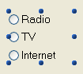

Les boutons radio sont des objets qui permettent à l’utilisateur de sélectionner une valeur parmi un groupe de valeurs.

Un bouton radio apparaît sous la forme d’un texte suivi d’un cercle. Cependant, les boutons radio peuvent avoir [différentes apparences](#button-styles).

Un bouton radio est sélectionné :

- lorsque l'utilisateur clique dessus
- lorsqu'il a le focus et que l'utilisateur appuie sur la touche **Espace**.

## Configuration des boutons radio

Les boutons radio sont utilisés sous forme d’ensembles coordonnés : un seul bouton peut être sélectionné à la fois parmi l’ensemble. Afin de fonctionner de manière coordonnée, un ensemble de boutons radio doit partager la même propriété de [groupe radio](properties_Object.md#radio-group).

Les boutons radio sont contrôlés par des méthodes. Comme pour tous les boutons, la variable associée au bouton radio est initialisée à 0 (zéro) lorsque le formulaire est ouvert pour la première fois. Une méthode associée à un bouton radio est exécutée lorsqu’il est sélectionné. L’exemple suivant représente des boutons radio utilisés dans une base de données d’enregistrements audio et se rapporte à la vitesse d’enregistrement :

Sélectionner un bouton radio d’un groupe met ce bouton à 1 et les autres boutons du groupe à 0. Un seul bouton radio du groupe peut être sélectionné à la fois.

> You can associate [Boolean type expressions](properties_Object.md#variable-or-expression) with radio buttons. Dans ce cas, lorsqu'un bouton radio d'un groupe est sélectionné, sa variable est True et les variables des autres boutons radio du groupe sont False.

La valeur contenue dans un objet bouton radio n’est pas sauvegardée automatiquement (hormis s'il s'agit de la représentation d'un champ booléen) ; les valeurs des boutons radio doivent être stockées dans leurs variables et gérées à l’aide de méthodes.

## Styles de bouton

[Les styles de bouton](properties_TextAndPicture.md#button-style) radio contrôlent l'apparence générale du bouton radio ainsi que ses propriétés disponibles. Il est possible d'appliquer différents styles prédéfinis aux boutons radio. Cependant, le même style de bouton doit être appliqué à tous les boutons radio d'un groupe afin qu'ils fonctionnent comme prévu.

4D propose des boutons radio dans les styles prédéfinis suivants :

### Classique

Le style de bouton radio Classique est un bouton système standard (c'est-à-dire une bulle avec un libellé) qui exécute le code lorsqu'un utilisateur clique dessus.

En plus de lancer l'exécution du code, le style de bouton radio Classique change la couleur de la bulle lors du survol.

### A plat

Le style de bouton radio A plat est un bouton système standard (c'est-à-dire une bulle avec un libellé) qui exécute le code lorsqu'un utilisateur clique dessus.

Par défaut, le style A plat a une apparence minimaliste. Le style graphique du bouton A plat est particulièrement utile pour les formulaires à imprimer.

### Toolbar (Barre d’outils)

Le style du bouton radio Barre d'outils est initialement destiné à être intégré dans une barre d'outils.

Par défaut, le style bouton Barre d'outils a un fond transparent avec un libellé au centre. En fonction du système d'exploitation, le design du bouton peut changer lorsque la souris le survole :

- _Sous Windows_ - le contour du bouton apparaît.

- _Sous macOS_ - le contour du bouton n’apparaît jamais.

### Bevel

Le style de bouton radio Bevel est similaire au comportement du style [barre d'outils](#toolbar), à la seule différence qu'il possède un arrière-plan gris clair et un contour gris. En fonction du système d'exploitation, le design du bouton peut changer lorsque la souris le survole :

- _Sous Windows_ - le contour du bouton apparaît.

- _Sous macOS_ - le contour du bouton n’apparaît jamais.

### Bevel arrondi

Le style du bouton Bevel arrondi est presque identique au style [Bevel](#bevel), à l'exception des coins du bouton qui peuvent, selon le système d'exploitation, être arrondis.

- _Sous Windows_ - ce bouton est identique au style [Bevel](#bevel).

- _Sous macOS_ - les coins du bouton sont arrondis.
  

### OS X Gradient

Le style du bouton OS X Gradient est presque identique au style [Bevel](#bevel), à l'exception de son apparence qui peut, en fonction du système d'exploitation, avoir deux tons.

- _Sous Windows_ - ce bouton est identique au style [Bevel](#bevel).

- _Sous macOs_ - le bouton s'affiche comme un bouton à deux tons.

### OS X Texture

Le style du bouton radio OS X Textured est presque identique au style [Barre d'outils](#toolbar), à l'exception de son apparence qui peut, en fonction du système d'exploitation, être différente et ne pas afficher le survol.

Par défaut, le style OS X Textured apparaît comme :

- _Sous Windows_ - un bouton en forme de barre d'outils avec une étiquette au centre et l'arrière-plan est toujours affiché.

- _Sous macOS_ - un bouton système standard affichant un changement de couleur du gris clair au gris foncé. Sa hauteur est prédéfinie : il n'est pas possible de l'agrandir ou de la réduire.

### Office XP

Le style de bouton Office XP combine l'apparence du style [Classique](#regular) (bouton système standard) et du comportement du style [Barre outils](#toolbar).

Les couleurs (surbrillance et arrière-plan) d'un bouton au style Office XP sont basées sur les couleurs du système. En fonction du système d'exploitation, le design du bouton peut changer lorsque la souris le survole :

- _Sous Windows_ - son arrière-plan n'apparaît que lorsque la souris le survole.

- _Sous macOS_ - son arrière-plan est toujours affiché.

### Contracter/Déployer

Ce style de bouton peut être utilisé pour ajouter une icône standard contracter/déployer. Ces boutons sont utilisés nativement dans les listes hiérarchiques. Sous Windows, le bouton ressemble à un [+] ou un [-]; sous macOS, cela ressemble à un triangle pointant vers la droite ou vers le bas.

:::info

Le style contracter/déployer est nommé "disclosure" dans la [grammaire JSON du style de bouton](properties_TextAndPicture.md#button-style).

:::

### Disclosure

Le style de bouton radio disclosure affiche le bouton radio comme un bouton disclosure standard, généralement utilisé pour afficher/masquer des informations supplémentaires. Le symbole du bouton pointe vers le bas avec la valeur 0 et vers le haut avec la valeur 1.

:::info

Le style Disclosure est nommé "roundedDisclosure" dans la [grammaire JSON du style de bouton](properties_TextAndPicture.md#button-style).

:::

### Personnalisé

The Custom radio button style accepts a personalized background picture and allows managing additional parameters such as [icon offset](properties_TextAndPicture.md#icon-offset) and [margins](properties_TextAndPicture.md#horizontal-margin).

## Propriétés prises en charge

Tous les boutons radio partagent une même série de propriétés de base :

[Bold](properties_Text.md#bold) - [Bottom](properties_CoordinatesAndSizing.md#bottom) - [Button Style](properties_TextAndPicture.md#button-style) - [Class](properties_Object.md#css-class) - [Expression Type](properties_Object.md#expression-type) - [Focusable](properties_Entry.md#focusable) - [Font](properties_Text.md#font) - [Font Color](properties_Text.md#font-color) - [Height](properties_CoordinatesAndSizing.md#height) - [Help Tip](properties_Help.md#help-tip) - [Horizontal Alignment](properties_Text.md#horizontal-alignment)(1) - [Horizontal Sizing](properties_ResizingOptions.md#horizontal-sizing) - [Image hugs title](properties_TextAndPicture.md#image-hugs-title)(2) - [Italic](properties_Text.md#italic) - [Left](properties_CoordinatesAndSizing.md#left) - [Number of States](properties_TextAndPicture.md#number-of-states)(2) - [Method](properties_Action.md#method) - [Object Name](properties_Object.md#object-name) - [Radio Group](properties_Object.md#radio-group) - [Picture pathname](properties_TextAndPicture.md#picture-pathname)(2) - [Right](properties_CoordinatesAndSizing.md#right) - [Save value](properties_Object.md#save-value) - [Shortcut](properties_Entry.md#shortcut) - [Title](properties_Object.md#title) - [Title/Picture Position](properties_TextAndPicture.md#titlepicture-position)(2) - [Top](properties_CoordinatesAndSizing.md#top) - [Type](properties_Object.md#type) - [Underline](properties_Text.md#underline) - [Variable or Expression](properties_Object.md#variable-or-expression) - [Vertical Sizing](properties_ResizingOptions.md#vertical-sizing) - [Visibility](properties_Display.md#visibility) - [Width](properties_CoordinatesAndSizing.md#width)

> (1) Non pris en charge par les styles [Regular](#regular) et [Flat](#flat). 
> (2) Non pris en charge par les styles [Regular](#regular), [Flat](#flat), [Disclosure](#disclosure) et [Collapse/Expand](#collapseexpand).

Des propriétés spécifiques supplémentaires sont disponibles en fonction du [style de bouton](#button-styles) :

- Custom: [Background pathname](properties_TextAndPicture.md#background-pathname) - [Horizontal Margin](properties_TextAndPicture.md#horizontal-margin) - [Icon Offset](properties_TextAndPicture.md#icon-offset) - [Vertical Margin](properties_TextAndPicture.md#vertical-margin)
