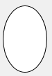

Les formes sont des [objets statiques](formObjects_overview.md#active-and-static-objects) qui peuvent être ajoutées à des formes 4D.

Les formes 4D prennent en charge les formes basiques suivantes :

- rectangles
- lignes
- ovales

## Rectangle

Un rectangle statique est un objet décoratif contenu dans les formulaires. Les rectangles sont limités à des formes carrées.

Les rectangles sont créés à l'aide de plusieurs propriétés (couleur, épaisseur de ligne, motif, etc.). L'[arrondi](properties_CoordinatesAndSizing.md#corner-radius), en particulier, des coins du rectangle peuvent être définis.


#### Exemple JSON :

```4d
	"myRectangle": {
		"type": "rectangle",	//define the type of object
		"left": 60,				//left position on the form  
		"top": 160,				//top position on the form 
		"width": 100,			//width of the object
		"height": 20,			//height of the object
		"borderRadius": 20		//define the roundness of the corners
                }
```

#### Propriétés prises en charge

[Bottom](properties_CoordinatesAndSizing.md#bottom) - [Class](properties_Object.md#css-class) - [Corner radius](properties_CoordinatesAndSizing.md#corner-radius) - [Dotted Line Type](properties_BackgroundAndBorder.md#dotted-line-type) - [Fill Color](properties_BackgroundAndBorder.md#background-color--fill-color) - [Height](properties_CoordinatesAndSizing.md#height) - [Horizontal Sizing](properties_ResizingOptions.md#horizontal-sizing) - [Left](properties_CoordinatesAndSizing.md#left) - [Line Color](properties_BackgroundAndBorder.md#line-color) - [Line Width](properties_BackgroundAndBorder.md#line-width) - [Object Name](properties_Object.md#object-name) - [Right](properties_CoordinatesAndSizing.md#right) - [Top](properties_CoordinatesAndSizing.md#top) - [Type](properties_Object.md#type) - [Vertical Sizing](properties_ResizingOptions.md#vertical-sizing) - [Visibility](properties_Display.md#visibility) - [Width](properties_CoordinatesAndSizing.md#width)

## Ligne

Une ligne statique est un objet décoratif pour les formulaires, entre deux tracés. Les lignes peuvent être horizontales, verticales ou de toute forme d'angle.

Les lignes sont créées à l'aide de plusieurs propriétés (couleur, épaisseur de ligne, etc.).

### propriété startPoint

La propriété JSON `startPoint` définit à partir de quelle coordonnée la ligne peut être dessinée (voir l'exemple).

> la propriété `startPoint` n'est pas exposée dans la liste des propriétés, où la direction du dessin de ligne est visible.

#### Exemple JSON :

```
	"myLine": {
		"type": "line",	               
		"left": 20,
		"top": 40,
		"width": 100,
		"height": 80,
		"startPoint": "topLeft", //first direction
		"strokeDashArray": "6 2" //dashed
		}
```

Result:


```
	"myLine": {
		"type": "line",	               
		"left": 20,
		"top": 40,
		"width": 100,
		"height": 80,
		"startPoint": "bottomLeft", //2nd direction
		"strokeDashArray": "6 2" //dashed
		}
```

Result:


#### Propriétés prises en charge

[Bottom](properties_CoordinatesAndSizing.md#bottom) - [Class](properties_Object.md#css-class) - [Dotted Line Type](properties_BackgroundAndBorder.md#dotted-line-type) - [Height](properties_CoordinatesAndSizing.md#height) - [Horizontal Sizing](properties_ResizingOptions.md#horizontal-sizing) - [Left](properties_CoordinatesAndSizing.md#left) - [Line Color](properties_BackgroundAndBorder.md#line-color) - [Line Width](properties_BackgroundAndBorder.md#line-width) - [Object Name](properties_Object.md#object-name) - [Right](properties_CoordinatesAndSizing.md#right) - [startPoint](#startpoint-property) - [Top](properties_CoordinatesAndSizing.md#top) - [Type](properties_Object.md#type) - [Vertical Sizing](properties_ResizingOptions.md#vertical-sizing) - [Visibility](properties_Display.md#visibility) - [Width](properties_CoordinatesAndSizing.md#width)

## Ovale

Un ovale statique est un objet décoratif contenu dans les formulaires. Les objets de forme ovale peuvent être utilisés pour dessiner des formes circulaires (lorsque les propriétés [largeur](properties_CoordinatesAndSizing.md#width) et [hauteur](properties_CoordinatesAndSizing.md#height) sont identiques).



#### Exemple JSON :

```4d
	"myOval": {
		"type": "oval",		//define the type of object
		"left": 60,			//left position on the form  
		"top": 160,			//top position on the form 
		"width": 100,		//width of the object
		"height": 20,		//height of the object
		"fill": "blue"		//define the background color
                }
```

#### Propriétés prises en charge

[Bottom](properties_CoordinatesAndSizing.md#bottom) - [Class](properties_Object.md#css-class) - [Dotted Line Type](properties_BackgroundAndBorder.md#dotted-line-type) - [Fill Color](properties_BackgroundAndBorder.md#background-color--fill-color) - [Height](properties_CoordinatesAndSizing.md#height) - [Horizontal Sizing](properties_ResizingOptions.md#horizontal-sizing) - [Left](properties_CoordinatesAndSizing.md#left) - [Line Color](properties_BackgroundAndBorder.md#line-color) - [Line Width](properties_BackgroundAndBorder.md#line-width) - [Object Name](properties_Object.md#object-name) - [Right](properties_CoordinatesAndSizing.md#right) - [Top](properties_CoordinatesAndSizing.md#top) - [Type](properties_Object.md#type) - [Vertical Sizing](properties_ResizingOptions.md#vertical-sizing) - [Visibility](properties_Display.md#visibility) - [Width](properties_CoordinatesAndSizing.md#width)
