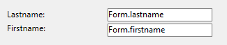

Un sous-formulaire est un formulaire inclus dans un autre formulaire.

## Terminologie

Afin de bien définir les notions mises en oeuvre avec les sous-formulaires, voici quelques définitions relatives aux termes employés :

- **Sous-formulaire** : formulaire destiné à être inclus dans un autre formulaire, lui-même nommé formulaire parent.
- **Formulaire parent** : formulaire contenant un ou plusieurs sous-formulaire(s).
- **Conteneur de sous-formulaire** : objet inclus dans le formulaire parent, contenant une instance du sous-formulaire.
- **Instance de sous-formulaire** : la représentation d’un sous-formulaire dans un formulaire parent. Cette notion est importante car il est possible d’afficher plusieurs instances d’un même sous-formulaire dans un formulaire parent.
- **Formulaire liste écran** : instance de sous-formulaire en liste.
- **Formulaire détaillé** : formulaire de saisie en page associé au sous-formulaire en liste et accessible via un double-clic dans la liste.

## Sous-formulaires en liste

Un sous-formulaire en liste vous permet de saisir, visualiser et modifier des données dans d’autres tables. Les sous-formulaires en liste sont généralement utilisés avec les bases de données utilisant des liens de type 1 vers N. Un sous-formulaire en liste affiche les enregistrements de la table N liée par un lien automatique de type 1 vers N. Vous pouvez disposer de plusieurs sous-formulaires provenant de différentes tables dans le même formulaire. En revanche, il n’est pas possible de placer deux sous-formulaires appartenant à la même table dans une même page de formulaire.

Par exemple, une base de gestion de contacts peut utiliser une instance de sous-formulaire en liste pour afficher tous les contacts d’une société. Bien que les contacts apparaissent dans l’écran général, l’information est en fait stockée dans la table liée. A l’aide d’un lien 1 vers N, la conception de cette base de données rend facile le stockage d’un nombre illimité de contacts pour chacune des sociétés. Avec des liens automatiques, vous pouvez permettre la saisie de données dans la table liée sans programmation.

Bien que les sous-formulaires en liste soient généralement associés aux tables N, une instance de sous-formulaire peut afficher des enregistrements de toute autre table de la base de données.

Vous pouvez également permettre à l’utilisateur de saisir des données dans le formulaire liste.
Suivant la configuration du sous-formulaire, l’utilisateur pourra afficher le formulaire détaillé en double-cliquant sur un sous-enregistrement ou en utilisant les commandes d’ajout et de modification des sous-enregistrements.

> 4D propose trois actions standard, permettant de répondre aux besoins élémentaires de gestion des sous-enregistrements : `Modifier sous-enregistrement`, `Supprimer sous-enregistrement` et `Ajouter sous-enregistrement`. Lorsque le formulaire comporte plusieurs instances de sous-formulaires, l’action s’applique au sous-formulaire ayant le focus.

## Sous-formulaires en page

Les sous-formulaires en mode page peuvent afficher des données relatives à l'enregistrement courant ou toute valeur pertinente en fonction du contexte (variables, images, etc.). Il peuvent également, et c'est là leur intérêt majeur, comporter des fonctionnalités avancées et interagir avec le formulaire parent (widgets). Les sous-formulaires en page bénéficient de propriétés et d'événements spécifiques, et peuvent être entièrement contrôlés par programmation.

Le sous-formulaire en page utilise le formulaire entrée désigné par la propriété [Formulaire détaillé](properties_Subform.md#detail-form). A la différence d’un sous-formulaire en mode liste, le formulaire utilisé peut provenir de la même table que le formulaire parent. Il est également possible d’utiliser un formulaire projet. En exécution, un sous-formulaire en mode page dispose des caractéristiques d’affichage standard d’un formulaire entrée.

> Les widgets 4D sont des objets composés prédéfinis. Ils sont décrits en détail dans le manuel [4D Widgets](https://doc.4d.com/4Dv19/4D/19/4D-Widgets.100-5462909.en.html).

### Utilisation de la variable ou de l'expression liée

You can bind [a variable or an expression](properties_Object.md#variable-or-expression) to a subform container object. Cette fonction est très utile pour synchroniser les valeurs du formulaire parent et de son/ses sous-formulaire(s).

By default, 4D creates a variable or expression of [object type](properties_Object.md#expression-type) for a subform container, which allows you to share values in the context of the subform using the `Form` command ([see below](#using-the-subform-bound-object)). However, you can use a variable or expression of any scalar type (time, integer, etc.) especially if you only need to share a single value:

- Define a bound variable or expression of a scalar type and call the `OBJECT Get subform container value` and `OBJECT SET SUBFORM CONTAINER VALUE` commands to exchange values when [On Bound Variable Change](../Events/onBoundVariableChange.md) or [On Data Change](../Events/onDataChange.md) form events occur. Cette solution est recommandée pour synchroniser une seule valeur.
- Define a bound variable or expression of the **object** type and use the `Form` command to access its properties from the subform. Cette solution est recommandée pour synchroniser plusieurs valeurs.

### Synchronisation du formulaire parent et du sous-formulaire (valeur unique)

Relier la même variable ou expression au conteneur du sous-formulaire et à d'autres objets du formulaire parent vous permet de relier les contextes du formulaire parent et du sous-formulaire pour apporter la touche finale à des interfaces sophistiquées. Imagine a subform that contains a clock displaying a static time, inserted into a parent form containing an [input area](input_overview.md):


Dans le formulaire parent, les deux objets (zone de saisie et conteneur de sous-formulaire) **ont la même valeur que *Variable ou expression***. It can be a variable (e.g. `parisTime`), or an expression (e.g. `Form.parisTime`).

:::info

To display a static time, you must use the appropriate [data type](properties_DataSource.md#data-type-expression-type) for the [variable or expression](properties_Object.md#variable-or-expression):

- If you use a variable (e.g. `parisTime`), it must be of the `text` or `time` type.
- If you use an expression (e.g. `Form.myValue`), it must contain a `text` value.

La valeur texte doit être formatée "hh:mm:ss".

:::

In the subform, the clock object is managed through the `Form.clockValue` property.

#### Mise à jour du contenu d'un sous-formulaire

Scénario 1 : La valeur de la variable ou de l'expression du formulaire parent est modifiée et cette modification doit être transmise à un sous-formulaire.

`parisTime` or `Form.parisTime` changes to "12:15:00" in the parent form, either because the user entered it, or because it was updated dynamically (via the `String(Current time)` statement for example). This triggers the [On Bound Variable Change](../Events/onBoundVariableChange.md) event in the subform's Form method.

Le code suivant est exécuté :

```4d
// Subform form method
If (Form event code=On Bound Variable Change) //bound variable or expression was modified in the parent form
	Form.clockValue:=OBJECT Get subform container value //synchonize the local value
End if
```

It updates the value of `Form.clockValue` in the subform:


L’événement formulaire [Sur modif variable liée](../Events/onBoundVariableChange.md) est généré :

- dès qu'une valeur est assignée à la variable/expression du formulaire parent, même si la même valeur est réassignée
- si le sous-formulaire appartient à la page formulaire courante ou à la page 0.

Note that, as in the above example, it is preferable to use the `OBJECT Get subform container value` command which returns the value of the expression in the subform container rather than the expression itself because it is possible to insert several subforms in the same parent form (for example, a window displaying different time zones contains several clocks).

La modification de la variable ou de l'expression liée déclenche des événements formulaire qui vous permettent de synchroniser les valeurs du formulaire parent et du sous-formulaire :

- Use the [On Bound Variable Change](../Events/onBoundVariableChange.md) form event to indicate to the subform (form method of subform) that the variable or expression was modified in the parent form.
- Use the [On Data Change](../Events/onDataChange.md) form event to indicate to the subform container that the variable or expression value was modified in the subform.

#### Mise à jour du contenu d'un formulaire parent

Scénario 2 : Le contenu du sous-formulaire est modifié et cette modification doit être répercutée dans le formulaire parent.

Dans le sous-formulaire, le bouton modifie la valeur de l'expression `Form.clockValue` de type Texte attachée à l'objet horloge. Cela déclenche l'événement formulaire [On Data Change](../Events/onDataChange.md) dans l'objet horloge (cet événement doit être sélectionné pour l'objet), qui met à jour la valeur `Form.parisTime` dans le formulaire principal.

Le code suivant est exécuté :

```4d
// subform clock object method
If (Form event code=On Data Change) //whatever the way the value is changed
	OBJECT SET SUBFORM CONTAINER VALUE(Form.clockValue) //Push the value to the container
End if
```


Everytime the value of `Form.clockValue` changes in the subform, `parisTime` or `Form.parisTime` in the subform container is also updated.

> Si la valeur de la variable ou de l'expression est définie à plusieurs endroits, 4D utilise la dernière valeur chargée. L'ordre de chargement suivant est appliqué : 1-Méthodes objet du sous-formulaire, 2-Méthode formulaire du sous-formulaire, 3-Méthodes objet du formulaire parent, 4-Méthode formulaire du formulaire parent.

### Synchronisation du formulaire parent et du sous-formulaire (valeurs multiples)

By default, 4D binds a variable or expression of [object type](properties_Object.md#expression-type) to each subform. Le contenu de cet objet peut être lu et/ou modifié à partir du formulaire parent et du sous-formulaire, ce qui permet de partager plusieurs valeurs dans un contexte local.

When bound a the subform container, this object is returned by the `Form` command directly in the subform. Comme les objets sont toujours passés par référence, si l'utilisateur modifie la valeur d'une propriété dans le sous-formulaire, cette valeur sera automatiquement enregistrée dans l'objet lui-même et donc disponible pour le formulaire parent. En revanche, si une propriété de l'objet est modifiée par l'utilisateur dans le formulaire parent ou par programmation, elle sera automatiquement mise à jour dans le sous-formulaire. Aucune gestion d'événement n'est nécessaire.

For example, in a subform, inputs are bound to the `Form` object properties (of the subform form):



Dans le formulaire parent, vous affichez le sous-formulaire deux fois. Each subform container is bound to an expression which is a property of the `Form` object (of the parent form):


The button only creates `mother` and `father` properties in the parent's `Form` object:

```4d
//Add values button object method
Form.mother:=New object("lastname"; "Hotel"; "firstname"; "Anne")
Form.father:=New object("lastname"; "Golf"; "firstname"; "Félix")
```

Lorsque vous exécutez le formulaire et cliquez sur le bouton, vous constatez que toutes les valeurs sont correctement affichées :


Si vous modifiez une valeur dans le formulaire parent ou dans le sous-formulaire, elle est automatiquement mise à jour dans l'autre formulaire car le même objet est utilisé :


### Utilisation de pointeurs (compatibilité)

In versions prior to 4D v19 R5, synchronization between parent forms and subforms was handled through **pointers**. Par exemple, pour mettre à jour un objet de type sous-formulaire, vous pouviez appeler le code suivant :

```4d
// Subform form method
If (Form event code=On Bound Variable Change) 
	ptr:=OBJECT Get pointer(Object subform container) 
	clockValue:=ptr-> 
End if
```

**This principle is still supported for compatibility but is now deprecated since it does not allow binding expressions to subforms.** It should no longer be used in your developments. In any cases, we recommend to use the [`Form` command](#synchronizing-parent-form-and-subform-multiple-values) or the [`OBJECT Get subform container value` and `OBJECT SET SUBFORM CONTAINER VALUE` commands](#synchronizing-parent-form-and-subform-single-value) to synchronize form and subform values.

### Programmation inter-formulaires avancée

La communication entre le formulaire parent et les instances du sous-formulaire peut nécessiter d'aller au-delà de l'échange de valeurs par l'intermédiaire de la variable liée. En effet, vous pouvez souhaiter mettre à jour des variables dans les sous-formulaires en fonction d’actions effectuées dans le formulaire parent et inversement. Si l’on reprend l’exemple du sous-formulaire de type "pendule dynamique", on peut souhaiter définir une ou plusieurs heures d’alerte par pendule.

Pour répondre à ces besoins, 4D propose les mécanismes suivants :

- Appel de l’objet conteneur depuis le sous-formulaire via la commande `CALL SUBFORM CONTAINER`
- Exécution d’une méthode dans le contexte du sous-formulaire via la commande `EXECUTE METHOD IN SUBFORM`

> La commande `GOTO OBJECT` peut rechercher l’objet de destination dans le formulaire parent même si elle exécutée depuis un sous-formulaire.

#### Commande CALL SUBFORM CONTAINER

The `CALL SUBFORM CONTAINER` command lets a subform instance send an [event](../Events/overview.md) to the subform container object, which can then process it in the context of the parent form. L’événement est reçu dans la méthode de l’objet conteneur. Il peut s’agir à l’origine de tout événement détecté par le sous-formulaire (clic, glisser-déposer, etc.).

Le code de l’événement est libre (par exemple, 20000 ou -100). Vous pouvez soit utiliser un code correspondant à un événement existant (par exemple, 3 pour `Sur validation`), soit utiliser un code personnalisé. Dans le premier cas, seuls les événements présents dans la liste des événements "cochables" des conteneurs de sous-formulaire peuvent être utilisés (cf. Liste des propriétés). Dans le second cas, le code ne doit correspondre à aucun événement formulaire existant. Il est conseillé d’utiliser une valeur négative pour avoir l’assurance que 4D n’utilisera pas ce code dans les versions futures.

Pour plus d'informations, reportez-vous à la description de la commande `CALL SUBFORM CONTAINER`.

#### Commande EXECUTE METHOD IN SUBFORM

La commande `EXECUTE METHOD IN SUBFORM` permet à un formulaire ou à l’un de ses objets de demander l’exécution d’une méthode dans le contexte de l’instance du sous-formulaire, ce qui lui donne accès aux variables, objets, etc., du sous-formulaire. Cette méthode peut en outre recevoir des paramètres.

Ce mécanisme est illustré dans le schéma suivant :


Pour plus d'informations, reportez-vous à la description de la commande `EXECUTE METHOD IN SUBFORM`.

## Propriétés prises en charge

[Border Line Style](properties_BackgroundAndBorder.md#border-line-style) - [Bottom](properties_CoordinatesAndSizing.md#bottom) - [Class](properties_Object.md#css-class) - [Detail Form](properties_Subform.md#detail-form) - [Double click on empty row](properties_Subform.md#double-click-on-empty-row) - [Double click on row](properties_Subform.md#double-click-on-row) - [Enterable in list](properties_Subform.md#enterable-in-list) - [Expression Type](properties_Object.md#expression-type) - [Focusable](properties_Entry.md#focusable) - [Height](properties_CoordinatesAndSizing.md#height) -
[Hide focus rectangle](properties_Appearance.md#hide-focus-rectangle) -
[Horizontal Scroll Bar](properties_Appearance.md#horizontal-scroll-bar) - [Horizontal Sizing](properties_ResizingOptions.md#horizontal-sizing) - [Left](properties_CoordinatesAndSizing.md#left) - [List Form](properties_Subform.md#list-form) - [Method](properties_Action.md#method) - [Object Name](properties_Object.md#object-name) - [Print Frame](properties_Print.md#print-frame) - [Right](properties_CoordinatesAndSizing.md#right) - [Selection mode](properties_Subform.md#selection-mode) - [Source](properties_Subform.md#source) - [Top](properties_CoordinatesAndSizing.md#top) - [Type](properties_Object.md#type) - [Variable or Expression](properties_Object.md#variable-or-expression) - [Vertical Scroll Bar](properties_Appearance.md#vertical-scroll-bar) - [Vertical Sizing](properties_ResizingOptions.md#vertical-sizing) - [Visibility](properties_Display.md#visibility) - [Width](properties_CoordinatesAndSizing.md#width)
