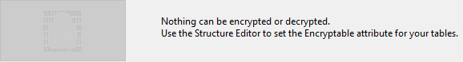

Vous pouvez vous aider de cette page pour chiffrer ou *déchiffrer* (i.e. enlever le chiffrement) le fichier de données, en fonction du statut de l'attribut **Chiffrable** défini pour chaque table de la base.

:::info

Pour des informations détaillées sur le chiffrement des données dans 4D, veuillez vous référer à la section [Chiffrer les données](https://doc.4d.com/4Dv20/4D/20/Encrypting-data.300-6263735.en.html) dans le manuel *Mode Développement*. Vous pouvez également lire le billet de blog [A deeper look into 4D data encryption](https://blog.4d.com/a-deeper-look-into-4d-data-encryption/).

:::

Un nouveau dossier est créé à chaque opération de chiffrement/déchiffrement. Il est nommé "Replaced Files (Encrypting) *yyyy-mm-dd hh-mm-ss*" ou "Replaced Files (Decrypting) *yyyy-mm-dd hh-mm-ss*".

> Le chiffrement n'est disponible qu'en [mode maintenance](overview.md#display-in-maintenance). Si vous tentez d’effectuer cette opération en mode standard, une boîte de dialogue d’alerte vous prévient que l'application va être fermée puis relancée en mode maintenance

**Warning:**

- Le chiffrement d'un fichier de données est une opération de longue durée. Un indicateur de progression de l'opération s'affiche (et peut être interrompu par l'utilisateur). À noter également que le chiffrement d'une application comprend toujours une étape de compactage.
- Chaque opération de chiffrement génère une copie du fichier de données, ce qui augmente la taille du dossier de l'application. Il est important de prendre cela en considération (notamment sous macOS, où les applications 4D apparaissent sous forme de paquet) afin de ne pas augmenter excessivement la taille de l'application. Le déplacement ou la suppression manuels des copies du fichier original dans le paquet peut aider à réduire la taille du paquet.

## Chiffrer des données pour la première fois

Trois étapes sont nécessaires pour effectuer le tout premier chiffrement de vos données à l'aide du CSM :

1. Dans l'éditeur de structure, cochez l'attribut **Chiffrable** pour chaque table dont vous souhaitez chiffrer les données. Consultez la section "Propriétés des tables".
2. Ouvrez la page Chiffrement du CSM.
   Si vous ouvrez la page sans paramétrer les tables comme étant **Chiffrables**, le message suivant s'affiche :
   
   Sinon, le message suivant s'affiche :
   

   Cela signifie que le statut **Chiffrable** défini pour au moins une table a été modifié et que le fichier de données n'a toujours pas été chiffré.
   \*\*Note : \*\*Le même message s'affiche lorsque le statut **Encryptable** a été modifié dans un fichier de données déjà crypté ou après que le fichier de données a été décrypté (voir ci-dessous).

3. Cliquez sur le bouton image Chiffrer.\
   \
   Vous serez invité à saisir une phrase secrète pour votre fichier de données:
   
   La phrase secrète est utilisée pour générer la clé de cryptage des données. Une phrase secrète est une version plus sécurisée d'un mot de passe et peut contenir un grand nombre de caractères. Par exemple, vous pouvez saisir une phrase secrète telle que "Nous sommes tous venus à Montreux" ou "Ma première phrase de passe géniale !!".
   L'indicateur de niveau de sécurité peut vous aider à évaluer la force de votre phrase secrète:
   
   (le vert foncé est le niveau le plus élevé)
4. Tapez sur Entrée pour confirmer votre phrase secrète sécurisée.

Le process de chiffrement est alors lancé. Si le CSM est ouvert en mode standard, l'application est rouverte en mode maintenance.

4D propose de sauvegarder la clé de chiffrement (voir [Sauvegarder la clé de chiffrement](#sauvegarder-la-cle-de-chiffrement) ci-dessous). Vous pouvez la sauvegarder à ce moment précis ou bien ultérieurement. Vous pouvez également ouvrir le fichier d'historique du chiffrement.

Si le processus de chiffrement est réussi, la page Chiffrement affiche les boutons Opérations de maintenance liées au chiffrement.

**Attention :** Pendant l'opération de chiffrement, 4D crée un nouveau fichier de données vide et le remplit avec les données du fichier de données original. Les enregistrements correspondant aux tables "chiffrées" sont chiffrés puis copiés ; les autres enregistrements sont uniquement copiés (une opération de compactage est également exécutée). Si l'opération est réussie, le fichier de données original est déplacé vers un dossier "Replaced Files (Encrypting)". Si vous souhaitez transmettre un fichier de données chiffré, assurez-vous d'avoir préalablement déplacé/retiré tout fichier de données non chiffrées du dossier de l'application.

## Opérations de maintenance liées au chiffrement

Lorsqu'une application est chiffrée (voir ci-dessus), la page Chiffrement propose plusieurs opérations de maintenance du chiffrement, correspondant à des scénarios standard.

### Fournir la clé de chiffrement des données actuelle

Pour des raisons de sécurité, toutes les opérations de maintenance liées au chiffrement nécessitent la clé courante de chiffrement des données.

- Si la clé de chiffrement des données est déjà chargée dans le trousseau 4D(1), elle est automatiquement réutilisée par 4D.
- Si la clé de chiffrement des données n'est pas identifiée, vous devez la fournir. Le dialogue suivant est affiché:
  

À ce stade, deux options s'offrent à vous :

- entrez la phrase secrète courante(2) et cliquez sur **OK**.
  OU
- connectez un périphérique tel qu'une clé USB et cliquez sur le bouton **Scanner les disques**.

(1) Le trousseau 4D stocke toutes les clés de chiffrement des données valides qui ont été saisies au cours de la session d'application.\
(2) La phrase secrète courante est la phrase secrète utilisée pour générer la clé de chiffrement courante.

Dans tous les cas, si des informations valides sont fournies, 4D redémarre en mode maintenance (si ce n'est pas déjà le cas) et exécute l'opération.

### Re-chiffrer les données à l'aide de la clé de chiffrement actuelle

Cette opération est utile lorsque l'attribut **Chiffrable** a été modifié pour une ou plusieurs tables contenant des données. Dans ce cas, afin d'éviter toute incohérence dans le fichier de données, 4D désactive l'accès en écriture aux enregistrements des tables dans l'application. Il est alors nécessaire de re-chiffrer les données pour restituer un statut de chiffrement valide.

1. Cliquez sur **Re-chiffrer les données à l'aide de la clé courante**.
2. Saisissez la clé de chiffrement des données actuelle.

Le fichier de données est correctement re-chiffré avec la clé courante et un message de confirmation est affiché :

### Changer votre phrase secrète et re-chiffrer les données

Cette opération est utile en cas de modification de la clé de chiffrement des données actuelle. Par exemple, il se peut que vous la modifiiez pour vous conformer aux règles de sécurité (telles que la nécessité de modifier la phrase secrète tous les trois mois).

1. Cliquez sur **Changer votre phrase secrète et re-chiffrer les données**.
2. Saisissez la clé de chiffrement des données actuelle.
3. Saisissez la nouvelle phrase secrète (pour plus de sécurité, il vous est demandé de la saisir deux fois):
   
   Le fichier de données est chiffré avec la nouvelle clé et le message de confirmation est affiché.
   

### Enlever le chiffrement de toutes les données

Cette opération supprime tout le chiffrement du fichier de données. Si vous ne souhaitez plus que vos données soient chiffrées :

1. Cliquez sur **Enlever le chiffrement de toutes les données**.
2. Saisissez la clé de chiffrement de données actuelle (voir Fournir la clé de chiffrement des données actuelle).

Le fichier de données est entièrement déchiffré et un message de confirmation est affiché :

> Une fois que le fichier de données est déchiffré, le statut de chiffrement des tables ne correspond plus à leur attribut Chiffrable. Pour restaurer un état correspondant, vous devez désélectionner tous les attributs **Chiffrables** au niveau de la structure de la base de données.

## Sauvegarder la clé de chiffrement

4D vous permet de sauvegarder la clé de chiffrement des données dans un fichier créé à cet effet. Le nom du fichier doit avoir l'extension `.4DKeyChain`, par exemple "myKeys.4DKeyChain". La sauvegarde de ce fichier sur un appareil externe tel qu'une clé USB facilitera l'utilisation d'une application chiffrée, étant donné que l'utilisateur n'aurait plus qu'à connecter cet appareil pour fournir la clé avant d'ouvrir l'application et accéder aux données chiffrées.

Vous pouvez sauvegarder la clé de chiffrement chaque fois qu'une nouvelle phrase secrète est fournie :

- lorsque l'application est chiffrée pour la première fois,
- lorsque l'application est re-chiffrée avec une nouvelle phrase secrète.

Les clés de chiffrement successives peuvent être sauvegardées sur le même appareil.

:::caution

Le stockage du fichier de clés de chiffrement des données au premier niveau de l'appareil est obligatoire lorsque vous utilisez la [fonctionnalité de restitution et d'intégration automatique](../Backup/settings.md#automatic-restore-and-log-integration). Lorsque la séquence de restitution est déclenchée, 4D doit avoir accès au fichier de la clé de cryptage, sinon une erreur se produit.

:::

## Fichier journal

Une fois qu'une opération de chiffrement est terminée, 4D génère un fichier dans le dossier Logs de l'application. Il est créé au format XML et nommé "*ApplicationName_Encrypt_Log_yyyy-mm-dd hh-mm-ss.xml*" ou "*ApplicationName_Decrypt_Log_yyyy-mm-dd hh-mm-ss.xml*".

Chaque fois qu'un nouveau fichier d'historique est généré, un bouton Voir le compte rendu s'affiche dans la page CSM.

Le fichier d'historique liste toutes les opérations internes liées au processus de chiffrement/déchiffrement qui ont été exécutées, ainsi que les erreurs (le cas échéant).
