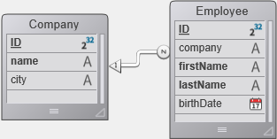

Étant donné qu'ORDA est basé sur des objets, l'utilisation d'ORDA nécessite des connaissances de base en programmation d'objets.

## Explorer le datastore

Le datastore ORDA est automatiquement basé sur une structure de base de données 4D, à condition qu'elle soit conforme aux [prérequis d'ORDA](overview.md#orda-prerequisites).

Cet exemple utilisera la structure de base de données 4D simple suivante :



Pour savoir ce qui est exposé en tant que datastore, créez une nouvelle méthode projet, écrivez la ligne suivante :

```code4d
TRACE
```

Exécutez la méthode - elle appelle simplement la fenêtre du débogueur.
Dans la zone d'Expression, double-cliquez pour insérer une expression et entrez `ds`. Elle retourne l'objet du datastore.
Déployez l'objet, vous pouvez voir que les tables et les champs sont automatiquement exposés par ORDA en tant que propriétés de l'objet `ds` :


Cela signifie par exemple que, chaque fois que vous avez besoin de vous référer au champ city de la table [Company], dans ORDA il vous suffit d'écrire :

```code4d
ds.Company.city // retourne le nom de la ville
```

> Dans le monde d'ORDA, ds.Company est une **dataclass**. ds.Company.city est un **attribut**.

> ORDA est sensible à la casse. `ds.company.city` ne fera pas référence à l'attribut ds.Company.city.

Vous avez également remarqué la propriété extra `hires` dans la dataclass ds.Company. Cela ne correspond pas à un champ. `hire`est en fait le nom de la relation _1 vers N_ entre Company et Employee :


_Name of the relation as defined in the Inspector_

Cela signifie que, chaque fois que vous avez besoin d'accéder à la liste des employés travaillant pour une entreprise, il vous suffit d'écrire, dans ORDA :

```code4d
ds.Company.hires // retourne la liste des employés
```

Mais n'allez pas trop vite. Voyons maintenant comment enregistrer des données dans des dataclass ORDA.

## Ajouter des données

Avec ORDA, vous pouvez ajouter un enregistrement à une dataclass à l'aide de la commande `new()`.

> Dans le monde d'ORDA, un enregistrement est une **entité** (entity) - une entité est elle-même un objet. Une commande attachée à un objet spécifique est appelée une **méthode membre**.

```code4d
$entity:=ds.Company.new() //créer une nouvelle référence d'entité
//dans la dataclass Company  
//et l'assigner à la variable $entity
```

Un nouvel objet entité contient une "copie" de tous les attributs de sa dataclass parente, vous pouvez donc leur assigner des valeurs :

```code4d
$entity.name:="ACME, inc."  
$entity.city:="London"  
//$entity.ID is automatically filled
```

Pour le moment, l'entité n'existe qu'en mémoire. Pour la stocker dans le fichier de données, vous devez l'enregistrer à l'aide de la méthode membre `save()` :

```code4d
$status:=$entity.save()
```
