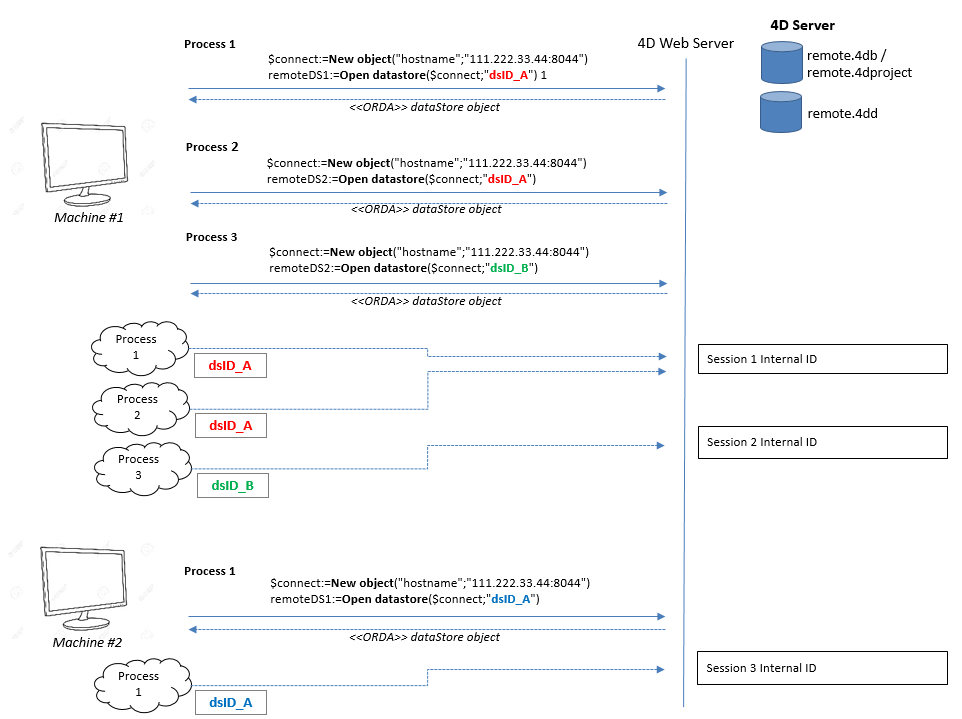
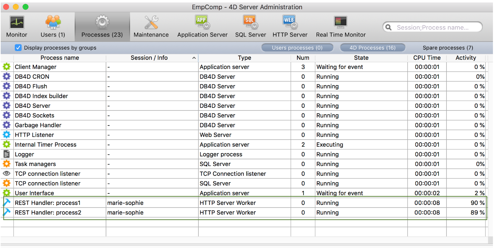

Un **datastore distant** est une référence, dans une application 4D locale (4D ou 4D Server), à un [datastore](dsMapping.md#datastore) stocké dans une autre application 4D.

The local 4D application connects to and references the remote datastore through a call to the [`Open datastore`](../commands/open-datastore.md) command.

Sur la machine distante, 4D ouvre une [session](../WebServer/sessions.md) pour gérer les requêtes de l'application qui a appelé `Open datastore`. Les requêtes utilisent en interne [l'API REST](../REST/gettingStarted.md), ce qui signifie qu'elles peuvent avoir besoin de [licences disponibles](../REST/authUsers.md).

## Utiliser des sessions web

When you work with a remote datastore referenced through calls to the [`Open datastore`](../commands/open-datastore.md) command, the connection with the requesting processes is handled via [web sessions](../WebServer/sessions.md) on the remote machine.

La session web créée sur le datastore distant est identifiée à l'aide d'un ID de session interne, associé au `localID` du côté de l'application 4D. Cette session gère automatiquement l'accès aux données, aux entity selections et aux entités.

Le `localID` est local à la machine qui se connecte au datastore distant, ce qui signifie que :

- Si d'autres process de la même application doivent accéder au même datastore distant, ils peuvent utiliser le même `localID` et partager alors la même session.
- Si un autre process de la même application ouvre le même datastore distant, mais avec un autre `localID`, il créera une nouvelle session sur le datastore distant.
- Si un autre poste se connecte au même datastore distant avec le même `localID`, il créera une autre session avec un autre cookie.

Ces principes sont illustrés dans les graphiques suivants :

### Visualiser les sessions

Les process qui gèrent les sessions d'accès aux datastore apparaissent dans la fenêtre d'administration de 4D Server :

- nom : "REST Handler : \<nom du process\>"
- type : type Worker Server HTTP
- session : le nom de session est le nom d'utilisateur passé à la commande `Open datastore`.

Dans l'exemple suivant, deux process sont en cours d'exécution pour la même session :

## Fermeture des sessions

Comme décrit dans le paragraphe [durée de vie de la session](../WebServer/sessions.md#session-lifetime), une session web est automatiquement fermée par 4D lorsqu'il n'y a pas eu d'activité pendant une durée déterminée par son timeout. Le timeout par défaut est de 60 mn mais cette valeur peut être paramétrée à l'aide du paramètre _connectionInfo_ de la commande `Open datastore`.

Si une demande est envoyée au datastore distant après la fermeture de la session, elle est automatiquement recréée si possible (licence disponible, serveur non arrêté, etc.). Cependant, gardez à l'esprit que le contexte de la session concernant les verrous et les transactions est perdu (voir ci-dessous).

## Verrouillage et transactions

Les fonctionnalités ORDA relatives au verrouillage d'entité et aux transactions sont gérées au niveau du process dans les datastore distants, tout comme en mode client/serveur ORDA :

- Si un process verrouille une entité à partir d'un datastore distant, l'entité est verrouillée pour tous les autres process, même lorsque ces process partagent la même session (voir [Verrouillage d'entités](entities.md#entity-locking)). Si plusieurs entités pointant vers le même enregistrement ont été verrouillées dans un process, elles doivent toutes être déverrouillées dans le process pour supprimer le verrou. Si un verrou a été mis sur une entité, il est supprimé lorsqu'il n'existe plus de référence à cette entité en mémoire.
- Les transactions peuvent être lancées, validées ou annulées séparément sur chaque datastore distant à l'aide des méthodes `dataStore.startTransaction( )`, `dataStore.cancelTransaction( )`, et `dataStore.validateTransaction( )`. Elles n’ont pas d’incidences sur les autres datastore.
- Classic 4D language commands ([`START TRANSACTION`](../commands-legacy/start-transaction.md), [`VALIDATE TRANSACTION`](../commands-legacy/validate-transaction.md), [`CANCEL TRANSACTION`](../commands-legacy/cancel-transaction.md)) only apply to the main datastore (returned by `ds`).
  Si une entité d'un datastore distant est verrouillée par une transaction dans un process, les autres process ne peuvent pas la mettre à jour, même si ces process partagent la même session.
- Les verrous sur les entités sont supprimés et les transactions sont annulées :
  - lorsque le process est tué.
  - quand la session est fermée sur le serveur
  - lorsque la session est arrêtée à partir de la fenêtre d’administration du serveur.
