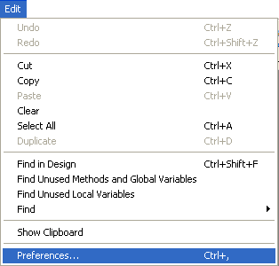
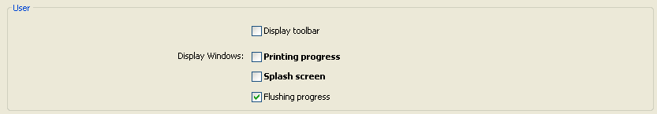
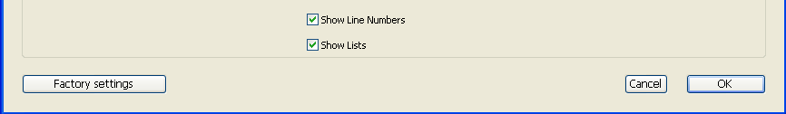

User preferences specify various settings affecting your working environment, e.g. default options, display themes, Code Editor features, shortcuts, etc. Elles sont appliquées à tous les projets ouverts avec votre application 4D ou 4D Server.

**4D Server** : Le verrouillage des objets se produit lorsque deux utilisateurs ou plus tentent de modifier les paramètres de la boîte de dialogue Préférences en même temps. Un seul utilisateur à la fois peut utiliser la boîte de dialogue Préférences.

> 4D propose un ensemble de paramètres spécifiques pour le projet ouvert : **Paramètres** (disponible dans le menu **Développement**). Pour plus d'informations, reportez-vous au chapitre Paramètres.

## Accès

Vous pouvez accéder à la boîte de dialogue Préférences à partir du menu **Edition> Préférences...** (Windows) ou du menu de l'application **4D** (macOS) :

Cette option de menu est disponible même lorsqu'il n'y a pas de projet ouvert.

Vous pouvez également afficher la boîte de dialogue Préférences en mode Application en utilisant l'action standard "Préférences" (associée à un élément de menu ou à un bouton) ou à l'aide de la commande `OPEN SETTINGS WINDOW`.

## Storage

Settings made in the Preferences dialog box are saved in an XML format preferences file named **4D Preferences vXX.4DPreferences** that is stored in the active 4D folder of the current user, as returned by the [`Get 4D folder`](https://doc.4d.com/4Dv18R6/4D/18-R6/Get-4D-folder.301-5198423.en.html) command:

- Windows: `{disk}\Users\\{username\}\AppData\Roaming\4D`
- macOS: `{disk}:Users:\{username\}:Library:Application Support:4D`

## Personnalisation des paramètres et réinitialisation des réglages

Dans les boîtes de dialogue des paramètres, les paramètres dont les valeurs ont été modifiées apparaissent en gras :

Les préférences indiquées comme personnalisées peuvent avoir été modifiées directement dans la boîte de dialogue, ou avoir été modifiées précédemment dans le cas d'une base de données convertie.

Un paramètre apparaît toujours en gras même lorsque sa valeur est remplacée manuellement par ses valeurs par défaut. Ainsi, il est toujours possible d'identifier visuellement les paramètres qui ont été personnalisés.

Pour rétablir les valeurs par défaut des paramètres et supprimer le style gras indiquant qu'ils ont été personnalisés, cliquez sur le bouton **Rétablir les paramètres d'usine** :

Ce bouton réinitialise tous les paramètres de la page courante. Il devient actif lorsqu'au moins un paramètre a été modifié sur la page courante.
