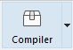
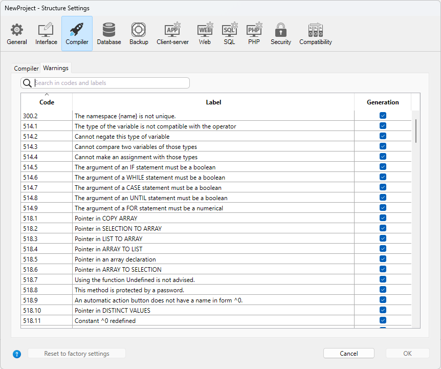

Vous pouvez compiler vos projets, c'est-à-dire traduire toutes vos méthodes en langage machine. La compilation d'un projet permet de vérifier la cohérence du code et d'accélérer son exécution, mais aussi de masquer le code dans son intégralité. La compilation est une étape indispensable, entre le développement de projets avec 4D et leur déploiement en tant qu'applications autonomes.

## Compilation

La compilation est gérée depuis votre application 4D et est entièrement automatique.

> Sur macOS, la compilation nécessite l'installation d'`Xcode`. Consultez [cette section](#silicon-compiler) pour plus d'informations sur ce pré-requis.

1. Ouvrez la fenêtre de compilation en sélectionnant la commande **Compilateur...** dans le menu **Développement** ou le bouton **Compilateur** de la barre d'outils.

   

   

> Vous pouvez également lancer directement la compilation en sélectionnant l'élément de menu **Lancer la compilation** dans le menu **Développement**.

2. Cliquez sur le bouton **Compiler** pour lancer la compilation à l'aide des [paramètres de compilation](#compiler-settings) courants.

Si aucune erreur n'est détectée, la compilation démarre et le message "Compilation successful" s'affiche au bas de la fenêtre lorsque la compilation est terminée :


Vous pouvez immédiatement [exécuter votre application en mode compilé](#run-compiled) et identifier sa rapidité.

Si des erreurs sont détectées, le process est stoppé et le message "Compilation failed" s'affiche. La zone d'information de la fenêtre affiche les noms des méthodes et les numéros de ligne concernés dans une liste hiérarchique :


Double-cliquez sur chaque erreur détectée pour ouvrir la méthode ou la classe concernée directement dans l'éditeur de code 4D. La ligne contenant l'erreur est mise en évidence et le type d'erreur est affiché dans la zone syntaxique de la fenêtre.

Utilisez les commandes **Erreur précédente** / **Erreur suivante** du menu **Méthode** pour naviguer d'une erreur à l'autre.

Le nombre d'erreurs trouvées lors de vos premières compilations peut être déconcertant, mais ne vous laissez pas décourager. Vous découvrirez rapidement qu'elles proviennent souvent de la même source, à savoir la non-conformité avec certaines conventions du projet. Le compilateur fournit toujours un [diagnostic précis](#error-file) des erreurs afin de vous aider à les corriger.

> La compilation nécessite une licence appropriée. Sans cette licence, il n'est pas possible d'effectuer une compilation (les boutons sont désactivés). Néanmoins, il est toujours possible de vérifier la syntaxe et de générer des méthodes de typage.

## Exécuter la compilation

Une fois le projet compilé, il est possible de passer du [mode interprété au mode compilé](Concepts/interpreted.md), et vice versa, à tout moment et sans avoir à quitter l'application 4D (sauf si le code interprété a été supprimé). Pour ce faire, utilisez les commandes **Redémarrer en interprété** et **Redémarrer en compilé** du menu **Exécution**. La [boîte de dialogue d'ouverture de projet ](GettingStarted/creating.md#options) de 4D permet également de choisir le mode interprété ou compilé au lancement du projet.

Lorsque vous passez d'un mode à l'autre, 4D ferme le mode courant et ouvre le nouveau. Cela équivaut à quitter et à rouvrir l'application. Chaque fois que vous passez d'un mode à l'autre, 4D exécute les deux méthodes base suivantes (si elles sont spécifiées) dans cet ordre : `On Exit` -> `On Startup`.

Si vous modifiez votre projet en mode interprété, vous devez le recompiler pour que vos modifications soient prises en compte en mode compilé.

## Caractéristiques de la fenêtre du compilateur

En plus du bouton [**Compiler**](#compiler), la fenêtre du compilateur fournit des fonctionnalités supplémentaires qui sont utiles pendant la phase de développement du projet.

### Vérifier la syntaxe

Le bouton **Vérifier la syntaxe** lance l'exécution de la phase de vérification de la syntaxe. À la fin du processus de vérification, les erreurs détectées sont listées dans la zone d'information. You can double–click on an error line in order to display the corresponding method or form object.

Le contrôle syntaxique peut également être lancé directement à l'aide de la commande **Check Syntax** associée au bouton de la barre d'outils **Compiler**. Cette option est la seule disponible si vous ne disposez pas d'une licence adéquate pour permettre la compilation d'applications.

### Générer le typage

:::info Compatibilité

This button is only displayed in converted projects if the **All variables are typed (Direct typing)** [compilation path option](#enabling-direct-typing) is not selected. For information about this button, please refer to the [documentation of previous 4D releases](https://developer.4d.com/docs/20/Project/compiler#generate-typing).

:::

### Effacer le code compilé

Le bouton **Effacer le code compilé** permet de supprimer le code compilé du projet. Lorsque vous cliquez dessus, tout le [code généré lors de la compilation](#classic-compiler) est supprimé, la commande **Redémarrer en compilé** du menu **Exécution** est désactivée et l'option "Projet compilé" n'est pas disponible au démarrage.

### Afficher/masquer les warnings

You can toggle the [warnings](#warnings) display in the Compiler window by clicking the **Show/Hide Warnings** button:


Lorsque cette option est cochée, les warnings (le cas échéant) sont affichés dans la fenêtre, après les autres types d'erreurs. Ils apparaissent en italique :


Un double-clic sur un warning ouvre la méthode correspondante.

## Paramètres du compilateur

The "Compiler" tab of the Settings dialog box lets you set parameters related to project compilation. Vous pouvez ouvrir directement cette page à partir de la [fenêtre du compilateur](#compiler-window) en cliquant sur le bouton **Paramètres du compilateur** :


### Options de compilation

Cette zone regroupe les options génériques utilisées lors du processus de compilation.

#### Générer le fichier de symboles

Permet de générer le fichier de symboles (voir [fichier de symboles](#symbol-file)). Le fichier de symboles est créé dans le [dossier Logs](Project/architecture.md#logs) du projet et est nommé `ProjectName_symbols.xml`.

#### Générer le fichier d'erreurs

Permet de générer le fichier d'erreurs (voir [fichier d'erreurs](#fichier-derreurs)) au moment du contrôle syntaxique. Le fichier d'erreur est créé dans le [dossier Logs](Project/architecture.md#logs) du projet et est nommé `ProjectName_errors.xml`.

#### Cible de compilation

<details><summary>Historique</summary>

| Release | Modifications |
| ------- | ------------- |
| 19      | Ajout         |

</details>

Ce paramètre vous permet de sélectionner la famille de processeurs pour laquelle votre projet 4D doit être compilé en mode natif. Le compilateur 4D peut générer du code natif pour deux familles de processeurs :

- Les processeurs **Intel/AMD** (toutes les machines),
- les processeurs **Apple Silicon**.

Deux options de cible sont proposées. Le résultat dépend du processeur de la machine sur laquelle 4D est exécuté.

| _Option_                                                                 | _sur Windows Intel/AMD_                                                                       | _sur macOS Intel_                                                                          | _sur macOS Silicon_                                                                        |
| ------------------------------------------------------------------------ | --------------------------------------------------------------------------------------------- | ------------------------------------------------------------------------------------------ | ------------------------------------------------------------------------------------------ |
| **Tous les processeurs (Intel/AMD et Apple Silicon)** | Code pour Intel/AMD<br/>_Il n'est pas possible de produire du code Apple Silicon sur Windows_ | Code pour Apple Silicon + Code pour Intel/AMD<br/>_Deux codes compilés seront disponibles_ | Code pour Apple Silicon + Code pour Intel/AMD<br/>_Deux codes compilés seront disponibles_ |
| **Mon processeur (processeur)**                       | Code pour Intel/AMD                                                                           | Code pour Intel/AMD                                                                        | Code pour Apple Silicon                                                                    |

> La cible de compilation Apple Silicon nécessite que l'application **Clang** soit installée sur votre machine. Clang est fournie avec la dernière version de Xcode. Voir les [pré-requis du compilateur Silicon](#requirements) pour plus d'informations.

### Additional options (Compatibility)

In projects converted from 4D versions prior to 20 R7, additional compilation options are available:

- **Compilation Path**
- **Default typing**
- **Compiler Methods for...**

These options are only maintained for compatibility with legacy code. For more information, please refer to the [documentation of previous 4D releases](https://developer.4d.com/docs/20/Project/compiler#compiler-settings).

In converted projects, it is recommended to [enable the direct typing mode](#enabling-direct-typing) and to write compliant declaration code, i.e.:

- declare explicitely all variables [using `var` keywords](../Concepts/variables.md#declaring-variables)
- declare explicitely all parameters in function prototypes (i.e. using the `Function` or `Class Constructor` keywords) or with `#DECLARE` keywords in methods (see [Declaring parameters](../Concepts/parameters.md#declaring-parameters).

#### Enabling direct typing

:::info

The direct typing mode is optional in converted projects only. It is natively used in projects created with 4D 20 R7 and higher.

:::

Select **All variables are typed (Direct typing)** option in the **Compilation Path** menu to enable the direct typing mode. When this option is selected, other compatibility options become useless and are no longer displayed.

Using this option is recommended since it provides flexibility and efficiency. The direct typing concept assumes that all elements are directly declared where they are defined in your code. You just have to make sure that all your variables are declared using the regular [`var` syntax](../Concepts/variables.md#declaring-variables) and that your method and function parameters are declared [in their prototypes](../Concepts/parameters.md) (the [Check Syntax](#check-syntax) feature can help you detecting missing or invalid declarations).

## Warnings

Les warnings sont des messages spécifiques générés par le compilateur lorsqu'il vérifie la syntaxe. Ces messages sont destinés à attirer votre attention sur les déclarations qui pourraient entraîner des erreurs d'exécution. Ils n'empêchent pas la compilation.

Depending on circumstances and the programming style used, warnings may be more or less relevant. You can enable or disable warnings, in the compiler dialog, and in the code editors (4D code editor and VS Code), globally through the [warnings tab](#warnings-tab) or locally using [`//%W`](#disabling-and-enabling-warnings-locally).

### Warnings tab



This tab allows you to define which warnings should be displayed globally. From the list of all possible warnings with their types, their code and their localized label, ordered by warning code.

To reduce the list, you can search words by warning labels and codes using the **Search in codes and labels** textbox or the magnifying glass icon on the left.

By default, all warning types are checked and enabled.

When you modify a warning display status, the information is stored in the "warnings.json" file, placed in the project Settings folder.

The **Reset to factory settings** button sets all the warning display status checkboxes to default values and deletes the "warnings.json" file.

### Disabling and enabling warnings locally

You can control warnings in specific parts of your code by using special comments to disable or enable them.

To disable warnings, insert the following comments before and after the code section where you want to disable warnings:

```4d
// Before the selected code part use
  //%W-<warning number>

// After the selected code part use
  //%W+<warning number>
```

To re-enable warnings in a code section, use the following comments:

```4d
// Before the selected code part use
  //%W+<warning number>

// After the selected code part use
  //%W-<warning number>
```

Only warnings with numbers can be disabled or enabled. Warning numbers are specified at the end of each message in the list of compilation errors or in the list found in the warning tab.
Par exemple, pour désactiver le warning suivant :

_1: Redefinition of variable $a (550.10)_

... you just need to write the following comments in your 4D method:

```4d
  var $a : Text
  $a:="hello world"
  
  //%W-550.10
  var $a : Text
  //%W+550.10
  
```

:::note

The special warnings comments have priority over the warnings display settings set in the warning tab.

:::

## Outils de compilation

### Fichier de symboles

Si vous cochez l'option [**Générer le fichier de symboles**](#generate-the-symbol-file) dans les paramètres du compilateur, un fichier de symboles appelé `ProjectName_symbols.txt` est créé dans le dossier [Logs](architecture.md#logs) du projet pendant la compilation. Il est divisé en plusieurs parties :

#### Liste des variables process et interprocess

Ces deux listes contiennent quatre colonnes :

- Noms des variables et tableaux process et interprocess utilisés dans votre projet. Ces variables sont classées par ordre alphabétique.
- Le type de variable. Ce type a été déterminé par une directive de compilation, sinon il est déduit par le compilateur en fonction de l’utilisation de la variable. Si le type d'une variable ne peut être déterminé, la colonne est vide.
- Nombre de dimensions si la variable est un tableau.
- Référence au contexte dans lequel le compilateur a établi le type de la variable. Si la variable est utilisée dans plusieurs contextes, le contexte mentionné est celui utilisé par le compilateur pour déterminer son type.
  - Si la variable est trouvée dans une méthode base, son nom est inscrit comme il a été défini dans 4D, précédé de (M)\*.
  - Si la variable est trouvée dans une méthode projet, son nom est inscrit comme il a été défini dans 4D, précédé de (M).
  - Si la variable est trouvée dans un trigger, c’est le nom de la table qui est inscrit, précédé de (MT).
  - Si la variable est trouvée dans une méthode formulaire, le nom du formulaire est inscrit, précédé du nom de la table et de (MF).
  - Si la variable est trouvée dans une méthode objet, le nom de la méthode objet est inscrit précédé du nom du formulaire, du nom de la table et de la mention (MO).
  - Si la variable est un objet d’un formulaire, sans intervenir dans une quelconque méthode projet, méthode formulaire, trigger ou méthode objet, le nom du formulaire dans lequel elle apparaît est inscrit, précédé de la mention (F).
    En fin de liste, vous trouvez la taille des variables process et interprocess en octets.

> Au moment de la compilation, le compilateur ne peut pas déterminer dans quel process une variable process donnée est utilisée. En effet, une variable process peut avoir une valeur différente dans chaque process. Toutes les variables process sont donc systématiquement dupliquées à chaque création de process : il convient de prendre garde à la taille mémoire qu’elles vont occuper. A noter que la taille des variables process est totalement indépendante de celle de la pile des process.

#### Liste des variables locales

La liste des variables locales est triée par méthode base, méthode projet, trigger, méthode formulaire et méthode objet en suivant le même ordre que dans 4D.

Cette liste contient trois colonnes :

- la liste des variables locales utilisées dans la méthode ;
- le type de la variable ;
- le nombre de dimensions du tableau, lorsque la variable est un tableau.

#### Liste complète des méthodes

A la fin du fichier sont réunies toutes vos méthodes base et projet avec :

- leur type (procédure ou fonction retournant une valeur)
- le type de leurs paramètres et du résultat renvoyé
- le nombre d'appels
- la propriété Thread Safe ou Thread Unsafe.

Ces informations apparaissent sous la forme suivante :

```
Procédure ou Fonction <Nom méthode>(type paramètres):
type résultat, nombre d'appels, Thread Safe ou Thread Unsafe
```

### Fichier d’erreurs

Vous pouvez choisir de générer ou non un fichier d'erreurs lors de la compilation en utilisant l'option [**Générer le fichier d'erreur**](#generate-error-file) dans les paramètres du compilateur. Le fichier d'erreur est automatiquement nommé `projectName_errors.xml` et est placé dans le [dossier Logs](Project/architecture.md#logs) du projet.

Bien que les erreurs soient directement accessibles via la [fenêtre de compilation](#compilation), il peut être intéressant de disposer d’un fichier d’erreurs qu’il est alors possible de transmettre d’un poste à l’autre. Le fichier d’erreurs est généré au format XML afin de faciliter l’analyse automatique de son contenu. Il permet également la création d’interfaces personnalisées de présentation des erreurs.

Le fichier d’erreurs est plus ou moins long suivant le nombre d’erreurs et de warnings délivrés par le compilateur.

Le fichier d’erreurs est structuré ainsi :

- En tête de ce fichier se trouve la liste des erreurs et warnings, triée par méthode et dans leur ordre de création dans 4D.
- Sous la rubrique _**Erreurs générales**_ sont regroupées toutes les impossibilités de typage et les ambiguïtés d’identité. Ces indications sont détaillées de la façon suivante :
  - le numéro de ligne dans la méthode (le numéro 0 est retourné pour les erreurs générales)
  - l’attribut warning indique si l’anomalie détectée est un warning (warning="true") ou une erreur (warning="false")
  - un diagnostic sur la nature de l’erreur

Si votre projet ne présente aucune erreur générale, le fichier ne comporte pas de section _Erreurs générales_.

Un fichier d’erreurs peut donc comporter trois types de messages :

- **Erreurs attachées à une ligne précise** : Ces erreurs vous sont indiquées accompagnées de leur contexte (la ligne où elles ont été détectées) et d’un commentaire.  Elles apparaissent lorsque le compilateur rencontre une expression qui lui pose un problème, que ce soit de typage ou de syntaxe. Dans la fenêtre du compilateur, double-cliquez sur chaque erreur détectée afin d'ouvrir la méthode concernée directement dans l'éditeur de code 4D, la ligne contenant l'erreur étant mise en évidence.

- **Erreurs générales** : Il s’agit d’erreurs qui ne permettent pas le passage en passe de compilation. Le compilateur délivre une erreur générale dans deux cas :
  - Si le type d’une variable process ou interprocess n’a pas pu être déterminé.
  - Si deux objets de nature différente portent le même nom.

Ces erreurs sont dites générales parce qu’elles ne peuvent être rattachées à aucune méthode en particulier. En effet, le compilateur n’a pu procéder au typage nulle part dans la base pour le premier cas. Dans le second, il ne peut choisir d’associer un nom à un objet plutôt qu’à un autre.

- **Warnings** : Les warnings ne sont pas des erreurs. Ils n’empêchent pas la compilation de la base, il s’agit simplement de points sur lesquels le compilateur souhaite attirer votre attention parce qu’il y a un risque d’erreur. Dans la fenêtre de compilation, les warnings apparaissent en caractères italiques. Il vous suffit de double-cliquer sur le libellé d’un warning pour ouvrir la méthode concernée dans l'éditeur de code 4D à la ligne correspondante.

### Contrôle d’exécution

Le code généré par le compilateur de 4D vérifie automatiquement que chaque accès à un élément de tableau ou à un indice de chaîne est effectué à l'intérieur de la plage des éléments de tableau ou des caractères de la chaîne. Les accès hors plage (out of range) provoqueront des erreurs d'exécution.

Dans certains cas, vous pouvez souhaiter que le contrôle d’exécution ne s’applique pas sur des parties fiabilisées du code. En effet, notamment dans le cas de boucles répétées de nombreuses fois et lors de l’exécution de la base compilée sur des machines anciennes, ce contrôle peut ralentir sensiblement les traitements. Dans la mesure où vous avez la certitude que le code en question est fiable et ne peut provoquer d’erreur système, vous pouvez désactiver localement le contrôle d’exécution.

Pour cela, vous devez encadrer le code à exclure du contrôle d’exécution avec les commentaires spéciaux `//%R-` et `//%R+`. Le commentaire `//%R-` désactive le contrôle d’exécution et `//%R+` le réactive :

```4d
  // %R-  pour désactiver le contrôle d'exécution
 
 ... //Placez ici le code exclus du contrôle d'exécution
 
  // %R+  pour réactiver le contrôle d'exécution pour la suite de la méthode
```

## A propos des compilateurs

4D inclut deux compilateurs :

- un compilateur "classique", permettant de compiler du code natif pour les processeurs Intel/AMD ;
- un compilateur Silicon, permettant de compiler du code natif pour les processeurs Apple Silicon.

Le compilateur classique peut être utilisé sur n'importe quelle plate-forme, tandis que le compilateur Silicon peut uniquement être utilisé sur une machine Mac :

|                  |   Compilation pour Windows  |  Compilation pour Mac Intel | Compilation pour Mac Silicon |
| ---------------- | :-------------------------: | :-------------------------: | :--------------------------: |
| Sous Windows     | &#10003 | &#10003 |  &#10007 |
| Sous Mac Intel   | &#10003 | &#10003 |  &#10003 |
| Sous Mac Silicon | &#10003 | &#10003 |  &#10003 |

Les deux compilateurs sont intégrés dans 4D. Le compilateur adéquat est automatiquement sélectionné en fonction de l'option [Cible de compilation](#cible-de-compilation).

### Compilateur classique

Le compilateur classique génère du code compilé natif pour les processeurs Intel/AMD sur n'importe quelle machine. Il ne nécessite aucune configuration particulière.

Le code compilé qui en résulte est stocké dans le dossier [DerivedData](architecture.md#deriveddata) du projet.

### Compilateur Silicon

Le compilateur Silicon génère du code compilé natif pour les processeurs Apple Silicon tels que le _Apple M1_.

Le code compilé qui en résulte est stocké dans le dossier [Libraries](architecture.md#libraries) du projet.

#### Conditions requises

- **Ordinateur Apple** : Le compilateur Silicon peut uniquement être lancé sur une machine Apple.
- **Architecture projet de 4D** : Le compilateur Silicon est uniquement disponible pour les développements 4D utilisant l'[architecture projet](architecture.md).
- **Xcode ou Developer Tools**: Le compilateur Silicon fait appel au compilateur macOS open-source **Clang** pour compiler le projet à partir du code C++ à la [deuxième étape](#compilation-incrementale) de la compilation. _clang_ nécessite des bibliothèques natives Apple, qui sont fournies soit par **Xcode** soit par **Developer Tools**.
  - **Si vous avez déjà installé** Xcode ou Developer Tools sur votre ordinateur, vous devez juste vous assurer que sa version est conforme aux spécifications de 4D.
  - **Si vous n'avez pas déjà installé** l'un de ces outils sur votre machine, il vous sera nécessaire d'en télécharger un depuis le site web Apple Developer.

> Nous recommandons **Xcode**, qui est plus simple à installer. Il est tout à fait possible d'installer **Developer Tools** qui est plus compact, mais son installation est un peu plus complexe.

Dans tous les cas, le compilateur Silicon de 4D vous avertira si votre configuration ne correspond pas aux conditions requises.

#### Compilation incrémentale

Le compilateur Silicon est incrémental, ce qui signifie que :

- Los de la compilation initiale, **toutes les méthodes 4D** sont compilées. Cette étape peut prendre un certain temps. Cependant, elle n'est nécessaire qu'une fois.
- Lors de toutes les compilations ultérieures, **seules les méthodes nouvelles ou modifiées** sont traitées, ce qui réduit considérablement la durée de compilation.
