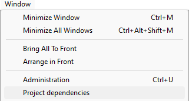
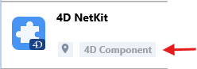
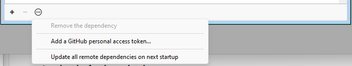

Un composant 4D est un ensemble de code 4D et de formulaires représentant une ou plusieurs fonctionnalité(s) que vous pouvez installer et utiliser dans vos projets. Par exemple, le composant [4D SVG](https://github.com/4d/4D-SVG) ajoute des commandes avancées et un moteur de rendu intégré qui peut être utilisé pour afficher des fichiers SVG.

Vous pouvez [développer](../Extensions/develop-components.md) et [construire](../Desktop/building.md) vos propres composants 4D, ou télécharger des composants publics partagés par la communauté 4D qui se trouvent sur GitHub.

Lorsque vous développez dans 4D, les fichiers de composants peuvent être stockés de manière transparente sur votre ordinateur ou sur un dépôt Github.

## Composants interprétés et compilés

Les composants peuvent être interprétés ou [compilés](../Desktop/building.md).

- Un projet 4D fonctionnant en mode interprété peut utiliser des composants interprétés ou compilés.
- Un projet 4D exécuté en mode compilé ne peut pas utiliser de composants interprétés. Dans ce cas, seuls les composants compilés peuvent être utilisés.

### Dossier racine (package)

Le dossier racine d'un composant (dossier *MyComponent.4dbase*) peut contenir :

- pour les **composants interprétés** : un [dossier project](../Project/architecture.md) standard. Le nom du dossier du dossier racine doit être suffixé **.4dbase** si vous voulez l'installer dans le dossier [**Components**](architecture.md#components) de votre projet.
- pour les **composants compilés** :
 - soit un dossier "Contents" contenant un fichier .4DZ, un dossier *Resources*, un fichier *Info.plist* (architecture recommandée)
 - soit directement un fichier .4DZ avec d'autres dossiers tels que *Resources*.

:::note

L'architecture de dossier "Contents" est recommandée pour les composants si vous voulez [notariser](../Desktop/building.md#about-notarization) vos applications sur macOS.

:::

## Chargement des composants

:::note

Cette page décrit comment travailler avec les composants dans les environnements **4D** et **4D Server**. Dans les autres environnements, les composants sont gérés différemment :

- dans [4D en mode distant](../Desktop/clientServer.md), les composants sont chargés par le serveur et envoyés à l'application distante.
- dans les applications fusionnées, les composants sont [inclus à l'étape de construction](../Desktop/building.md#plugins--components-page).

:::

### Vue d’ensemble

Pour charger un composant dans votre projet 4D, vous pouvez soit :

- copier les fichiers des composants dans le [dossier **Components** de votre projet](architecture.md#components) (les dossiers des composants interprétés doivent être suffixés avec ".4dbase", voir ci-dessus),
- ou déclarer le composant dans le fichier **dependencies.json** de votre projet ; ceci est fait automatiquement pour les fichiers locaux lorsque vous [**ajoutez une dépendance en utilisant l'interface du Gestionnaire de dépendances**](#adding-a-github-dependency).

Les composants déclarés dans le fichier **dependencies.json** peuvent être stockés à différents endroits :

- au même niveau que le dossier racine de votre projet 4D : c'est l'emplacement par défaut,
- n'importe où sur votre machine : le chemin du composant doit être déclaré dans le fichier **environment4d.json**
- sur un dépôt GitHub : le chemin du composant peut être déclaré dans le fichier **dependencies.json** ou dans le fichier **environment4d.json**, ou dans les deux.

Si le même composant est installé à différents endroits, un [ordre de priorité](#priority) est appliqué.

### dependencies.json et environment4d.json

#### dependencies.json

Le fichier **dependencies.json** référence tous les composants nécessaires à votre projet 4D. Ce fichier doit être placé dans le dossier **Sources** du dossier du projet 4D, par exemple :

```
	/MyProjectRoot/Project/Sources/dependencies.json
```

Il peut contenir :

- les noms des composants [stockés localement](#local-components) (chemin par défaut ou chemin défini dans un fichier **environment4d.json**),
- les noms des composants [stockés sur des dépôts GitHub](#components-stored-on-github) (leur chemin peut être défini dans ce fichier ou dans un fichier **environment4d.json**).

#### environment4d.json

Le fichier **environment4d.json** est facultatif. Il vous permet de définir des **chemins personnalisés** pour certains ou tous les composants déclarés dans le fichier **dependencies.json**. Ce fichier peut être stocké dans le dossier racine de votre projet ou dans l'un de ses dossiers parents, à n'importe quel niveau (jusqu'à la racine).

Les principaux avantages de cette architecture sont les suivants :

- vous pouvez stocker le fichier **environment4d.json** dans un dossier parent de vos projets et décider de ne pas le livrer (*commit*), ce qui vous permet d'avoir une organisation locale pour vos composants.
- si vous souhaitez utiliser le même dépôt GitHub pour plusieurs de vos projets, vous pouvez le référencer dans le fichier **environment4d.json** et le déclarer dans le fichier **dependencies.json**.

### Priorité

Puisque les composants peuvent être installés de différentes manières, un ordre de priorité est appliqué lorsque le même composant est référencé à plusieurs endroits :

**Priorité la plus élevée**

1. Composants stockés dans le [dossier **Components** du projet](architecture.md#components).
2. Composants déclarés dans le fichier **dependencies.json** (le chemin déclaré dans **environment4d.json** remplace le chemin **dependencies.json** pour configurer un environnement local).
3. Composants utilisateurs 4D internes (par exemple 4D NetKit, 4D SVG...)

**Priorité la plus basse**

```mermaid
organigramme TB
    id1("1<br/>Composants du dossier Components du projet")
	~~~
    id2("2<br/>Composants listés dans dependencies.json")
	~~
    id2 -- environment4d.json donne le chemin --> id4("Charger le composant basé sur le chemin déclaré dans environment4d.json")
    ~~~
    id3("3<br/>Composants utilisateurs 4D internes")
    id2 -- environment4d.json ne donne pas de chemin --> id5("Charger le composant à côté du dossier raciner")
    ~~~
    id3("3<br/>Composants utilisateurs 4D internes")
```

Lorsqu'un composant ne peut pas être chargé à cause d'une autre instance du même composant située à un niveau de priorité plus élevé, les deux obtiennent un [statut](#dependency-status) spécifique : le composant non chargé reçoit le statut *Overloaded*, tandis que le composant chargé a le statut *Overloading*.

### Composants locaux

Vous déclarez un composant local dans le fichier [**dependencies.json** ](#dependenciesjson) de la manière suivante :

```json
{
    "dependencies": {
        "myComponent1" : {},
        "myComponent2" : {}
    }
}
```

... où "myComponent1" et "myComponent2" sont les noms des composants à charger.

Par défaut, si "myComponent1" et "myComponent2" ne sont pas déclarés dans un fichier [**environment4d.json**](#environment4djson), 4D cherchera le dossier package du composant (c'est-à-dire le dossier racine du projet du composant) au même niveau que le dossier du package de votre projet 4D, par exemple :

```
	/MyProjectRoot/
	/MyProjectComponentRoot/
```

Grâce à cette architecture, vous pouvez simplement copier tous vos composants au même niveau que vos projets et les référencer dans vos fichiers **dependencies.json**.

:::note

Si vous ne souhaitez pas utiliser l'architecture **dependencies.json**, vous pouvez installer des composants locaux en copiant leurs fichiers dans le [dossier **Components** de votre projet](architecture.md#components).

:::

#### Personnalisation des chemins des composants

Si vous souhaitez personnaliser l'emplacement des composants locaux, vous devez déclarer dans le fichier [**environment4d.json**](#environment4djson) les chemins des dépendances qui ne sont pas stockées au même niveau que le dossier projet.

Vous pouvez utiliser des chemins **relatifs** ou **absolus** (voir ci-dessous).

Exemples :

```json
{
	"dependencies": {
		"myComponent1" : "MyComponent1",
		"myComponent2" : "../MyComponent2",
    "myComponent3" : "file:///Users/jean/MyComponent3"
    }
}
```

:::note

Si un chemin de composant déclaré dans le fichier **environment4d.json** n'est pas trouvé lorsque le projet est démarré, le composant n'est pas chargé et récupère le [statut](#dependency-status) *Not found*, même si une version du composant existe à côté du dossier racine du projet.

:::

#### Chemins relatifs vs chemins absolus

Les chemins sont exprimés en syntaxe POSIX comme décrit dans [ce paragraphe](../Concepts/paths#posix-syntax).

Les chemins relatifs sont relatifs au fichier [`environment4d.json`](#environment4djson). Les chemins absolus sont liés à la machine de l'utilisateur.

L'utilisation de chemins relatifs est **recommandée** dans la plupart des cas, puisqu'ils fournissent flexibilité et portabilité de l'architecture des composants, surtout si le projet est hébergé dans un outil de contrôle de source.

Les chemins absolus ne doivent être utilisés que pour les composants spécifiques à une machine et à un utilisateur.

### Composants stockés sur GitHub

Des composants 4D disponibles en tant que releases GitHub peuvent être référencés et automatiquement chargés et mis à jour dans vos projets 4D.

:::note

En ce qui concerne les composants stockés sur GitHub, les fichiers [**dependencies.json**](#dependenciesjson) et [**environment4d.json**](#environment4djson) prennent en charge le même contenu.

:::

#### Configuration du dépôt GitHub

Pour pouvoir référencer et utiliser directement un composant 4D stocké sur GitHub, vous devez configurer le dépôt du composant GitHub :

- Compressez les fichiers des composants au format ZIP.
- Nommez cette archive avec le même nom que le dépôt GitHub.
- Intégrez l'archive dans une [release GitHub](https://docs.github.com/en/repositories/releasing-projects-on-github/managing-releases-in-a-repository) du dépôt.

Ces étapes peuvent être facilement automatisées, avec du code 4D ou en utilisant des actions GitHub, par exemple.

#### Déclaration des chemins

Vous déclarez un composant stocké sur GitHub dans le fichier [**dependencies.json** ](#dependenciesjson) de la manière suivante :

```json
{
	"dependencies": {
		"myGitHubComponent1": {
			"github" : "JohnSmith/myGitHubComponent1"
		},
		"myGitHubComponent2": {}
	}
}
```

... où "myGitHubComponent1" est référencé et déclaré pour le projet, tandis que "myGitHubComponent2" est seulement référencé. Vous devez le déclarer dans le fichier [**environment4d.json**](#environment4djson) :

```json
{
	"dependencies": {
		"myGitHubComponent2": {
			"github" : "JohnSmith/myGitHubComponent2"
		}
	}
}
```

"myGitHubComponent2" peut être utilisé par plusieurs projets.

#### Tags et versions

Lorsqu'une release est créée dans GitHub, elle est associée à un **tag** et à une **version**. Le gestionnaire de dépendances utilise ces informations pour gérer la disponibilité automatique des composants.

- **Tags** are texts that uniquely reference a release. In the [**dependencies.json** file](#dependenciesjson) and [**environment4d.json**](#environment4djson) files, you can indicate the release tag you want to use in your project. For example :

```json
{
	"dependencies": {
		"myFirstGitHubComponent": {
			"github": "JohnSmith/myFirstGitHubComponent",
			"tag": "beta2"
		}
	}
}
```

- A release is also identified by a **version**. The versioning system used is based on the [*Semantic Versioning*](https://regex101.com/r/Ly7O1x/3/) concept, which is the most commonly used. Each version number is identified as follows: `majorNumber.minorNumber.pathNumber`. In the same way as for tags, you can indicate the version of the component you wish to use in your project, as in this example:

```json
{
	"dependencies": {
		"myFirstGitHubComponent": {
			"github": "JohnSmith/myFirstGitHubComponent",
			"version": "2.1.3"
		}
	}
}
```

A range is defined by two semantic versions, a min and a max, with operators '\< | > | >= | <= | ='. The `*` can be used as a placeholder for all versions. ~ and ^ prefixes define versions starting at a number, and up to respectively the next major and minor version.

Here are a few examples:

- "latest": the version having the “latest” badge in GitHub releases.
- "\*": the latest version released.
- "1.\*": all version of major version 1.
- "1.2.\*": all patches of minor version 1.2.
- ">=1.2.3": the latest version, starting with the 1.2.3 version.
- ">1.2.3": the latest version, starting with the version just after the 1.2.3.
- "^1.2.3": the latest version 1, starting with the 1.2.3 version and strictly lower than version 2.
- "~1.2.3": the latest version 1.2, starting with the 1.2.3 version and strictly lower than version 1.3.
- "<=1.2.3": the latest version until the 1.2.3 one.
- "1.0.0 – 1.2.3" or ">=1.0.0 <=1.2.3": version between 1.0.0 and 1.2.3.
- "`<1.2.3 || >=2`": version that is not between 1.2.3 and 2.0.0.

If you do not specify a tag or a version, 4D automatically retrieves the "latest" version.

The Dependency manager checks periodically if component updates are available on Github. If a new version is available for a component, an update indicator is then displayed for the component in the dependency list, [depending on your settings](#defining-a-github-dependency-version-range).

#### Private repositories

If you want to integrate a component located in a private repository, you need to tell 4D to use a connection token to access it.

To do this, in your GitHub account, create a **classic** token with access rights to **repo**.

:::note

For more information, please refer to the [GitHub token interface](https://github.com/settings/tokens).

:::

You then need to [provide your connection token](#providing-your-github-access-token) to the Dependency manager.

#### Local cache for dependencies

Referenced GitHub components are downloaded in a local cache folder then loaded in your environment. The local cache folder is stored at the following location:

- on macOs: `$HOME/Library/Caches/<app name>/Dependencies`
- on Windows: `C:\Users\<username>\AppData\Local\<app name>\Dependencies`

...where `<app name>` can be "4D", "4D Server", or "tool4D".

### dependency-lock.json

A `dependency-lock.json` file is created in the [`userPreferences` folder](architecture.md#userpreferencesusername) of your project.

This file logs information such as the state of dependencies, paths, urls, loading errors, as well as other information. It could be useful for component loading management or troubleshooting.

## Monitoring Project Dependencies

In an opened project, you can add, remove, update, and get information about dependencies and their current loading status in the **Dependencies** panel.

To display the Dependencies panel:

- with 4D, select the **Design/Project Dependencies** menu item (Development environment),<br/>
 

- with 4D Server, select the **Window/Project Dependencies** menu item.<br/>
 

The Dependencies panel is then displayed. Dependencies are sorted by name in alphabetical order:


The Dependencies panel interface allows you to manage dependencies (on 4D single-user and 4D Server).

### Filtering dependencies

By default, all dependencies identified by the Dependency manager are listed, whatever their [status](#dependency-status). You can filter the displayed dependencies according to their status by selecting the appropriate tab at the top of the Dependencies panel:


- **Active**: Dependencies that are loaded and can be used in the project. It includes *overloading* dependencies, which are actually loaded. *Overloaded* dependencies are listed in the **Conflicts** panel, along with all conflicting dependencies.
- **Inactive**: Dependencies that are not loaded in the project and are not available. There are many possible reasons for this status: missing files, version incompatibility...
- **Conflict**: Dependencies that are loaded but that overloads at least one other dependency at lower [priority level](#priority). Overloaded dependencies are also displayed so that you can check the origin of the conflict and take appropriate actions.

### Dependency status

Dependencies requiring the developer's attention are indicated by a **status label** at the right side of the line and a specific background color:


The following status labels are available:

- **Overloaded**: The dependency is not loaded because it is overloaded by another dependency with the same name at a higher [priority level](#priority).
- **Overloading**: The dependency is loaded and is overloading one or more other dependencies with the same name at a lower [priority level](#priority).
- **Not found**: The dependency is declared in the dependencies.json file but is not found.
- **Inactive**: The dependency is not loaded because it is not compatible with the project (e.g. the component is not compiled for the current platform).
- **Duplicated**: The dependency is not loaded because another dependency with the same name exists at the same location (and is loaded).
- **Available after restart**: The dependency reference has just been added or updated [using the interface](#monitoring-project-dependencies), it will be loaded once the application restarts.
- **Unloaded after restart**: The dependency reference has just been removed [using the interface](#removing-a-dependency), it will be unloaded once the application restarts.
- **Update available \<version\>**: A new version of the GitHub dependency matching your [component version configuration](#defining-a-github-dependency-version-range) has been detected.
- **Refreshed after restart**: The [component version configuration](#defining-a-github-dependency-version-range) of the GitHub dependency has been modified, it will be adjusted the next startup.
- **Recent update**: A new version of the GitHub dependency has been loaded at startup.

A tooltip is displayed when you hover over the dependency line, provding additional information about the status:


### Dependency origin

The Dependencies panel lists all project dependencies, whatever their origin, i.e. wherever they come from. The dependency origin is provided by the tag under its name:



The following origins are possible:

| Origin tag                        | Description                                                                    |
| --------------------------------- | ------------------------------------------------------------------------------ |
| 4D Component                      | Built-in 4D component, stored in the `Components` folder of the 4D application |
| dependencies.json | Component declared in the [`dependencies.json`](#dependenciesjson) file        |
| Environment                       | Component declared in the [`environnement4d.json`](#environment4djson) file    |
| Project Component                 | Component located in the [`Components`](architecture.md#components) folder     |

**Right-click** in a dependency line and select **Show on disk** to reveal the location of a dependency:


:::note

This item is not displayed if the dependency is inactive because its files are not found.

:::

Component icon and location logo provide additional information:

- The component logo indicates if it is provided by 4D or a third-party developer.
- Local components can be differentiated from GitHub components by a small icon.


### Adding a local dependency

To add a local dependency, click on the **+** button in the footer area of the panel. La fenêtre suivante s'affiche :


Make sure the **Local** tab is selected and click on the **...** button. A standard Open file dialog box is displayed, allowing you to select the component to add. You can select a [**.4DZ**](../Desktop/building.md#build-component) or a [**.4DProject**](architecture.md#applicationname4dproject-file) file.

If the selected item is valid, its name and location are displayed in the dialog box.


If the selected item is not valid, an error message is displayed.

Click **Add** to add the dependency to the project.

- If you select a component located next to the project package folder (default location), it is declared in the [**dependencies.json**](#dependenciesjson) file.
- If you select a component that is not located next to the project package folder, it is declared in the [**dependencies.json**](#dependenciesjson) file and its path is declared in the [**environment4d.json**](#environment4djson) file (see note). The Dependencies panel asks if you want to save a [relative or absolute path](#relative-paths-vs-absolute-paths).

:::note

If no [**environment4d.json**](#environment4djson) file is already defined for the project at this step, it is automatically created in the project package folder (default location).

:::

The dependency is added to the [inactive dependency list](#dependency-status) with the **Available after restart** status. It will be loaded once the application restarts.

### Adding a GitHub dependency

To add a [GitHub dependency](#components-stored-on-github), click on the **+** button in the footer area of the panel and select the **GitHub** tab.


Enter the path of the GitHub repository of the dependency. It could be a **repository URL** or a **github-account/repository-name string**, for example:


Once the connection is established, the GitHub icon  is displayed on the right side of the entry area. You can click on this icon to open the repository in your default browser.

:::note

If the component is stored on a [private GitHub repository](#private-repositories) and your personal token is missing, an error message is displayed and a  **Add a personal access token...** button is displayed (see [Providing your GitHub access token](#providing-your-github-access-token)).

:::

Define the [dependency version range](#tags-and-versions) to use for this project. By defaut, "Latest" is selected, which means that the lastest version will be automatically used.

Click on the **Add** button to add the dependency to the project.

The GitHub dependency declared in the [**dependencies.json**](#dependenciesjson) file and added to the [inactive dependency list](#dependency-status) with the **Available at restart** status. It will be loaded once the application restarts.

#### Defining a GitHub dependency version range

You can define the [tag or version](#tags-and-versions) option for a dependency:


- **Latest**: Selected by default and allows to download the release that is tagged as the latest (stable) version.
- **Up to Next Major Version**: Define a [semantic version range](#tags-and-versions) to restrict updates to the next major version.
- **Up to Next Minor Version**: Similarly, restrict updates to the next minor version.
- **Exact Version (Tag)**: Select or manually enter a [specific tag](#tags-and-versions) from the available list.

The current GitHub dependency version is displayed on the right side of the dependency item:


#### Modifying the GitHub dependency version range

You can modify the [version setting](#defining-a-github-dependency-version-range) for a listed GitHub dependency: select the dependency to modify and select **Modify the dependency...** from the contextual menu. In the "Modify the dependency" dialog box, edit the Dependency Rule menu and click **Apply**.

Modifying the version range is useful for example if you use the automatic update feature and want to lock a dependency to a specific version number.

### Updating GitHub dependencies

The Dependency manager provides an integrated handling of updates on GitHub. The following features are supported:

- Automatic and manual checking of available versions
- Automatic and manual updating of components

Manual operations can be done **per dependency** or **for all dependencies**.

#### Checking for new versions

Dependencies are regularly checked for updates on GitHub. This checking is done transparently in background.

:::note

If you provide an [access token](#providing-your-github-access-token), checks are performed more frequently, as GitHub then allows a higher frequency of requests to repositories.

:::

In addition, you can check for updates at any moment, for a single dependency or for all dependencies:

- To check for updates of a single dependency, right-click on the dependency and select **Check for updates** in the contextual menu.


- To check for updates of all dependencies, click on the **options** menu at the bottom of the Dependency manager window and select **Check for updates**.


If a new component version matching your [component versioning configuration](#defining-a-github-dependency-version-range) is detected on GitHub, a specific dependency status is displayed:


You can decide to [update the component](#updating-dependencies) or not.

If you do not want to use a component update (for example you want to stay with a specific version), just let the current status (make sure the [**Automatic update**](#automatic-update) feature is not checked).

#### Updating dependencies

**Updating a dependency** means downloading a new version of the dependency from GitHub and keeping it ready to be loaded the next time the project is started.

You can update dependencies at any moment, for a single dependency or for all dependencies:

- To update a single dependency, right-click on the dependency and select **Update \<component name\> on next startup** in the contextual menu or in the **options** menu at the bottom of the Dependency manager window:


- To update all dependencies at once, click on the **options** menu at the bottom of the Dependency manager window and select **Update all remote dependencies on next startup**:


In any cases, whatever the current dependency status, an automatic checking is done on GitHub before updating the dependency, to make sure the most recent version is retrieved, [according to your component versioning configuration](#defining-a-github-dependency-version-range).

When you select an update command:

- a dialog box is displayed and proposes to **restart the project**, so that the updated dependencies are immediately available. It is usually recommended to restart the project to evaluate updated dependencies.
- if you click Later, the update command is no longer available in the menu, meaning the action has been planned for the next startup.

#### Automatic update

The **Automatic update** option is available in the **options** menu at the bottom of the Dependency manager window.

When this option is checked (default), new GitHub component versions matching your [component versioning configuration](#defining-a-github-dependency-version-range) are automatically updated for the next project startup. This option facilitates the day-to-day management of dependency updates, by eliminating the need to manually select updates.

When this option is unchecked, a new component version matching your [component versioning configuration](#defining-a-github-dependency-version-range) is only indicated as available and will require a [manual updating](#updating-dependencies). Unselect the **Automatic update** option if you want to monitor dependency updates precisely.

### Providing your GitHub access token

Registering your personal access token in the Dependency manager is:

- mandatory if the component is stored on a [private GitHub repository](#private-repositories),
- recommended for a more frequent [checking of dependency updates](#updating-github-dependencies).

To provide your GitHub access token, you can either:

- click on **Add a personal access token...** button that is displayed in the "Add a dependency" dialog box after you entered a private GitHub repository path.
- or, select **Add a GitHub personal access token...** in the Dependency manager menu at any moment.



You can then enter your personal access token:


You can only enter one personal access token. Once a token has been entered, you can edit it.

The provided token is stored in a **github.json** file in the [active 4D folder](../commands-legacy/get-4d-folder.md#active-4d-folder).

### Removing a dependency

To remove a dependency from the Dependencies panel, select the dependency to remove and click on the **-** button of the panel or select **Remove the dependency...** from the contextual menu. You can select several dependencies, in which case the action is applied to all selected dependencies.

:::note

Only dependencies declared in the [**dependencies.json**](#dependenciesjson) file can be removed using the Dependencies panel. If a selected dependency cannot be removed, the **-** button is disabled and the **Remove the dependency...** menu item is hidden.

:::

Une boîte de dialogue de confirmation s'affiche. If the dependency was declared in the **environment4d.json** file, an option allows you to remove it:


If you confirm the dialog box, the removed dependency [status](#dependency-status) is automatically flagged "Unload after restart". It will be unloaded once the application restarts.


