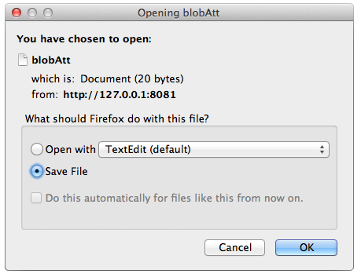

Passez "true" pour enregistrer le BLOB en tant que document (vous devez également passer `$expand={blobAttributeName}`)

## Description

`$binary` vous permet d'enregistrer le BLOB en tant que document.  Vous devez également utiliser la commande [`$expand`]($expand.md) en conjonction avec celle-ci.

Lorsque vous faites la requête suivante :

```
GET  /rest/Company(11)/blobAtt?$binary=true&$expand=blobAtt
```

Il vous sera demandé où enregistrer le BLOB sur le disque :


