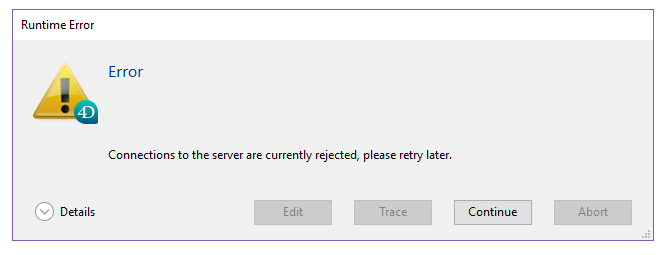

La Page Serveur d’application regroupe les informations relatives à la base de données publiée par 4D Server et permet de gérer cette publication.

La partie supérieure de la page fournit des informations sur le statut courant du serveur d’application de 4D Server.

- **Etat** : Démarré ou Arrêté.
- **Date de démarrage** : Date et heure de lancement de la base serveur. Cette date correspond à l’ouverture de la base par 4D Server.
- **Durée de fonctionnement** : Durée écoulée depuis la dernière ouverture de la base.

## Refuser / Accepter nouvelles connexions

Il permet de gérer l’accès de nouveaux postes clients à l’application serveur.

Par défaut, lorsque la base est publiée :

- Le libellé du bouton est "Refuser nouvelles connexions"
- De nouveaux clients peuvent se connecter librement (dans les limites des connexions accordées par la licence).
- Le nom de la base est publié dans la boîte de dialogue de connexion (si l’option "Publier le nom de la base au démarrage dans le dialogue de connexion" est cochée dans les Préférences).

Si vous cliquez sur le bouton **Refuser nouvelles connexions** :

- Le libellé du bouton devient "Accepter nouvelles connexions"
- Plus aucun nouveau client ne peut alors se connecter. Les clients qui tenteront de se connecter recevront le message suivant :

- Le nom du projet n’apparaît plus dans la boîte de dialogue de connexion.
- Les clients déjà connectés ne sont pas déconnectés et peuvent continuer à travailler normalement.

> Vous pouvez effectuer la même action avec la commande [`REJECT NEW REMOTE CONNECTIONS`](https://doc.4d.com/4dv19/help/command/en/page1635.html).

- Si vous cliquez sur le bouton **Accepter nouvelles connexions**, la base retourne dans l’état "par défaut".

Cette fonction permet par exemple à un administrateur d'effectuer diverses opérations de maintenance (vérification, compactage, etc.) juste après avoir démarré le serveur. S’il utilise une connexion cliente, il a la certitude d’être le seul à modifier les données. Il est également possible d’utiliser cette fonction en préparation d’une opération de maintenance nécessitant qu’aucun poste client ne soit connecté.

## Informations

### Configuration

Cette zone fournit plusieurs informations sur la base de données 4D publiée par le serveur : nom et emplacement des fichiers de structure et de données et nom du fichier journal (fichier d’historique de la base). Vous pouvez cliquer sur le nom du fichier de structure ou de données afin de visualiser son chemin d’accès complet.

Le champ **Mode** indique le mode d'exécution courant de l'application : compilé ou interprété.

La partie inférieure de la zone indique les paramètres de configuration du serveur (démarré comme service, port et adresse IP) et l’activation du TLS pour les connexions client-serveur (ne concerne pas les connexions SQL ni HTTP).

### Mémoire

Cette zone indique la **mémoire cache totale** (paramètre défini dans les préférences de la base) et la **mémoire cache utilisée** (allocation dynamique par 4D Server en fonction des besoins).

### Connexions application serveur

- **Maximum** : indique le nombre maximum de connexions clientes simultanées autorisées pour le serveur d'application. Cette valeur dépend de la licence installée sur le poste serveur.
- **Utilisées** : indique le nombre de connexions actuellement consommées.
