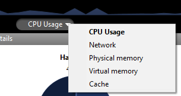

La Page **Moniteur** affiche des informations dynamiques relatives à l’exploitation de la base de données ainsi que des informations sur le système et l’application 4D Server.

> Sous Windows, certaines informations système affichées sur cette page sont récupérées via les outils "Analyseur de performance" de Windows. Ces outils sont accessibles uniquement si l'utilisateur ayant ouvert la session sur laquelle 4D Server a été lancé dispose des autorisations d'administration nécessaires.

## Zone graphique

La zone graphique permet de visualiser l’évolution en temps réel de plusieurs paramètres : le taux d’utilisation des processeurs, le trafic réseau et l'état de la mémoire. Vous sélectionnez le paramètre à afficher via le menu situé au centre la fenêtre :

- **Utilisation processeurs** : Taux d’utilisation globale du ou des processeur(s) de la machine, toutes applications confondues. La part spécifique de 4D Server dans ce taux d’utilisation est fournie dans la zone d’informations "Processeurs".
- **Réseau** : Nombre d’octets reçus par seconde par la machine (serveur ou client). Le nombre d’octets envoyés est fourni dans la zone d’informations "Réseau".
- **Mémoire physique** : Quantité de mémoire RAM de la machine utilisée par 4D Server. Une vue plus détaillée de l’utilisation de la mémoire est fournie dans la zone d’informations "Mémoire".
- **Mémoire virtuelle** : Affiche dans la zone graphique la quantité de mémoire virtuelle utilisée par l’application 4D Server. Cette mémoire est allouée par le système en fonction des besoins de l’application. La valeur située en bas à droite de la zone indique la quantité de mémoire en cours d’utilisation. La valeur située en haut à gauche indique la quantité maximale de mémoire virtuelle utilisable. La valeur maximale est calculée dynamiquement en fonction des paramètres mémoire généraux de l’application.
- **Cache** : Affiche dans la zone graphique la quantité de mémoire cache utilisée par l’application 4D Server. La valeur située en bas à droite de la zone indique la quantité de mémoire en cours d’utilisation. The value found at the bottom right of the area indicates the quantity of memory currently being used.

A noter que lorsque cette option est sélectionnée, le défilement de la zone graphique est ralenti car une analyse efficace du cache s’effectue généralement sur une période d’observation assez longue.

## Zone Vue d’ensemble

La zone "Vue d’ensemble" fournit diverses informations relatives au système, à l’application et aux licences installées sur la machine de 4D Server.

- **Informations système** : Ordinateur, système et adresse IP du serveur
- **Informations application** : Numéro de version interne de 4D Server et statut du Volume Shadow Copy
- **Connexions maximum** : Nombre de connexions simultanées autorisées par type de serveur
- **Licence** : Description de la licence. Lorsque la licence produit ou l'une de ses expansions expire dans moins de 10 jours, dans le cas d'un abonnement, 4D Server tente de renouveler automatiquement la licence depuis le compte de l'utilisateur 4D. Dans ce cas, si le renouvellement automatique échoue pour une raison quelconque (erreur de connexion, statut du compte invalide, contrat non prolongé...), une icône d'avertissement est affichée à côté de la licence afin d'alerter l'administrateur du serveur. Des informations supplémentaires relatives au statut du renouvellement de la licence peuvent être affichées dans une info-bulle lorsque vous survolez la zone avec la souris :

Usually, you will need to check the [**Licences Manager**](Admin/licenses.md).

## Zone Détails

La zone "Détails" reprend une partie des informations affichées dans la zone graphique et propose des informations complémentaires.

- **Disque dur** : Capacité globale du disque dur et répartition entre l’espace occupé par les données de la base (fichier de données + index des données), l’espace occupé par les autres fichiers et l’espace disponible.
- **Mémoire** : Mémoire RAM installée sur la machine et quantité de mémoire occupée par 4D Server, par les autres applications ainsi que mémoire disponible. La mémoire occupée par 4D Server peut également être affichée dynamiquement dans la zone graphique.
- **Processeurs** : Taux instantané d’occupation du ou des processeurs(s) de la machine par 4D Server et par les autres applications. Ce taux est recalculé en permanence. Le taux d’occupation par 4D Server peut également être affiché dynamiquement dans la zone graphique.
- **Réseau** : Nombre instantané d’octets envoyés et reçus par la machine (serveur ou client). Cette valeur est réactualisée en permanence. Le nombre d’octets reçus peut également être affiché dynamiquement dans la zone graphique.
