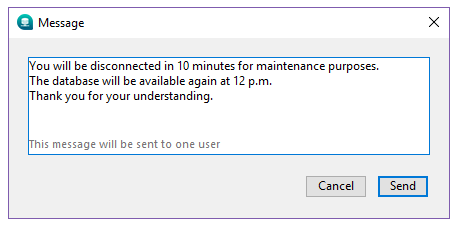

La page **Utilisateurs** liste les utilisateurs 4D connectés au serveur.

Le bouton "Utilisateurs" indique entre parenthèses le nombre total d’utilisateurs connectés au serveur (ce nombre ne tient pas compte des éventuels filtres d’affichage appliqués à la fenêtre). La page contient également une zone de recherche dynamique et des boutons de commande. Vous pouvez modifier l’ordre des colonnes par simple glisser-déposer de la zone d’en-tête des colonnes.

Vous pouvez également trier la liste sur les valeurs d’une colonne en cliquant sur son en-tête. Cliquez plusieurs fois pour définir alternativement un ordre croissant/décroissant.

## Liste des utilisateurs

Pour chaque utilisateur connecté à la base, la liste fournit les informations suivantes :

- Système de la machine cliente (macOS ou Windows) sous forme d’icône.
- **4D User**: Name of the 4D user, or alias if set with the [`SET USER ALIAS`](https://doc.4d.com/4dv19/help/command/en/page1666.html) command on the user machine. Si les mots de passe ne sont pas activés et si aucun alias n'a été défini, tous les utilisateurs 4D sont nommés "Super_Utilisateur".
- **Nom de machine** : Nom de la machine distante.
- **Nom de session** : Nom de la session ouverte sur la machine distante.
- **Adresse IP** : Adresse IP de la machine distante.
- **Connexion** : Date et heure de la connexion de la machine distante.
- **Temps CPU** : Temps processeur consommé par cet utilisateur depuis la connexion.
- **Activité** : Ratio du temps que 4D Server consacre à cet utilisateur (affichage dynamique). "Endormi" si la machine du poste client est passée en veille (cf. ci-dessous).

### Gestion des utilisateurs endormis

4D Server gère spécifiquement le cas où la machine d'une application distante 4D passe en mode veille alors que la connexion au serveur est toujours active. Dans ce cas, l'application distante 4D connectée notifie automatiquement 4D Server de sa déconnexion imminente. Sur le serveur, l'utilisateur connecté prend le statut d'activité **Endormi** :

Ce statut libère les ressources sur le serveur. En outre, l'application 4D distante se reconnecte automatiquement à 4D Server après la sortie du mode veille.

Le scénario suivant est pris en charge : un utilisateur distant cesse de travailler durant un certain laps de temps, par exemple durant la pause déjeuner, mais garde ouverte la connexion au serveur. La machine passe en mode veille. Au retour de l'utilisateur, la machine sort du mode veille et l'application 4D distante récupère automatiquement sa connexion au serveur ainsi que son contexte de session.

> Une session distante en veille est automatiquement abandonnée par le serveur après 48 heures d'inactivité. You can modify this default timeout using the [`SET DATABASE PARAMETER`](https://doc.4d.com/4dv19/help/command/en/page642.html) command with the `Remote connection sleep timeout` selector.

## Zone de recherche/filtrage

Cette fonction permet de réduire le nombre de lignes affichées dans la liste à celles qui correspondent au texte saisi dans la zone de recherche. La zone indique les colonnes dans lesquelles la recherche/le filtrage sera effectué(e). Dans la page Utilisateurs, il s’agit des colonnes Utilisateur 4D, Nom de machine et Nom de session.

La mise à jour de la liste est effectuée en temps réel à mesure que vous saisissez du texte dans la zone. Il est possible de saisir plus d’une valeur à chercher. Utilisez un point-virgule pour séparer les valeurs. L’opérateur utilisé dans ce cas est du type `OU`. Par exemple, si vous saisissez "Jean;Marie;Pierre", seules les lignes comportant Jean OU Marie OU Pierre dans l’une des colonnes cibles seront conservées.

## Boutons d’administration

La page comporte trois boutons de commande. Ces boutons sont actifs si au moins une ligne est sélectionnée. Vous pouvez sélectionner plusieurs lignes en appuyant sur la touche **Maj** pour une sélection continue ou **Ctrl** (Windows) / **Commande** (macOS) pour une sélection discontinue.

### Envoyer message

Ce bouton permet d’envoyer un message aux utilisateurs 4D sélectionnés dans la fenêtre. Si aucun utilisateur 4D n’est sélectionné, le bouton est désactivé. Lorsque vous cliquez sur le bouton, une boîte de dialogue apparaît, vous permettant saisir le message. La boîte de dialogue indique le nombre d’utilisateurs qui recevront le message :

Le message sera affiché sous forme d’alerte sur les postes distants.

> Vous pouvez effectuer la même action pour les utilisateurs distants avec la commande [`SEND MESSAGE TO REMOTE USER`](https://doc.4d.com/4dv19/help/command/en/page1632.html).

### Visualiser process

Ce bouton permet de visualiser directement les process du ou des utilisateur(s) sélectionné(s) dans la [page **Processus** ](processes.md) de la fenêtre d’administration. Lorsque vous cliquez sur ce bouton, 4D Server bascule sur la page Process et pré-remplit la zone de recherche/filtrage de cette page avec les noms des utilisateurs sélectionnés.

### Déconnecter

Ce bouton permet de forcer la déconnexion du ou des utilisateur(s) sélectionné(s). When you click on this button, a warning dialog box appears so that you can confirm or cancel this operation (hold down **Alt** key while clicking on the **Drop user** button to disconnect the selected user(s) directly without displaying the confirmation dialog box).

> Vous pouvez effectuer la même action pour les utilisateurs distants avec la commande [`DROP REMOTE USER`](https://doc.4d.com/4dv19/help/command/en/page1633.html).
