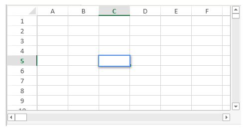

<!-- REF #_method_.VP Cell.Syntax -->

**VP Cell** ( *vpAreaName* : Text ; *column* : Integer ; *row* : Integer { ; *sheet* : Integer } )  : Object<!-- END REF -->

<!-- REF #_method_.VP Cell.Params -->

| Paramètres | Type    |                             | Description                                                                 |
| ---------- | ------- | --------------------------- | --------------------------------------------------------------------------- |
| vpAreaName | Text    | ->                          | Nom d'objet formulaire zone 4D View Pro                                     |
| column     | Integer | ->                          | Indice de la colonne                                                        |
| row        | Integer | ->                          | Indice de la ligne                                                          |
| sheet      | Integer | ->                          | Numéro d'indice de la feuille (feuille courante si omis) |
| Résultat   | Object  | <- | Objet plage d'une seule cellule                                             |

<!-- END REF -->

#### Description

La commande `VP Cell` <!-- REF #_method_.VP Cell.Summary -->retourne une nouvelle plage référençant une cellule spécifique<!-- END REF -->.

> Cette commande s'applique aux plages d'une seule cellule. Pour créer un objet plage pour plusieurs cellules, utilisez la commande [VP Cells](vp-cells.md).

Dans *vpAreaName*, passez le nom de la zone 4D View Pro. Si vous passez un nom inexistant, une erreur est retournée.

Le paramètre *column* définit la colonne de la position de la plage de cellules. Passez l'indice de la colonne dans ce paramètre.

Le paramètre *row* définit la ligne de la position de la plage de cellules. Passez l'indice de la ligne dans ce paramètre.

Dans le paramètre optionnel *sheet*, vous pouvez indiquer l'index de la feuille où la plage sera définie. Si le paramètre est omis ou si vous passez `vk current sheet`, la feuille courante est utilisée par défaut.

> l'indexation démarre à 0.

#### Exemple

Vous souhaitez définir une plage pour la cellule de la feuille courante (sur la feuille courante) :



Le code est le suivant :

```4d
$cell:=VP Cell("ViewProArea";2;4) // C5
```

#### Voir également

[VP All](vp-all.md)<br/>
[VP Cells](vp-cells.md)<br/>
[VP Column](vp-column.md)<br/>
[VP Combine ranges](vp-combine-ranges.md)<br/>
[VP Name](vp-name.md)<br/>
[VP Row](vp-row.md)
