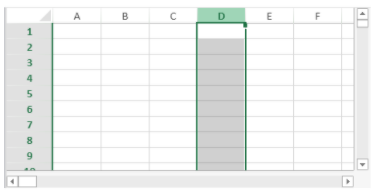

<!-- REF #_method_.VP Column.Syntax -->

**VP Column** ( *vpAreaName* : Text ; *column*: Integer ; *columnCount* : Integer { ; *sheet* : Integer } ) : Object<!-- END REF -->

<!-- REF #_method_.VP Column.Params -->

| Paramètres  | Type    |                             | Description                                                                 |                  |
| ----------- | ------- | --------------------------- | --------------------------------------------------------------------------- | ---------------- |
| vpAreaName  | Text    | ->                          | Nom d'objet formulaire zone 4D View Pro                                     |                  |
| column      | Integer | ->                          | Indice de la colonne                                                        |                  |
| columnCount | Integer | ->                          | Nombre de colonnes                                                          |                  |
| sheet       | Integer | ->                          | Numéro d'indice de la feuille (feuille courante si omis) |                  |
| Résultat    | Object  | <- | Objet plage de toutes les cellules                                          | <!-- END REF --> |

#### Description

La commande `VP Column` <!-- REF #_method_.VP Column.Summary -->retourne un nouvel objet de plage référencant une ou des colonnes spécifiques<!-- END REF -->.

Dans *vpAreaName*, passez le nom de la zone 4D View Pro. Si vous passez un nom inexistant, une erreur est retournée.

Le paramètre *column* définit la première colonne de la plage de colonnes. Passez l'indice de la colonne (la numérotation commence à zéro) dans ce paramètre. Si la plage contient plusieurs colonnes, vous devez également utiliser le paramètre optionnel *columnCount*.

Le paramètre optionnel *columnCount* permet de définir le nombre total de colonnes de la plage. *columnCount* doit être supérieur à 0. Si le paramètre est omis, la valeur 1 sera définie par défaut et une plage de type colonne sera créée.

Dans le paramètre optionnel *sheet*, vous pouvez désigner une feuille spécifique dans laquelle sera définie la plage (la numérotation commence à zéro). Si le paramètre est omis ou si vous passez `vk current sheet`, la feuille courante est utilisée par défaut.

#### Exemple

Vous souhaitez définir une plage pour la colonne ci-dessous (dans la feuille courante) :



Le code est le suivant :

```4d
 $column:=VP Column("ViewProArea";3) // colonne D
```

#### Voir également

[VP All](vp-all.md)<br/>
[VP Cells](vp-cells.md)<br/>
[VP Cell](vp-cell.md)<br/>
[VP Combine ranges](vp-combine-ranges.md)<br/>
[VP Name](vp-name.md)<br/>
[VP Row](vp-row.md)<br/>
[VP SET COLUMN ATTRIBUTES](vp-set-column-attributes.md)
