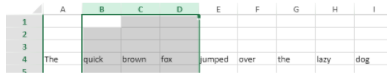

<!-- REF #_method_.VP DELETE COLUMNS.Syntax -->

**VP DELETE COLUMNS** ( *rangeObj* : Object )<!-- END REF -->

<!-- REF #_method_.VP DELETE COLUMNS.Params -->

| Paramètres | Type   |    | Description |                  |
| ---------- | ------ | -- | ----------- | ---------------- |
| rangeObj   | Object | -> | Objet plage | <!-- END REF --> |

#### Description

La commande `VP DELETE COLUMNS` <!-- REF #_method_.VP DELETE COLUMNS.Summary -->supprime les colonnes de *rangeObj*<!-- END REF -->.

Dans *rangeObj*, passez un objet contenant une plage de colonnes à supprimer. Si la plage qui est passée contient :

- des lignes et des colonnes, seules les colonnes sont supprimées.
- uniquement des lignes, la commande ne fait rien.

> Les colonnes sont supprimées de droite à gauche.

#### Exemple

Pour supprimer les colonnes sélectionnées par l'utilisateur (colonnes B, C et D de l'image ci-dessous) :



saisissez le code suivant :

```4d
VP DELETE COLUMNS(VP Get selection("ViewProArea"))
```

#### Voir également

[VP DELETE ROWS](vp-delete-rows.md)<br/>
[VP INSERT COLUMNS](vp-insert-columns.md)<br/>
[VP INSERT ROWS](vp-insert-rows.md)
