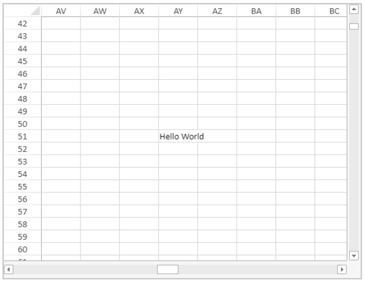

<!-- REF #_method_.VP SHOW CELL.Syntax -->

**VP SHOW CELL** ( *rangeObj* : Object { ; *vPos* : Integer; *hPos* : Integer } ) <!-- END REF -->

<!-- REF #_method_.VP SHOW CELL.Params -->

| Paramètres | Type    |    | Description                                                 |                  |
| ---------- | ------- | -- | ----------------------------------------------------------- | ---------------- |
| rangeObj   | Object  | -> | Objet plage                                                 |                  |
| vPos       | Integer | -> | Position verticale de la vue de la cellule ou de la ligne   |                  |
| hPos       | Integer | -> | Position horizontale de la vue de la cellule ou de la ligne | <!-- END REF --> |

#### Description

The `VP SHOW CELL` command <!-- REF #_method_.VP SHOW CELL.Summary -->vertically and horizontally repositions the view of the *rangeObj*<!-- END REF -->.

In *rangeObj*, pass a range of cells as an object to designate the cells to be viewed. The view of the *rangeObj* will be positioned vertically or horizontally (i.e., where *rangeObj* appears) based on the *vPos* and *hPos* parameters. The *vPos* parameter defines the desired vertical position to display the *rangeObj*, and the *hPos* parameter defines the desired horizontal position to display the *rangeObj*.

Les sélecteurs suivants sont disponibles :

| Sélecteur             | Description                                                                                                                                                                                                                                                                                                                                                                                                          | Disponible avec *vPos* | Disponible avec *hPos* |
| --------------------- | -------------------------------------------------------------------------------------------------------------------------------------------------------------------------------------------------------------------------------------------------------------------------------------------------------------------------------------------------------------------------------------------------------------------- | ---------------------- | ---------------------- |
| `vk position bottom`  | Alignement vertical vers le bas de la cellule ou de la ligne.                                                                                                                                                                                                                                                                                                                                        | X                      |                        |
| `vk position center`  | Alignement vers le centre. The alignment will be to the cell, row, or column limit according to the view position indicated:<li>Vertical view position - cell or row</li><li>Horizontal view position - cell or column</li>                                                                                                                                                          | X                      | X                      |
| `vk position left`    | Alignement horizontal vers la gauche de la cellule ou de la colonne                                                                                                                                                                                                                                                                                                                                                  |                        | X                      |
| `vk position nearest` | Alignement vers la limite la plus proche (haut, bas, gauche, droite, centre). The alignment will be to the cell, row, or column limit according to the view position indicated:<li>Vertical view position (top, center, bottom) - cell or row </li><li>Horizontal view position (left, center, right) - cell or column</li> | X                      | X                      |
| `vk position right`   | Alignement horizontal vers la droite de la cellule ou de la colonne                                                                                                                                                                                                                                                                                                                                                  |                        | X                      |
| `vk position top`     | Alignement vertical vers le haut de la cellule ou de la ligne                                                                                                                                                                                                                                                                                                                                                        | X                      |                        |

> Cette commande n'est efficace que si le repositionnement de la vue est possible. For example, if the *rangeObj* is in cell A1 (the first column and the first row) of the current sheet, repositioning the view will make no difference because the vertical and horizontal limits have already been reached (i.e., it is not possible to scroll any higher or any more to the left). The same is true if *rangeObj* is in cell C3 and the view is repositioned to the center or the bottom right. La vue demeure inchangée.

#### Exemple

Vous souhaitez visualiser la cellule dans la colonne AY, ligne 51, au centre de la zone 4D View Pro.

```4d
$displayCell:=VP Cell("myVPArea";50;50)
 // Déplacez la vue pour afficher la cellule
 VP SHOW CELL($displayCell;vk position center;vk position center)
```

Résultat:



Le même code ainsi que les sélecteurs verticaux et horizontaux ont été modifiés pour afficher la même cellule en haut à droite de la zone 4D View Pro :

```4d
$displayCell:=VP Cell("myVPArea";50;50)
  // Déplacez la vue pour afficher la cellule
 VP SHOW CELL($displayCell;vk position top;vk position right)
```

Résultat:


#### Voir également

[VP Cell](vp-cell.md)<br/>
[VP Get active cell](vp-get-active-cell.md)<br/>
[VP Get selection](vp-get-selection.md)<br/>
[VP RESET SELECTION](vp-reset-selection.md)<br/>
[VP SET ACTIVE CELL](vp-set-active-cell.md)<br/>
[VP SET SELECTION](vp-set-selection.md)
