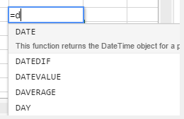
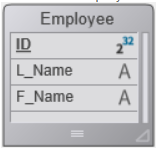

## Utilisation des formules

Une formule de feuille de calcul est une expression qui calcule la valeur d'une cellule.

### Saisie des formules

Pour saisir une formule dans une zone de 4D View Pro :

1. Sélectionnez la cellule dans laquelle vous allez saisir la formule ou la fonction.
2. Saisissez = (le signe égal).
3. Tapez la formule et appuyez sur la touche **Entrée**.

Lorsque vous écrivez une formule, vous pouvez utiliser différents raccourcis :

- cliquez sur une cellule pour entrer sa référence dans la formule :


- tapez la première lettre d'une fonction à saisir. Un menu contextuel listant les fonctions et références disponibles apparaît, pour vous permettre de sélectionner les éléments souhaités :



Vous pouvez également créer des formules nommées qui peuvent être appelées via leur nom. Pour ce faire, saisissez ces formules à l'aide de la commande [VP ADD FORMULA NAME](commands/vp-add-formula-name.md).

### Opérateurs et opérandes

Toutes les formules ont des opérandes et des opérateurs :

- **Opérateurs** : voir [Valeurs et opérateurs](#values-and-operators) ci-dessous.
- **Les opérandes** comprennent plusieurs catégories:
  - [valeurs](#values-and-operators) (5 types de données sont pris en charge)
  - [Les références à d'autres cellules](#cell-references) (relatives, absolues, mixtes ou par nom)
  - [fonctions de feuille de calcul standard](#using-functions)
  - [Fonctions 4D](#4d-functions) basées sur des formules 4D et donnant accès à des variables, champs, méthodes, commandes ou expressions 4D.

## Valeurs et opérateurs

4D View Pro prend en charge cinq types de données. Pour chaque type de données, des valeurs littérales et des opérateurs spécifiques sont pris en charge.

| Types de données                  | Valeurs                                                                                             | Opérateurs                                                                                                                                                                                                                                                                                                                                            |
| --------------------------------- | --------------------------------------------------------------------------------------------------- | ----------------------------------------------------------------------------------------------------------------------------------------------------------------------------------------------------------------------------------------------------------------------------------------------------------------------------------------------------- |
| [Number](Concepts/dt_number.md)   | 1.2<br/>1.2 E3<br/>1.2E-3<br/>10.3x | + (addition)<br/>- (soustraction)<br/>\* (multiplication)<br/>/ (division)<br/>^ (exposant, le nombre de fois qu'il faut multiplier un nombre par lui-même)<br/>% (pourcentage -- diviser par cent le nombre précédant l'opérateur) |
| [Date](Concepts/dt_date.md)       | 10/24/2017                                                                                          | + (date + nombre de jours -> date)<br/>+ (date + heure -> date + heure de la journée)<br/>- (date - nombre de jours -> date)<br/>- (date - date -> nombre de jours entre les deux)                                                                                        |
| [Time](Concepts/dt_time.md)       | 10:12:10                                                            | Opérateurs de durée :<br/>+ (addition)<br/>- (soustraction)<br/>\* (durée \* nombre -> durée)<br/>/ (durée / nombre -> durée)                                                                                                                             |
| [String](Concepts/dt_string.md)   | 'Sophie' ou "Sophie"                                                                                | & (concaténation)                                                                                                                                                                                                                                                                                              |
| [Boolean](Concepts/dt_boolean.md) | TRUE ou FALSE                                                                                       | -                                                                                                                                                                                                                                                                                                                                                     |

### Opérateurs de comparaison

Les opérateurs suivants peuvent être utilisés avec deux opérandes de même type :

| Opérateur                   | Comparaison         |
| --------------------------- | ------------------- |
| =                           | est égal à          |
| `<>`                        | est différent de    |
| >                           | supérieur à         |
| <  | inférieur à         |
| > =                         | supérieur ou égal à |
| <= | inférieur ou égal à |

### Préséance des opérateurs

Liste des opérateurs, du plus important au moins important :

| Opérateur                   | Description                                    |
| --------------------------- | ---------------------------------------------- |
| ()       | Parenthèse (pour regrouper) |
| -                           | Négatif                                        |
| +                           | Plus                                           |
| %                           | Pourcentage                                    |
| ^                           | Exposant                                       |
| \* et /                     | Multiplier et diviser                          |
| + et -                      | Ajouter et soustraire                          |
| &       | Concaténer                                     |
| `=`  `>` `<` `>=` `<=` `<>` | Comparer                                       |

## Références de cellules

Les formules font souvent référence à d'autres cellules par des adresses de cellule. Vous pouvez copier ces formules dans d'autres cellules. Par exemple, la formule suivante, saisie dans la cellule C8, additionne les valeurs des deux cellules situées au-dessus et affiche le résultat.

```
= C6 + C7
```

Cette formule fait référence aux cellules C6 et C7. En d'autres termes, le logiciel 4D View Pro reçoit l'instruction de se référer à ces autres cellules pour trouver les valeurs à utiliser dans la formule.

Lorsque vous copiez ou déplacez ces formules vers de nouveaux emplacements, chaque adresse de cellule dans cette formule change ou reste la même, selon la façon dont elle est tapée.

- Une référence qui change est appelée une **référence relative**, et fait référence à une cellule en fonction de sa distance à gauche/droite et en haut/bas par rapport à la cellule contenant la formule.
- Une référence qui pointe toujours vers une cellule particulière est appelée une **référence absolue**.
- Vous pouvez également créer une référence mixte qui pointe toujours vers une ligne ou une colonne fixe.

### Notation des références

Si vous utilisez uniquement des coordonnées de cellule, telle qu'une cellule C5 par exemple, 4D View Pro interprète la référence comme étant relative. Vous pouvez faire de la référence une référence absolue en précédant la lettre et le chiffre du signe dollar, comme dans `$C$5`.

Vous pouvez combiner les références absolues et relatives en insérant un signe dollar devant la lettre ou le chiffre seul, par exemple, `$C5` ou `C$5`. Une référence mixte vous permet de spécifier la ligne ou la colonne comme absolue, tout en permettant à l'autre partie de l'adresse de se référer de manière relative.

Un moyen pratique, rapide et précis de spécifier une référence absolue consiste à nommer la cellule et à utiliser ce nom à la place de l'adresse de la cellule. Une référence à une cellule nommée est toujours absolue. Vous pouvez créer ou modifier des cellules ou des plages de cellules nommées en utilisant la commande [`VP ADD RANGE NAME`](commands/vp-add-range-name.md).

Le tableau suivant montre l'effet des différentes notations :

| Exemple        | Type de référence | Description                                                                                                                                                                                                     |
| -------------- | ----------------- | --------------------------------------------------------------------------------------------------------------------------------------------------------------------------------------------------------------- |
| C5             | Relative          | La référence concerne l'emplacement relatif de la cellule C5, en fonction de l'emplacement de la cellule dans laquelle la référence est utilisée pour la première fois                                          |
| $C$5           | Absolue           | La référence est absolue. Elle fait toujours référence à la cellule C5, quel que soit l'endroit où elle est utilisée.                                                           |
| $C5            | Mixed             | La référence est toujours faite à la colonne C, mais la référence de ligne est relative à l'emplacement de la cellule dans laquelle la référence est utilisée pour la première fois.            |
| C$5            | Mixed             | La référence est toujours la ligne 5, mais la référence de la colonne est relative à l'emplacement de la cellule dans laquelle la référence est utilisée pour la première fois                                  |
| Nom de cellule | Absolue           | La référence est absolue. Elle fait toujours référence à la [cellule ou à la plage nommée](commands/vp-add-range-name.md) quel que soit l'endroit où la référence est utilisée. |

## Fonctions intégrées

Les fonctions de tableur sont des formules prédéfinies utilisées pour calculer les valeurs des cellules. Lorsque vous tapez la première lettre de la fonction à saisir, un menu contextuel répertoriant les fonctions et références disponibles apparaît, vous permettant de sélectionner les éléments souhaités :


Voir [**la liste étendue des fonctions de SpreadJS**](https://developer.mescius.com/spreadjs/docs/formulareference/FormulaFunctions) pour plus de détails et d'exemples.

## Fonctions 4D

4D View Pro vous permet de définir et d'appeler **des fonctions 4D personnalisées**, qui exécutent [des formules 4D](API/FunctionClass.md). L'utilisation de fonctions personnalisées 4D étend les possibilités de vos documents 4D View Pro et permet des interactions avancées avec la base de données 4D.

Les fonctions personnalisées 4D permettent d'accéder, à partir de vos formules 4D View Pro :

- aux variables process 4D,
- aux champs,
- aux méthodes projet,
- aux commandes de langage 4D,
- ou à toute autre expression 4D valide.

Les fonctions personnalisées 4D peuvent recevoir des [paramètres](#parameters) de la zone 4D View Pro, et retourner des valeurs.

Vous déclarez toutes vos fonctions en utilisant la commande [`VP SET CUSTOM FUNCTIONS`](commands/vp-set-custom-functions). Exemples :

```4d
$o:=New object

//Nom de la fonction dans 4D View Pro : "DRIVERS_LICENCE"
$o.DRIVERS_LICENCE:=New object

//variable process
$o.DRIVERS_LICENCE.formula:=Formula(DriverLicence)

//champ table
$o.DRIVERS_LICENCE.formula:=Formula([Users]DriverLicence)

//méthode projet
$o.DRIVERS_LICENCE.formula:=Formula(DriverLicenceState)

//Commande 4D
$o.DRIVERS_LICENCE:=Formula(Choose(DriverLicence; "Obtained"; "Failed"))

//expression et paramètre 4D 
$o.DRIVERS_LICENCE.formula:=Formula(ds.Users.get($1).DriverLicence)
$o.DRIVERS_LICENCE.parameters:=New collection
$o.DRIVERS_LICENCE.parameters.push(New object("name"; "ID"; "type"; Is longint))
```

> **Voir aussi** [4D View Pro : Utilisez des formules 4D dans votre feuille de calcul (article de blog)](https://blog.4d.com/4d-view-pro-use-4d-formulas-in-your-spreadsheet/)

### Exemple avec Hello World

Nous souhaitons imprimer "Hello World" dans une cellule de la zone 4D View Pro en utilisant une méthode projet 4D :

1. Créez une méthode projet "myMethod" avec le code suivant :

```4d
 #DECLARE->$hw :Text
 $hw:="Hello World"

```

2. Exécutez le code suivant avant d'ouvrir tout formulaire contenant une zone 4D View Pro :

```4d
  Case of
    :(Form event code=On Load)
       var $o : Object
       $o:=New object
  // Définir la fonction "vpHello" à partir de la méthode "myMethod"
       $o.vpHello:=New object
       $o.vpHello.formula:=Formula(myMethod)
       VP SET CUSTOM FUNCTIONS("ViewProArea";$o)
 End case
```

3. Modifiez le contenu d'une cellule dans une zone 4D View Pro et saisissez :

   

   "myMethod" est alors appelé par 4D et la cellule s'affiche :

   

### Paramètres

Les paramètres peuvent être passés aux fonctions 4D qui appellent les méthodes projet en utilisant la syntaxe suivante :

```
=METHODNAME(param1,param2,...,paramN)
```

Ces paramètres sont reçus dans _methodName_ en $1, $2...$N.

A noter que les ( ) sont obligatoires, même si aucun paramètre n'est passé :

```
=METHODWITHOUTNAME()
```

Vous pouvez déclarer le nom, le type et le nombre de paramètres à travers la collection _parameters_ de la fonction que vous avez déclarée en utilisant la commande [VP SET CUSTOM FUNCTIONS](commands/vp-set-custom-functions.md). En option, vous pouvez contrôler le nombre de paramètres passés par l'utilisateur à l'aide des propriétés _minParams_ et _maxParams_.

Pour plus d'informations sur les types de paramètres entrants pris en charge, veuillez vous reporter à la description de la commande [VP SET CUSTOM FUNCTIONS](commands/vp-set-custom-functions).

Si vous ne déclarez pas de paramètres, les valeurs peuvent être passées séquentiellement aux méthodes (elles seront reçues dans $1, $2...) et leur type sera automatiquement converti.

Les paramètres Date et Objet sont gérés de la manière suivante:

- Les dates en _jstype_ seront passées en tant que [object](Concepts/dt_object.md) dans le code 4D avec deux propriétés :

| Propriété | Type | Description       |
| --------- | ---- | ----------------- |
| value     | Date | Valeur date       |
| time      | Real | Heure en secondes |

- Les objets seront passés comme [object](Concepts/dt_object.md) avec une propriété `.value` contenant le paramètre:

| Propriété | Type   | Description       |
| --------- | ------ | ----------------- |
| value     | Object | Paramètre d'objet |

### Valeurs retournées

Les méthodes projet 4D peuvent également retourner des valeurs dans la formule de la cellule 4D View Pro via $0. Les types de données suivants sont pris en charge pour les paramètres retournés :

- [text](Concepts/dt_string.md) (converti en chaîne de caractères dans 4D View Pro)
- [real](Concepts/dt_number.md)/[longint](Concepts/dt_number.md) (converti en nombre dans 4D View Pro)
- [date](Concepts/dt_date.md) (converti en type JS Date dans 4D View Pro - heure, minute, seconde = 0)
- [time](Concepts/dt_time.md) (converti en type JS Date dans 4D View Pro - date dans la date de base, c'est-à-dire 30/12/1899)
- [boolean](Concepts/dt_boolean.md) (converti en bool dans 4D View Pro)
- [picture](Concepts/dt_picture.md) (jpg,png,gif,bmp,svg autres types convertis en png) crée un URI (data:image/png;base64,xxxx) et ensuite utilisé comme fond dans 4D View Pro dans la cellule où la formule est exécutée
- [objet](Concepts/dt_object.md) avec les deux propriétés suivantes (permettant de passer une date et une heure) :

  | Propriété | Type | Description       |
  | --------- | ---- | ----------------- |
  | value     | Date | Valeur date       |
  | time      | Real | Heure en secondes |

Si la méthode 4D ne retourne rien, une chaîne vide est automatiquement retournée.

Une erreur est retournée dans la cellule 4D View Pro si :

- la méthode 4D retourne un autre type que ceux listés ci-dessus,
- une erreur s'est produite pendant l'exécution de la méthode 4D (lorsque l'utilisateur clique sur le bouton "abort").

#### Exemple

```4d
var $o : Object

$o.BIRTH_INFORMATION:=New object
$o.BIRTH_INFORMATION.formula:=Formula(BirthInformation)
$o.BIRTH_INFORMATION.parameters:=New collection
$o.BIRTH_INFORMATION.parameters.push(New object("name";"First name";"type";Is text))
$o.BIRTH_INFORMATION.parameters.push(New object("name";"Birthday";"type";Is date))
$o.BIRTH_INFORMATION.parameters.push(New object("name";"Time of birth";"type";Is time))
$o.BIRTH_INFORMATION.summary:="Returns a formatted string from given information"

VP SET CUSTOM FUNCTIONS("ViewProArea"; $o)
```


## Compatibilité

Des solutions alternatives sont disponibles pour déclarer des champs ou des méthodes en tant que fonctions dans vos zones 4D View Pro. Ces solutions sont maintenues pour des raisons de compatibilité et peuvent être utilisées dans des cas spécifiques. Cependant, l'utilisation de la commande [`VP SET CUSTOM FUNCTIONS`](commands/vp-set-custom-functions.md) est recommandée.

### Référencement de champs à l'aide de la structure virtuelle

4D View Pro vous permet de référencer des champs 4D en utilisant la structure virtuelle de la base de données, c'est-à-dire déclarée à travers les commandes [`SET TABLE TITLES`](https://doc.4d.com/4dv19/help/command/fr/page601.html) et/ou [`SET FIELD TITLES`](https://doc.4d.com/4dv19/help/command/fr/page602.html) avec le paramètre \*. Cette solution alternative peut être utile si votre application s'appuie déjà sur une structure virtuelle (sinon, [il est recommandé d'utiliser `VP SET CUSTOM FUNCTIONS`](#4d-functions)).

> **ATTENTION :** Vous ne pouvez pas utiliser la structure virtuelle et `VP SET CUSTOM FUNCTIONS` simultanément. As soon as `VP SET CUSTOM FUNCTIONS` is called, the functions based upon `SET TABLE TITLES` and `SET FIELD TITLES` commands are ignored in the 4D View Pro area.

#### Conditions requises

- Le champ doit appartenir à la structure virtuelle de la base de données, c'est-à-dire qu'il doit être déclaré par les commandes [`SET TABLE TITLES`](https://doc.4d.com/4dv19/help/command/fr/page601.html) et/ou [`SET FIELD TITLES`](https://doc.4d.com/4dv19/help/command/fr/page602.html) avec le paramètre \* (voir exemple),
- Les noms de table et de champ doivent être conformes à ECMA (voir également [la norme ECMA Script](https://www.ecma-international.org/ecma-262/5.1/#sec-7.6)),
- Le type de champ doit être pris en charge par 4D View Pro (voir ci-dessus).

Une erreur est retournée dans la cellule 4D View Pro si la formule appelle un champ qui n'est pas conforme.

#### Appel d'un champ virtuel dans une formule

Pour insérer une référence à un champ virtuel dans une formule, saisissez le champ avec la syntaxe suivante :

```
TABLENAME_FIELDNAME()
```

Par exemple, si vous avez déclaré le champ "Name" de la table "People" dans la structure virtuelle, vous pouvez appeler les fonctions suivantes :

```
=PEOPLE_NAME()
=LEN(PEOPLE_NAME())
```

> Si un champ porte le même nom qu'une [méthode 4D](../Concepts/methods.md), il a la priorité sur la méthode.

#### Exemple

Nous souhaitons imprimer le nom d'une personne dans une cellule de la zone 4D View Pro en utilisant un champ virtuel 4D :

1. Créez une table "Employee" avec un champ "L_Name" :



2. Exécuter le code suivant pour initialiser une structure virtuelle :

   ```4d
   ARRAY TEXT($tableTitles;1)
   ARRAY LONGINT($tableNum;1)
   $tableTitles{1}:="Emp"
   $tableNum{1}:=2
   SET TABLE TITLES($tableTitles;$tableNum;*)
    
   ARRAY TEXT($fieldTitles;1)
   ARRAY LONGINT($fieldNum;1)
   $fieldTitles{1}:="Name"
   $fieldNum{1}:=2 //nom de famille
   SET FIELD TITLES([Employee];$fieldTitles;$fieldNum;*)
   ```

3. Modifiez le contenu d'une cellule de la zone 4D View Pro et saisir "=e" :


4. Sélectionnez EMP_NAME (utilisez la touche Tab) et saisissez la fermeture ).


5. Validez le champ pour afficher le nom de l'employé courant :


> La table \[Employee] doit avoir un enregistrement en cours.

### Déclarer des méthodes autorisées

Vous pouvez appeler directement des méthodes du projet 4D à partir de vos formules 4D View Pro. Pour des raisons de sécurité, vous devez déclarer explicitement des méthodes qui peuvent être appelées par l'utilisateur avec la commande [VP SET ALLOWED METHODS](commands/vp-set-allowed-methods.md) .

#### Conditions requises

Pour être appelée dans une formule 4D View Pro, une méthode projet doit être :

- **Autorisée** : elle a été déclarée explicitement avec la commande [VP SET ALLOWED METHODS](commands/vp-set-allowed-methods.md).
- **Exécutable** : elle appartient au projet hôte ou à un composant chargé dont l'option "Partagé par les composants et le projet hôte" est activée (voir [Partage des méthodes projet](../Concepts/components.md#sharing-of-project-methods)).
- **Pas de conflit** avec une fonction de tableur 4D View Pro existante : si vous appelez une méthode projet portant le même nom qu'une fonction intégrée 4D View Pro, la fonction est appelée.

> Si ni la commande [VP SET CUSTOM FUNCTIONS](commands/vp-set-custom-functions.md) ni la commande [VP SET ALLOWED METHODS](commands/vp-set-allowed-methods.md) n'ont été exécutées pendant la session, les fonctions personnalisées de 4D View Pro s'appuient sur les méthodes autorisées définies par la commande générique `SET ALLOWED METHODS` de 4D. Dans ce cas, les noms de méthode du projet doivent être conformes à la grammaire des identifiants JavaScript (voir également [la norme ECMA Script](https://www.ecma-international.org/ecma-262/5.1/#sec-7.6)). L'option de filtrage global dans la boîte de dialogue Paramètres (voir _Accès aux données_) est ignorée dans tous les cas.
