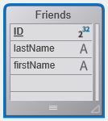
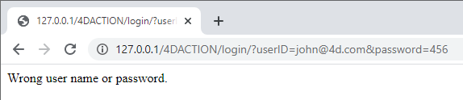

Cette section d'initiation est destinée aux nouveaux utilisateurs qui souhaitent avoir une vue d'ensemble sur la façon de créer à partir de rien un site Web 4D qui gère des données provenant de la base. C'est parti !

## Hello World Example

Commençons par faire en sorte que le serveur web envoie "Hello World" au navigateur. La manière la plus simple de faire cela est de créer un projet, démarrer le serveur web et écrire un petit code qui retourne un texte dans la méthode base `On Web Connection`.

### Démarrer le serveur web

Pour démarrer le Serveur Web 4D:

1. Lancez votre application 4D et créez un nouveau projet 4D vide.
2. Dans le menu **Exécution**, sélectionnez **Démarrer le serveur Web**.

C'est tout ! Le serveur web est démarré (vous pouvez voir que l'élément de menu est devenu **Arrêter le serveur web**). Il est maintenant prêt à traiter les requêtes. Pour le vérifier, nous allons afficher la page d'accueil par défaut.

### Affichage de la page home par défaut

Le serveur web 4D crée automatiquement une page `index.html` par défaut dans le dossier racine `WebFolder` par défaut, créé au même niveau que le dossier Project.

1. Lancez un navigateur web et connectez-vous à l'adresse IP du serveur web (le port http par défaut pour le serveur web 4D est 80). Si le serveur web et le navigateur sont sur la même machine, vous pouvez sélectionner **Tester le serveur Web** dans le menu **Exécution**.

La page d'accueil par défaut est affichée :


### Affichage de Hello World

1. Ouvrez l'Explorateur, affichez la liste des méthodes base et double-cliquez sur `On Web Connection`.

2. Saisissez le code suivant :

```4d
Case of 
	: ($1="/hello")
		WEB SEND TEXT("Hello World!")
	Else 
		// Error 404 par exemple
End case 
```

La méthode base [`On Web Connection`](httpRequests.md#on-web-connection) est appelée pour les requêtes entrantes et reçoit l'URL cible dans le paramètre `$1`. Ce code très simple envoie simplement le texte au navigateur.

3. Dans votre navigateur, saisissez l'URL suivante :

```
http://localhost/hello
```

Le serveur web traite la demande et renvoie :


## Obtenir des données à partir de la base

Maintenant, nous allons voir à quel point il est simple de récupérer des données de la base. Tout d'abord, nous allons créer une table et la remplir avec quelques données.

Créez une base de données basique avec, par exemple, une seule table contenant quelques enregistrements :




### Affichage des données dans une page

La solution la plus simple pour afficher des données est d'appeler une [page de modèle](templates.md) contenant des balises.

1. À l'aide de n'importe quel éditeur de texte, créez un fichier contenant les lignes suivantes :

```html
<html>
<body>
<!--#4DCODE ALL RECORDS([Friends])-->
<!--#4DLOOP [Friends]-->
<!--#4DTEXT [Friends]lastName--> <!--#4DTEXT [Friends]firstName--><br/>
<!--#4DENDLOOP-->
</body>
</html>
```

2. Nommez le fichier "friends.shtml" et enregistrez-le dans le dossier **WebFolder** de votre projet.
3. Dans votre navigateur, saisissez l'URL suivante :

```
http://localhost/friends.shtml
```

Les pages `.shtml` sont automatiquement traitées par le serveur web. Votre page remplie avec les données est renvoyée :


### Requête REST

Si nous ne voulons pas seulement _afficher_ des données, mais aussi les _utiliser_, nous pouvons faire appel à ORDA et au serveur REST. Grâce au concept [ORDA](ORDA/overview.md), la table `Friends` est automatiquement disponible sous forme de dataclass et est disponible via [REST](REST/gettingStarted.md).

1. Nous allons utiliser le serveur REST pour accéder aux données : dans la boîte de dialogue des \*\* Paramètres\*\*, sélectionnez **Web** > **Fonctionnalités Web**, et cochez l'option **Exposer en tant que serveur REST**.


2. Dans votre navigateur, saisissez l'URL suivante :

```
http://localhost/rest/$catalog
```

Le serveur web renvoie les résultats en JSON :

```json
{
	"__UNIQID": "3F1B6ACFFE12B64493629AD76011922D",
	"dataClasses": [
		{
			"name": "Friends",
			"uri": "/rest/$catalog/Friends",
			"dataURI": "/rest/Friends"
		}
	]
}
```

Vous obtenez le catalogue, c'est-à-dire la liste des dataclass et des attributs exposés dans le datastore.

Vous pouvez également obtenir diverses données.

3. Entrez l'URL suivante :

```
http://localhost/rest/Friends
```

Le serveur renvoie les entités, c'est-à-dire les données, de la dataclass Friends :

```json
{
	"__DATACLASS": "Friends",
	"__entityModel": "Friends",
	"__GlobalStamp": 0,
	"__COUNT": 4,
	"__FIRST": 0,
	"__ENTITIES": [
		{
			"__KEY": "1",
			"__TIMESTAMP": "2020-10-27T14:29:01.914Z",
			"__STAMP": 1,
			"ID": 1,
			"lastName": "Smith",
			"firstName": "John"
		},
		{
			"__KEY": "2",
			"__TIMESTAMP": "2020-10-27T14:29:16.035Z",
			"__STAMP": 1,
			"ID": 2,
			"lastName": "Brown",
			"firstName": "Danny"
		},
		{
			"__KEY": "3",
			"__TIMESTAMP": "2020-10-27T14:29:43.945Z",
			"__STAMP": 1,
			"ID": 3,
			"lastName": "Purple",
			"firstName": "Mark"
		},
		{
			"__KEY": "4",
			"__TIMESTAMP": "2020-10-27T14:34:58.457Z",
			"__STAMP": 1,
			"ID": 4,
			"lastName": "Dupont",
			"firstName": "Jenny"
		}
	],
	"__SENT": 4
}
```

Cet exemple très simple montre comment le serveur web interagit de manière transparente avec le [serveur REST](REST/gettingStarted.md) pour renvoyer toutes les données demandées, à condition qu'elles soient exposées. Dans vos interfaces web, vous pouvez facilement lier le code javascript ou html avec les données retournées. Examinez l'[Explorateur de données Web](Admin/dataExplorer.md) intégré pour avoir un exemple d'interface web sophistiquée liée aux dataclass.

## Connexion et session

Dans les sections ci-dessus, nous obtenons un accès libre à l'application à partir de requêtes Web. Cependant, dans le monde des applications web, la sécurité d'accès aux données est la première priorité. Lors de la connexion au serveur Web 4D, les utilisateurs doivent être authentifiés et leur navigation contrôlée.

### Création d'une table d'utilisateurs

La façon la plus simple et sécurisée de connecter un utilisateur sur le serveur web 4D est basée sur le scénario suivant :

- Les utilisateurs sont stockés dans une table dédiée et non exposée (nommée _WebUsers_ par exemple)
- La table _WebUsers_ pourrait être [chiffrée](MSC/encrypt.md) et stocke le nom d'utilisateur et un hachage de leur mot de passe.

1. Créez une table avec certains champs, par exemple :


2. Écrivez et exécutez le code suivant pour créer un utilisateur :

```4d
var $webUser : cs.WebUsersEntity

$webUser:=ds.WebUsers.new()
$webUser.firstName:="John"
$webUser.lastName:="Doe"
// le mot de passe devrait en principe être saisi par l'utilisateur
$webUser.password:=Generate password hash("123")
$webUser.userId:="john@4d.com"
$webUser.save()
```

### Authentification des utilisateurs

> Pour être en sécurité de bout en bout, il est nécessaire que la connexion entière soit établie via [https](webServerConfig.md#enable-https).

1. Ouvrez l'Explorateur et créez une méthode projet nommée "login".

2. Écrivez le code suivant :

```4d
var $indexUserId; $indexPassword : Integer
var $userId; $password : Text
var $user; $info : Object
ARRAY TEXT($anames; 0)
ARRAY TEXT($avalues; 0)

// récupérer les valeurs envoyées dans le header de la requête
WEB GET VARIABLES($anames; $avalues)

// chercher les champs de login dans le header
$indexUserId:=Find in array($anames; "userId")
$userId:=$avalues{$indexUserId}
$indexPassword:=Find in array($anames; "password")
$password:=$avalues{$indexPassword}

//chercher l'utilisateur saisi dans la table des utilisateurs
$user:=ds.WebUsers.query("userId = :1"; $userId).first()

If ($user#Null) //un utilisateur a été trouvé
		//vérifier le mot de passe
    If (Verify password hash($password; $user.password))
    		//mot de passe ok, on remplit la session
        $info:=New object()
        $info.userName:=$user.firstName+" "+$user.lastName
        Session.setPrivileges($info)
        	//On peut utiliser la session utilisateur pour stocker toute information
        WEB SEND TEXT("Welcome "+Session.userName)
    Else 
        WEB SEND TEXT("Wrong user name or password.")
    End if 
Else 
    WEB SEND TEXT("Wrong user name or password.")
End if 
```

3. Affichez les propriétés de la méthode en cliquant sur le bouton **[i]** dans l'éditeur de code, cochez l'option `Balises et URLs 4D (4DACTION...)` et cliquez sur **OK**.


4. Dans votre navigateur, saisissez l'URL suivante :

```
http://localhost/4DACTION/login/?userID=john@4d.com&password=123
```

> L'utilisation de telles URLs n'est pas recommandée, elle est présentée ici uniquement pour simplifier l'exemple. Une requête de connexion plus réaliste doit être traitée via un formulaire web et une requête POST. Voir [cette page](sessions.md#example) pour un exemple de formulaire POST.

Vous serez alors connecté pour la session :


Les informations d'identification erronées seraient rejetées :



Une fois qu'un utilisateur est connecté, vous pouvez gérer la session associée en utilisant la commande `WEB Get Current Session ID`. Voir la page [Sessions Web](sessions.md) .
