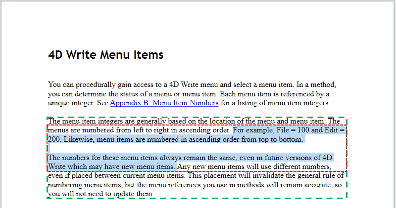

<!--REF #_command_.WP Get position.Syntax-->**WP Get position** ( *objCible* {; *presentation*} ) -> Résultat<!-- END REF-->
<!--REF #_command_.WP Get position.Params-->
| Paramètre | Type |  | Description |
| --- | --- | --- | --- |
| objCible | Object | &#8594;  | Plage ou élément ou document 4D Write Pro |
| presentation | Integer | &#8594;  | Mise en page de document 4D Write Pro utilisée pour la présentation :<br/>0 (par défaut) = mise en page 4D Write Pro,<br/>1 = HTML WYSIWYG |
| Résultat | Object | &#8592; | Informations sur la position |

<!-- END REF-->

#### Description 

<!--REF #_command_.WP Get position.Summary-->La commande **WP Get position** retourne un objet décrivant la position courante de *objCible*.<!-- END REF-->

Dans le paramètre *objCible* vous pouvez passer :

* une plage, ou
* un élément (tableau / ligne / paragraphe / corps / en-tête / pied / image / section / sous-section / zone de texte), ou
* un document 4D Write Pro

L'objet retourné par la commande comporte les propriétés suivantes :

| **Nom de la propriété** | **Type** | **Description**                                                                                                                                                                                                                                                                |
| ----------------------- | -------- | ------------------------------------------------------------------------------------------------------------------------------------------------------------------------------------------------------------------------------------------------------------------------------ |
| section                 | Nombre   | Numéro de la première section qui croise l'*objCible*                                                                                                                                                                                                                          |
| page                    | Nombre   | Numéro de la première page qui croise l'*objCible*                                                                                                                                                                                                                             |
| column                  | Nombre   | Index de la première colonne qui croise l'*objCible* (base 1)                                                                                                                                                                                                                  |
| line                    | Nombre   | Index de la première ligne qui croise l'*objCible* (par rapport à la colonne -ou la page si aucune colonne- base 1)                                                                                                                                                            |
| position                | Nombre   | Position dans la ligne du premier caractère de l'*objCible* (base 1)                                                                                                                                                                                                           |
| bounds                  | Objet    | Coordonnées du rectangle englobant d'*objCible*, exprimées dans l'unité du document courant et relativement à l'extrémité supérieure gauche de la page. Le padding et les tailles des bordures (le cas échéant) sont pris en compte ; les marges et les règles ne le sont pas. |
| top                     | Nombre   | Coordonnée supérieure du rectangle                                                                                                                                                                                                                                             |
| left                    | Nombre   | Coordonnée gauche du rectangle                                                                                                                                                                                                                                                 |
| bottom                  | Nombre   | Coordonnée inférieure du rectangle                                                                                                                                                                                                                                             |
| right                   | Numbre   | Coordonnée droite du rectangle                                                                                                                                                                                                                                                 |
| rangeHeight             | Nombre   | Hauteur du rectangle englobant de l'*objCible*. Cette valeur peut être différente de *bounds.bottom-bounds.top* si *objCible* s'étend sur plusieurs colonnes (voir l'exemple 4).                                                                                               |

Si *objCible* est une plage vide, **WP Get position** retourne des informations sur la position du début de la plage. Notez que lorsqu'une plage de type par défaut (texte) est vide, la hauteur de la plage (*range* ou *bounds.bottom-bounds.top*) correspond à la hauteur du curseur et la largeur de la plage (*bounds.right-bounds.left*) est de 1 pixel.   
Si *objCible* est un texte en en-tête ou en pied, **WP Get position** retourne des informations sur la position où l'en-tête et le pied de page sont affichés dans la première section/page.  
Si *objCible* est une image ancrée (qui peut être répliquée sur plusieurs pages), **WP Get position** renvoie des informations sur la position où l'image est ancrée dans la première section/page.  
Si *objCible* est une sous-section, **WP Get position** renvoie des informations sur la position de la première page de la section parente.

Le paramètre *presentation* peut être utilisé pour définir du wysiwyg HTML pour l'évaluation de l'*objCible*. Vous pouvez passer une des constantes suivantes du thème "4D Write Pro" :

| Constante              | Type        | Valeur | Comment                                                                                                                                                          |
| ---------------------- | ----------- | ------ | ---------------------------------------------------------------------------------------------------------------------------------------------------------------- |
| wk 4D Write Pro layout | Entier long | 0      | Format 4D Write Pro standard, pouvant inclure des attributs de style spécifiques                                                                                 |
| wk html wysiwyg        | Entier long | 1      | Dans ce format, les éventuels attributs avancés de 4D Write Pro non disponibles dans tous les navigateurs sont supprimés (multi-colonnes, double interlignes...) |

Si *presentation* est omis, la présentation 4D Write Pro (0) est utilisée par défaut.

**Notes sur les performances** 

* Les mêmes paramétrages de présentation que pour la commande [WP PRINT](wp-print.md) sont utilisés avec **WP Get position** :  
   * en-têtes : visible  
   * pieds : visible  
   * expressions : calculées et affichées  
   * mode page : page ou brouillon (vue wysiwyg HTML telle que définie par la commande)  
   Si *objCible* est affiché dans une zone formulaire 4D Write Pro, assurez-vous que les paramètres d'affichage de la zone correspondent aux paramètres d'affichage de la commande afin d'obtenir des informations cohérentes. Notez également que si ces paramètres sont différents dans la zone, 4D Write Pro devra "cloner" le document pour calculer la présentation à chaque appel de la commande, ce qui peut prendre un certain temps. Pour des raisons de performances, il est recommandé dans ce cas de créer le document hors ligne et de le copier dans la zone sur le formulaire uniquement lorsque la génération est terminée.
* Cette commande ne doit pas être appelée dans des événements fréquemment générés (tels que On After Edit), étant donné que, par exemple, *result.rangeHeight* peut nécessiter de coûteux calculs de rendu à chaque appel d'événement.

#### Exemple 1 

Vous souhaitez connaître le numéro de page d'une plage :

```4d
 var $range;$rangePosition : Object
 $range:=WP Text range(WParea) //plage de la sélection de l'utilisateur
 $rangePosition:=WP Get position($range;wk 4D Write Pro layout)
 ALERT("Votre sélection se trouve en page  "+String($rangePosition.page))
```

#### Exemple 2 

Vous voulez appliquer la couleur bleue pour le texte de la première et de la dernière page d'un document :

```4d
 var $nbPages : Integer
 var $body : Object
 var $_paragraphs : Collection
 
 $nbPages:=WP Get page count([DOC]Sample)
 $body:=WP Get body([DOC]Sample)
 $_paragraphs:=WP Get elements($body;wk type paragraph)
 For each($paragraph;$_paragraphs)
    $info:=WP Get position($paragraph)
    If($info.page=1)|($info.page=$nbPages) // pour la première et la dernière page, couleur du texte en bleu
       WP SET ATTRIBUTES($paragraph;wk text color;"blue")
    Else //pour les paragraphes des autres pages, le texte est en noir
       WP SET ATTRIBUTES($paragraph;wk text color;"black")
    End if
 End for each
```

#### Exemple 3 

Lors de la création d'un document, vous souhaitez éviter les fractionnements de paragraphes :

```4d
 var WParea;$body : Object
 var $_paragraphs : Collection
 WParea:=WP New
 
 $body:=WP Get body([DOC]Sample)
 $_paragraphs:=WP Get elements($body;wk type paragraph)
 
 For each($paragraph;$_paragraphs)
    $insert:=WP New($paragraph)
 
  //mémorise la plage courante et le numéro de page
    $rangeBefore:=WP Text range(WParea;wk end text;wk end text)
    $info:=WP Get position($rangeBefore)
    $memoPage:=$info.page
 
  //insère les contenus, sans toucher à la plage
    WP INSERT DOCUMENT($rangeBefore;$insert;wk append;wk exclude from range)
 
  //vérifie la position après l'insertion
    $rangeAfter:=WP Text range(WParea;wk end text;wk end text)
    $info:=WP Get position($rangeAfter)
 
    If($memoPage#$info.page) // si la page a changé, insertion d'un saut de page
       WP INSERT BREAK($rangeBefore;wk page break;wk replace)
       fin de si
 
    End for each
```

#### Exemple 4 

Les exemples suivants illustrent les coordonnées retournées du rectangle englobant, en fonction de *objCible*.

```4d
 $default:=WP Text range(WPArea) //plage par défaut (texte)
 $textCoordinates:=WP Get position($default) //ligne pointillée rouge
 
 $paragraph:=WP Create paragraph range($default) //plage paragraphe
 $paraCoordinates:=WP Get position($paragraph) //ligne pointillée verte
```



*Ligne pointillée rouge :* *valeurs $textCoordinates de l'objet* 
**Ligne pointillée verte :* **valeurs $* *paraCoordinates* **de l'objet*

**Note :** En cas d'affichage sur plusieurs colonnes, la propriété *rangeHeight* (lignes pleines) peut être plus importante que *bounds.bottom*\-*bounds.top* (lignes pointillées) :


#### Voir aussi 

[WP PRINT](wp-print.md)  