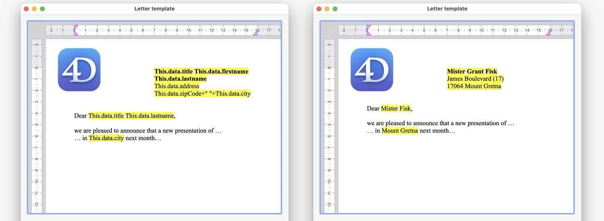

<!--REF #_command_.WP SET DATA CONTEXT.Syntax-->**WP SET DATA CONTEXT** ( *wpDoc* ; *contextData* )<!-- END REF-->
<!--REF #_command_.WP SET DATA CONTEXT.Params-->
| Paramètre | Type |  | Description |
| --- | --- | --- | --- |
| wpDoc | Object | &#8594;  | Document 4D Write Pro |
| contextData | Object | &#8594;  | Données à insérer dans le contexte |

<!-- END REF-->

*Cette commande n'est pas thread-safe, elle ne peut pas être utilisée dans du code préemptif.*


#### Description 

<!--REF #_command_.WP SET DATA CONTEXT.Summary-->La commande **WP SET DATA CONTEXT** définit l'objet *contextData* comme contexte de données du document 4D Write Pro wpDoc.<!-- END REF--> La définition d'un nouveau contexte pour un document remplace tout contexte existant pour ce document. 

Dans wpDoc, passez le document 4D Write Pro qui recevra le contexte de données. 

Dans contextData, passez un objet qui détermine le contenu du contexte de données. Vous pouvez passer n'importe quel type d'objet 4D, y compris des objets appartenant à des classes ORDA, tels que 4D.Entity. Pour réinitialiser un contexte, passez un objet *null*.

Un contexte de données 4D Write Pro est volatile : 

* On peut y accéder via un document 4D Write Pro au moment de l'exécution.
* Il n'est pas sauvegardé dans le document 4D Write Pro, contrairement aux autres propriétés 4D Write Pro.

Une fois qu'un contexte de données est défini, ses données sont disponibles dans la zone 4D Write Pro au sein du process courant par le biais de la formule **This.data**.

**Note :** D'autres formules sont disponibles via **This** lorsque l'on travaille avec des sources de données de type tableau, voir *Expressions avec This*.

Un contexte de données ne peut être utilisé uniquement dans le process où il a été défini :

* Lorsque vous utilisez le contexte de données dans des formules calculées d'un autre process, il est *null* et **This.data** est indéfini.
* Si vous définissez un contexte de données qui a déjà été défini pour le même document dans un autre process, une erreur est générée.

Afin de calculer des formules avec différents contextes de données dans différents process (c'est-à-dire générer différentes factures à partir du même document modèle), il est recommandé de dupliquer le document en utilisant [WP New](wp-new.md) dans chacun de ces process pour éviter toute erreur. A noter que le contexte de données n'est pas copié lorsque vous dupliquez un document.

#### Exemple 1 

Insérez un objet dans le contexte d'un document 4D Write Pro et affichez ses informations sur la page :

```4d
 var $person;$info: Object
 
  // Créer un objet "person"
 $person:=New object()
 $person.firstName:="John"
 $person.lastName:="Doe"
 
  // Définir un contexte à l'aide de l'objet "person"
 WP SET DATA CONTEXT(WParea;$person)
 
  // Accéder au contexte de données avec le mot-clé "This"
 $info:=Formula(This.data.firstName+" "+This.data.lastName)
 
  // Afficher le contexte de données sur la page
 WP INSERT FORMULA(WParea;$info;wk replace) // afficher "John Doe" sur la page.
```

Le résultat est le suivant :


#### Exemple 2 

Lorsque vous travaillez sur un modèle de document, vous pouvez y associer un contexte pour insérer des données dans la page. Cela est utile, par exemple, pour des campagnes d'e-mailing. 

Lorsque le modèle est chargé et que le contexte de données est défini, un modèle de lettre peut avoir cet aperçu :



L'exemple suivant fait une boucle à travers une *entity selection* et crée un aperçu avant impression pour chaque *entity* :

```4d
 var $person: 4D.Entity
 var $people: 4D.EntitySelection
 
 SET PRINT PREVIEW(True)
 $people:=ds.People.all()
 For each($person;$people)
    WP SET DATA CONTEXT(WParea;$person)
    WP PRINT(WParea)
 End for each
```

#### Voir aussi 

  
[WP COMPUTE FORMULAS](wp-compute-formulas.md)  
[WP Get data context](wp-get-data-context.md)  