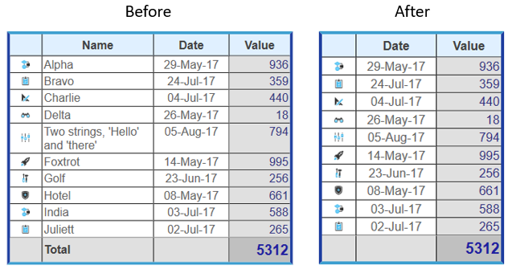

<!--REF #_command_.WP TABLE DELETE COLUMNS.Syntax-->**WP TABLE DELETE COLUMNS** ( *objCible* ) | ( *refTableau* ; *numCol* {; *nbCols*} )<!-- END REF-->
<!--REF #_command_.WP TABLE DELETE COLUMNS.Params-->
| Paramètre | Type |  | Description |
| --- | --- | --- | --- |
| objCible | Object | &#8594;  | Plage ou élément ou document 4D View Pro |
| refTableau | Object | &#8594;  | Référence de tableau |
| numCol | Integer | &#8594;  | Numéro de colonne |
| nbCols | Integer | &#8594;  | Nombre de colonnes à supprimer (valeur par défaut=1) |

<!-- END REF-->

#### Description 

<!--REF #_command_.WP TABLE DELETE COLUMNS.Summary-->La commande **WP TABLE DELETE COLUMNS** supprimer une ou plusieurs colonnes d'un tableau 4D Write.<!-- END REF-->

Cette commande prend en charge deux syntaxes :

* Si vous passez objCible comme premier paramètre, la commande supprimera toutes les colonnes des tableaux qui intersectent la cible. objCible peut contenir :  
   * une plage, ou  
   * un élément (ligne / paragraphe / corps / en-tête/ pied / image en ligne / section / sous-section), ou  
   * un document 4D Write Pro.  
         
   Si objCible intersecte plusieurs tableaux, les colonnes intersectées sont supprimées. Si objCible n'intersecte pas un tableau, la commande ne fait rien (aucune erreur n'est générée).  
   Avec cette syntaxe, le paramètre *nbCols* est ignoré (s'il est passé).
* Si vous passez les paramètres *refTableau* et *numCol*, la commande supprime la ou les colonnes du tableau désigné, en commençant par l'indice de colonne spécifié.  
Avec cette syntaxe, le paramètre optionnel *nbCols* définit le nombre de colonnes de *refTableau* à supprimer. Par défaut, si ce paramètre est omis, une colonne est supprimée.

La suppression de toutes les colonnes du tableau entrainera la suppression du tableau.

#### Exemple 

Vous souhaitez supprimer une colonne du tableau *Invoice*. Ce code :

```4d
 var $table : Object
 
 $table:=WP Get element by ID(WParea;"Invoice") //récupère le tableau "Invoice" 
 
 WP TABLE DELETE COLUMNS($table;2;1) //récupère la deuxième colonne
```

Supprimera la colonne de son emplacement initial :



#### Voir aussi 

[WP TABLE DELETE ROWS](wp-table-delete-rows.md)  