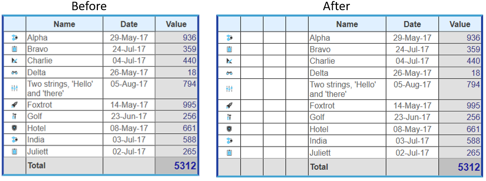

<!--REF #_command_.WP Table insert columns.Syntax-->**WP Table insert columns** ( objCible | {*refTableau* ; *numCol*} {; *nbCols*} )  -> Résultat<!-- END REF-->
<!--REF #_command_.WP Table insert columns.Params-->
| Paramètre | Type |  | Description |
| --- | --- | --- | --- |
| objCible | Object | &#8594;  | Plage ou élément ou document 4D Write Pro |
| refTableau | Object | &#8594;  | Référence de tableau |
| numCol | Integer | &#8594;  | Numéro de colonne |
| nbCols | Integer | &#8594;  | Nombre de colonnes à insérer (valeur par défaut = 1) |
| Résultat | Object | &#8592; | Plage de colonnes du tableau |

<!-- END REF-->

#### Description 

<!--REF #_command_.WP Table insert columns.Summary-->La commande **WP Table insert columns** insère une ou plusieurs colonnes dans un tableau 4D Write Pro.<!-- END REF-->

Cette commande prend en charge deux syntaxes :

* Si vous passez objCible comme premier paramètre, la commande insèrera la/les colonne(s) du premier tableau qui intersecte la cible. objCible peut contenir :  
   * une plage, ou  
   * un élément (ligne / paragraphe / corps / en-tête/ pied / image en ligne / section / sous-section), ou  
   * un document 4D Write Pro.  
         
   Si objCible n'intersecte pas une plage tableau ou une plage texte là où des colonnes peuvent être insérées, la commande ne fait rien et retourne Null (aucune erreur n'est générée).
* Si vous passez les paramètres *refTableau* et *numCol*, la commande insèrera la/les colonne(s) dans le tableau désigné, suivant l'indice de colonne spécifié. Si numCol est supérieur au nombre de colonnes dans *refTableau*, les colonnes ne sont pas insérées dans le tableau, mais elles y sont annexées.

Le paramètre optionnel nbCols définit le nombre de colonnes à insérer dans objCible ou *refTableau*. Par défaut, si ce paramètre est omis, une colonne est insérée.

**Résultat**

La commande retourne une plage de colonne représentant une ou plusieurs colonnes insérées, ou retourne Null si rien n'a été inséré. 

#### Exemple 

Vous souhaitez insérer deux colonnes après la première colonne du tableau *Invoice*. Le code suivant :

```4d
 var $column : Object
 var $table : Object
 
 $table:=WP Get element by ID(WParea;"Invoice") //récupère le tableau "Invoice"
 
 $column:=WP Table insert columns($table;2;3) //2e position, ajoute 3 colonnes
```

Insèrera la nouvelle colonne à l'emplacement souhaité :



#### Voir aussi 

[WP Table insert rows](wp-table-insert-rows.md)  