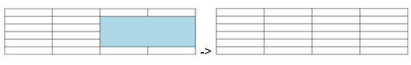

<!--REF #_command_.WP TABLE SPLIT CELLS.Syntax-->**WP TABLE SPLIT CELLS** ( *targetObj* ) | ( *tableRef* ; *startColumn* ; *startRow* {; *columnCount*{; *rowCount*}} )<!-- END REF-->
<!--REF #_command_.WP TABLE SPLIT CELLS.Params-->
| Paramètre | Type |  | Description |
| --- | --- | --- | --- |
| targetObj | Object | &#8594;  | Range or element or 4D Write Pro document |
| tableRef | Object | &#8594;  | Table reference |
| startColumn | Integer | &#8594;  | Position of first cell column |
| startRow | Integer | &#8594;  | Position of first column row |
| columnCount | Integer | &#8594;  | Number of columns to split |
| rowCount | Integer | &#8594;  | Number of rows to split |

<!-- END REF-->

*Cette commande n'est pas thread-safe, elle ne peut pas être utilisée dans du code préemptif.*


#### Description 

<!--REF #_command_.WP TABLE SPLIT CELLS.Summary-->La commande **WP TABLE SPLIT CELLS** fractionne la sélection intersectée de cellules contenues dans *targetObj* ou *tableRef* (défini par *startColumn*, *startRow*, *columnCount*, et *rowCount*).<!-- END REF--> Une cellule ne sera fractionnée que si elle a déjà été fusionnée horizontalement, verticalement ou les deux ; dans le cas contraire, la cellule ne sera pas modifiée.

Vous pouvez passer soit : 

* *targetObj:*  
   * une plage, ou  
   * un élément (tableau / ligne / corps / paragraphe / image ancrée / en-tête / pied / section / sous-section), ou  
   * un document 4D Write Pro

Si *targetObj* ne croise pas un tableau ou une plage de texte où une sélection de cellules peut être récupérée, la commande ne fait rien.

Si *targetObj* croise une ou plusieurs cellules qui n'ont pas été fusionnées auparavant, la commande **WP TABLE SPLIT CELLS** ne fait rien.

**OU**

* startColumn et *startRow* \- définissent les coordonnées gauche-haut de la première cellule à fractionner.
* columnCount et rowCount (facultatif) - spécifie respectivement le nombre de colonnes et le nombre de lignes à fractionner.  
    
Si rowCount est omis, cela équivaut à passer 1 (valeur par défaut). Si columnCount et rowCount sont tous deux omis, cela équivaut à fractionner une seule cellule, et si elle n'a pas été fusionnée auparavant, rien ne se produit.

Si startColumn plus ColumnCount ou *startRow* plus rowCount dépasse le nombre de colonnes/lignes dans tableRef, ou si startColumn ou *startRow* est supérieur au nombre de colonnes/lignes dans tableRef, la plage renvoyée contient le maximum de colonnes/lignes possibles, ce qui signifie que chaque cellule du tableau (si elle a été fusionnée auparavant) est fractionnée.

#### Example 

L'exemple suivant consiste à désigner une plage de cellules (qui contient des cellules déjà fusionnées) et à la fractionner :

```4d
 WP TABLE SPLIT CELLS($table;3;2;1;1)
  //or
 $cells:=WP Table get cells($table;3;2;1;1)
 WP TABLE SPLIT CELLS($cells)
```

Résultat :



Les données de la cellule déjà fusionnée sont toutes conservées dans la première cellule ( première en haut à gauche) après le fractionnement, les autres cellules résultant du fractionnement restent vides.

Pour plus de détails, veuillez consulter *Fusionner et fractionner des cellules*.

#### Voir aussi 

*Manipuler des tableaux*  
[WP TABLE MERGE CELLS](wp-table-merge-cells.md)  