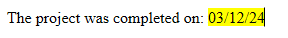

<!--REF #_command_.WP Insert formula.Syntax-->**WP Insert formula** ( *targetObj* ; *formula* ; *mode* {; *rangeUpdate*} ) : Object<!-- END REF-->

<!--REF #_command_.WP Insert formula.Params-->

| Paramètres  | Type   |   | Description                                                |
| ----------- | ------ | - | ---------------------------------------------------------- |
| targetObj   | Object | → | Range or element or 4D Write Pro document                  |
| formula     | Object | → | Formula object OR Object with formula and name properties  |
| mode        | Number | → | Insertion mode                                             |
| rangeUpdate | Number | → | Includes or excludes the inserted content within the range |
| Résultat    | Object | ← | Text range object reprsenting the result of the formula    |

<!-- END REF-->

#### Description

The **WP Insert formula** command<!--REF #_command_.WP Insert formula.Summary--> inserts a *formula* in *targetObj* according to the specified insertion *mode* and returns the resulting text range.<!-- END REF-->

In the *targetObj* parameter, you can pass:

- a range, or
- an element (table / row / cell(s) / paragraph / body / header / footer / section / subsection / inline picture), or
- a 4D Write Pro document.

In the *formula* parameter, pass the 4D formula to evaluate. Vous pouvez passer :

- either a [formula object](../../API/FunctionClass.md#formula-objects) created by the [**Formula**](../../API/FunctionClass.md#formula) or [**Formula from string**](../../API/FunctionClass.md#formula-from-string) command,
- or an object containing two properties:

| **Propriété** | **Type** | **Description**                                                                                                                                                                                                        |
| ------------- | -------- | ---------------------------------------------------------------------------------------------------------------------------------------------------------------------------------------------------------------------- |
| name          | Text     | Name to display for the formula in the document                                                                                                                                                                        |
| formula       | Object   | The [formula object](../../API/FunctionClass.md#formula-objects) created by the [**Formula**](../../API/FunctionClass.md#formula) or [**Formula from string**](../../API/FunctionClass.md#formula-from-string) command |

When you use an object with a formula *name*, this name is displayed in the document instead of the formula reference when formulas are displayed as reference, and in the formula tip when displayed as value or symbols. If the *name* property contains an empty string or is omitted, it is removed from the object and the formula is displayed by default. For more information, see the [Managing formulas](../managing-formulas.md) page.

In the *mode* parameter, pass one of the following constants to indicate the insertion mode to be used:

| Constante  | Type    | Valeur | Commentaire                            |
| ---------- | ------- | ------ | -------------------------------------- |
| wk append  | Integer | 2      | Insert contents at end of target       |
| wk prepend | Integer | 1      | Insert contents at beginning of target |
| wk replace | Integer | 0      | Replace target contents                |

- If *targetObj* is a range, you can use the optional *rangeUpdate* parameter to pass one of the following constants to specify whether or not the inserted *formula* is included in the resulting range:

| Constante             | Type    | Valeur | Commentaire                                                              |
| --------------------- | ------- | ------ | ------------------------------------------------------------------------ |
| wk exclude from range | Integer | 1      | Inserted contents not included in updated range                          |
| wk include in range   | Integer | 0      | Inserted contents included in updated range (default) |

If you do not pass a *rangeUpdate* parameter, by default the inserted *formula* is included in the resulting range.

- If *targetObj* is not a range, *rangeUpdate* is ignored.

:::note

Keep in mind that, when called, the formula object is evaluated within the context of the database or component that created it.

:::

#### Exemple 1

To replace all current date formulas with formatted strings:

```4d
 var $_formulas : Collection
 var $find;$newFormula : Object
 
  // define the formula to find
 $find:=Formula(Current date)
 
  // define the replacement formula
 $newFormula:=Formula(String(Current date;System date long))
 
  // find all formulas in the document
 $_formulas:=WP Get formulas(WriteProArea)
 
  // query the collection from WP Get formulas
 $_formulas:=$_formulas.query("formula.source =:1";$find.source)
 
  // then replace each formula
 For each($formula;$_formulas)
    WP Insert formula($formula.range;$newFormula;wk replace)
 End for each
```

#### Exemple 2

You want to use a formula name for the customer name:

```4d
  //add some data
 $data:=New object("customer";New object("lastname";"Smith";"firstname";"John"))
 WP SET DATA CONTEXT(WPArea;$data)
 
  //create a formula object with a name
 $o:=New object
 $o.formula:=Formula(This.data.customer.firstname+" "+This.data.customer.lastname)
 $o.name:="Customer name"
 
  //inserts as text
 $range:=WP Text range(WPArea;wk start text;wk end text)
 WP SET TEXT($range;"Dear ";wk append)
 WP Insert formula($range;$o;wk append)
```

Résultat:


#### Exemple 3

You want to highlight a formula in yellow:

```4d
WParea:=WP New
WP SET TEXT(WParea; "The project was completed on: "; wk append)
$range1:=WP Insert formula(WParea; Formula(Current date); wk append)

WP SET ATTRIBUTES($range1; wk background color; "yellow")

```

Résultat:



#### Voir également

*Managing formulas*\
[WP COMPUTE FORMULAS](../commands-legacy/wp-compute-formulas.md)</br>
[WP FREEZE FORMULAS](../commands-legacy/wp-freeze-formulas.md)</br>
[WP Get formulas](../commands-legacy/wp-get-formulas.md)
