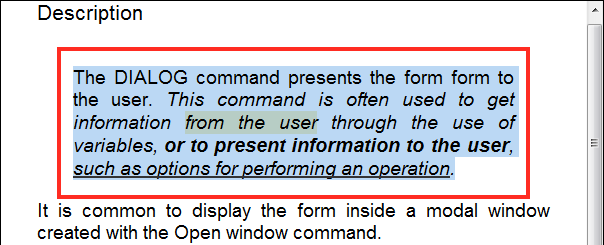
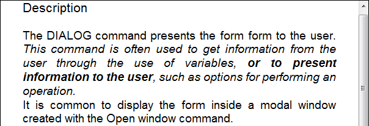

<!--REF #_command_.WP RESET ATTRIBUTES.Syntax-->**WP RESET ATTRIBUTES** ( *targetObj* ; *attribName* {; *attribName2* ; ... ; *attribNameN*} )<br/> **WP RESET ATTRIBUTES** ( *sectionOrSubsection* {; *attribName* }{; *attribName2* ; ... ; *attribNameN*} )<br/>**WP RESET ATTRIBUTES** ( *targetObj* ; *attribColl* )<br/> **WP RESET ATTRIBUTES** ( *sectionOrSubsection* {; *attribColl*})<!-- END REF-->

<!--REF #_command_.WP RESET ATTRIBUTES.Params-->

| Paramètres          | Type       |                             | Description                                        |
| ------------------- | ---------- | --------------------------- | -------------------------------------------------- |
| targetObj           | Object     | &#8594; | Plage ou élément ou document 4D Write Pro          |
| sectionOrSubsection | Object     | &#8594; | Section ou sous-section d'un document 4D Write Pro |
| attribName          | Text       | &#8594; | Nom d'attribut(s) à supprimer   |
| attribColl          | Collection | &#8594; | Collection d'attributs à supprimer                 |

<!-- END REF-->

## Description

La commande **WP RESET ATTRIBUTES** <!--REF #_command_.WP RESET ATTRIBUTES.Summary--> permet de réinitialiser la valeur d'un ou plusieurs attributs dans la plage, l'élément ou le document passé en paramètre.<!-- END REF--> Cette commande permet de supprimer tout type d'attribut interne à 4D Write Pro : caractère, paragraphe, document, tableau ou image. Vous pouvez passer le nom de l'attribut à réinitialiser dans *attribName* ou vous pouvez passer une collection d'attributs dans *attribColl* pour réinitialiser plusieurs attributs à la fois.

> Dans le cas d'une section ou d'une sous-section, l'objet *sectionOrSubsection* peut être transmis seul et tous les attributs sont réinitialisés en une seule fois.

Dans le paramètre *targetObj*, vous pouvez passer soit :

- une plage, ou
- un élément (en-tête / pied de page / corps / tableau / paragraphe / image ancrée ou en ligne / section / sous-section / feuille de style), ou
- un document 4D Write Pro

Lorsqu'une valeur d'attribut est supprimée à l'aide de la commande **WP RESET ATTRIBUTES**, la valeur par défaut est appliquée à *targetObj* ou *sectionOrSubsection*. Les valeurs par défaut sont listées dans la section *4D Write Pro Attributes*.

:::note Notes

- Lorsque **WP RESET ATTRIBUTES** est appliqué à un objet section/sous-section, les attributs sont ensuite hérités de la section parente ou du document.
- Lorsque **WP RESET ATTRIBUTES** est appliqué à un objet de feuille de style, les attributs sont supprimés de la feuille de style sauf si c'est la feuille de style par défaut ("Normal"). Dans ce cas, la valeur par défaut est appliquée à l'attribut (la feuille de style "Normal" définit tous les attributs de la feuille de style).
- Si *sectionOrSubsection* n'est ni une section ni une sous-section et si aucun attribut n'est fourni, une erreur est soulevée.

:::

Si l'attribut à réinitialiser n'a pas été défini dans l'élément passé en tant que paramètre, la commande ne fait rien.

## Exemple 1

Vous souhaitez supprimer plusieurs attributs de la sélection suivante :



Vous pouvez exécuter :

```4d
 $range:=WP Get selection(*;"WParea")
 WP RESET ATTRIBUTES($range;wk padding)
 WP RESET ATTRIBUTES($range;wk background color)
 WP RESET ATTRIBUTES($range;wk text underline style)
 WP RESET ATTRIBUTES($range;wk margin)
 WP RESET ATTRIBUTES($range;wk border style)
```

Le document résultant est alors :



## Exemple 2

Vous souhaitez supprimer plusieurs attributs en utilisant une collection :

```4d
$myRange:=WP Get selection(*;"WParea")
$myCollection:=New collection(wk font size; wk background color; wk border style)
WP RESET ATTRIBUTES($myRange; $myCollection)
 
```

## Exemple 3

```4d
$section:=WP Get section($document; 3)
WP RESET ATTRIBUTES($section)  // Tous les attributs de la section sont supprimés
$subSection:=WP Get subsection(WP Get section($document; 3); wk left page)
WP RESET ATTRIBUTES($subSection) // Tous les attributs de la sous-section sont supprimés
```

## Voir également

*4D Write Pro Attributes*\
[WP GET ATTRIBUTES](wp-get-attributes.md)\
[WP SET ATTRIBUTES](wp-set-attributes.md)
