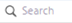
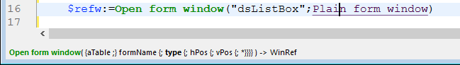
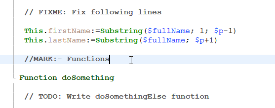
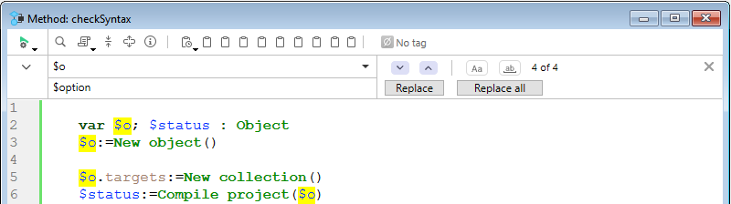
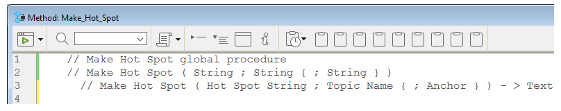
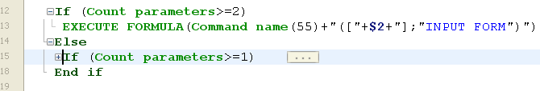

4D dispose d'un puissant éditeur de code intégré qui offre un large choix de fonctionnalités pour une édition de code hautement productive, telles que la complétion intelligente du code, la navigation dans le code, le débogage, la recherche, et bien plus encore.


L'éditeur de code fonctionne comme un éditeur de texte. L'écriture d'une méthode ou d'une classe est généralement une combinaison de saisie de texte, de sélection de composants et de déplacement d'éléments à partir de l'explorateur ou d'autres fenêtres. Vous pouvez également utiliser diverses fonctions d'anticipation (type-ahead) pour créer des méthodes plus rapidement.

Vous pouvez faire défiler le contenu des méthodes, des classes et des fonctions, qui peuvent comprendre jusqu'à 32 000 lignes de code ou 2 Go de texte.

L'éditeur de code 4D fournit un contrôle de base des erreurs de syntaxe. Un contrôle d'erreur supplémentaire est effectué lors de l'exécution du code. Pour plus d'informations sur la gestion des erreurs, voir [Débogage](../Debugging/basics.md).

:::note

If you are used to coding with **VS Code**, you can also use this editor with 4D code after installing the [4D-Analyzer](https://github.com/4d/4D-Analyzer-VSCode) extension.

:::

## Interface

### Toolbar (Barre d’outils)

Chaque fenêtre de l'éditeur de code dispose d'une barre d'outils qui permet un accès instantané aux fonctionnalités de base liées à l'exécution et à l'édition du code.

| Élément                                 | Icône                                                                             | Description                                                                                                                                                                                                                                                                                                                                                                                                                                                                                                                                                                                                                                                                                                                                                                                                                                                                                                                                                                                                                                                                                                                                                                                                                                                                                         |
| --------------------------------------- | --------------------------------------------------------------------------------- | --------------------------------------------------------------------------------------------------------------------------------------------------------------------------------------------------------------------------------------------------------------------------------------------------------------------------------------------------------------------------------------------------------------------------------------------------------------------------------------------------------------------------------------------------------------------------------------------------------------------------------------------------------------------------------------------------------------------------------------------------------------------------------------------------------------------------------------------------------------------------------------------------------------------------------------------------------------------------------------------------------------------------------------------------------------------------------------------------------------------------------------------------------------------------------------------------------------------------------------------------------------------------------------------------- |
| **Exécuter la méthode**                 |                     | Lorsque vous travaillez avec des méthodes, chaque fenêtre de l'éditeur de code dispose d'un bouton qui peut être utilisé pour exécuter la méthode en cours. En utilisant le menu associé à ce bouton, vous pouvez choisir le type d'exécution :<ul><li>**Exécuter nouveau process** : Crée un process et exécute la méthode en mode standard dans ce process.</li><li>**Exécuter et déboguer nouveau process** : Crée un nouveau process et affiche la méthode dans la fenêtre du débogueur pour une exécution pas à pas dans ce process.</li><li>**Exécuter dans le process de l'application** : Exécute la méthode en mode standard dans le contexte du process de l'application (c'est-à-dire la fenêtre d'affichage des enregistrements).</li><li>**Exécuter et déboguer dans le process de l'application** : Affiche la méthode dans la fenêtre du débogueur pour une exécution pas à pas dans le contexte du process de l'application.</li></ul>Pour plus d'informations sur l'exécution des méthodes, voir [Appel des méthodes projet](../Concepts/methods.md#appel-des-méthodes-projet). |
| **Chercher dans la méthode**            |                                | Affiche la [_zone de recherche_](#find-and-replace).                                                                                                                                                                                                                                                                                                                                                                                                                                                                                                                                                                                                                                                                                                                                                                                                                                                                                                                                                                                                                                                                                                                                                                                                                                |
| **Macros**                              |                              | Insère une macro dans la sélection. Cliquez sur la flèche déroulante pour afficher la liste des macros disponibles. Pour plus d'informations sur la création et l'instanciation des macros, voir [Macros](#macros).                                                                                                                                                                                                                                                                                                                                                                                                                                                                                                                                                                                                                                                                                                                                                                                                                                                                                                                                                                                                                                 |
| **Déployer tout / Contracter tout**     |        | Ces boutons permettent de déployer ou de contracter toutes les structures de flux de contrôle du code.                                                                                                                                                                                                                                                                                                                                                                                                                                                                                                                                                                                                                                                                                                                                                                                                                                                                                                                                                                                                                                                                                                                                                                              |
| **Informations sur la méthode**         |        | Affiche la boîte de dialogue [Propriétés de la méthode](../Concepts/methods.md#project-method-properties) (méthodes de projet uniquement).                                                                                                                                                                                                                                                                                                                                                                                                                                                                                                                                                                                                                                                                                                                                                                                                                                                                                                                                                                                                                                                                                                                       |
| **Dernières valeurs du presse-papiers** |  | Affiche les dernières valeurs stockées dans le presse-papiers.                                                                                                                                                                                                                                                                                                                                                                                                                                                                                                                                                                                                                                                                                                                                                                                                                                                                                                                                                                                                                                                                                                                                                                                                                      |
| **Presse-papiers**                      |                        | Neuf presse-papiers sont disponibles dans l'éditeur de code. Vous pouvez [utiliser ces presse-papiers](./write-class-method.md#multiple-copy-paste-and-numbering-of-clipboards) en cliquant directement dessus ou en utilisant des raccourcis clavier. Vous pouvez utiliser l'[option Préférences](Preferences/methods.md#options-1) pour les masquer.                                                                                                                                                                                                                                                                                                                                                                                                                                                                                                                                                                                                                                                                                                                                                                                                                                                                                              |
| **Menu déroulant de navigation**        |                        | Vous permet de naviguer à l'intérieur des méthodes et des classes avec du contenu étiqueté automatiquement ou des marqueurs déclarés manuellement. Voir ci-dessous                                                                                                                                                                                                                                                                                                                                                                                                                                                                                                                                                                                                                                                                                                                                                                                                                                                                                                                                                                                                                                                                                                                  |

### Zone d'édition

C'est ici que vous écrivez et modifiez votre code. L'éditeur indente automatiquement le texte du code et colore les différents éléments de la syntaxe pour une structure de code claire.

Vous pouvez personnaliser l'affichage de la zone d'édition. Toute personnalisation est automatiquement reportée sur toutes les fenêtres de l'éditeur de code :

| Option                                       | Description                                                                                                                                                                                                                                                                                                        | Défini dans...                                                                                                                                                                      |
| -------------------------------------------- | ------------------------------------------------------------------------------------------------------------------------------------------------------------------------------------------------------------------------------------------------------------------------------------------------------------------ | ----------------------------------------------------------------------------------------------------------------------------------------------------------------------------------------------------------------------------------- |
| **police** et **taille de police**           | Définit la police et la taille de caractères à utiliser dans la zone d'édition                                                                                                                                                                                                                                     | **Préférences** > [**Méthodes**](../Preferences/methods.md) ou **Méthode > Affichage** > **Agrandir la police** ou **Réduire la police**                                                                                            |
| **style et couleur des éléments de syntaxe** | assigner une couleur et/ou un style spécifique à chaque type d'élément du langage 4D.  Vous pouvez également changer les différentes couleurs utilisées dans l'interface de la zone d'édition (surlignement, arrière-plan, etc.).               | Clic avec le bouton droit de la souris sur un élément du langage (variable, mot-clé, etc.) > Sous-menu **Style**. Ou **Préférences** > [**Méthodes**](../Preferences/methods.md) |
| **espaces**                                  | Vous pouvez afficher les espaces entre les mots en utilisant des points (.) au lieu d'espaces vides. Cette option s'applique à tous les éléments du code (noms de commandes, variables, commentaires, etc.). | **Méthode > Affichage > Espaces**                                                                                                                                                                                                   |
| **thèmes**                                   | Vous pouvez sélectionner le thème sombre ou clair, ou en définir un thème personnalisé                                                                                                                                                                                                                             | **Préférences** > [**Méthodes**](../Preferences/methods.md)                                                                                                                                                                         |
| **largeur des indentations de code**         | Définir la largeur des indentations de code                                                                                                                                                                                                                                                                        | **Préférences** > [**Méthodes**](../Preferences/methods.md)                                                                                                                                                                         |

#### Barres de modification

Des barres de couleur vous indiquent en temps réel où les lignes de code ont été modifiées depuis l'ouverture de la méthode :


La couleur de la barre de modification indique si les modifications ont été enregistrées ou non :

- jaune : La ligne a été modifiée et la méthode n'a pas encore été enregistrée.
- vert : La ligne a été modifiée et la méthode a été enregistrée.

### Zone des listes

La zone des listes permet d'afficher une ou plusieurs listes d'éléments nécessaires à l'écriture des méthodes et des classes (commandes, constantes, formulaires, etc.). Vous pouvez choisir le nombre et le contenu des listes affichées dans la fenêtre.

Par défaut, l'éditeur de code affiche quatre listes. Vous pouvez masquer ou afficher toutes les listes en cliquant sur l'icône en bas à droite de la fenêtre. 

Vous pouvez agrandir ou réduire la largeur relative de chaque zone de liste en faisant glisser l'une de ses partitions. Il est également possible d'ajuster la taille de la zone de liste par rapport à celle de la zone d'édition en faisant glisser la ligne de séparation entre les deux.

- Un double-clic sur un élément d'une liste entraîne son insertion dans la zone d'édition, à l'endroit où se trouve le curseur.
- Pour **modifier le contenu** d'une liste, cliquez sur la zone de titre de la liste concernée : un menu contextuel apparaît, vous permettant de choisir le type d'élément à afficher.


- Pour ajouter ou supprimer une liste, cliquez sur la zone de titre de l'une des listes et choisissez la commande correspondante dans le menu contextuel.
  La commande **Supprimer cette liste** est désactivée lorsque vous cliquez sur la dernière liste. Si vous souhaitez masquer toutes les listes, vous devez soit cliquer sur le bouton **Montrer ou cacher les listes**  en bas à droite de la fenêtre, soit les masquer par défaut dans les **Préférences**.

- Vous pouvez masquer les listes dans toutes les fenêtres de la manière suivante :
  - Sélectionnez l'option **Affichage > Listes** dans le menu **Méthode** (une coche indique si les listes sont affichées)
  - Décochez l'option **Préférences** > **Méthodes** > **Options** > **Afficher les listes** . Pour que les modifications apportées dans la boîte de dialogue **Préférences** soient prises en compte, toutes les méthodes ouvertes, classes ou fonctions doivent d'abord être fermées puis rouvertes.

#### Listes d'éléments disponibles

Vous pouvez afficher les listes d'éléments suivantes dans la zone des listes de la fenêtre de l'éditeur de code :

- **Toutes les tables et les champs**: Noms des tables et des champs de la base de données sous la forme d'une liste hiérarchique. Lorsque vous insérez un nom de champ dans la méthode en double-cliquant sur son nom, 4D l'insère en respectant la syntaxe et ajoute le nom de la table ou de la sous-table selon le cas.
- **Table** (sous-menu) : Noms des champs de la table sélectionnée à l'aide d'un sous-menu.
- **Table courante**: noms des champs de la table courante (disponibles dans les triggers, les méthodes formulaire et les méthodes objet).
- **Formulaires Projet**: Nom des formulaires projet de la base de données. Lorsque vous double-cliquez sur le nom d'un formulaire projet, 4D l'insère en respectant la syntaxe : le nom du formulaire est inséré entre guillemets.
- **Formulaires table**: Noms des tables et des formulaires de la base de données sous la forme d'une liste hiérarchique. Lorsque vous insérez un nom de formulaire dans une méthode en double-cliquant sur son nom, 4D l'insère en respectant la syntaxe : le nom du formulaire est inséré entre guillemets et est précédé du nom de la table et d'un point-virgule. Par exemple: [Table]; "Formulaire".
- **Méthodes**: noms des méthodes projet de la base de données.
- **Tous les dossiers**: Noms des dossiers et sous-dossiers d'objets définis dans la base de données, affichés sous la forme d'une liste hiérarchique. Les dossiers peuvent être utilisés pour organiser les objets de manière personnalisée. Ils sont gérés à partir de la page Démarrage de l'Explorateur.
- **Dossiers** (sous-menu) : Contenu du dossier sélectionné à l'aide d'un sous-menu.
- **Macros**: Noms des macros définies pour la base de données (voir [Créer et utiliser des macros](#creating-and-using-macros)).
- **Commandes**: Commandes du langage 4D par ordre alphabétique.
- **Commandes par thèmes**: Commandes du langage 4D classées par thème sous forme de liste hiérarchique.
- **Barres de menu**: Noms et numéros des barres de menu [créées avec l'éditeur de barres de menu 4D](../Menus/creating.md).
- **Constantes**: constantes 4D et celles des éventuels plug-ins, classées par thème sous forme de liste hiérarchique.
- **Listes**: Noms des listes.
- **Commandes des plug-ins**: Commandes pour tous les plug-ins installés dans la base de données (s'il y en a), classés par thème sous la forme d'une liste hiérarchique.
- **Mots clés SQL**: ensemble de mots-clés reconnus par l'analyseur de syntaxe SQL de 4D. Cette liste comprend des commandes (par exemple SELECT), des clauses (par exemple WHERE) ainsi que des fonctions (ABS).
- **Fonctions SQL**: fonctions SQL de 4D.

**Note :** A l'exception de l'élément Macros, toutes les listes sont classées par ordre alphabétique.

#### Enregistrer comme modèle

Vous pouvez enregistrer les listes définies dans la fenêtre de l'éditeur de code sous la forme d'un modèle. Une fois le modèle enregistré, les paramètres définis dans ce dernier seront utilisés pour chaque nouvelle fenêtre de l'éditeur de code qui sera ouverte.

Les paramètres suivants sont stockés dans le modèle :

- Taille relative des zones d'édition et de liste
- Nombre de listes
- Emplacement et contenu de chaque liste
- Largeur relative de chaque liste

Pour enregistrer une fenêtre de l'éditeur de code en tant que modèle, choisissez **Méthode** > **Enregistrer comme modèle**. Le modèle est enregistré immédiatement (aucune boîte de dialogue ne s'affiche). Il est stocké dans les \*\*Préférences \*\* de l'application 4D. Si un modèle précédent existe déjà, il est remplacé.

### Zone de points d'arrêt

Cette zone, située à gauche de la zone d'édition, permet d'afficher les numéros de ligne et d'insérer des points d'arrêt directement à côté d'instructions spécifiques. Les points d'arrêt sont utiles pendant la phase de débogage de votre programmation. Ils arrêtent l'exécution de votre code à des endroits spécifiques et affichent le débogueur.

Pour plus d'informations sur les points d'arrêt, voir la section [Débogage](../Debugging/breakpoints.md#breakpoints) .

Vous pouvez afficher ou masquer les numéros de ligne dans la zone de points d'arrêt pour chaque fenêtre de l'éditeur de code.

- Pour activer ou désactiver l'affichage des numéros de ligne par défaut, choisissez **Préférences** > **Méthodes** > **Afficher numéros de lignes**.
- Pour modifier cet affichage séparément pour chaque fenêtre de l'éditeur de code, choisissez **Méthode** > **Affichage** > **Numéros de lignes**.

L'affichage des numéros de ligne permet de se repérer plus facilement dans la fenêtre. La commande **Méthode** > **Aller à la ligne n°...** vous permet également de profiter de cet affichage.

Ce type de recherche est utile lorsqu'il est utilisé conjointement avec le [compilateur](../Project/compiler.md), qui signale les erreurs d'exécution par le numéro de ligne où elles se produisent.

### Barre d'état

La barre d'état située en bas à droite de la fenêtre de l'éditeur affiche à tout moment la position du curseur :


- **Ln**: Numéro de ligne
- **Col**: Numéro de colonne, c'est-à-dire le niveau dans la hiérarchie des structures de programmation. Le premier niveau est 0. Le numéro de colonne est utile pour le débogage car cette information peut être fournie par l'interpréteur en cas d'erreur dans le code.
- **Ch**: Emplacement du caractère dans la ligne.
- : Hide/display lists.

Lorsque vous placez le curseur dans une commande, une fonction ou un paramètre, la barre d'état affiche la syntaxe de la commande. Si vous écrivez ou sélectionnez un paramètre, la zone affiche le paramètre courant en **gras**:


### Menu déroulant de navigation

Le menu de navigation vous aide à organiser votre code et à naviguer plus facilement dans vos classes et méthodes :


Certaines balises sont ajoutées automatiquement ; vous pouvez compléter la liste déroulante à l'aide de [marqueurs](#manual-tagging).

#### Navigation dans le code

Cliquez sur un élément de la liste déroulante pour accéder à sa première ligne dans le code. Vous pouvez également naviguer avec les touches fléchées et appuyer sur **Entrée**.

#### Balisage automatique

Les constructeurs, les déclarations de méthodes, les fonctions et les attributs calculés sont automatiquement balisés et ajoutés à la liste déroulante.

Lorsqu'il n'y a pas de balise dans la classe/méthode, l'outil affiche "No tag".

Les éléments suivants sont ajoutés automatiquement :

| Icône                                                                       | Élément                                                          |
| --------------------------------------------------------------------------- | ---------------------------------------------------------------- |
|                          | Pas de balise                                                    |
|                | Class constructor ou déclaration de méthode                      |
|  | Attribut calculé (get, set, orderBy et query) |
|                      | Nom de la fonction de classe                                     |

#### Balisage manuel

En ajoutant des marqueurs dans votre code, vous pouvez ajouter les balises suivantes à la liste déroulante :

| Icône                                                   | Élément                        |
| ------------------------------------------------------- | ------------------------------ |
|  | MARK : balise  |
|  | TODO : balise  |
|    | FIXME : balise |

Vous les déclarez en ajoutant des commentaires tels que :

```4d
// FIXME : Corriger les éléments suivants
```

Les déclarations ne sont pas sensibles à la casse ; écrire `fixme` : a le même effet.

L'ajout d'un trait d'union après la balise `MARK:` trace une ligne de séparation dans l'éditeur de code et dans le menu déroulant. Ainsi, cette saisie :



Se traduit par ceci :


Tous les marqueurs situés à l'intérieur des fonctions sont indentés dans la liste déroulante, à l'exception des balises `MARK:` situées à la fin des fonctions et non suivies d'instructions. Celles-ci apparaîtront au premier niveau.

#### Ordre d'affichage

Les balises sont affichées dans leur ordre d'apparition à l'intérieur de la méthode/classe.

Pour afficher les balises d'une méthode ou d'une classe par ordre alphabétique, effectuez l'une des opérations suivantes :

- Faites un **clic droit** sur l'outil déroulant
- maintenez la touche **Cmd** sous macOS ou **Alt** sous Windows, et cliquez sur l'outil de liste déroulante

> Les balises à l'intérieur des fonctions se déplacent avec leurs éléments parents.

### Raccourcis

De nombreuses fonctionnalités de l'éditeur de code de 4D sont disponibles par le biais de raccourcis clavier par défaut.

:::info macOS

Sous macOS, utilisez la touche **Command** au lieu de la touche **Ctrl** mentionnée (Windows).

:::

| **Raccourci**                                                                                                                                                                                     | **Action**                                                                                                                                                                              |
| ------------------------------------------------------------------------------------------------------------------------------------------------------------------------------------------------- | --------------------------------------------------------------------------------------------------------------------------------------------------------------------------------------- |
| **Sélection et navigation**                                                                                                                                                                       |                                                                                                                                                                                         |
| Double-clic                                                                                                                                                                                       | Sélectionne un nom d'élément du langage                                                                                                                                                 |
| [Alt]+Double-clic                                                                                                                             | Sélectionne un nom d'élément du langage contenant des espaces (constante, méthode, etc.)                                                             |
| [Maj]+[flèche droite]                                                                     | Crée et agrandit la sélection, caractère par caractère, vers la droite, ou Réduit la sélection, caractère par caractère, à partir de la gauche                                          |
| [Maj]+[flèche gauche]                                                                     | Réduit la sélection, caractère par caractère, à partir de la droite ou Crée et agrandit la sélection, caractère par caractère, vers la gauche                                           |
| [Maj]+[flèche vers le bas]                                                                | Crée et agrandit une sélection, ligne par ligne, du haut vers le bas                                                                                                                    |
| [Maj]+[flèche haut]                                                                       | Crée et agrandit une sélection, ligne par ligne, du bas vers le haut                                                                                                                    |
| [Ctrl]+[Maj]+[flèche droite]          | Crée et agrandit la sélection, mot par mot, de droite à gauche                                                                                                                          |
| [Ctrl]+[Maj]+[flèche gauche]          | Réduit la sélection, mot par mot, à partir de la droite, ou crée et agrandit la sélection, mot par mot, à partir de la gauche                                                           |
| [Ctrl]+[flèche droite]                                                                    | Déplace le point d'insertion, mot par mot, de gauche à droite                                                                                                                           |
| [Ctrl]+[flèche gauche]                                                                    | Déplace le point d'insertion, mot par mot, de droite à gauche                                                                                                                           |
| [Alt]+[flèche vers le bas]                                                                | Déplace la ou les ligne(s) où se trouve le curseur vers le bas                                                                                                       |
| [Alt]+[flèche haut]                                                                       | Déplace la ou les ligne(s) où se trouve le curseur vers le haut                                                                                                      |
| [Home]                                                                                                                                        | Place le point d'insertion au début de la ligne                                                                                                                                         |
| [Fin]                                                                                                                                         | Place le point d'insertion à la fin de la ligne                                                                                                                                         |
| [Ctrl]+[Home]                                                                             | Place le point d'insertion au début de la méthode                                                                                                                                       |
| [Ctrl]+[Fin]                                                                              | Place le point d'insertion à la fin de la méthode                                                                                                                                       |
| [Maj]+[Home]                                                                              | Sélectionne tous les caractères de la ligne qui se trouvent à gauche du curseur                                                                                                         |
| [Maj]+[Fin]                                                                               | Sélectionne tous les caractères de la ligne qui se trouvent à droite du curseur                                                                                                         |
| [PgAV]                                                                                                                                        | Fait défiler le contenu de la méthode, page par page, du bas vers le haut (ne modifie pas le point d'insertion)                                                      |
| [PgAR]                                                                                                                                        | Fait défiler le contenu de la méthode, page par page, du haut vers le bas (ne modifie pas le point d'insertion)                                                      |
| [**Introspection**](#goto-definition)                                                                                                                                                             |                                                                                                                                                                                         |
| [Ctrl]+K ou [Alt]+double-clic                                                             | Identique à la commande [**Aller à la définition**](#goto-definition)                                                                                                                   |
| [Ctrl] (Windows) ou [Alt] (macOS)+survol d'un token | Souligne le token (élément de langage identifié). Clic sur le token souligné = identique à la commande [**Aller à définition**](#aller-a-definition) |
| [**Chercher et remplacer**](#find-and-replace)                                                                                                                                                    |                                                                                                                                                                                         |
| [Ctrl]+F                                                                                                                                      | Chercher                                                                                                                                                                                |
| [Ctrl]+G                                                                                                                                      | Chercher suivant                                                                                                                                                                        |
| [Ctrl]+[Maj]+G                                                                            | Chercher précédent                                                                                                                                                                      |
| [Ctrl]+E                                                                                                                                      | Chercher identique suivant                                                                                                                                                              |
| [Ctrl]+[Maj]+E                                                                            | Chercher identique précédent                                                                                                                                                            |
| [Ctrl]+[Alt]+F                                                                            | Remplacer                                                                                                                                                                               |
| [Ctrl]+[Alt]+G                                                                            | Remplacer suivant                                                                                                                                                                       |
| [Ctrl]+[Alt]+[Maj]+G                  | Remplacer précédent                                                                                                                                                                     |
| [**Presse-papiers**](#clipboards)                                                                                                                                                                 |                                                                                                                                                                                         |
| [Maj]+clic ou [Alt]+clic sur l'icône du presse-papiers                                    | Copier le texte sélectionné dans un presse-papiers                                                                                                                                      |
| [Ctrl]+[Maj]+touche numérotée                                                             | Copier le texte sélectionné dans le presse-papiers de ce numéro                                                                                                                         |
| [Ctrl]+clic sur l'icône du presse-papiers                                                                                                     | Coller le contenu d'un presse-papiers à l'emplacement du curseur                                                                                                                        |
| [Ctrl]+[Maj]+touche numérotée                                                             | Coller le contenu du presse-papiers de ce numéro à l'emplacement du curseur                                                                                                             |

:::tip

La plupart de ces raccourcis peuvent être personnalisés dans la boîte de dialogue [Préférences 4D](../Preferences/shortcuts.md).

:::

## Edition du code

4D utilise des techniques d'édition de texte standard pour la saisie et la modification dans l'Éditeur de code.

L'Éditeur de code utilise des conventions d'affichage (style, couleur) pour les éléments de syntaxe. Vous pouvez [personnaliser ces conventions](#customizing-the-editing-area). Au fur et à mesure que vous tapez, lorsque vous validez votre saisie, 4D évalue le texte de la ligne et applique le format d'affichage approprié. 4D indente également chaque ligne à son niveau approprié par rapport à la ligne précédente lorsque vous utilisez des structures de programmation (If, End if...).

Vous pouvez utiliser les touches fléchées pour vous déplacer rapidement d'une ligne à l'autre. Utiliser les touches fléchées pour se déplacer sur plusieurs lignes est plus rapide que de cliquer car l'éditeur retarde l'évaluation de la ligne pour les erreurs.

Sous Windows, l'éditeur de code comprend un éditeur de code d'entrée (IME) pour faciliter l'édition de code sur les systèmes japonais ou chinois.

L'Éditeur de code comprend de nombreux [raccourcis de navigation](#shortcuts).

#### Utilisation du backslash

Le caractère backslash (`\`) bénéficie d'un support spécifique dans le langage 4D :

- inséré à la fin des lignes, il permet d'écrire une seule instruction sur [plusieurs lignes](../Concepts/quick-tour.md#code-on-several-lines).
- il permet de définir des [séquences d'échappement](../Concepts/quick-tour.md#escape-sequences).

:::caution

Le caractère backslash (`\`) est utilisé comme séparateur dans les [chemins d'accès sous Windows](../Concepts/paths.md#windows). En général, 4D interprétera correctement les noms de chemins Windows entrés dans l'éditeur de code en remplaçant la barre oblique inverse simple par une barre oblique inverse double. Par exemple, `C:\MyDocuments` deviendra `C:\\MyDocuments`. Toutefois, si vous écrivez `"C:\MyDocuments\New"`, 4D affichera `"C:\\MyDocuments\New"`. Dans ce cas, le deuxième backslash est interprété incorrectement comme `\N` (une [séquence d'échappement](../Concepts/quick-tour.md#s%C3%A9quences-d%C3%A9chappement) existante). Vous devez donc saisir un double backslash lorsque vous souhaitez avoir une barre oblique inversée devant un caractère utilisé dans l'une des séquences d'échappement reconnues par 4D.

:::

### Glisser-déposer

Depuis l'explorateur, vous pouvez glisser-déposer des tables, des champs, des formulaires, des méthodes projet, des constantes ou des commandes 4D. Lorsque vous glissez et déposez un élément, 4D utilise toujours la bonne syntaxe. Par exemple, si vous faites glisser le nom de champ Prénom de la table `[People]`, il apparaît dans l'Éditeur de code comme `[People]Prénom`. De même, si vous faites glisser le nom du formulaire Input de la table People, il apparaît dans l'Éditeur de code comme `[People];"Input"`.

Lorsque vous insérez une commande en la faisant glisser depuis la page **Commandes** de l'Explorateur, elle apparaît avec sa syntaxe (qui comprend tous ses paramètres) dans l'Éditeur de code. Cette fonctionnalité vous rappelle simplement les paramètres que la commande attend. Vous pouvez alors utiliser la syntaxe qui convient le mieux à votre utilisation.

Vous pouvez également effectuer un glisser-déposer à l'intérieur d'une méthode, d'une classe ou d'une fonction, ou entre deux méthodes, classes ou fonctions différentes. Dans l'éditeur de code, le mécanisme de glisser-déposer est activé dès qu'une portion de texte est sélectionnée.
Par défaut, le mécanisme de glisser-déposer **déplace** le texte sélectionné. Pour **copier** celui-ci, maintenez la touche **Ctrl** (Windows) ou la touche **Option** (macOS) enfoncée pendant l'opération.

### Modification de la casse

Vous pouvez modifier automatiquement la casse des caractères sélectionnés en utilisant les commandes du menu **Méthodes** > **Casse** ou le menu contextuel de l'éditeur :

- **Majuscule** / **Minuscule** : Basculer les caractères sélectionnés en majuscules ou en minuscules.
- **camelCase** / **CamelCase** : Changer les caractères sélectionnés en "camel case". Cela consiste à passer en majuscule chaque première lettre d'un groupe de mots attachés. Ce type de notation est souvent utilisé pour les nomenclatures de variables. hireDate et PurchaseDate sont des exemples de deux variantes de la notation en camel case.

Lorsque vous appliquez l'une de ces commandes à une sélection de texte, les espaces et les caractères "_" sont supprimés et la première lettre de chaque mot est mise en majuscule.

### Inverser l'expression

La fonctionnalité **Inverser expression** peut être utilisée pour inverser les arguments d'une expression assignant une valeur. Par exemple,

`variable1:=variable2`

devient

`variable2:=variable1`

Cette fonctionnalité est extrêmement utile pour inverser un ensemble d'affectations utilisées pour obtenir ou définir des propriétés, ou pour corriger des erreurs de saisie. Pour utiliser cette fonctionnalité, sélectionnez la ou les ligne(s) à modifier, puis choisissez **Méthode** > **Inverser l'expression** ou utilisez le menu contextuel de la zone. Dans la sélection, seules les lignes assignant une valeur seront modifiées.

### Presse-papiers

En plus de l'opération standard copier-coller, 4D offre deux fonctionnalités supplémentaires qui vous permettent de travailler avec le contenu des différents presse-papiers :

- Le programme stocke en mémoire les 10 dernières actions de "copier" ou "couper" qui ont été effectuées dans l'Éditeur de code pendant la session en cours. Chacun des différents contenus enregistrés de cette manière peut être réutilisé à tout moment. Pour cela, utilisez la commande **Historique du Presse-papier** du menu contextuel de l'éditeur de code ou le bouton "Dernières valeurs du presse-papiers" de la barre d'outils :

  

  Les premiers mots des éléments copiés ou coupés sont affichés. Sélectionnez un élément pour l'insérer à l'emplacement courant du curseur.

- Neuf presse-papiers numérotés supplémentaires sont disponibles et peuvent être utilisés directement à l'aide des boutons de la barre d'outils de l'Éditeur de code ou [en utilisant des raccourcis clavier](#shortcuts) :


### Déplacement des lignes

Vous pouvez déplacer la ligne où se trouve le curseur directement sans devoir la sélectionner d'abord en utilisant les commandes **Déplacer lignes en haut** et **Déplacer lignes en bas** dans le menu **Méthode**. Vous pouvez également le faire en utilisant le [raccourci clavier](#shortcuts) touche **Alt/Option** + flèche **Haut** ou flèche **Bas**.

### Fonctions d'autocomplétion

L'Éditeur de Code fournit des fonctionnalités d'autocomplétion. 4D affiche automatiquement des suggestions basées sur les premiers caractères saisis.

Dans l'exemple ci-dessous, en tapant la chaîne de caractères "cop", un triangle bleu s'affiche pour indiquer que plusieurs suggestions sont disponibles :


Lorsque les caractères que vous saisissez correspondent à une seule possibilité, cette valeur suggérée apparaît en gris (et est insérée si vous appuyez sur la touche **Tab**):
 ---> 

> Si vous avez coché l'option **Insérer () et ajouter } ) ] " fermants** dans la page **Méthodes** des **Préférences**, 4D ajoutera également automatiquement **()** après une commande, un mot-clé ou une méthode projet 4D qui nécessite un ou plusieurs arguments obligatoires (après avoir accepté une suggestion ou une complétion) :
>  -> 

L'autocomplétion fonctionne également avec les structures de code (par exemple If..End if, For each...End for each) : lorsque vous saisissez la première partie de la structure, l'Éditeur de code suggérera automatiquement la partie de clôture :


S'il y a plusieurs suggestions disponibles, 4D les affiche dans une liste déroulante lorsque vous appuyez sur la touche **Tabulation** :


La liste est par ordre alphabétique. Choisissez la valeur en double-cliquant dessus ou faites défiler la liste à l'aide des touches fléchées du clavier, puis appuyez sur **Entrée**, **Retour arrière** ou **Tabulation** pour insérer la valeur sélectionnée.

Par défaut, vous pouvez également insérer une valeur suggérée en appuyant sur l'un des délimiteurs suivants `( ; : = < [ {` après avoir sélectionné une valeur : la valeur insérée est ensuite suivie du délimiteur, prête pour la saisie des données.

  +  **(** key --> 

> Vous pouvez désactiver l'utilisation de délimiteurs pour insérer des valeurs suggérées dans les **Préférences** > **Méthodes** > **Options**.

Vous pouvez appuyer sur la touche **Esc** pour fermer la liste déroulante ou vous pouvez continuer à taper pendant qu'elle est ouverte. Les valeurs suggérées dans la liste déroulante sont mises à jour à mesure que des caractères supplémentaires sont saisis.

Si les caractères saisis correspondent à différents types d'objets, la liste les affiche dans leur style courant. Les types d'objets suivants peuvent être affichés :

- Commandes 4D
- Commandes SQL
- Méthodes utilisateur
- Noms de tables
- Noms de champs
- Constantes
- Variables déclarées dans la méthode
- Noms de propriétés d'objets
- Commandes de plug-ins
- Mots-clés 4D
- Mots-clés SQL
- Macros (affichées entre < >)

> Pour des raisons pratiques, vous pouvez désactiver l'affichage automatique de la liste des suggestions pour les **constantes**, les **variables (locales ou interprocess) et attributs d'objets**, les **tables** et/ou les **prototypes**. Ces options se trouvent dans **Préférences** > **Méthodes** > **Options**

#### Noms de propriétés d'objets

4D affiche automatiquement des suggestions sensibles à la casse de tous les noms de propriétés d'objet valides dans le code 4D lorsque vous :

- tapez un point "." après un objet ou
- utilisez la touche Tab après un pointeur d'objet déréférencé "->".


> La propriété `length` est toujours incluse pour une utilisation avec les collections.

Une fois créés, les noms de propriété sont stockés dans une liste globale interne et sont disponibles dès lors qu'une méthode/classe/fonction est ouverte, fermée ou change de focus.


La liste des suggestions est mise à jour dynamiquement lorsque vous modifiez le code. Lorsque vous basculez entre les fenêtres, les noms de propriétés nouveaux/modifiés sont toujours ajoutés à la liste globale. La liste est également mise à jour lorsque vous prévisualisez une méthode, une classe ou une fonction dans l'Explorateur.

Lorsque la base de données est redémarrée, la liste est réinitialisée.

> Vous pouvez désactiver l'affichage automatique des propriétés d'objet dans les **Préférences** > **Méthodes** > **suggestions**.

## Chercher et remplacer

L'éditeur de code dispose de puissantes fonctionnalités de **recherche et remplacement** qui s'appliquent à la fenêtre en cours.

Une zone de recherche et de remplacement peut être affichée dans la barre d'outils de n'importe quelle fenêtre de méthode :



Pour afficher cette zone, cliquez sur l'icône **Chercher dans la méthode** de la [barre d'outils](#toolbar) ou sélectionnez une fonction de recherche ou de remplacement soit via un [**raccourci**](#shortcuts) soit via une commande du sous-menu **Édition > Chercher**. Vous pouvez fermer cette zone à tout moment en cliquant sur le bouton **x** situé à l'extrême droite de la barre d'outils.

:::tip

La fonctionnalité **Chercher dans le développement** de la barre d'outils 4D ou du menu **Édition** n'est pas spécifique à l'éditeur de code mais peut être utilisée pour rechercher une valeur parmi toutes les méthodes et classes.

:::

### Chercher

Sélectionnez **Chercher > Chercher...** dans le menu **Edition** ou tapez **Ctrl+F** (Windows)**/Cmd+F** (macOS) pour afficher/activer la _zone de recherche_.

La recherche définie dans la zone sera effectuée dans le code situé dans la fenêtre.

La zone de **saisie de recherche** vous permet d'entrer la chaîne à rechercher. Cette zone est une combo box qui stocke les 10 dernières chaînes qui ont été recherchées ou remplacées pendant la session. Si vous surlignez le texte avant de choisir la commande **Chercher...**, il apparaîtra automatiquement dans cette zone. Vous pouvez alors utiliser ce texte ou le remplacer par un autre.

Une fois qu'une chaîne de caractères est entrée ou sélectionnée, toutes les occurrences trouvées dans la fenêtre ouverte sont surlignées et le côté droit de la zone affiche le nombre total de correspondances trouvées. Il indique également la position actuelle du curseur parmi tous les résultats.

Appuyez sur la touche **Entrée** pour sélectionner l'occurrence la plus proche du curseur. Vous pouvez également cliquer sur les boutons **Suivant / Précédent**  pour sélectionner toutes les occurrences séquentiellement vers le début ou la fin de la méthode courante, à partir de l'emplacement initial du curseur, ou utiliser les commandes **Chercher suivant** et **Chercher précédent** du [menu **Edition**](#raccourcis).

#### Options

- **Majuscule/Minuscule**  : Prenez en compte la casse des caractères telle qu'elle a été saisie dans la zone de recherche. Cette option prend également en compte les caractères diacritiques. Par exemple, une recherche pour "MyVar" ne trouvera pas "myVar" ; une recherche pour "dej" ne trouvera pas "déjà".
- **Mot entier** : Limiter la recherche aux occurrences exactes du mot recherché. Lorsque cette option est cochée, par exemple, une recherche sur "client" ne trouvera ni "clients" ni "myclient". Par défaut, cette option n'est pas cochée ; par conséquent, une recherche de "var" donnera "Myvar", "variation", etc.

### Remplacer

Cliquez sur le bouton de bascule **v** sur le côté gauche de la _zone Recherche_ pour afficher/masquer la zone _Remplacer_. Vous pouvez également sélectionner **Chercher > Remplacer...** dans le menu **Édition** ou taper **Ctrl+Alt+F** (Windows)/**Cmd+Alt+F** (macOS).

La zone de saisie _Remplacer_ est utilisée pour définir la chaîne de caractères qui remplacera celle définie ci-dessus.

Cliquez sur le bouton **Remplacer** pour lancer la recherche avec toutes les options définies et remplacer la première occurrence trouvée. 4D commence la recherche à partir du point d'insertion de texte en cours et la poursuit jusqu'à la fin de la méthode. Il est alors possible de continuer à chercher/remplacer en utilisant les commandes **Remplacer suivant** et **Remplacer précédent** du [menu **Édition**](#raccourcis).

Cliquez sur le bouton **Tout remplacer** pour remplacer toutes les occurrences correspondant aux critères de recherche directement dans la méthode ouverte.

### Chercher identique

La commande **Chercher identique** permet de rechercher les chaînes de caractères identiques à celle sélectionnée. Cette commande n'est active que si vous avez sélectionné au moins un caractère dans l'éditeur de code.

La recherche effectuée est de type "Chercher suivant" dans la fenêtre courante de l'éditeur de code.

Les commandes **Chercher identique suivant** et **Chercher identique précédent** permettent de trouver des chaînes de caractères _strictement_ identiques à celles sélectionnées. Par exemple, la casse doit correspondre.

### Tout marquer

La commande **Edition > Tout marquer** est activée lorsqu'une recherche a déjà été spécifiée dans la boîte de dialogue de recherche ou de remplacement. Lorsque vous sélectionnez cette commande, 4D place un signet à chaque ligne contenant un élément correspondant aux critères de recherche "courants". Cela permet de repérer facilement tous les résultats de la recherche. Pour plus d'informations sur les signets, voir [Signets](#bookmarks).

## Warnings et erreurs

Grâce à 4D Code Live Checker, la syntaxe, la cohérence et la structure du code saisi sont automatiquement vérifiées afin d'éviter les erreurs d'exécution. Par exemple, le Code Live Checker peut détecter l'absence d'une parenthèse droite ou l'utilisation d'un attribut de dataclass inconnu.

Le Code Live Checker est activé à trois niveaux :

- lorsque vous écrivez du code dans l'éditeur de code,
- lorsque vous [vérifiez la syntaxe](../Project/compiler.md#check-syntax) dans le compilateur,
- lorsque vous [compilez](../Project/compiler.md) le projet.

4D vérifie automatiquement la syntaxe du code pour s'assurer qu'elle est correcte. Si vous saisissez un texte ou sélectionnez un composant qui n'est pas correct, 4D affiche un symbole pour indiquer l'expression incorrecte.

Deux types de symboles sont affichés :

- **[warnings](../Project/compiler.md#warnings)**  : Les warnings ont pour but d'attirer votre attention sur des déclarations qui pourraient entraîner des erreurs d'exécution. Ils n'empêchent pas la compilation.
- **erreurs** : les erreurs sont des anomalies qui empêchent l'exécution correcte du code. Elles doivent être corrigées, sinon le projet ne se compilera pas.

Lorsque vous passez la souris sur le symbole, une infobulle affiche la cause de l'erreur :


Le Code Live Checker est activé lorsque vous saisissez du code. Lorsqu'une ligne d'une méthode, d'une classe ou d'une fonction est signalée comme ayant une syntaxe incorrecte, vérifiez et corrigez la saisie. Si la ligne devient correcte, 4D supprime le symbole d'erreur. Lorsque vous enregistrez ou fermez la fenêtre, l'ensemble de la méthode est validé.

Vous pouvez formater la ligne courante (sans passer à la ligne suivante) en appuyant sur la touche **Entrée** du clavier numérique. 4D évalue la ligne, la met en forme, marque les erreurs éventuelles et place le point d'insertion à la fin de la ligne.

Le Code Live Checker vérifie :

- les erreurs de syntaxe de base (opérateurs erronés, fautes d'orthographe, etc.)
- la structure des instructions (`If`, `End if` et similaires)
- la correspondance des caractères d'encadrement du code tels que les parenthèses ou les crochets (voir note ci-dessous)
- les appels d'attributs et de fonctions selon votre modèle (ORDA) et vos définitions de classes utilisateurs. Par exemple, le Code Live Checker génère une erreur lorsqu'un appel à un attribut calculé de la dataclass n'est pas compatible avec le type d'attribut calculé déclaré.

:::tip

Lorsque vous saisissez un caractère d'encadrement, 4D indique la correspondance en encadrant les caractères de début/fin avec des rectangles gris par défaut :


Vous pouvez modifier la façon dont 4D indique les caractères d'encadrement correspondants ou désactiver cette fonctionnalité dans les [**Préférences**](../Preferences/methods.md#options-1).

:::

Le Code Live Checker ne peut pas détecter certaines erreurs qui ne se produisent que pendant l'exécution. Les erreurs d'exécution sont détectées par 4D lorsque le code est exécuté. Cependant, gardez à l'esprit que le [compilateur](../Project/compiler.md) fournit également une aide indispensable pour détecter les erreurs.

## Infobulles

L'éditeur de code fournit diverses informations contextuelles à l'aide d'infobulles. Elles apparaissent lorsque vous survolez un objet avec la souris.

:::tip

La [barre d'état](#status-bar) fournit également des informations contextuelles.

:::

- **Erreurs** : Lorsque vous passez la souris sur le symbole indiquant une erreur à gauche de la zone d'édition, une infobulle affiche la cause de l'erreur (voir [Erreurs de syntaxe](#syntax-errors)).

- **Documentation de commande 4D** : Lorsque vous déplacez la souris sur une commande ou une fonction 4D, une infobulle affiche sa syntaxe ainsi qu'une brève description de son fonctionnement.
  

- **Type et description de la variable** : Lorsque vous survolez une variable, une infobulle affiche son type (si celui-ci a été explicitement défini dans la méthode) et le commentaire associé, le cas échéant.
  

- **Méthodes projet ou fonctions** : Lorsque vous survolez une méthode projet ou une fonction de classe, une infobulle affiche :

  - soit les commentaires spécifiés dans l'Explorateur.
  - soit les premières lignes de la méthode ou de la fonction de classe si elle comporte des commentaires (lignes commençant par // ou bloc de commentaires /_..._/). Il est courant d'insérer la documentation de la méthode ainsi que ses paramètres sous forme de commentaires au début de la méthode. Vous pouvez obtenir ces informations directement dans l'infobulle, en veillant à supprimer au préalable tous les commentaires présents dans l'Explorateur.
    Commentaires au début d'une méthode :
    
    Aide dans une autre méthode :
    

- Vous pouvez également créer un **fichier de documentation dédié** nommé `<MethodName>MethodName<MethodName>.md` dans le dossier `<package>package<package>/documentation`. Voir [Afficher la documentation dans l'éditeur de code](../Project/documentation.md#viewing-documentation-in-the-code-editor)

## Commenter / Décommenter

Le langage 4D supporte les [commentaires](../Concepts/quick-tour.md#comments), qui sont des lignes de code inactives. L'éditeur de code n'applique pas de style particulier dans les commentaires. La longueur des commentaires est limitée à la taille maximale de 32 000 caractères par ligne.

Il existe deux types de commentaires : `//commentaire` (commentaire sur une seule ligne) et `/*commentaire*/` (commentaires en ligne ou blocs de commentaires multilignes).

Des commentaires peuvent être créés en tapant les caractères `/`. Alternativement, la commande **Commenter/Ne pas commenter**, présente dans le menu **Méthode** ainsi que dans le menu contextuel de l'éditeur de code, permet de commenter chaque ligne d'un groupe de lignes sélectionnées ou, au contraire, de supprimer les caractères de commentaires de chaque ligne de la sélection. Pour utiliser cette commande, sélectionnez le code à commenter, puis sélectionnez la commande **Commenter/Ne pas commenter** :

 --> 

Lorsque la sélection ne contient que du code actif, la commande **Commenter** est appliquée. Lorsque la sélection comprend à la fois du code actif et des lignes commentées, une paire supplémentaire de caractères de commentaire ( // ) est ajoutée à ces dernières ; de cette façon, elles conserveront leur statut de commentaire initial si la ligne est ensuite "décommentée". Lorsque la sélection ne contient que des lignes commentées, la commande **Ne pas commenter** est appliquée.

> La commande **Commenter/Ne pas commenter** ne fonctionne qu'avec des lignes complètes - elle ne peut pas être utilisée pour commenter seulement une partie d'une ligne.

## Déployer / Contracter

Le code 4D situé à l'intérieur des boucles et des conditions peut être contracté ou déployé, afin de faciliter la lecture des méthodes :

- Code déployé :
  

- Code contracté :
  

Si vous placez la souris sur le bouton de déploiement [...], une infobulle apparaît, affichant les premières lignes du code masqué.

Une portion de code repliée peut être sélectionnée, copiée, collée ou supprimée. Toutes les lignes incluses seront copiées, collées ou supprimées respectivement. Lorsqu'une portion de code est collée, elle est automatiquement déployée.

Il y a plusieurs façons de déployer et de contracter le code :

- Cliquer sur les icônes de déploiement/réduction ([+] et [-] sous Windows) ou sur le bouton d'ouverture [...]
- Utiliser les commandes du sous-menu **Méthode > Plier/Déplier** :

  - **Plier la sélection** / **Déplier la sélection** : réduit ou développe toutes les structures de code trouvées dans la sélection de texte.
  - **Plier le niveau courant** / **Déplier le niveau courant** : réduit ou développe la structure du code là où se trouve le curseur. Ces commandes sont également disponibles dans le **menu contextuel** de l'éditeur.
  - **Plier tout** / **Déplier tout** : réduit ou développe toutes les boucles et conditions d'une méthode. Ces commandes sont également disponibles dans la barre d'outils de l'éditeur.

## Blocs

Les blocs peuvent être définis par :

- des guillemets
- des parenthèses
- une structure logique (Si/Sinon/Fin de si, Tant que/Fin tant que, Répéter/Jusque, Au cas ou/Fin de cas...)
- des accolades

### Sélectionner bloc

La fonction **Sélectionner bloc** est utilisée pour sélectionner le "bloc englobant" du code contenant le point d'insertion.

Si un bloc de texte est déjà sélectionné, la fonction sélectionne le bloc englobant du niveau supérieur suivant, et ainsi de suite, jusqu'à ce que la méthode entière soit sélectionnée.

Appuyez sur **Ctrl+Maj+B** (Windows) ou **Command+Maj+B** (macOS) pour annuler cette opération et désélectionner le dernier bloc sélectionné.

**Note :** Si le point d'insertion est placé dans une structure de type `If` ou `Else`, le bloc englobant sera celui contenant respectivement l'instruction `If` ou `Else`.

### Début de bloc ou Fin de bloc

Deux commandes facilitent la navigation au sein des structures de code (par exemple `If...Else...End if`) :

- **Début de bloc** : place le curseur au début de la structure courante, juste avant le mot-clé initial.
- **Fin de bloc** : place le curseur à la fin de la structure actuelle, juste après le mot-clé final.

Ces commandes se trouvent dans le menu **Méthode** ainsi que dans le menu contextuel de l'éditeur. Vous pouvez également utiliser les raccourcis suivants :

- Windows : **Ctrl + flèche vers le haut** ou **Ctrl** + **flèche vers le bas**‚
- macOS : **Commande** + **flèche vers le haut** ou **Commande** + **flèche vers le bas**.

## Signets

4D vous permet d'associer des signets à certaines lignes de vos méthodes. Vous pouvez alors naviguer rapidement dans le code en passant d'un signet à un autre à l'aide de commandes spécifiques.


Un signet se déplace avec sa ligne d'origine si des lignes supplémentaires sont insérées dans la méthode. Les signets sont enregistrés avec les méthodes.

Les signets sont gérés en utilisant le sous-menu **Signets** du menu **Méthode** :

- **Permuter** : Associe un signet à la ligne courante (où se trouve le curseur) si elle n'en a pas déjà un, ou supprime le signet existant si elle en a un. Cette fonction est également disponible dans le menu contextuel de l'éditeur ou en utilisant le raccourci clavier **Ctrl+F3** (Windows) ou **Command+F3** (macOS).
- **Tout supprimer** : Supprime tous les signets de la fenêtre en cours.
- **Aller au suivant** / **Aller au précédent** : Permet de naviguer parmi les signets dans la fenêtre. La sélection d'une de ces commandes place le curseur sur le premier caractère de la ligne associée au signet concerné. Vous pouvez également utiliser les raccourcis clavier **F3** (passer à la suivante) ou **Maj+F3** (passer à la précédente).

:::info

Vous pouvez utiliser des signets comme marqueurs pour les lignes qui contiennent un [élément trouvé par une recherche](#find). Dans ce cas, 4D ajoute automatiquement les signets. Pour plus d'informations, voir [Tout mettre en signet](#bookmark-all).

:::

## Afficher dans l'Explorateur

La commande **Afficher dans l'Explorateur...** ouvre une fenêtre de l'Explorateur avec l'élément cible sélectionné. Pour ce faire, placez le curseur à l'intérieur du nom de l'élément ou sélectionnez-le, puis choisissez **Méthode** > **Afficher dans l'Explorateur...** .

## Chercher les appelants

La commande **Chercher les appelants** dans le menu **Méthode** est uniquement activée pour les méthodes projet. Elle recherche tous les objets (autres méthodes ou menus) qui font référence à la méthode projet.

**Note:** La commande **Chercher les appelants...** est également disponible dans **Explorateur > Méthodes**

Cette commande affiche ses résultats dans une nouvelle fenêtre.

## Aller à définition

La commande **Aller à définition** ouvre la définition d'un élément référencé dans l'éditeur de code. Pour ce faire, placez le curseur à l'intérieur du nom de l'objet ou sélectionnez-le, et choisissez **Méthode** > **Aller à définition...** ou utilisez le menu contextuel de l'éditeur.

:::tip

Cette fonctionnalité est également disponible via le raccourci clavier **Ctrl+K** (Windows) / **Command+K** (macOS) ou **Alt+double-clic**.

:::

L'effet de la commande **Aller à définition...** varie en fonction de l'élément cible :

- avec une méthode projet, elle affiche le contenu de la méthode dans une nouvelle fenêtre de l'Editeur de code
- avec un nom de classe ou une fonction de classe, elle ouvre la classe dans l'Éditeur de code
- avec une commande ou fonction 4D intégrée, elle a le même effet que la commande [**Montrer la documentation**](#show-documentation).

## Montrer la documentation

La commande **Montrer la documentation...** ouvre la documentation pour l'élément cible. Pour ce faire, placez le curseur à l'intérieur du nom de l'élément ou sélectionnez-le, puis choisissez **Méthode** > **Montrer la documentation...** ou utilisez le menu contextuel. L'effet varie en fonction de l'élément cible. Par exemple :

- Sélectionner une méthode projet ou une classe utilisateur et choisir **Montrer la documentation...** sélectionne la méthode dans l'Explorateur et bascule vers l'onglet de documentation
- Sélectionner le nom d'une commande, fonction ou classe 4D et choisir **Montrer la documentation...** affiche la documentation en ligne.
- Si aucun élément n'est sélectionné, la commande ouvre la documentation de la méthode actuellement affichée dans l'Éditeur de Code, [le cas échéant](../Project/documentation.md).

:::tip

Pour afficher la documentation d'une commande de langage "classique" 4D, sélectionnez le nom de la commande ou placez simplement le curseur dans le nom et appuyez sur **F1**. La documentation de la commande est affichée dans une nouvelle fenêtre de votre navigateur par défaut. 4D recherche la documentation en fonction des paramètres définis dans les Préférences (voir [Emplacement de la documentation](../Preferences/general.md#documentation-location)).

:::

## Chercher les références

La commande **Chercher les références...** présente dans le menu **Méthode** ou dans le menu contextuel de l'Éditeur de code recherche tous les objets (méthodes et formulaires) du projet où l'élément courant de la méthode est référencé (utilisé).

L'élément courant est soit celui sélectionné, soit celui où se trouve le curseur. Il peut s’agir d’un nom de champ, de nom de variable, de commande, d’une chaîne, etc. Par exemple, l'action suivante recherche toutes les occurrences de la variable _vlNbCmd_ dans le projet :


Cette commande affiche ses résultats dans une nouvelle fenêtre.

## Liste des macros

Vous pouvez utiliser des macro-commandes dans vos méthodes. Les macro-commandes permettent de gagner beaucoup de temps lors de la saisie de code.

Une macro-commande est une partie de code 4D accessible en permanence et pouvant être insérée à tout endroit de vos méthodes, quelle que soit la base ouverte. Les macro-commandes peuvent contenir tout type de texte, des commandes et des constantes 4D, ainsi que des balises spéciales, remplacées au moment de l’insertion de la macro par des valeurs issues du contexte de la méthode. Par exemple, une macro-commande peut contenir la balise `<method_name/>;` au moment de son insertion, cette balise sera remplacée par le nom de la méthode projet courante.

Les macro-commandes sont stockées dans un ou plusieurs fichier(s) au format XML (texte). Elles peuvent être affichées dans une liste de l’éditeur de code; elle peuvent également être appelées à l’aide du menu contextuel de l’éditeur ou à l’aide de la fonction de saisie prédictive.

Les macro-commandes de 4D sont écrites au format XML. Vous pouvez utiliser “tel quel” le fichier de macro-commandes par défaut de 4D ou le modifier.

### Emplacement des macros

4D charge les macros à partir d’un dossier nommé **Macros v2**. Les macros doivent être présentes sous forme d’un ou plusieurs fichiers XML placés dans ce dossier.

Le dossier “Macros v2” peut être situé :

- Dans le dossier 4D actif de la machine. Les macros sont alors partagées pour toutes les bases.
  **Note :** L’emplacement du dossier 4D actif varie en fonction du système d’exploitation. Pour plus d’informations, reportez-vous à la description de la commande [Get 4D folder](https://doc.4d.com/4Dv19R4/4D/19-R4/Get-4D-folder.301-5739515.en.html) dans le _manuel Langage de 4D_.
- A côté du fichier de structure de la base. Les macros ne sont chargées que pour cette structure.
- Pour les composants : dans le dossier **Components** de la base. Les macros ne sont alors chargées que si le composant est installé.

Ces trois emplacements peuvent être utilisés simultanément : il est possible d’installer un dossier “Macros v2” à chaque emplacement. Les macros seront chargées dans l’ordre suivant : dossier 4D, fichier de structure, composant 1... composant N.

### Macros par défaut

4D propose un ensemble de macros par défaut contenant, par exemple, des mots-clés des conditions et boucles. Ces macros sont incluses dans le fichier par défaut "_Macros.xml_", placé dans le dossier " Macros v2 " qui est créé dans le dossier 4D actif de la machine lors du démarrage initial de 4D.

Vous pouvez modifier ce fichier ou le contenu du dossier par la suite comme vous le souhaitez (voir le paragraphe suivant). En cas de problème avec ce dossier, il peut être supprimé et 4D le recréera au démarrage suivant.

### Ajout de macros personnalisées

Vous pouvez ajouter des macros personnalisées dans le fichier "Macros.xml" à l'aide d'un éditeur de texte standard ou par programmation. Vous pouvez également ajouter des fichiers XML de macros personnalisées dans ce dossier.

En mode local, le fichier de macros peut être ouvert tout en utilisant 4D. La liste des macros disponibles est mise à jour à chaque événement activant 4D. Par exemple, il est possible de faire passer l'éditeur de texte au premier plan, de modifier le fichier macro, puis de revenir à la méthode : la nouvelle macro est alors disponible dans l'éditeur de code.

Les macros vides ou erronées ne sont pas affichées.

#### Vérification de la syntaxe des macros personnalisées

Les fichiers de macro-commandes de 4D doivent être conformes à la norme XML. Cela signifie plus particulièrement que la déclaration XML `<?xml version="1.0" ...?>` et la déclaration de document `<!DOCTYPE macros SYSTEM "http://www.4d.com/dtd/2007/macros.dtd">` sont obligatoires au début d'un fichier macro pour qu'il puisse être chargé. Les différents types d'encodage XML sont pris en charge. Toutefois, il est recommandé d'utiliser un encodage compatible avec Mac/PC (UTF-8). 4D fournit une DTD qui peut être utilisée pour valider les fichiers macro. Ce fichier se trouve à l'emplacement suivant :

- Windows : \Resources\DTD\macros.dtd
- Mac OS : :Contenu:Ressources:DTD:macros.dtd

Si un fichier de macros ne contient pas les déclarations ou ne peut être validé, il n'est pas chargé.

#### Syntaxe des macros 4D

Les macros 4D sont construites à l'aide de balises XML personnalisées appelées "éléments".

Certaines balises indiquent le début et la fin de la définition (balises doubles du type `<tag> </tag>`), d'autres sont remplacées par des valeurs de contexte d'insertion (`<tag/>`).

Conformément aux spécifications XML, certaines balises d'éléments peuvent inclure des attributs. Sauf indication contraire, ces attributs sont facultatifs et une valeur par défaut est utilisée lorsqu'ils sont omis. La syntaxe des éléments avec attributs est la suivante :

- Balises doubles : `<tag attribute="value"> </macro>`
- Balises simples : `<tag attribute="value"/>`

Si l'élément accepte plusieurs attributs, vous pouvez les regrouper dans la même ligne de commande, séparés par un espace :
`\<tag attribute1="value" attribute2="value" attribute3="value"... >`

Voici la liste des balises et leur mode d'utilisation :

| **Balises d'éléments** | **Description**                                                                                                                                                                                                                                                                                                                                                                                                                                                                                                                                                                                                                                                                                                                                                                                                                                               |
| ---------------------- | ------------------------------------------------------------------------------------------------------------------------------------------------------------------------------------------------------------------------------------------------------------------------------------------------------------------------------------------------------------------------------------------------------------------------------------------------------------------------------------------------------------------------------------------------------------------------------------------------------------------------------------------------------------------------------------------------------------------------------------------------------------------------------------------------------------------------------------------------------------- |
| `<macros> </macros>`   | Début et fin du fichier macro (balise obligatoire).                                                                                                                                                                                                                                                                                                                                                                                                                                                                                                                                                                                                                                                                                                                                                                        |
| `<macro> </macro>`     | Début et fin de la définition d'une macro et de ses attributs.                                                                                                                                                                                                                                                                                                                                                                                                                                                                                                                                                                                                                                                                                                                                                                                |
|                        | _Attributs_:                                                                                                                                                                                                                                                                                                                                                                                                                                                                                                                                                                                                                                                                                                                                                                                                                                  |
|                        | - name : Nom de la macro tel qu'il apparaît dans les menus et les listes de l'éditeur de code (attribut obligatoire).                                                                                                                                                                                                                                                                                                                                                                                                                                                                                                                                                                                                                                                                                      |
|                        | - type_ahead_text : Chaîne de caractères à saisir pour appeler la macro à l'aide de la fonction de saisie prédictive (ou autocomplétion).                                                                                                                                                                                                                                                                                                                                                                                                                                                                                                                                                                                                                        |
|                        | - in_menu : Booléen indiquant si la macro peut être appelée à l'aide du menu contextuel. Valeurs = "true" (par défaut) ou "false".                                                                                                                                                                                                                                                                                                                                                                                                                                                                                                                                                                                                                                    |
|                        | - type_ahead : Booléen indiquant si la macro peut être appelée en utilisant la fonction de saisie prédictive (ou autocomplétion). Valeurs = "true" (par défaut) ou "false".                                                                                                                                                                                                                                                                                                                                                                                                                                                                                                                                                                        |
|                        | - method_event : Utilisé pour déclencher l'appel automatique de la macro en fonction de la phase de traitement courante de chaque méthode (création, fermeture, etc.). Valeurs = "on_load": La macro est déclenchée à l'ouverture de chaque méthode, "on_save": La macro est déclenchée lorsque chaque méthode est enregistrée (fermeture d'une méthode modifiée ou enregistrement à l'aide de la commande Fichier>Enregistrer), "on_create": La macro est déclenchée lorsque chaque méthode est créée, "on_close": La macro est déclenchée lorsque chaque méthode est fermée. |
|                        | "on_save" et "on_close" peuvent être utilisés conjointement --- en d'autres termes, ces deux événements sont générés lorsqu'une méthode modifiée est fermée. En revanche, "on_create" et "on_load" ne sont jamais générés de manière consécutive. Cet attribut peut être utilisé, par exemple, pour préformater les méthodes lors de leur création (commentaires dans la zone d'en-tête) ou pour enregistrer des informations telles que la date et l'heure de leur clôture.                                                                                                                                                                                                                           |
|                        | - version : Utilisé pour activer le nouveau mode de prise en charge des sélections de texte pour la macro (voir la section "À propos de la balise `<method>`" ci-dessous). Pour activer ce mode, passez la valeur "2". Si vous omettez cet attribut ou passez la version="1", l'ancien mode est conservé.                                                                                                                                                                                                                                                                                                                                                                                                                                                                  |
|                        | - in_toolbar : Booléen indiquant si la macro doit être présente dans le menu du bouton Macro de la barre d'outils. Valeurs = "true" (par défaut) ou "false".                                                                                                                                                                                                                                                                                                                                                                                                                                                                                                                                                                                                          |
| `<selection/>`         | Balise remplacée par le texte sélectionné lors de l'insertion de la macro. La sélection peut être vide.                                                                                                                                                                                                                                                                                                                                                                                                                                                                                                                                                                                                                                                                                                                       |
| `<text> </text>`       | Début et fin du code qui doit être inséré dans la méthode. Un retour chariot sera ajouté avant et après le code.                                                                                                                                                                                                                                                                                                                                                                                                                                                                                                                                                                                                                                                                                                              |
| `<method> </method>`   | Début et fin du nom de la méthode projet et de son paramètre (facultatif). La méthode est exécutée lorsque la macro est appelée. Vous pouvez passer un paramètre sous la forme ("param1;param2 ;..."). Ce paramètre sera reçu dans la méthode à l'aide des variables $1, $2, etc. Pour plus d'informations sur cette balise, reportez-vous à la section "À propos de la balise `<method>`" ci-dessous.                                                                                                                                                                                                                                                                                  |
| `<caret/>`             | Emplacement du point d'insertion dans le code après l'insertion de la macro.                                                                                                                                                                                                                                                                                                                                                                                                                                                                                                                                                                                                                                                                                                                                                                  |
| `<user_4D/>`           | Balise remplacée par le nom de l'utilisateur 4D courant.                                                                                                                                                                                                                                                                                                                                                                                                                                                                                                                                                                                                                                                                                                                                                                                      |
| `<user_os/>`           | Balise remplacée par le nom d'utilisateur courant du système.                                                                                                                                                                                                                                                                                                                                                                                                                                                                                                                                                                                                                                                                                                                                                                                 |
| `<method_name/>`       | Balise remplacée par le nom de la méthode courante.                                                                                                                                                                                                                                                                                                                                                                                                                                                                                                                                                                                                                                                                                                                                                                                           |
| `<method_path/>`       | Balise remplacée par une syntaxe de chemin (comme retourné par [`METHOD Get path`](https://doc.4d.com/4dv19R/help/command/fr/page1164.html)) de la méthode courante.                                                                                                                                                                                                                                                                                                                                                                                                                                                                                                                                                                                                                                                       |
| `<date/>`              | Balise remplacée par la date courante.                                                                                                                                                                                                                                                                                                                                                                                                                                                                                                                                                                                                                                                                                                                                                                                                        |
|                        | _Attribut_:                                                                                                                                                                                                                                                                                                                                                                                                                                                                                                                                                                                                                                                                                                                                                                                                                                   |
|                        | - format : Format 4D utilisé pour afficher la date. Si aucun format n'est défini, le format par défaut est utilisé. Valeurs = numéro du format 4D (0 à 8).                                                                                                                                                                                                                                                                                                                                                                                                                                                                                                                                                                                                                 |
| `<time/>`              | Balise remplacée par l'heure courante.                                                                                                                                                                                                                                                                                                                                                                                                                                                                                                                                                                                                                                                                                                                                                                                                        |
|                        | _Attribut_:                                                                                                                                                                                                                                                                                                                                                                                                                                                                                                                                                                                                                                                                                                                                                                                                                                   |
|                        | - format : Format 4D utilisé pour afficher l'heure. Si aucun format n'est défini, le format par défaut est utilisé. Valeurs = numéro du format 4D (0 à 6).                                                                                                                                                                                                                                                                                                                                                                                                                                                                                                                                                                                                                 |
| `<clipboard/>`         | Balise remplacée par le contenu du presse-papiers.                                                                                                                                                                                                                                                                                                                                                                                                                                                                                                                                                                                                                                                                                                                                                                                            |
|                        | _Attribut_:                                                                                                                                                                                                                                                                                                                                                                                                                                                                                                                                                                                                                                                                                                                                                                                                                                   |
|                        | - index : Presse-papiers à coller. Valeurs = numéro du presse-papiers (0 à 9).                                                                                                                                                                                                                                                                                                                                                                                                                                                                                                                                                                                                                                                                                                             |

- Les macros peuvent être appelées à l'aide du menu contextuel de l'éditeur de code ou à l'aide de la fonction type-ahead (voir la section suivante).

- Si vous voulez vous conformer aux spécifications du langage XML, vous ne devez pas utiliser de caractères étendus (caractères accentués, guillemets, etc.).

Voici un exemple de définition de macro :

| **Contenu de la macro**                                                              | **Commentaires**                                                                                                                                                          |
| ------------------------------------------------------------------------------------ | ------------------------------------------------------------------------------------------------------------------------------------------------------------------------- |
| `<?xml version="1.0"...?>`                                                           | Déclaration XML                                                                                                                                                           |
| `<!DOCTYPE macros SYSTEM>`                                                           | Déclaration de document                                                                                                                                                   |
| `<macros>`                                                                           | Début du fichier XML des macros                                                                                                                                           |
| `<macro name="RecordLoop">`                                                          | Début de la définition et du nom de la macro                                                                                                                              |
| `<text>`                                                                             | Début du code de la macro                                                                                                                                                 |
| For($i;1;Records in selection(`<Selection/>`)) | La balise `<Selection/>` sera remplacée par le code sélectionné dans la méthode 4D au moment de l'insertion de la macro (par exemple, un nom de table) |
| SAVE RECORD(`<Selection/>`)                                       |                                                                                                                                                                           |
| NEXT RECORD(`<Selection/>`)                                       |                                                                                                                                                                           |
| End for                                                                              |                                                                                                                                                                           |
| `</text>`                                                                            | Fin du code de la macro                                                                                                                                                   |
| `</macro>`                                                                           | Fin de la définition de la macro                                                                                                                                          |
| `</macros>`                                                                          | Fin du fichier XML des macros                                                                                                                                             |

#### À propos de la balise `<method>`

La balise `<method>` permet de générer et d'utiliser des macro-commandes qui exécutent des méthodes projet 4D. Cela permet aux développeurs de créer des fonctions sophistiquées qui peuvent être distribuées via des macro-commandes associées à des composants. Par exemple, la macro suivante provoquera l'exécution de la méthode _MyMethod_ avec le nom de la méthode courante comme paramètre :

`<method>MyMethod("<method_name/>")</method>`

Le code d'une méthode appelée est exécuté dans un nouveau process. Ce process est tué une fois la méthode exécutée.

> Le process de structure reste figé jusqu'à ce que l'exécution de la méthode appelée soit terminée. Vous devez vous assurer que l'exécution est rapide et qu'il n'y a aucun risque qu'elle bloque l'application. Si cela se produit, utilisez la commande **Ctrl+F8** (Windows) ou **Command+F8** (macOS) pour "tuer" le process.

### Appeler des macros

Par défaut, les macros peuvent être appelées à l'aide du menu contextuel ou de la barre d'outils de l'éditeur de code, de la fonction d'auto-complétion ou d'une liste spécifique au bas de la fenêtre de l'éditeur de code.

Notez que pour chaque macro, il est possible de restreindre la possibilité de l'appeler à l'aide du menu contextuel et/ou de la fonction d'autocomplétion.

#### Menu contextuel et barre d'outils

Par défaut, toutes les macros peuvent être appelées via le menu contextuel de l'éditeur de code (à l'aide de la commande hiérarchique **Insert macro** ) ou le bouton **Macros** de la barre d'outils.

L'attribut _in_menu_ de la balise `<macro>` permet de définir si la macro apparaît ou non dans ce menu.

Dans le menu contextuel, les macros sont affichées dans l'ordre du fichier "Macros.xml" et des éventuels fichiers XML supplémentaires. Il est donc possible de changer l'ordre en modifiant ces fichiers.

#### Autocomplétion

Par défaut, toutes les macros sont accessibles à l'aide de la fonction d'autocomplétion (ou fonction de saisie prédictive) (voir [Editeur de code](./write-class-method.md)). L'attribut _type_ahead_ de la balise `<macro>` peut être utilisé pour exclure une macro de ce type d'opération.

**Note :** Si la macro contient la balise `<selection/>`, elle n'apparaîtra pas dans la fenêtre pop-up d'auto-complétion.

#### Liste de l'éditeur de code

Vous pouvez afficher vos macros dans une liste de l'éditeur de code (voir [Editeur de code](./write-class-method.md)). Il suffit de double-cliquer sur le nom d'une macro dans la liste pour l'appeler. Il n'est pas possible d'exclure une macro spécifique de cette liste.

### Notes de compatibilité

La prise en charge des macros peut changer d'une version de 4D à l'autre. Afin de garder les différentes versions compatibles tout en conservant vos personnalisations, 4D ne supprime pas les versions précédentes. Si vous souhaitez utiliser les dernières fonctionnalités disponibles, vous devez adapter votre version en conséquence.

#### Variables de sélection de texte pour les méthodes

Il est recommandé de gérer les sélections de texte à l'aide des commandes [GET MACRO PARAMETER](https://doc.4d.com/4dv19/help/command/en/page997.html) et [SET MACRO PARAMETER](https://doc.4d.com/4dv19/help/command/en/page998.html) . Ces commandes peuvent être utilisées pour surmonter le cloisonnement des espaces d'exécution du projet hôte/composant et ainsi permettre la création de composants dédiés à la gestion des macros. Afin d'activer ce mode pour une macro, vous devez déclarer l'attribut Version avec la valeur 2 dans l'élément Macro. Dans ce cas, 4D ne gère plus les variables prédéfinies _textSel,_textReplace, etc. et les commandes [GET MACRO PARAMETER](https://doc.4d.com/4dv20/help/command/fr/page997.html) et [SET MACRO PARAMETER](https://doc.4d.com/4dv20/help/command/fr/page998.html) sont utilisées. Cet attribut doit être déclaré comme suit :

`<macro name="MyMacro" version="2">`<br/> `--- Text of the macro ---`<br/> `</macro>`

Si vous ne passez pas cet attribut, le mode précédent est conservé.

#### Incompatibilités liées à la norme XML

Des règles syntaxiques strictes doivent être observées pour que les fichiers de macros respectent la norme XML. Cela peut entraîner des incompatibilités avec le code des macros créées avec les versions précédentes et empêcher le chargement des fichiers XML. Les principales sources de dysfonctionnement sont les suivantes :

- Les commentaires du type "// mon commentaire", autorisés à l'intérieur des éléments `<macro>` dans les versions précédentes de 4D, ne sont pas compatibles avec la syntaxe XML. Les lignes de commentaires doivent respecter la forme standard `"<!-- mon commentaire -->"`.
- Les symboles `<>` utilisés plus particulièrement pour les noms d'objets interprocess doivent être encodés. Par exemple, la variable `<>params` doit être écrite `&lt;>params`.
- La balise de déclaration initiale `<macros>` pouvait être omise dans les versions précédentes de 4D. Il est maintenant obligatoire ; sinon, le fichier ne sera pas chargé.
