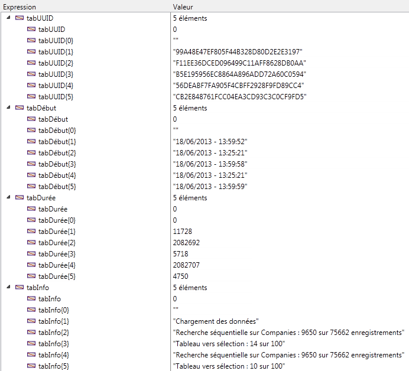

<!--REF #_command_.ACTIVITY SNAPSHOT.Syntax-->**ACTIVITY SNAPSHOT** ( tabActivités | tabUUID ; *tabDébut* ; *tabDurée* ; *tabInfo* {; *tabDétails*}{; *} )<!-- END REF-->
<!--REF #_command_.ACTIVITY SNAPSHOT.Params-->
| Paramètre | Type |  | Description |
| --- | --- | --- | --- |
| tabActivités &#124; tabUUID | Tableau objet, Tableau texte | &#8592; | Description complète des opérations (tableau objet) ouUUIDs des opérations (tableau texte) |
| tabDébut | Text array | &#8592; | Heures de démarrage des opérations |
| tabDurée | Integer array | &#8592; | Durées des opérations en millisecondes |
| tabInfo | Text array | &#8592; | Description |
| tabDétails | Object array | &#8592; | Détails du contexte et Sous-opérations (le cas échéant) |
| * | Opérateur | &#8594;  | Si passé = Lire activité serveur |

<!-- END REF-->

#### Description 

<!--REF #_command_.ACTIVITY SNAPSHOT.Summary-->La commande **ACTIVITY SNAPSHOT** retourne un ou plusieurs tableau(x) décrivant les opérations en cours de progression sur les données de 4D.<!-- END REF--> Ces opérations entraînent généralement l’affichage d’une fenêtre de progression. 

Cette commande permet d’obtenir un instantané des *n* opérations les plus coûteuses en temps et/ou les plus fréquentes en cours d’exécution telles que l’écriture du cache ou l’exécution de formules.

**Note :** Les informations retournées par la commande **ACTIVITY SNAPSHOT** sont les mêmes que celles affichées dans la page "Moniteur temps réel" (MTR) de la fenêtre d’administration de 4D Server (cf. *guide de référence de 4D Server*). 

Par défaut, **ACTIVITY SNAPSHOT** traite des opérations effectuées en local (avec 4D monoposte, 4D Server ou 4D en mode distant). Avec 4D en mode distant cependant, vous pouvez également obtenir l’aperçu des opérations effectuées sur le serveur : il suffit pour cela de passer l’étoile (*\**) en dernier paramètre. Dans ce cas, les données du serveur seront récupérées localement. Le paramètre *\** est ignoré lorsque la commande est exécutée sur 4D Server ou 4D monoposte. 

La commande **ACTIVITY SNAPSHOT** admet deux syntaxes : 

* syntaxe utilisant uniquement un tableau objet.
* syntaxe utilisant plusieurs tableaux.

##### Première syntaxe : LIRE APERCU ACTIVITE (tabActivités{; \*}) 

Avec cette syntaxe, toutes les opérations sont retournées sous forme structurée dans le tableau d’objets 4D *tabActivités*. Chaque élément du tableau est un objet construit de la manière suivante :

```json
[    {        "message":"xxx",        "maxValue":12321,        "currentValue":63212,        "interruptible:0,        "remote":0,        "uuid":"deadbeef",        "taskId":xxx,        "startTime":"2014-03-20 13:37:00:123",        "duration":92132,        "dbContextInfo":{            "task_id": xxx,            "user_name": Jean,            "host_name": HAL,            "task_name": "CreateIndexLocal",            "client_uid": "DE4DB33F33F"            "user4d_id ": 1,            "client_version ": 123456        },        "dbOperationDetails":{            table: "maTable"            field: "Champ_1"        },        "subOperations":[            {"message":"xxx",            ...}            ]    },    {...}]
```

Voici une description de chaque propriété retournée :

* *message* (texte) : libellé de l'opération
* *maxValue* (numérique) : nombre d'itérations prévues dans l'opération (-1 si opération non itérative)
* *currentValue* (numérique) : itération courante
* *interruptible* (numérique) : opération pouvant être interrompue par l'utilisateur (0=vrai, 1=faux)
* *remote* (numérique) : opération jumelée entre le client et le serveur (0=vrai, 1=faux)
* *uuid* (texte) : identifiant UUID de l'opération
* *taskId* (numérique) : identifiant interne du process à l'origine de l'opération
* *startTime* (texte) : horaire de démarrage de l'opération au format "aaaa:mm:jj hh:mm:ss:mls"
* *duration* (numérique) : durée de l'opération en millisecondes
* *dbContextInfo* (objet) : informations relatives aux opérations traitées par le moteur de base de données. Contient les propriétés suivantes :  
   * *host\_name* (chaîne) : nom de l'hôte ayant lancé l'opération  
   * *user\_name* (chaîne) : nom de l'utilisateur 4D dont la session a lancé l'opération  
   * *task\_name* (chaîne) : nom du process ayant lancé l'opération  
   * *task\_id* (num) : numéro d'id du process ayant lancé l'opération  
   * *client\_uid* (chaîne) : optionnel, uuid du client ayant lancé l'opération  
   * *is\_remote\_context* (booléen, 0 ou 1) : optionnel, indique si l'opération de base de données a été lancée par un client (valeur 1) ou par le serveur via une procédure stockée (valeur 0)  
   * *user4d\_id* (num) : numéro d'id de l'utilisateur 4D courant côté client  
   * *client\_version* (chaîne) : quatre chiffres représentant la version du moteur 4D de l'application, tels que retournés par la commande [Application version](application-version.md).  
**Note :** client\_uid et is\_remote\_context sont disponibles uniquement en mode client/serveur. client\_uid n'est retourné que si l'opération de base de données a été démarrée sur un poste client.
* *dbOperationDetails* (objet) : propriété retournée uniquement si l'opération fait appel au moteur de base de données (c'est le cas par exemple pour les recherches et les tris). Il s'agit d'un objet contenant des informations spécifiques liées à l'opération elle-même. Les propriétés disponibles dépendent de la nature de l'opération de base de données effectuée. Ces propriétés incluent notamment :  
   * table (chaîne): nom de la table impliquée dans l'opération  
   * field (chaîne): nom du champ impliqué dans l'opération  
   * queryPlan (chaîne): plan de recherche défini pour l'opération  
   * ...
* *subOperations* (tableau) : tableau d'objets contenant les sous-opérations de l'opération courante (le cas échéant). La structure de chaque sous-élément est identique à celle de l'objet principal. Si l'opération courante n'a pas de sous-opérations, *subOperations* est vide.

##### Seconde syntaxe : LIRE APERCU ACTIVITE (tabUUID ;tabDébut;tabDurée; tabInfo {;tabDétails}{; \*}) 

Avec cette syntaxe, toutes les opérations sont retournées sous forme de plusieurs tableaux synchronisés (chaque opération entraîne l’ajout d’un élément dans tous les tableaux). Les tableaux suivants sont retournés :

* *tabUUID* : contient les identifiants UUID de chaque opération (correspond à la propriété *uuid* de l'objet *tabActivités* dans la syntaxe précédente)
* *tabDébut* : contient les horaires de démarrage de chaque opération (correspond à la propriété *startTime* de l'objet *tabActivités*)
* *tabDurée* : contient les durées de chaque opération en millisecondes (correspond à la propriété *duration* de l'objet *tabActivités*)
* *tabInfo* : contient les libellés décrivant chaque opération (correspond à la propriété *message* de l'objet *tabActivités*)
* *tabDétails* (optionnel) : chaque élément de ce tableau est un objet contenant les propriétés suivantes :  
   * *"dbContextInfo"* (objet) : cf. ci-dessus  
   * *"dbOperationDetails"* (objet) : cf. ci-dessus  
   * "subOperations". La valeur de cette propriété est un tableau objet contenant toutes les sous-opérations de l’opération courante. Si l’opération courante n’a pas de sous-opérations, la valeur de la propriété *subOperations* est un tableau vide (correspond à la propriété *subOperations* de l'objet *tabActivités*).

#### Exemple 

Cette méthode, exécutée dans un process séparé sous 4D ou 4D Server, permet d’obtenir un instantané des opérations en progression :

```4d
 ARRAY TEXT(tabUUID;0)
 ARRAY TEXT(tabDébut;0)
 ARRAY LONGINT(tabDurée;0)
 ARRAY TEXT(tabInfo;0)
 
 Repeat
       ACTIVITY SNAPSHOT(tabUUID;tabDébut;tabDurée;tabInfo)
       If(Size of array(tabUUID)>0)
          TRACE //appel du débogueur
       End if
 Until(False) //Boucle infinie
```

Vous obtenez des tableaux du type :




#### Propriétés

|  |  |
| --- | --- |
| Numéro de commande | 1277 |
| Thread safe | &check; |


