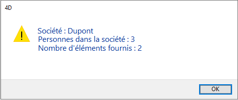
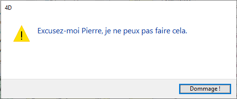
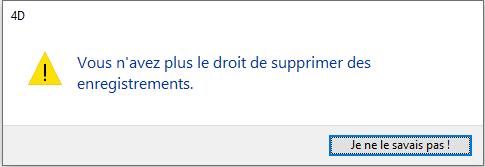

<!--REF #_command_.ALERT.Syntax-->**ALERT** ( *message* {; *libelléBoutonOK*} )<!-- END REF-->
<!--REF #_command_.ALERT.Params-->
| Paramètre | Type |  | Description |
| --- | --- | --- | --- |
| message | Text | &#8594;  | Message à afficher dans la boîte de dialogue d'alerte |
| libelléBoutonOK | Text | &#8594;  | Libellé du bouton OK |

<!-- END REF-->

#### Description 

<!--REF #_command_.ALERT.Summary-->La commande **ALERT** affiche une boîte de dialogue d'alerte composée d'une icône, d'un message et d'un bouton OK.<!-- END REF-->

Vous passez le message à afficher dans le paramètre *message*. Ce message peut contenir jusqu'à 255 caractères. Si la longueur ou la largeur des caractères est trop importante par rapport à la zone du message, il sera tronqué.

Par défaut, le libellé du bouton OK est “OK”. Si vous voulez changer ce libellé, passez le nouveau libellé dans le paramètre optionnel *libelléBoutonOK*. Si nécessaire, la largeur du bouton OK est augmentée vers la gauche pour contenir ce nouveau libellé.

**Note :** N'appelez pas la commande **ALERT** dans une méthode formulaire ou une méthode objet qui gère l'événement formulaire On Activate ou On Deactivate , car cela provoquerait une boucle sans fin.

#### Exemple 1 

L'exemple suivant appelle une boîte de dialogue d'alerte qui affiche des informations sur une société. Notez que le message contient des retours chariot ([Char](char.md)(13)) qui forcent le texte à passer sur la ligne suivante :

```4d
 ALERT("Société: "+[Société]Nom+Char(13)+"Personnes dans la société: "+\
 String(Enregistrements trouves([Personnes ]))+Caractere(13)+"Nombre d'éléments fournis: "+\
 String(Enregistrements trouves([Elements])))
```

Voici la boîte de dialogue d'alerte affichée (sous Windows) par notre exemple :



#### Exemple 2 

Voici un autre exemple :

```4d
 ALERT("Excusez-moi Pierre, je ne peux pas faire cela.";"Dommage !")
```

Cette instruction affichera (sous Windows) la boîte de dialogue d'alerte suivante :



#### Exemple 3 

Voici un autre exemple :

```4d
 ALERT("Vous n'avez plus le droit de supprimer des enregistrements.";"Je ne le savais pas !")
```

Ce code affiche la boîte de dialogue d'alerte suivante :



#### Voir aussi 

[CONFIRM](confirm.md)  
[DISPLAY NOTIFICATION](display-notification.md)  
[Request](request.md)  

#### Propriétés

|  |  |
| --- | --- |
| Numéro de commande | 41 |
| Thread safe | &check; |


