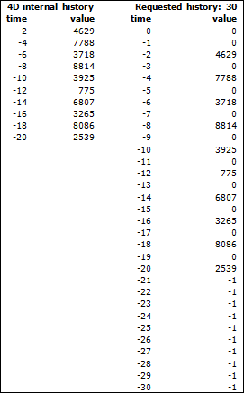

<!--REF #_command_.Database measures.Syntax-->**Database measures** {( *options* )} : Object<!-- END REF-->
<!--REF #_command_.Database measures.Params-->
| Paramètre | Type |  | Description |
| --- | --- | --- | --- |
| options | Object | &#8594;  | Options de retour |
| Résultat | Object | &#8592; | Objet contenant des mesures sur la base |

<!-- END REF-->

#### Description 

<!--REF #_command_.Database measures.Summary-->La commande **Database measures** vous permet d'obtenir un ensemble d'informations détaillées sur les événements du moteur de base de données de 4D.<!-- END REF--> Les informations renvoyées concernent les accès en lecture/écriture aux données depuis ou vers le disque ou le cache ainsi que l'utilisation des index de la base, les recherches et les tris. 

**Database measures** retourne un seul objet contenant toutes les mesures utiles. Le paramètre *options* vous permet de paramétrer les informations retournées. 

##### Présentation de l'objet retourné 

L'objet retourné par la commande contient une seule propriété, nommée "DB", dont la structure est la suivante :

```json
{    "DB": {        "diskReadBytes": {…},        "cacheReadBytes": {…},        "cacheMissBytes": {…},        "diskWriteBytes": {…},        "diskReadCount": {…},        "cacheReadCount": {…},        "cacheMissCount": {…},        "diskWriteCount": {…},        "dataSegment1": {…},        "indexSegment": {…},        "tables": {…},        "indexes": {…}    }}
```

Cet objet est composé de huit propriétés élémentaires qui contiennent les mesures de base ("diskReadBytes", "cacheReadBytes", "cacheMissBytes", "diskWriteBytes", "diskReadCount", "cacheReadCount", "cacheMissCount", "diskWriteCount") ainsi que des propriétés additionnelles ("dataSegment1", "indexSegment", "tables", "index") qui peuvent elles-mêmes contenir les propriétés élémentaires mais appliquées à des niveaux différents (voir ci-dessous).

**Note :** Une propriété est présente dans l'objet uniquement si elle contient des valeurs. Lorsqu'une propriété est vide, elle n'est pas incluse dans l'objet. Par exemple, si la base a été ouverte en mode lecture seulement et que les index n'ont pas été sollicités, l'objet retourné ne contiendra pas les propriétés "diskWriteBytes", "diskWriteCount", "indexSegment" et "indexes".

##### Propriétés élémentaires 

Les propriétés élémentaires peuvent être présentes à différents niveaux de l'objet DB. Elles retournent les mêmes informations mais sur des périmètres spécifiques. Voici la description de ces propriétés :

| **Nom**        | **Information retournée**                  |
| -------------- | ------------------------------------------ |
| diskReadBytes  | Octets lus depuis le disque                |
| cacheReadBytes | Octets lus depuis le cache                 |
| cacheMissBytes | Octets manqués depuis le cache             |
| diskWriteBytes | Octets écrits sur le disque                |
| diskReadCount  | Nombre d'accès en lecture depuis le disque |
| cacheReadCount | Nombre d'accès en lecture depuis le cache  |
| cacheMissCount | Nombre d'accès manqués dans le cache       |
| diskWriteCount | Nombre d'accès en écriture sur le disque   |

Ces huit propriétés élémentaires ont toutes la même structure d'objet, par exemple :

```json
"diskReadBytes": {
    "value": 33486473620,
    "history": [        // optionnel
        {"value": 52564,"time": -1665},
        {"value": 54202,"time": -1649},
            …
    ]
}
```

* "**value**" (numérique): La propriété "value" contient un nombre représentant soit une quantité d'octets, soit un nombre d'accès. Cette valeur représente la somme théorique des valeurs de l'objet "history" (même si l'objet "history" n'est pas présent ).
* "**history**" (tableau d'objets) : Le tableau d'objets "history" est une compilation de valeurs d'événements groupés par seconde. La propriété "history" est présente uniquement si elle a été demandée via le paramètre *options* (cf. ci-dessous). Le tableau "history" contient un maximum de 200 éléments. Chaque élément du tableau est lui-même un objet contenant deux propriétés : "value" et "time".  
   * "value" (numérique) : nombre d'octets ou d'accès décomptés durant la période de temps indiquée par la propriété "time" associée.  
   * "time" (numérique) : nombre de secondes écoulées depuis l'appel de la fonction. Dans l'exemple ci-dessus, ("time": -1649) signifie "il y a 1649 secondes" (ou plus précisément, entre 1649 et 1650 secondes). Pendant cette unique seconde, 54,202 octets ont été lus sur le disque.  
   Le tableau "history" ne contient pas séquentiellement toutes les secondes (-1650,-1651,-1652, etc.). La valeur précédente est -1665, ce qui signifie que rien n'a été lu sur le disque durant la période de 15 secondes entre 1650 et 1665.  
   Puisque la taille maximum du tableau est 200, si la base de données est sollicitée de manière intensive (quelque chose est lu chaque seconde sur le disque), la durée maximale de l'historique sera de 200 secondes. D'un autre côté, s'il ne se passe presque rien, par exemple uniquement toutes les 3 minutes, la durée de l'historique pourra atteindre 600 minutes (3\*200).  
   Cet exemple peut être représenté dans le schéma suivant :  
   

##### dataSegment1 et indexSegment 

Les propriétés "dataSegment1" et "indexSegment" peuvent contenir jusqu'à quatre propriétés élémentaires (le cas échéant) : 

```json
"dataSegment1": {    "diskReadBytes": {…},    "diskWriteBytes": {…},    "diskReadCount": {…},    "diskWriteCount": {…}    },"indexSegment": {    "diskReadBytes": {…},    "diskWriteBytes": {…},    "diskReadCount": {…},    "diskWriteCount": {…}    }
```

Ces propriétés retournent les mêmes informations que les propriétés élémentaires précédemment décrites, mais limitées à chaque fichier de la base :

* "dataSegment1" représente le fichier de données .4dd sur disque
* "indexSegment" représente le fichier d'index .4dx sur disque

Par exemple, vous pouvez obtenir l'objet suivant : 

```json
{
"DB": {
"diskReadBytes": {
    "value": 718260
    },
"diskReadCount": {
    "value": 229
    },

"dataSegment1": {
    "diskReadBytes": {
    "value": 679092
    },
    "diskReadCount": {
    "value": 212
    }
    },
"indexSegment": {
    "diskReadBytes": {
    "value": 39168
    },
    "diskReadCount": {
    "value": 17
    }
}
```

Les valeurs retournées correspondent aux formules suivantes :

*diskReadBytes.value = dataSegment1.diskReadBytes.value + indexSegment.diskReadBytes.value* 
*diskWriteBytes.value = dataSegment1.diskWriteBytes.value + indexSegment.diskWriteBytes.value* 
*diskReadCount.value = dataSegment1.diskReadCount.value + indexSegment.diskReadCount.value* 
*diskWriteCount.value = dataSegment1.diskWriteCount.value + indexSegment.diskWriteCount.value* 

##### tables 

La propriété "tables" contient autant de propriétés qu'il y a de tables ayant été utilisées en lecture ou en écriture depuis l'ouverture de la base. Le nom de chaque propriété est le nom de la table concernée. Par exemple : 

```json
"tables": {
    "Employees": {…)
    "Companies": {…)
    }
```

Chaque objet "table" contient jusqu' à 12 propriétés :

* Les huit premières propriétés sont les *propriétés élémentaires* (voir ci-dessus) limitées à la table concernée.
* Deux autres propriétés, "records" et "blobs", contiennent également le même ensemble des huit propriétés élémentaires, mais limitées à certains types de champs :  
   * La propriété "records" concerne tous les champs de la table (chaînes, dates, numériques, etc.) à l'exception des champs de type texte, image et BLOB.  
   * La propriété "blobs" concerne les champs de type texte, image et BLOB de la table.
* Une ou deux propriétés supplémentaires, "fields" et "queries", peuvent également être présentes en fonction des recherches et tris effectués sur la table concernée :  
   * La propriété "fields" contient autant de propriétés "nom de champ" (chacune étant également un sous-objet) qu'il y a de champs ayant été utilisés pour des recherches ou des tris.  
   Chaque objet nom de champ contient :  
         * un objet "queryCount" (avec ou sans history, en fonction du paramètre *options*) si une recherche a été effectuée en utilisant ce champ  
         * et/ou un objet "sortCount" (avec ou sans history, en fonction du paramètre *options*) si un tri a été effectué en utilisant ce champ.  
   Cet attribut n'est pas basé sur l'utilisation des index ; tous les types de recherches et de tris sont pris en compte.  
   Exemple : Depuis le lancement de la base, plusieurs recherches et tris ont été effectués en utilisant les champs *CompID*, *Name* et *FirstName*. L'objet retourné contient le sous-objet "fields" suivant (*options* sans historique) :  
         
   ```json  
   {  
       "DB": {  
           "tables": {  
               "Employees": {  
                   "fields": {  
                       "CompID": {  
                           "queryCount": {  
                               "value": 3  
                           }  
                       },  
                       "Name": {  
                           "queryCount": {  
                               "value": 1  
                           },  
                           "sortCount": {  
                               "value": 3  
                           }  
                       },  
                       "FirstName": {  
                           "sortCount": {  
                               "value": 2  
                           }  
                       }  
   (...)  
   ```  
         
   **Note** : L'attribut "fields" est créé uniquement si une recherche ou un tri a été effectué(e) sur la table ; sinon, l'attribut n'est pas présent.  
   * "queries" est un tableau d'objets fournissant une description de chaque recherche effectuée sur la table concernée. Chaque élément du tableau contient trois attributs :  
         * "queryStatement" (chaîne) : chaîne de recherche (contenant les noms des champs mais pas les valeurs recherchées). Par exemple : "(Companies.PK\_ID != ?)"  
         * "queryCount" (objet) :  
                  * "value" (numérique) : nombre d'exécutions de la chaîne de recherche, quelles que soient les valeurs recherchées.  
                  * "history" (tableau d'objets) (si requis via le paramètre *options*) : propriétés d'historique standard "value" et "time"  
         * "duration" (objet) (si la "value" est >0)  
                  * "value" (numérique) : nombre de millisecondes  
                  * "history" (tableau d'objets) (si requis via le paramètre *options*) : propriétés d'historique standard "value" et "time".  
   Exemple : Depuis le lancement de la base, une seule recherche a été effectuée sur la table Employees (*options* avec historique) :  
   ```json  
   {  
       "DB": {  
           "tables": {  
               "Employees": {  
                   "queries": [  
                       {  
                           "queryStatement": "(Employees.Name == ?)",  
                           "queryCount": {  
                               "value": 1,  
                               "history": [  
                                   {  
                                       "value": 1,  
                                       "time": -2022  
                                   }  
                               ]  
                           },  
                           "duration": {  
                               "value": 2,  
                               "history": [  
                                   {  
                                       "value": 2,  
                                       "time": -2022  
                                   }  
                               ]  
                           }  
                       },  
   (...)  
   ```  
         
   **Note :** L'attribut "queries" est créé si au moins une recherche a été effectuée sur la table.

##### indexes 

Il s'agit de l'objet ayant la structure la plus complexe. Toutes les tables auxquelles on a accédé via au moins l'un de leurs index sont stockées en tant que propriétés et, à l'intérieur de chaque propriété, les noms des index utilisés sont également stockés sous forme de propriétés. Les index de mots-clés apparaissent séparément, leur nom est suivi de "*(* *Keyword)*". Enfin, chaque objet nom d'index contient les huit propriétés élémentaires relatives à cet index ainsi que jusqu'à quatre sous-objets en fonction de l'utilisation des index de la base depuis son lancement (chaque sous-objet n'existe que si au moins une opération correspondante a été effectuée depuis le lancement de la base).

Exemple : Depuis le lancement de la base, divers index du champ \[Employees\]EmpLastName ont été sollicités. En outre, 2 enregistrements ont été créés et 16 enregistrements ont été supprimés dans la table \[Companies\]. Cette table comporte un champ "name" qui est indexé. Des recherches et des tris ont été effectués dans la table via ce champ. L'objet résultant contient :

```json
"indexes": {
    "Employees": {
        "EmpLastName": {
                    "diskReadBytes": {…},
                    "cacheReadBytes": {…},
                    "cacheMissBytes": {…},
                    "diskWriteBytes": {…},

                    "diskReadCount": {…},
                    "cacheReadCount": {…},
                    "cacheMissCount": {…},
                    "diskWriteCount": {…}
            }
        "EmpLastName (Keyword)": {...},
        "index3Name": {…},
        "index4Name": {…},
        …
        }
        "Companies": {
            "Name": 
            (...)
                "queryCount": {
                    "value": 41
                },
                "sortCount": {
                    "value": 3
                },
                "insertKeyCount": {
                    "value": 2
                },
                "deleteKeyCount": {
                    "value": 16
                }
    table3Name: {…}
}
```

##### Paramètre options 

Le paramètre *options* vous permet de personnaliser les informations retournées par la commande. Dans *options*, vous devez passer un objet pouvant contenir jusqu'à trois propriétés : "withHistory", "historyLength" et "path".

| **Propriété**   | **Type**                     | **Description**                                                                                                                                                                                                                                                                                                                                                                                                                                                                                                                                                                           |
| --------------- | ---------------------------- | ----------------------------------------------------------------------------------------------------------------------------------------------------------------------------------------------------------------------------------------------------------------------------------------------------------------------------------------------------------------------------------------------------------------------------------------------------------------------------------------------------------------------------------------------------------------------------------------- |
| "withHistory"   | Booléen                      | "true" signifie que l'objet "history" devra être retourné par la commande; "false" signifie que l'objet retourné ne devra pas contenir d'objet "history"                                                                                                                                                                                                                                                                                                                                                                                                                                  |
| "historyLength" | numérique                    | Définit la taille en secondes du tableau "history" retourné(\*).                                                                                                                                                                                                                                                                                                                                                                                                                                                                                                                          |
| "path"          | chaîne \| tableau de chaînes | Chemin complet de la propriété spécifique ou tableau de chemins complets des propriétés spécifiques que vous voulez obtenir. Si vous passez une chaîne, seule la valeur correspondante est retournée dans l'objet "DB" (si le chemin est valide). Exemple : "DB.tables.Employees.records.diskWriteBytes". Si vous passez un tableau de chaînes, seules les valeurs correspondantes sont retournées dans l'objet "DB" (si les chemins sont valides). Exemple : \["DB.tables.Employee.records.diskWriteBytes", "DB.tables.Employee.records.diskReadCount","DB.dataSegment1.diskReadBytes"\] |

(\*) Comme décrit précédemment, l'historique n'est pas stocké sous forme d'une séquence de secondes mais uniquement sous forme de valeurs remarquables. Si rien ne se produit durant deux secondes ou plus, rien n'est stocké et une rupture apparaît dans le tableau "history". Par exemple, "time" peut contenir -2, -4, -5, -10, -15, -30 avec des valeurs "value" 200, 300, 250, 400, 500,150\. Si la propriété "historyLength" est fixée à 600 (10 minutes), le tableau retourné contiendra 0, -1, -2, -3 … -599 pour "time", et seules les propriétés "value" des secondes -2, -4, -5, -10, -15, -30 seront remplies. Toutes les autres propriétés "value" auront pour valeur 0 (zéro). De plus, comme décrit également, la seule limite du tableau d'historique interne est sa taille (200 éléments), et non le temps. Cela signifie que s'il y a une activité réduite pour une propriété spécifique, le moment le plus ancien peut ête très éloigné (p.e. -3600 pour il y a une heure). Il peut également contenir moins de 200 valeurs si la base vient juste d'être lancée. Dans ces cas, si l'heure interne de l'historique est plus récent que celui demandé OU si toutes les valeurs remarquables ont déjà ajoutées au tableau retourné, la valeur retournée sera -1\.   
Exemple : La base a été démarrée il y a 20 secondes et la taille demandée du tableau "history" est de 60 secondes. Les données retournées entre 0 et -20 seront bien constituées de valeurs et de 0, et les autres valeurs serront -1\. Lorsqu'une valeur "-1" est retournée, cela signifie soit que le temps demandé est top ancien, soit que la valeur n'est plus dans le tableau d'historique interne (c'est-à-dire que la limite des 200 éléments a été atteinte et que les valeurs plus anciennes ont été supprimées).

##### Client/serveur et composants 

Cette commande retourne des informations relatives à l'utilisation de la base de données. Cela signifie qu'elle ne retourne un objet valide contenant des valeurs significatives uniquement lorsqu'elle est appelée :

* 4D en mode local (lorsqu'elle est appelée depuis un composant, elle retourne les données de la base hôte),
* sur le serveur en mode client/serveur.

Si la commande est appelée depuis un 4D distant en mode client/serveur, l'objet est retourné vide.   
Dans ce contexte, si vous souhaitez obtenir des informations sur le serveur, le plus simple est de créer une méthode et d'activer l'option "Exécuter sur serveur". Ce principe fonctionne aussi pour un composant : si le composant est utilisé dans un contexte local, la commande retourne des informations sur la base hôte ; dans un contexte de 4D distant, elle retourne des informations sur la base du serveur. 

#### Exemple 1 

Vous souhaitez obtenir l'objet "history" dans l'objet retourné :

```4d
 var $param : Object
 var $measures : Object
 OB SET($param;"withHistory";True)
 $measures:=Database measures($param)
```

#### Exemple 2 

Vous souhaitez connaître uniquement le nombre global d'octets lus dans le cache ("cacheReadBytes") :

```4d
 var $oStats : Object
 var $oParams : Object
 OB SET($oParams;"path";"DB.cacheReadBytes")
 $oStats:=Database measures($oParams)
```

L'objet retourné contiendra, par exemple :

```json
{
    "DB": {
        "cacheReadBytes": {
            "value": 9516637
        }
    }
}
```

#### Exemple 3 

Vous souhaitez obtenir les mesures d'octets lus dans le cache au cours des deux dernières minutes :

```4d
 var $oParams : Object
 var $measures : Object
 OB SET($oParams;"path";"DB.cacheReadBytes")
 OB SET($oParams;"withHistory";True)
 OB SET($oParams;"historyLength";2*60)
 $measures:=Database measures($oParams)
```


#### Propriétés

|  |  |
| --- | --- |
| Numéro de commande | 1314 |
| Thread safe | &check; |


