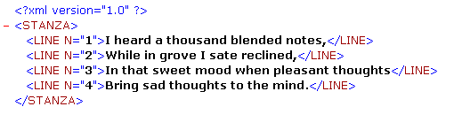

<!--REF #_command_.DOM GET XML ATTRIBUTE BY NAME.Syntax-->**DOM GET XML ATTRIBUTE BY NAME** ( *refElément* ; *nomAttribut* ; *valeurAttribut* )<!-- END REF-->
<!--REF #_command_.DOM GET XML ATTRIBUTE BY NAME.Params-->
| Paramètre | Type |  | Description |
| --- | --- | --- | --- |
| refElément | Text | &#8594;  | Référence d’élément XML |
| nomAttribut | Text | &#8594;  | Nom d’attribut |
| valeurAttribut | Variable | &#8592; | Valeur de l’attribut |

<!-- END REF-->

#### Description 

<!--REF #_command_.DOM GET XML ATTRIBUTE BY NAME.Summary-->La commande **DOM GET XML ATTRIBUTE BY NAME** permet de connaître la valeur d’un attribut désigné par son nom.<!-- END REF-->

Passez dans *refElément* la référence d’un élément XML et dans *nomAttribut* le nom d’attribut dont vous voulez connaître la valeur. La valeur est retournée dans le paramètre *valeurAttribut*. 4D tentera de convertir la valeur obtenue dans le type de la variable passée en paramètre. Si le type de la variable n'est pas défini, la valeur est retournée par défaut en type texte.

Si aucun attribut *nomAttribut* n’existe dans l’élément XML, une erreur est retournée. Si plusieurs attributs de l’élément XML portent le nom spécifié, seule la valeur du premier attribut est retournée.

#### Exemple 

Cette méthode permet de récupérer une valeur d’attribut XML à l’aide de son nom :

```4d
 var maVarBlob : Blob
 var $ref_XML_Parent;$ref_XML_Enfant : Text
 var $NumLigne : Integer
 
 $ref_XML_Parent:=DOM Parse XML variable(maVarBlob)
 $ref_XML_Enfant:=DOM Get first child XML element($ref_XML_Parent)
 DOM GET XML ATTRIBUTE BY NAME($ref_XML_Enfant;"N";$NumLigne)
```

Si cette méthode est appliquée à l’exemple ci-dessous, $NumLigne contient la valeur 1 :



#### Variables et ensembles système 

Si la commande a été correctement exécutée, la variable système OK prend la valeur 1\. Si une erreur se produit, elle prend la valeur 0.

#### Voir aussi 

[DOM GET XML ATTRIBUTE BY INDEX](dom-get-xml-attribute-by-index.md)  
[DOM REMOVE XML ATTRIBUTE](dom-remove-xml-attribute.md)  

#### Propriétés

|  |  |
| --- | --- |
| Numéro de commande | 728 |
| Thread safe | &check; |
| Modifie les variables | OK, error |


