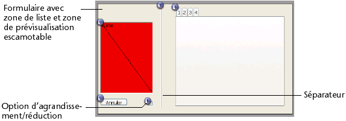
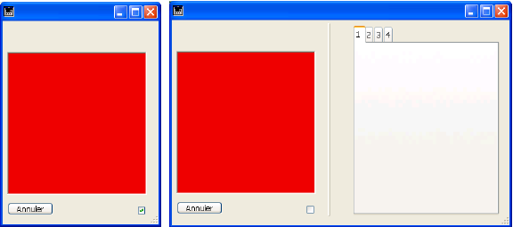

<!--REF #_command_.FORM SET SIZE.Syntax-->**FORM SET SIZE** ( {*objet* ;} *horizontal* ; *vertical* {; *} )<!-- END REF-->
<!--REF #_command_.FORM SET SIZE.Params-->
| Paramètre | Type |  | Description |
| --- | --- | --- | --- |
| objet | Text | &#8594;  | Nom d’objet indiquant les limites du formulaire |
| horizontal | Integer | &#8594;  | Si * passé : marge horizontale (pixels)Si * omis : largeur (pixels) |
| vertical | Integer | &#8594;  | Si * passé : marge verticale (pixels)Si * omis : hauteur (pixels) |
| * | Opérateur | &#8594;  | • Si passé, utiliser horizontal et vertical comme marges du formulaire• Si omis, utiliser horizontal et vertical comme largeur et hauteur du formulaireCe paramètre ne peut pas être passé si objet est passé |

<!-- END REF-->

#### Description 

<!--REF #_command_.FORM SET SIZE.Summary-->La commande **FORM SET SIZE** permet de modifier par programmation la taille du formulaire courant.<!-- END REF--> La nouvelle taille est définie pour le process courant, elle n’est pas stockée avec le formulaire.  
  
Comme en mode Développement, cette commande permet de définir la taille d’un formulaire de trois manières :

* automatiquement — 4D détermine la taille du formulaire sur le principe que tous les objets doivent être visibles — en ajoutant éventuellement une marge horizontale et une marge verticale,
* sur la base de l’emplacement d’un objet du formulaire auquel s’ajoutent éventuellement une marge horizontale et une marge verticale,
* en saisissant des dimensions “absolues” (largeur et hauteur).  
Pour plus d’informations sur les possibilités de dimensionnement des formulaires, reportez-vous au manuel Mode Développement de 4D.

**Taille automatique**  
Pour que le formulaire ait une taille automatique, vous devez utiliser la syntaxe suivante :   

```4d
 FORM SET SIZE(horizontal;vertical;*)
```

  
Dans ce cas, vous devez passer dans *horizontal* et *vertical* les marges (en pixels) que vous souhaitez ajouter à droite et en bas du formulaire. 

**Taille basée sur un objet**  
 Pour que la taille du formulaire soit basée sur un objet, vous devez utiliser la syntaxe suivante :  

```4d
 FORM SET SIZE(objet;horizontal;vertical)
```

  
Dans ce cas, vous devez passer dans *horizontal* et *vertical* les marges (en pixels) que vous souhaitez ajouter à droite et en bas de l’objet. Il n'est pas possible de passer le paramètre *\**.

**Taille en valeur absolue**  
 Pour passer une taille de formulaire absolue, vous devez utiliser la syntaxe suivante :  

```4d
 FORM SET SIZE(horizontal;vertical)
```

  
Dans ce cas, vous devez passer dans *horizontal* et *vertical* la largeur et la hauteur (en pixels) du formulaire. 

La commande **FORM SET SIZE** modifie la taille du formulaire mais tient compte de ses propriétés de redimensionnement. Par exemple, si la largeur minimale du formulaire est de 500 pixels et si la commande définit une largeur de 400 pixels, la nouvelle largeur du formulaire sera de 500 pixels. 

A noter également que cette commande ne modifie pas la taille de la fenêtre du formulaire (il est possible de redimensionner un formulaire sans que la taille de la fenêtre soit modifiée, et inversement). Pour modifier la taille de la fenêtre d’un formulaire, reportez-vous à la description de la commande [RESIZE FORM WINDOW](resize-form-window.md). 

#### Exemple 

Voici un exemple de mise en place d’une fenêtre de type Explorateur. Le formulaire suivant est défini en mode Développement :



La taille du formulaire est “automatique”.

La fenêtre est affichée via l’instruction suivante :

```4d
 $ref:=Open form window([Table 1];"Form1";Form fenêtre standard;Centrée horizontalement;Centrée verticalement;*)
 DIALOG([Table 1];"Form1")
 CLOSE WINDOW
```

La partie droite de la fenêtre peut être affichée ou masquée via un clic sur l’option d’agrandissement/réduction :



La méthode objet associée à ce bouton est la suivante :

```4d
 Case of
    :(FORM Event.code=On Load)
       var b1;<>contracté : Boolean
       var marge : Integer
       marge:=15
       b1:=<>contracté
       If(<>contracté)
          FORM SET HORIZONTAL RESIZING(False)
          FORM SET SIZE("b1";marge;marge)
       Else
          FORM SET HORIZONTAL RESIZING(True)
          FORM SET SIZE("onglet";marge;marge)
       End if
 
    :(FORM Event.code=On Clicked)
       <>contracté:=b1
       If(b1)
  //contracté
          OBJECT GET COORDINATES(*;"b1";$g;$h;$d;$b)
          GET WINDOW RECT($gf;$hf;$df;$bf;Current form window)
          SET WINDOW RECT($gf;$hf;$gf+$d+marge;$hf+$b+marge;Current form window)
          FORM SET HORIZONTAL RESIZING(False)
          FORM SET SIZE("b1";marge;marge)
 
       Else
  //déployé
          OBJECT GET COORDINATES(*;"onglet";$g;$h;$d;$b)
          GET WINDOW RECT($gf;$hf;$df;$bf;Current form window)
          SET WINDOW RECT($gf;$hf;$gf+$d+marge;$hf+$b+marge;Current form window)
          FORM SET HORIZONTAL RESIZING(True)
          FORM SET SIZE("onglet";marge;marge)
       End if
 
 End case
```

#### Voir aussi 

[FORM SET HORIZONTAL RESIZING](form-set-horizontal-resizing.md)  
[FORM SET VERTICAL RESIZING](form-set-vertical-resizing.md)  

#### Propriétés

|  |  |
| --- | --- |
| Numéro de commande | 891 |
| Thread safe | &cross; |


