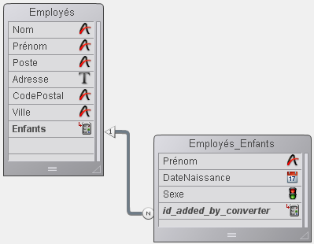

<!--REF #_command_.Get subrecord key.Syntax-->**Get subrecord key** ( *champID* ) : Integer<!-- END REF-->
<!--REF #_command_.Get subrecord key.Params-->
| Paramètre | Type |  | Description |
| --- | --- | --- | --- |
| champID | Field | &#8594;  | Champ de type "Lien sous-table" ou de type "Entier long" d’une ancienne relation sous-table |
| Entier long | Integer | &#8592; | Clé interne du lien |

<!-- END REF-->

#### Description 

<!--REF #_command_.Get subrecord key.Summary-->La commande **Get subrecord key** est destinée à faciliter la migration du code 4D utilisant des sous-tables converties vers le code standard de manipulation des tables.<!-- END REF-->Les sous-tables ne sont plus prises en charge à compter de la version 11 de 4D. Lors de la conversion d’une ancienne base, les sous-tables existantes sont automatiquement transformées en tables standard reliées aux tables d’origine par un lien automatique. La sous-table devient une table “N” et la table d’origine la table “1”. Dans la table 1, l’ex-champ de type sous-table est transformé en champ spécial de type “Lien sous-table” et dans la table N, un champ spécial, également de type “Lien sous-table” est ajouté. Il est nommé “id\_added\_by\_converter”. 

Ce principe permet de préserver le fonctionnement des bases de données converties, mais il est fortement conseillé de remplacer les mécanismes des sous-tables par ceux des tables standard. 

La première étape de ce processus consiste à supprimer le lien automatique spécial, ce qui désactive définitivement les mécanismes hérités des sous-tables. Cette opération nécessite ensuite de réécrire le code associé. La commande [Get subrecord key](get-subrecord-key.md) accompagne cette réécriture en renvoyant l’identifiant interne utilisé par le lien. Elle permet de s’affranchir du lien et donc de travailler avec la sélection de l’ancienne sous-table, que le lien soit présent ou non. 

Examinons par exemple la structure (convertie) suivante : 



Dans 4D, le code suivant continue de fonctionner mais il doit être mis à jour :

```4d
 ALL SUBRECORDS([Employés]Enfants)
 $total:=Records in subselection([Employés]Enfants)
 vPrenoms:=""
 For($i;1;$total)
    vPrenoms:=vPrenoms+[Employés]Enfants'Prénom+" "
    NEXT SUBRECORD([Employés]Enfants)
 End for
```

Vous pouvez désormais remplacer ce code par :

```4d
 QUERY([Employés_Enfants];[Employés_Enfants]id_added_by_converter=Get subrecord key([Employés]Enfants))
 $total:=Records in selection([Employés_Enfants])
 vPrenoms:=""
 For($i;1;$total)
    vPrenoms:=vPrenoms+[Employés_Enfants]Prénom+" "
    NEXT RECORD(Employés_Enfants)
 End for
```

**Note :** S’il n’y a pas d’enregistrement courant chargé au moment de son exécution, [Get subrecord key](get-subrecord-key.md) retourne 0\. 

Le second code présente le double avantage d’utiliser des commandes standard de 4D et de fonctionner de manière identique, que le lien soit présent ou non. Lorsque vous supprimerez le lien, la commande retournera simplement la valeur clé stockée dans le champ Entier long. 

La commande accepte dans le paramètre *champ\_ID* soit un champ de type Lien sous-table (lien existant) soit de type Entier long (lien supprimé). Dans tous les autres cas, une erreur est générée.

Ce principe permet d’écrire du code de transition. Lors de la dernière étape de la mise à niveau de l’application, vous pourrez supprimer les appels à cette commande. 

#### Affecter le champ id\_added\_by\_converter 

A compter de 4D v14 R3, vous pouvez affecter la valeur du champ "id\_added\_by\_converter". Jusqu'alors, cette valeur pouvait uniquement être affectée par 4D, ce qui obligeait les développeurs à utiliser des commandes obsolètes telles que *\_o\_CREATE SUBRECORD* pour pouvoir ajouter des enregistrements dans les sous-tables converties.

Avec cette possibilité, vous pouvez convertir vos anciennes bases comportant des sous-tables d'une manière progressive : vous pouvez conserver le lien spécial "Lien sous-table", tout en ajoutant ou en modifiant des enregistrements liés comme s'ils étaient standard. Une fois que toutes vos méthodes auront été mises à jour, vous pourrez remplacer le lien spécial par un lien normal sans changer votre code. 

Par exemple, vous pouvez écrire avec la structure précédente :

```4d
 CREATE RECORD([Employés])
 [Employés]Nom:="Jones"
 CREATE RECORD([Employés_Enfants])
 [Employés_Enfants]Prénom:="Natacha"
 [Employés_Enfants]DateNaissance:=!12/24/2013!
 [Employés_Enfants]id_added_by_converter:=Get subrecord key([Employés]Enfants)
 SAVE RECORD([Employés_Enfants])
 SAVE RECORD([Employés]
```

Ce code fonctionnera indifféremment avec un lien spécial ou standard.


#### Propriétés

|  |  |
| --- | --- |
| Numéro de commande | 1137 |
| Thread safe | &check; |


