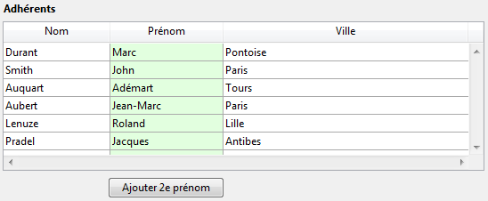
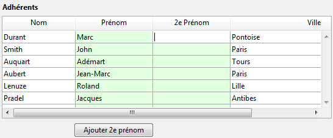

<!--REF #_command_.LISTBOX DUPLICATE COLUMN.Syntax-->**LISTBOX DUPLICATE COLUMN** ( {* ;} *objet* ; *positionCol* ; *nomCol* ; *variableCol* ; *nomEntête* ; *varEntête* {; *nomPied* ; *variablePied*} )<!-- END REF-->
<!--REF #_command_.LISTBOX DUPLICATE COLUMN.Params-->
| Paramètre | Type |  | Description |
| --- | --- | --- | --- |
| * | Opérateur | &#8594;  | Si spécifié, objet est un nom d'objet (chaîne) Si omis, objet est une variable |
| objet | any | &#8594;  | Nom d'objet (si * est spécifié) ou Variable (si * est omis) de la colonne à dupliquer |
| positionCol | Integer | &#8594;  | Emplacement de la nouvelle colonne dupliquée |
| nomCol | Text | &#8594;  | Nom de la nouvelle colonne |
| variableCol | Array, Field, Variable, Pointer | &#8594;  | Nom de la variable tableau de la colonne ou champ ou variable |
| nomEntête | Text | &#8594;  | Nom d’objet de l’en-tête de la colonne |
| varEntête | Integer, Pointer | &#8594;  | Variable d’en-tête de la colonne |
| nomPied | Text | &#8594;  | Nom d’objet du pied de la colonne |
| variablePied | Variable, Pointer | &#8594;  | Variable du pied de la colonne |

<!-- END REF-->

#### Description 

<!--REF #_command_.LISTBOX DUPLICATE COLUMN.Summary-->La commande **LISTBOX DUPLICATE COLUMN** permet de dupliquer la colonne désignée par le(s) paramètre(s) *objet* et *\** dans le contexte du formulaire en cours d’exécution (mode Application).<!-- END REF--> Le formulaire d’origine, généré en mode Développement, n’est pas modifié. 

**Note :** Cette fonctionnalité est présente dans 4D, en mode Développement uniquement, via la commande **Dupliquer colonne** du menu contextuel de l’éditeur de formulaires.

Par défaut, toutes les options de style (taille, couleur, formats, etc.) définies pour la colonne source via la Liste des propriétés ou les commandes de gestion d’objet (*\_o\_OBJECT SET COLOR*, etc.) sont appliquées à la copie. La méthode objet et le paramétrage des événements formulaire sont également dupliqués.   
En revanche, la source de données (tableau ou sélection, selon le type de source défini pour la list box) ainsi que les tableaux de style et de couleurs ne sont pas dupliqués. Il vous appartient de les définir pour chaque nouvelle colonne après la duplication. 

Les paramètres *objet* et *\** désignent la colonne à dupliquer. Si vous passez le paramètre optionnel *\**, vous indiquez que le paramètre *objet* est un nom de colonne (une chaîne). Si vous ne passez pas ce paramètre, vous indiquez que le paramètre *objet* est une variable de colonne. Dans ce cas, vous ne passez pas une chaîne mais une référence de variable. 

**Note :** Cette commande ne fait rien si elle est appliquée à la première colonne d’une list box affichée en mode hiérarchique.

La nouvelle colonne dupliquée est placée juste avant la colonne désignée par le paramètre *positionCol*. Si le paramètre *positionCol* est supérieur au nombre total de colonnes, la colonne est dupliquée après la dernière colonne.

Passez dans les paramètres *nomCol* et *variableCol* le nom d’objet et la variable de la nouvelle colonne dupliquée.

* Dans le cadre d’une list box de type tableau, le nom de la variable correspond au nom du tableau dont le contenu sera affiché dans la colonne. Vous pouvez passer un pointeur Nil (->\[\]) dans un contexte dynamique (cf. ci-dessous).
* Dans le cadre d’une list box de type sélection, vous pouvez passer un champ ou une variable dans le paramètre *variableCol*. Le contenu de la colonne sera alors la valeur du champ ou de la variable, évaluée pour chaque enregistrement de la sélection associée à la list box. Ce type de contenu ne peut être utilisé que lorsque la propriété “Source de données” de la list box est Sélection courante ou Sélection temporaire.

N’oubliez pas que la source de données de la colonne d’origine n’est pas dupliquée : le contenu de la variable, tableau ou champ source de la nouvelle colonne dupliquée doit être défini.

Passez dans les paramètres *nomEntête* et *variableEntête* le nom d’objet et la variable de l’en-tête de la nouvelle colonne dupliquée. Vous pouvez également passer dans les paramètres *nomPied* et *variablePied* le nom d’objet et la variable du pied de la colonne insérée. Si vous omettez le paramètre *variablePied*, 4D utilisera une variable dynamique. 

**Note :** Les noms d’objets doivent être uniques dans un formulaire. Vous devez veiller à ce que les noms passés dans les paramètres *nomCol*, *nomEntête* et *nomPied* ne soient pas déjà utilisés. Sinon, la colonne n’est pas dupliquée et une erreur est générée. 

Cette commande doit être utilisée dans le contexte de l’affichage d’un formulaire. Elle sera généralement appelée dans l’événement On Load du formulaire ou suite à une action utilisateur (événement On Clicked).

##### Duplication dynamique 

Vous pouvez dupliquer dynamiquement des colonnes de list box, 4D prenant automatiquement en charge les définitions de variables nécessaires (colonne, pied et en-tête).

Pour cela, **LISTBOX DUPLICATE COLUMN** accepte un pointeur **Nil** (**\->\[\]**) comme valeur pour les paramètres *variableCol* (list box de type tableau et collection/entity selection), *variableEntête* et *variablePied*. Dans ce cas, 4D va créer dynamiquement les variables requises lors de l'exécution de la commande (pour plus d'informations, reportez-vous à la section ). 

A noter que les variables d'en-tête et de pied sont toujours créées avec un type spécifique (respectivement entier long et texte). A l'inverse, les variables de colonne ne peuvent pas être typées à la création car les list box acceptent différents types de tableaux pour ces variables (tableau texte, tableau entier, etc.). Vous devez donc définir manuellement le type du tableau (cf. exemple 2). Il est important d'effectuer ce typage avant d'appeler des commandes telles que [LISTBOX INSERT ROWS](listbox-insert-rows.md) pour insérer des nouveaux éléments dans le tableau. Ou bien, il est possible d'utiliser [APPEND TO ARRAY](append-to-array.md) pour à la fois typer le tableau et insérer des éléments. 

#### Exemple 1 

Dans une list box de type tableau, on souhaite dupliquer la colonne "Prénom", prête pour la saisie :



Le code du bouton :

```4d
 ARRAY TEXT(tPrenoms2;Enregistrements dans table([Adhérents]))
 LISTBOX DUPLICATE COLUMN(*;"colonne2";3;"col2bis";tPrenoms2;"PrenomBis";vHead2Bis)
 OBJECT SET TITLE(*;"PrenomBis";"2e Prénom")
 EDIT ITEM(*;"col2bis";0)
```

Lorsque vous cliquez sur le bouton, la list box apparaît ainsi :



#### Exemple 2 

Vous souhaitez dupliquer dynamiquement une colonne booléenne et modifier son titre :

```4d
 var $ptr : Pointer
 LISTBOX DUPLICATE COLUMN(*;"colbool";3;"colboolDupl";$ptr;"HeaderboolDupli";$ptr;"footerboolDupli";$ptr)
 colprt:=OBJECT Get pointer(Object named;"colboolDupl")
 ARRAY BOOLEAN(colprt->;10)
 headprt:=OBJECT Get pointer(Object named;"HeaderboolDupli")
 OBJECT SET TITLE(headprt->;"Nouvelle colonne dupliquée")
```

#### Voir aussi 

[LISTBOX MOVE COLUMN](listbox-move-column.md)  

#### Propriétés

|  |  |
| --- | --- |
| Numéro de commande | 1273 |
| Thread safe | &cross; |


