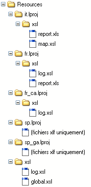

<!--REF #_command_.Localized document path.Syntax-->**Localized document path** ( *cheminRelatif* ) : Text<!-- END REF-->
<!--REF #_command_.Localized document path.Params-->
| Paramètre | Type |  | Description |
| --- | --- | --- | --- |
| cheminRelatif | Text | &#8594;  | Chemin d’accès relatif du document dont on veut obtenir la version localisée |
| Résultat | Text | &#8592; | Chemin d’accès absolu du document localisé |

<!-- END REF-->

#### Description 

<!--REF #_command_.Localized document path.Summary-->La commande **Localized document path** retourne le chemin d’accès complet (absolu) d’un document désigné par *cheminRelatif* et situé dans un dossier xxx.<!-- END REF-->lproj.

Cette commande doit être utilisée dans le cadre d’une architecture d’application multi-langue basée sur la présence d’un dossier **Resources** et de sous-dossiers *xxx.lproj* (xxx représentant une langue). Avec cette architecture, 4D prend automatiquement en charge les fichiers localisés de type .xliff ainsi que les images, mais vous pouvez avoir besoin d’utiliser le même mécanisme pour d’autres types de fichiers. 

Passez dans *cheminRelatif* le chemin d’accès relatif du document recherché. Le chemin saisi doit être relatif au premier niveau d’un dossier "xxx.lproj" de la base. La commande retournera un chemin d’accès complet en utilisant le dossier "xxx.lproj" correspondant à la langue courante de la base. 

**Note :** La langue courante est définie soit automatiquement par 4D en fonction du contenu du dossier **Resources** (cf. commande [Get database localization](get-database-localization.md)), soit via la commande [SET DATABASE LOCALIZATION](set-database-localization.md). 

Vous pouvez exprimer le contenu du paramètre *cheminRelatif* à l’aide d’une syntaxe posix ou système. Par exemple :

* xsl/log.xsl (syntaxe posix : utilisable sous Mac OS ou Windows)
* xsl\\log.xsl (Windows uniquement)
* xsl:log.xsl (Mac OS uniquement)

Le chemin d’accès absolu retourné par la commande est toujours exprimé en syntaxe système. 

**4D Server :** En mode distant, la commande retourne le chemin du dossier **Resources** sur le poste client si la commande est appelée depuis un process client. 

4D recherche le fichier en respectant une séquence permettant de traiter tous les cas d’applications multi-langues. A chaque étape, 4D teste la présence de *cheminRelatif* dans le dossier correspondant à la langue et retourne le chemin complet en cas de succès. Si *cheminRelatif* n’est pas trouvé ou si le dossier n’existe pas, 4D passe à l’étape suivante. Voici les dossiers des étapes de recherche :

*Langue courante (ex : fr-ca)* 
 *Langue courante sans la région (ex : fr)* 
 *Langue chargée par défaut au démarrage (ex : es-ga)* 
 *Langue chargée par défaut au démarrage sans la région (ex : es)* 
 *Premier dossier .lproj trouvé (ex : it.lproj)* 
 *Premier niveau du dossier Resources*

Si *cheminRelatif* n’est trouvé à aucun de ces emplacements, la commande retourne une chaîne vide. 

#### Exemple 

Dans le but de transformer un fichier xml en html, vous souhaitez utiliser un fichier de transformation "log.xsl". Ce fichier diffère suivant la langue courante. Vous souhaitez donc connaître le chemin du fichier "log.xsl" à utiliser.   
Voici le contenu du dossier Resources :



Pour utiliser un fichier .xsl adapté à la langue courante, il vous suffit de passer :

```4d
 $monxsl:=Localized document path("xsl/log.xsl")
```

Si la langue courante est, par exemple, le français canadien (fr-ca), la commande retourne :

* sous Windows : C:\\users\\…\\…\\…\\resources\\fr\_ca.lproj\\xsl\\log.xsl"
* sous Mac OS : "HardDisk:users:…:…:…:resources:fr\_ca.lproj:xsl:log.xsl"

#### Voir aussi 

[Get database localization](get-database-localization.md)  

#### Propriétés

|  |  |
| --- | --- |
| Numéro de commande | 1105 |
| Thread safe | &check; |


