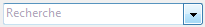

<!--REF #_command_.OBJECT SET PLACEHOLDER.Syntax-->**OBJECT SET PLACEHOLDER** ( {* ;} *objet* ; *texteExemple* )<!-- END REF-->
<!--REF #_command_.OBJECT SET PLACEHOLDER.Params-->
| Paramètre | Type |  | Description |
| --- | --- | --- | --- |
| * | Opérateur | &#8594;  | Si spécifié, objet est un nom d'objet (chaîne)<br/>Si omis, objet est un champ ou une variable |
| objet | any | &#8594;  | Nom d'objet (si * est spécifié) ou <br/>Champ ou variable (si * est omis) |
| texteExemple | Text | &#8594;  | Texte d’exemple associé à l’objet |

<!-- END REF-->

#### Description 

<!--REF #_command_.OBJECT SET PLACEHOLDER.Summary-->La commande **OBJECT SET PLACEHOLDER** vous permet d’associer un texte d’exemple à l’objet ou aux objets désigné(s) par les paramètres *objet* et *\**.<!-- END REF--> 

Pour plus d’informations sur les textes d’exemple, reportez-vous au manuel *Mode Développement*. 

Si un texte d’exemple avait déjà été associé à l’objet via la Liste des propriétés, il est remplacé dans le process courant par le contenu du paramètre *texteExemple*. 

Si vous passez le paramètre optionnel *\**, vous indiquez que le paramètre *objet* est un nom d’objet (une chaîne). Si vous ne passez pas le paramètre, vous indiquez que le paramètre *objet* est un champ ou une variable. Dans ce cas, vous ne passez pas une chaîne mais une référence de champ ou de variable (champ ou variable objet uniquement).

Passez dans *texteExemple* le texte d’aide ou l’indication devant apparaître lorsque l’objet est vide. 

**Note :** L’insertion de références xliff dans les textes d’exemple n’est pas prise en charge par la commande **OBJECT SET PLACEHOLDER**. Cette possibilité n’existe que pour les textes d’exemple définis via la Liste des propriétés. 

Cette commande peut être utilisée uniquement avec les objets de formulaire de type variable, champ et combo box. Un texte d’exemple peut être associé à des valeurs de type texte et alpha. Il peut également être associé à des données de type date ou heure si l’objet de formulaire comporte la propriété "Vide si null".

#### Exemple 

Vous souhaitez afficher le texte exemple "Recherche" dans une combo box :

```4d
 OBJECT SET PLACEHOLDER(*;"comb_rech";"Recherche")
```



#### Voir aussi 

[OBJECT Get placeholder](object-get-placeholder.md)  

#### Propriétés

|  |  |
| --- | --- |
| Numéro de commande | 1295 |
| Thread safe | &cross; |


