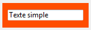
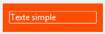

<!--REF #_command_.OBJECT SET RGB COLORS.Syntax-->**OBJECT SET RGB COLORS** ( {* ;} *objet* ; *couleurAvantPlan* {; *couleurArrièrePlan* {; *couleurArrièrePlanAlt*}} )<!-- END REF-->
<!--REF #_command_.OBJECT SET RGB COLORS.Params-->
| Paramètre | Type |  | Description |
| --- | --- | --- | --- |
| * | Opérateur | &#8594;  | Si spécifié, objet est un nom d'objet (chaîne) Si omis, objet est un champ ou une variable |
| objet | any | &#8594;  | Nom d'objet (si * est spécifié) ou Champ ou Variable (si * est omis) |
| couleurAvantPlan | Text, Integer | &#8594;  | Valeur de la couleur RVB d'avant-plan |
| couleurArrièrePlan | Text, Integer | &#8594;  | Valeur de la couleur RVB d'arrière-plan |
| couleurArrièrePlanAlt | Text, Integer | &#8594;  | Valeur de la couleur RVB d'arrière-plan alternée |

<!-- END REF-->

#### Description 

<!--REF #_command_.OBJECT SET RGB COLORS.Summary-->La commande **OBJECT SET RGB COLORS** modifie les couleurs d'avant-plan et d'arrière-plan du ou des objet(s) défini(s) par le paramètre *objet* et le paramètre optionnel *\**.<!-- END REF--> Lorsque la commande est appliquée à un objet de type list box, un paramètre supplémentaire permet de modifier la couleur alternée des lignes.

Si vous passez le paramètre optionnel *\**, vous spécifiez que le paramètre *objet* est le nom d'un objet (une chaîne de caractères). Si le paramètre \* est omis, vous spécifiez que *objet* est un champ ou un objet. Dans ce cas, vous ne passez pas dans *objet* une chaîne de caractères mais la référence à un champ ou à une variable (champ ou variable objet uniquement). Pour plus d'informations sur les noms d'objets, reportez-vous à la section *Objets de formulaires*.

Le paramètre facultatif *couleurArrièrePlanAlt* permet de désigner une couleur alternative pour l’arrière-plan (c’est-à-dire le fond) des lignes paires. Ce paramètre n’est utile que lorsque l’objet désigné est de type list box ou colonne de list box. Lorsque ce paramètre est utilisé, la *couleurArrièrePlan* est utilisée pour le fond des lignes impaires uniquement. Utiliser des couleurs alternées améliore la lisibilité des tableaux.

Si *objet* désigne l’objet list box, les couleurs alternées sont utilisées dans la totalité de la list box. Si *objet* désigne une colonne de list box, seule cette colonne utilisera les couleurs définies.

**Définition des couleurs**

Vous passez des valeurs de couleurs RVB dans les paramètres *couleurAvantPlan* et, éventuellement, *couleurArrièrePlan* et *couleurArrièrePlanAlt*. Les formats suivants sont pris en charge :

| **Nom du format**                      | **Type**    | **Description**                                                                                                                                                                                                                                                                                                                                                                                                                                                                                                   | **Exemples**                                                                                                |
| -------------------------------------- | ----------- | ----------------------------------------------------------------------------------------------------------------------------------------------------------------------------------------------------------------------------------------------------------------------------------------------------------------------------------------------------------------------------------------------------------------------------------------------------------------------------------------------------------------- | ----------------------------------------------------------------------------------------------------------- |
| Nom de la couleur CSS                  | Texte       | Nom de la couleur CSS standard. <br/> La liste des noms est disponible en ligne, comme par exemple sur le site web [htmlcolorcodes.com](https://htmlcolorcodes.com/color-names/). Utilisez "transparent" pour obtenir un fond transparent (peut être utilisé uniquement avec les paramètres *couleurArrièrePlan* et *couleurArrièrePlanAlt*). Utilisez "" (chaîne vide) dans *couleurAvantPlan* et/ou couleurArrièrePlan pour laisser la couleur inchangée.                                               | "red", "cyan", "lightblue"                                                                                  |
| Syntaxe "#rrggbb" de la couleur CSS    | Texte       | Code couleur standard CSS2 en notation hexadécimale : rr = Composante rouge de la couleur gg = Composante verte de la couleur bb = Composante bleue de la couleur                                                                                                                                                                                                                                                                                                                                                 | "#ff0000", "#00FFFF", "#ADD8E6"                                                                             |
| Syntaxe "rgb(r,g,b)" de la couleur CSS | Texte       | Code couleur standard CSS2 en notation rvb :<br/> r = Composante rouge de la couleur (0...255) g = Composante verte de la couleur (0...255) b = Composante bleue de la couleur (0...255)                                                                                                                                                                                                                                                                                                                  | "rgb(255,255,0)", "rgb(255,0,0)"                                                                            |
| Valeur RVB de 4 octets                 | Entier long | Entier long de 4 octets (format 0x00rrggbb). Valeurs hexadécimales :<br/> rr = Composante rouge de la couleur gg = Composante verte de la couleur bb = Composante bleue de la couleur                                                                                                                                                                                                                                                                                                                     | 0x00000000, 0x00FF7F7F                                                                                      |
| Constante couleur "système" 4D         | Entier long | Couleurs utilisées par 4D pour dessiner des objets avec des couleurs automatiques. Constantes disponibles (du thème *FIXER COULEUR RVB*):<br/> Background color Background color none (cette constante peut être utilisée uniquement avec les paramètres *couleurArrièrePlan* et couleurArrièrePlanAlt) Dark shadow color Disable highlight item color Foreground color Highlight menu background color Highlight menu text color Highlight text background color Highlight text color Light shadow color | **Note :* Les couleurs automatiques dépendent du système et du type d'objet auxquels elles sont affectées.* |

#### Exemple 1 

Voici un formulaire contenant deux variables non saisissables, *vsColorValue* et *vsColor* ainsi que trois thermomètres, *thRouge*, *thVert* et *thBleu* :


Les méthodes associées à ces objets sont les suivantes :

```4d
  // Méthode objet de la variable non saisissable vsColorValue
 Case of
    :(FORM Event=On Load)
       vsColorValue:="0x00000000"
 End case
 
  // Méthode objet de la variable non saisissable vsColor
 Case of
    :(FORM Event=On Load)
       vsColor:=""
       OBJECT SET RGB COLORS(vsColor;0x00FFFFFF;0x0000)
 End case
 
  // Méthode objet du thermomètre thRouge
 CLIC SUR THERMOMETRE COULEUR
 
  // Méthode objet du thermomètre thVert
 CLIC SUR THERMOMETRE COULEUR
 
  // Méthode objet du thermomètre thBleu
 CLIC SUR THERMOMETRE COULEUR
```

La méthode projet appelée par les trois thermomètres est la suivante :

```4d
  // Méthode projet CLIC SUR THERMOMETRE COULEUR
 OBJECT SET RGB COLORS(vsColor;0x00FFFFFF;(thRouge << 16)+(thVert << 8)+thBleu)
 vsColorValue:=String((thRouge << 16)+(thVert << 8)+thBleu;" & x")
 If(thRouge=0)
    vsColorValue:=Substring(vsColorValue;1;2)+"0000"+Substring(vsColorValue;3)
 End if
```

Notez l'utilisation des **[SET AUTOMATIC RELATIONS](set-automatic-relations.md)** pour le calcul des valeurs des couleurs à partir de celles des thermomètres.

En exécution, le formulaire a l'aspect suivant :


#### Exemple 2 

Passage du fond en transparent avec couleur de police claire :



```4d
 OBJECT SET RGB COLORS(*;"maVar";Light shadow color;Background color none)
```



#### Voir aussi 

[OBJECT GET RGB COLORS](object-get-rgb-colors.md)  
[Select RGB Color](select-rgb-color.md)  

#### Propriétés

|  |  |
| --- | --- |
| Numéro de commande | 628 |
| Thread safe | &cross; |


