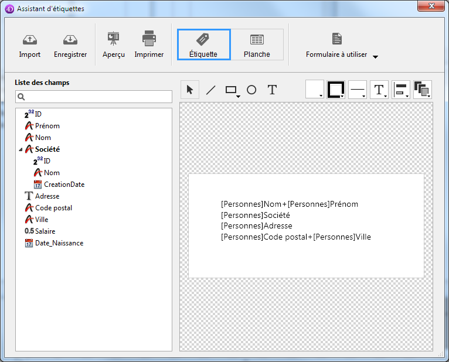

<!--REF #_command_.PRINT LABEL.Syntax-->**PRINT LABEL** ( {*laTable* }{;}{ *nomFichier* {; * | >}} )<!-- END REF-->
<!--REF #_command_.PRINT LABEL.Params-->
| Paramètre | Type |  | Description |
| --- | --- | --- | --- |
| laTable | Table | &#8594;  | Table à imprimer ou Table par défaut si ce paramètre est omis |
| nomFichier | Text | &#8594;  | Nom de fichier d'étiquettes sur disque |
| * &#124; > | &#8594;  | * pour supprimer les boîtes de dialogue d'impression ou > pour ne pas réinitialiser les paramètres d'impression |

<!-- END REF-->

#### Description 

<!--REF #_command_.PRINT LABEL.Summary-->**PRINT LABEL** vous permet d'imprimer des étiquettes à partir des données de la sélection de *laTable*.<!-- END REF-->

Si vous ne spécifiez pas le paramètre *nomFichier*, **PRINT LABEL** imprime la sélection courante de *laTable* sous forme d'étiquettes, en utilisant le formulaire sortie courant du process. Vous ne pouvez pas imprimer de sous-formulaires lorsque vous utilisez cette commande. Pour plus d'informations sur la création d'étiquettes à l'aide de formulaires, reportez-vous au manuel *Mode Développement* de 4D.

Si vous spécifiez le paramètre *nomFichier*, **PRINT LABEL** vous permet d'imprimer un document d'étiquettes existant stocké sur disque ou d'ouvrir l'Assistant de création d'étiquettes (affiché ci-dessous). Pour plus d'informations sur ce point, reportez-vous à l'exemple plus bas.



Par défaut, **PRINT LABEL** affiche la boîte de dialogue d'impression. Si l'utilisateur annule cette boîte de dialogue, l'exécution de la commande est stoppée et l'état n'est pas imprimé. 

Vous pouvez supprimer son affichage en utilisant soit le paramètre optionnel astérisque (\*), soit le paramètre optionnel “supérieur à” (>).

* Le paramètre *\** provoque une impression avec les paramètres d'impression courants.
* Le paramètre *\>* provoque en outre l’impression sans réinitialisation des paramètres d’impression. Ce paramètre est utile lorsque vous souhaitez exécuter successivement plusieurs appels à **PRINT LABEL** (par exemple à l'intérieur d’une boucle) tout en conservant des paramètres d’impression personnalisés préalablement définis.

Il est à noter que ces paramètres n'ont pas d'effet si l'assistant de création d'étiquettes est utilisé.

Si l'assistant de création d'étiquettes n'est pas utilisé, la variable système OK est mise à 1 si toutes les étiquettes ont été imprimées ; sinon, elle prend la valeur 0 (zéro) (par exemple si l'utilisateur a cliqué sur le bouton **Annuler** dans la boîte de dialogue d'impression).

Si vous spécifiez le paramètre *nomFichier*, les étiquettes sont imprimées avec les paramétrages définis dans *nomFichier*. Si *nomFichier* est une chaîne vide (""), **PRINT LABEL** affiche une boîte de dialogue standard d’ouverture de documents, permettant à l'utilisateur de sélectionner le fichier d'étiquettes à utiliser. Si *nomFichier* est le nom d'un fichier qui n'existe pas ou est invalide (si vous passez, par exemple, [Char](char.md)(1) dans *nomFichier*), l'assistant de création d'étiquettes s'affiche, permettant à l'utilisateur de créer son propre format d'étiquettes.

**Note :** Si *laTable* a été déclarée “invisible” en mode Développement, l'assistant de création d'étiquettes n'apparaît pas.

**4D Server :** Cette commande peut être exécutée sur 4D Server dans le cadre d'une procédure stockée. Dans ce contexte :

* Veillez à ce qu’aucune boîte de dialogue n’apparaisse sur le poste serveur (sauf besoin spécifique). Pour cela, il est nécessaire d’appeler la commande avec le paramètre *\** ou *\>*.
* La syntaxe faisant apparaître l‘éditeur d’étiquettes ne fonctionne pas avec 4D Server, dans ce cas, la variable système OK prend la valeur 0.
* En cas de problème sur l’imprimante (plus de papier, imprimante déconnectée, etc.), aucun message d'erreur n'est généré.

#### Exemple 1 

L'exemple suivant imprime des étiquettes à l'aide du formulaire de sortie de la table. L'exemple s'appuie sur deux méthodes. La première est une méthode projet qui désigne le formulaire sortie à utiliser puis imprime les étiquettes : 

```4d
 ALL RECORDS([Adresses]) // Sélection de tous les enregistrements
 FORM SET OUTPUT([Adresses];"ImprimEtiq") // Sélection du formulaire sortie
 PRINT LABEL([Adresses]) // Impression des étiquettes
 FORM SET OUTPUT([Adresses];"Sortie") // Rétablissement du formulaire sortie par défaut
```

La seconde méthode est la méthode du formulaire "ImprimEtiq". Le formulaire contient une variable, nommée *vEtiq*, contenant les champs concaténés. Si le second champ Adresse (Adr2) est vide, il est enlevé par la méthode (notez que cette opération peut être effectuée automatiquement par l'assistant de création d'étiquettes). La méthode formulaire construit l'étiquette pour chaque enregistrement :

```4d
  // Méthode formulaire [Adresses];"Etiquette sortie"
 Case of
    :(FORM Event=On Load)
       vEtiq:=[Adresses]Nom1+" "+[Adresses]Nom2+Char(13)+[Adresses]Adr1
       +Char(13)
       If([Adresses]Adr2 #"")
          vEtiq:=vEtiq+[Adresses]Adr2+Char(13)
       End if
       vEtiq:=vEtiq+[Adresses]Ville+", "+[Adresses]Département+" "+[Adresses]Code Postal
 End case
```

#### Exemple 2 

L'exemple suivant permet à l'utilisateur d'effectuer une recherche sur la table \[Employés\], et d'imprimer automatiquement les étiquettes “Mes Etiquettes” :

```4d
 QUERY([Employés])
 If(OK=1)
    PRINT LABEL([Employés];"Mes Etiquettes";*)
 End if
```

#### Exemple 3 

L'exemple suivant permet à l'utilisateur d'effectuer une recherche sur la table \[Employés\], puis de choisir les étiquettes qui doivent être imprimées :

```4d
 QUERY([Employés])
 If(OK=1)
    PRINT LABEL([Employés];"")
 End if
```

#### Exemple 4 

L'exemple suivant permet à l'utilisateur d'effectuer une recherche sur la table \[Employés\], puis affiche l'assistant de création d'étiquettes afin que l'utilisateur puisse concevoir, sauvegarder, charger et imprimer tout type d'étiquettes :

```4d
 QUERY([Employés])
 If(OK=1)
    PRINT LABEL([Employés];Char(1))
 End if
```

#### Voir aussi 

[PRINT SELECTION](print-selection.md)  
[QR REPORT](qr-report.md)  

#### Propriétés

|  |  |
| --- | --- |
| Numéro de commande | 39 |
| Thread safe | &cross; |
| Modifie les variables | OK |


