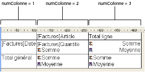
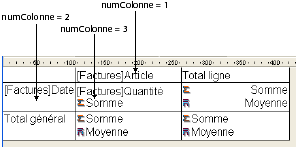
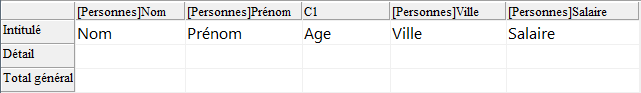

<!--REF #_command_.QR GET INFO COLUMN.Syntax-->**QR GET INFO COLUMN** ( *zone* ; *numColonne* ; *titre* ; *objet* ; *cachée* ; *taille* ; *valeursRépétées* ; *format* {; *varRésultat*} )<!-- END REF-->
<!--REF #_command_.QR GET INFO COLUMN.Params-->
| Paramètre | Type |  | Description |
| --- | --- | --- | --- |
| zone | Integer | &#8594;  | Référence de la zone |
| numColonne | Integer | &#8594;  | Numéro de colonne |
| titre | Text | &#8592; | Titre de la colonne |
| objet | Text | &#8592; | Nom du champ ou contenu de la formule affecté(e) à la colonne |
| cachée | Integer | &#8592; | 0 = visible, 1 = invisible |
| taille | Integer | &#8592; | Largeur de la colonne |
| valeursRépétées | Integer | &#8592; | 0 = non répétées, 1 = répétées |
| format | Text | &#8592; | Format d'affichage des données |
| varRésultat | Text | &#8592; | Nom de la variable de formule |

<!-- END REF-->

#### Description 

<!--REF #_command_.QR GET INFO COLUMN.Summary-->##### Etats en liste 

La commande **QR GET INFO COLUMN** vous permet de récupérer les paramètres d'une colonne existante de l'état présent dans la *zone*.<!-- END REF--> 

Passez dans *zone* la référence de la zone d'état rapide et dans *numColonne* le numéro de la colonne à définir.

Le paramètre *titre* retourne l'intitulé de l'en-tête de la colonne. 

Le paramètre *objet* retourne le nom du champ ou la formule associé(e) à la colonne.

**Note :** La commande ne tient pas compte de la structure virtuelle éventuellement définie via les commandes [SET TABLE TITLES](set-table-titles.md) et [SET FIELD TITLES](set-field-titles.md). Le nom réel des champs est retourné dans le paramètre *objet*. 

Le paramètre *cachée* indique si la colonne est affichée ou masquée :

* si *cachée* vaut 1, la colonne est masquée ;
* si *cachée* vaut 0, la colonne est affichée.

Le paramètre *taille* retourne la taille en pixels de la colonne. Si la valeur retournée est négative, la taille de la colonne est automatique. 

*valeursRépétées* retourne le statut de la propriété de répétition des données. Par exemple, si la valeur d'un champ ou d'une variable ne change pas d'un enregistrement à l'autre, il est possible de la répéter ou non dans chaque ligne de la colonne.

* si *valeursRépétées* vaut 0, les valeurs ne sont pas répétées.
* si *valeursRépétées* vaut 1, les valeurs sont répétées.

Le paramètre *format* retourne le format d'affichage de la colonne. Vous pouvez utiliser tout format d'affichage standard de 4D compatible avec les données affichées dans la colonne. 

Le paramètre optionnel *varRésultat*, lorsqu'il est passé, retourne le nom de la variable automatiquement affectée par l'éditeur d'états rapides à la colonne de formule (le cas échéant) : "C1" pour la première colonne de formule, "C2" pour la seconde, et ainsi de suite. 4D utilise cette variable pour stocker les résultats de la dernière exécution de la formule de colonne lors de la génération de l'état. 

##### Etats tableaux croisés 

Avec ce type d'état, la commande **QR GET INFO COLUMN** permet de récupérer globalement les mêmes paramètres que ceux décrits dans le paragraphe ci-dessus, toutefois les zones auxquelles ils s'appliquent sont différentes et varient en fonction du paramètre à lire.   
En outre, les paramètres *titre*, *cachée* et *valeursRépétées* ne sont pas utilisés lorsque vous travaillez avec des états tableaux croisés, les valeurs retournées dans ces paramètres ne sont donc pas significatives.   
La valeur à passer dans le paramètre *numColonne* dépend de l'opération que vous souhaitez effectuer : lire la taille de la colonne ou lire la source de données et le format d'affichage. 

* Taille de la colonne  
Il s'agit d'un attribut “visuel”, par conséquent les colonnes sont simplement numérotées de gauche à droite, comme illustré ci-dessous :  


La méthode suivante affecte une taille automatique à toutes les colonnes d'un état en tableau croisé et laisse les autres éléments inchangés :

```4d
 For($i;1;3)
    QR GET INFO COLUMN(qr_zone;$i;$titre;$obj;$caché;$taille;$rep;$format)
    QR SET INFO COLUMN(qr_zone;$i;$titre;$obj;$caché;0;$rep;$format)
 End for
```

* Source de données (objet) et format d'affichage  
Dans ce cas, la numérotation des colonnes s'effectue de la manière suivante :  


Si un numéro de *zone* invalide est passé, l’erreur -9850 est générée.  
Si le paramètre *numColonne* est incorrect, l’erreur -9852 est générée.

#### Exemple 

Vous avez construit l'état suivant :



Vous pouvez écrire :

```4d
 var $vTitle;$vObject;$vDisplayFormat;$vResultVar : Text
 var $area;$vHide;$vSize;$vRepeatedValue : Integer
 QR GET INFO COLUMN($area;3;$vTitle;$vObject;$vHide;$vSize;$vRepeatedValue;$vDisplayFormat;$vResultVar)
  //$vTitle = "Age"
  //$vObject = "[Personnes]Date_Naissance-Date du jour" ou
  // "[Personnes]Date_Naissance-Current date" selon vos préférences de langage
  //$vHide = 0
  //$vSize = 57
  //$vRepeatedValue = 1
  //$vDisplayFormat = ""
  //$vResultVar = "C1"
```

#### Voir aussi 

[QR Get info row](qr-get-info-row.md)  
[QR SET INFO COLUMN](qr-set-info-column.md)  
[QR SET INFO ROW](qr-set-info-row.md)  

#### Propriétés

|  |  |
| --- | --- |
| Numéro de commande | 766 |
| Thread safe | &cross; |
| Modifie les variables | error |


