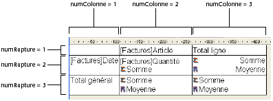

<!--REF #_command_.QR SET TOTALS DATA.Syntax-->**QR SET TOTALS DATA** ( *zone* ; *numColonne* ; *numRupture* ; opérateur | valeur )<!-- END REF-->
<!--REF #_command_.QR SET TOTALS DATA.Params-->
| Paramètre | Type |  | Description |
| --- | --- | --- | --- |
| zone | Integer | &#8594;  | Référence de la zone |
| numColonne | Integer | &#8594;  | Numéro de colonne |
| numRupture | Integer | &#8594;  | Numéro de rupture |
| opérateur &#124; valeur | Entier long, Chaîne | &#8594;  | Opérateur pour la cellule ou Contenu de la cellule |

<!-- END REF-->

#### Description 

<!--REF #_command_.QR SET TOTALS DATA.Summary-->**Note :** Cette commande ne crée pas de sous-total.<!-- END REF-->

##### Etat en liste 

La commande **QR SET TOTALS DATA** permet de définir le contenu d'une ligne de rupture spécifique (sous-total ou total général). 

Passez dans *zone* la référence de la zone d'état rapide.

Passez dans *numColonne* le numéro de colonne de la cellule que vous souhaitez définir.

Passez dans *numRupture* le numéro de la ligne de rupture à modifier (sous-total ou total général). Pour une ligne de sous-total, *numRupture* correspond au numéro d'ordre de la rupture. Pour le total général, *numRupture* vaut -3 (vous pouvez également utiliser la constante *qr total général* du thème *QR Lignes pour Propriétés*). 

Le paramètre *opérateur* contient la valeur cumulée de tous les opérateurs à placer dans la cellule. Utilisez les constantes du thème *QR Opérateurs* pour définir ce paramètre :

| Constante             | Type        | Valeur |
| --------------------- | ----------- | ------ |
| qr average            | Entier long | 2      |
| qr count              | Entier long | 16     |
| qr max                | Entier long | 8      |
| qr min                | Entier long | 4      |
| qr standard deviation | Entier long | 32     |
| qr sum                | Entier long | 1      |
  
  
Si vous ne souhaitez utiliser aucun opérateur, passez 0 dans le paramètre *opérateur*. 

Si vous choisissez d'insérer du texte dans la cellule, passez-le dans le paramètre *valeur*. 

**Note :** Les paramètres *opérateur* et *valeur* sont mutuellement exclusifs, vous pouvez passer soit une combinaison de valeurs numériques, soit du texte. 

Si vous souhaitez saisir à la fois du texte et des opérateurs, vous pouvez utiliser les codes suivants dans le paramètre *valeur* :  
\- # pour la valeur provoquant la rupture ou le sous-total  
\- ##S sera remplacé par la somme.  
\- ##A sera remplacé par la moyenne.  
\- ##C sera remplacé par le nombre  
\- ##X sera remplacé par le maximum.  
\- ##N sera remplacé par le minimum.  
\- ##D sera remplacé par l'écart type.  
\- ##xx, où xx est un numéro de colonne. Ce code sera remplacé par la valeur de la colonne désignée, dans son propre formatage. Si la colonne n'existe pas, le code apparaît dans l'état. 

##### Etat tableau croisé 

La commande **QR SET TOTALS DATA** vous permet de définir le contenu d'une cellule spécifique.

Passez dans *zone* la référence de la zone d'état rapide.

Passez dans *numColonne* le numéro de colonne de la cellule que vous souhaitez définir.

Passez dans *numRupture* le numéro de ligne de la cellule que vous souhaitez définir.

Le paramètre *opérateur* contient la valeur cumulée de tous les opérateurs à placer dans la cellule. Utilisez les constantes du thème *QR Opérateurs* pour définir ce paramètre (cf. paragraphe précédent).   
Le paramètre alternatif *valeur* permet de définir le texte à insérer dans la cellule. 

L'illustration suivante précise la manière dont les paramètres *numColonne* et *numRupture* sont combinés dans un tableau croisé :

##### Types de données acceptés 

Vous pouvez passer deux types de données : des libellés et des opérateurs.

* Libellés  
Un libellé est une chaîne de caractères passée via le paramètre *valeur*. Cette valeur ne peut être utilisée qu'avec les cellules suivantes : *numColonne=3*,*numRupture=1* et *numColonne=1*,*numRupture=3*.
* Opérateurs  
Un opérateur ou un cumul d'opérateurs (cf. paragraphe précédent) peut être passé via le paramètre *opérateur* aux cellules suivantes :  
*numColonne=2,numRupture=2*  
*numColonne=3,numRupture=2*  
*numColonne=2,numRupture=3*  
Notez que ces deux dernières valeurs affectent également la cellule (colonne 3,ligne 3). En effet, si par exemple un calcul est effectué dans la cellule (colonne 2,ligne 3), le contenu de la cellule (colonne 3/ligne 3) sera modifié en conséquence.

Si un numéro de *zone* invalide est passé, l’erreur -9850 est générée.  
Si le paramètre *numColonne* est incorrect, l’erreur -9852 est générée.  
Si le paramètre *numRupture* est incorrect, l’erreur -9853 est générée.

#### Voir aussi 

[QR GET TOTALS DATA](qr-get-totals-data.md)  

#### Propriétés

|  |  |
| --- | --- |
| Numéro de commande | 767 |
| Thread safe | &cross; |
| Modifie les variables | error |

