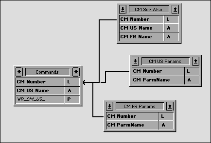

<!--REF #_command_.RECEIVE RECORD.Syntax-->**RECEIVE RECORD** {( *laTable* )}<!-- END REF-->
<!--REF #_command_.RECEIVE RECORD.Params-->
| Paramètre | Type |  | Description |
| --- | --- | --- | --- |
| laTable | Table | &#8594;  | Table dans laquelle recevoir l'enregistrement, ou Table par défaut si omis |

<!-- END REF-->

#### Description 

<!--REF #_command_.RECEIVE RECORD.Summary-->**RECEIVE RECORD** ajoute dans *laTable* un enregistrement reçu par l'intermédiaire du port série ou d'un document ouvert par la commande [SET CHANNEL](set-channel.md).<!-- END REF--> L'enregistrement doit avoir été envoyé par la commande [SEND RECORD](send-record.md). Lorsque vous exécutez **RECEIVE RECORD**, un nouvel enregistrement est automatiquement créé dans *laTable*. Si l'enregistrement a été correctement reçu, vous pouvez le sauvegarder à l'aide de [SAVE RECORD](save-record.md).

L'enregistrement est reçu en totalité, ce qui signifie que les images et BLOBs stockés dans ou avec l'enregistrement sont également reçus.

**Important :** Lorsque des enregistrements sont envoyés et reçus par [SEND RECORD](send-record.md) et **RECEIVE RECORD**, la structure de la table source et celle de la table de destination doivent être compatibles. Si ce n'est pas le cas, 4D convertira les valeurs en fonction des définitions des tables lorsque **RECEIVE RECORD** sera exécutée.

**Notes :**

1. Si vous recevez un enregistrement provenant d'un document avec cette commande, le document doit avoir été ouvert par la commande [SET CHANNEL](set-channel.md). Vous ne pouvez pas utiliser **RECEIVE RECORD** avec un document ouvert par [Open document](open-document.md), [Create document](create-document.md) ou [Append document](append-document.md).
2. Pendant l'exécution d'un **RECEIVE RECORD**, l'utilisateur peut interrompre l'opération en appuyant sur les touches **Ctrl**+**Alt**+**Maj** (sous Windows) ou **Commande**+**Option**+**Maj** (sous Mac OS). Cette interruption génère une erreur -9994 que vous pouvez intercepter à l'aide d'une méthode installée par la commande [ON ERR CALL](on-err-call.md). Généralement, vous devez gérer les interruptions d'une réception uniquement lors d'une communication série.

#### Exemple 

L'utilisation combinée de [SEND VARIABLE](send-variable.md), [SEND RECORD](send-record.md), [RECEIVE VARIABLE](receive-variable.md) et **RECEIVE RECORD** est idéale pour archiver des données ou échanger des données entre des bases monopostes identiques utilisées à différents endroits. Certes, vous pouvez échanger des données entre des bases 4D à l'aide des commandes d'import/export telles que [EXPORT TEXT](export-text.md) et [IMPORT TEXT](import-text.md). Cependant, si vos données contiennent des images et/ou des tables liées, l'utilisation de [SEND RECORD](send-record.md) et **RECEIVE RECORD** est, de loin, plus pratique. 

Par exemple, imaginons une documentation créée à l'aide de 4D et 4D Write. Comme plusieurs rédacteurs basés dans différents pays travaillent sur ce projet, nous avons besoin d'un système simple pour échanger les données entre les différentes bases. Voici une vue simplifiée de la structure de la base : 



La table *\[Commands\]* contient la description de chaque commande ou section. Les tables *\[CM US Params\]* et *\[CM FR Params\]* contiennent respectivement les paramètres de chaque commande en anglais et en français. La table *\[CM See Also\]* contient les commandes indiquées en tant que Références pour chaque commande ou section. L'échange de la documentation entre les bases consiste donc à envoyer les enregistrements de *\[Commands\]* ainsi que leurs enregistrements liés. Pour cela, nous utilisons [SEND RECORD](send-record.md) et **RECEIVE RECORD**. De plus, nous utilisons [SEND VARIABLE](send-variable.md) et [SEND RECORD](send-record.md) pour "cocher" les enregistrements importés/exportés.

Voici la méthode projet (simplifiée) d'export de la documentation :

```4d
  // Méthode projet CM_EXPORT_SEL
  // Cette méthode fonctionne avec la sélection courante de la table [Commands]
 
 SET CHANNEL(12;"") // Laissons l'utilisateur créer et ouvrir un document série
 If(OK=1)
  // Marquons le document avec une variable décrivant son contenu
  // Note: la variable process BUILD_LANG indique si des données US (anglaises)
  // ou FR (françaises) sont envoyées
    $vsTag:="4DV6COMMAND"+BUILD_LANG
    SEND VARIABLE($vsTag)
  // Envoyer une variable indiquant combien de [Commands] sont exportées
    $vlNbCmd:=Records in selection([Commands])
    SEND VARIABLE($vlNbCmd)
    FIRST RECORD([Commands])
  // For each commande
    For($vlCmd;1;$vlNbCmd)
  // Envoyer l'enregistrement [Commands]
       SEND RECORD([Commands])
  // Sélection de tous les enregistrements liés
       RELATE MANY([Commands])
  // En fonction de la langue, envoyer une variable indiquant
  // le nombre de paramètres qui va suivre
       Case of
          :(BUILD_LANG="US")
             $vlNbParm:=Records in selection([CM US Params])
          :(BUILD_LANG="FR")
             $vlNbParm:=Records in selection([CM FR Params])
       End case
       SEND VARIABLE($vlNbParm)
  // Envoyer les enregistrements des paramètres (s'il y en a)
       For($vlParm;1;$vlNbParm)
          Case of
             :(BUILD_LANG="US")
                SEND RECORD([CM US Params])
                NEXT RECORD([CM US Params])
             :(BUILD_LANG="FR")
                SEND RECORD([CM FR Params])
                NEXT RECORD([CM FR Params])
          End case
       End for
  // Envoyer une variable indiquant combien de “Références” vont suivre
       $vlNbSee:=Records in selection([CM See Also])
       SEND VARIABLE($vlNbSee)
  // Envoyer les enregistrements [See Also] (s'il y en a)
       For($vlSee;1;$vlNbSee)
          SEND RECORD([CM See Also])
          NEXT RECORD([CM See Also])
       End for
  // Aller à l'enregistrement [Commands] suivant et continuer l'export
       NEXT RECORD([Commands])
    End for
    SET CHANNEL(11) // Fermer le document
 End if
```

Voici la méthode projet (simplifiée) d'import de la documentation :

```4d
  // Méthode projet CM_IMPORT_SEL
 
 SET CHANNEL(10;"") // Laissons l'utilisateur ouvrir un document existant
 If(OK=1) // Si un document a été ouvert
    RECEIVE VARIABLE($vsTag) // Essayons de recevoir la variable marqueur attendue
    If($vsTag="4DV6COMMAND@") // Avons-nous le bon marqueur ?
       $CurLang:=Substring($vsTag;Length($vsTag)-1) // Extrayons la langue du marqueur
       If(($CurLang="US") | ($CurLang="FR")) // Avons-nous reçu un langage valide ?
          RECEIVE VARIABLE($vlNbCmd) // Combien de commandes dans ce document?
          If($vlNbCmd>0) // S'il en existe une au moins
             For($vlCmd;1;$vlNbCmd) // For each enregistrement [Commands] archivé
  // Réception de l'enregistrement
                RECEIVE RECORD([Commands])
  // Appelons une sous-routine qui sauvegarde le nouvel enregistrement ou le copie
  // dans un enregistrement existant
                CM_IMP_CMD($CurLang)
  // Réception du nombre de paramètres (s'il y en a)
                RECEIVE VARIABLE($vlNbParm)
                If($vlNbParm>=0)
  // Appelons une sous-routine qui appelle RECEVOIR ENREGISTREMENT puis stocke
  // les nouveaux enregistrements ou les copie dans des enregistrements existants
                   CM_IMP_PARM($vlNbParm;$CurLang)
                End if
  // Réception du nombre de “Références” (s'il y en a)
                RECEIVE VARIABLE($vlNbSee)
                If($vlNbSee>0)
  // Appelons une sous-routine qui appelle RECEVOIR ENREGISTREMENT puis stocke
  // les nouveaux enregistrements ou les copie dans des enregistrements existants
                   CM_IMP_SEEA($vlNbSee;$CurLang)
                End if
             End for
          Else
             ALERT("Le nombre de commandes dans ce document d'export est invalide.")
          End if
       Else
          ALERT("Le langage de ce document d'export est inconnu.")
       End if
    Else
       ALERT("Ce document n'est pas un document d'export.")
    End if
    SET CHANNEL(11) // Fermer document
 End if
```

Notez que nous n'avons pas testé la variable OK pendant la réception des données, ni intercepté les éventuelles erreurs. Cependant, comme nous avons stocké dans le document des variables décrivant le document lui-même, si ces variables, une fois reçues, sont correctes, la probabilité d'erreur est très faible. Si par exemple un utilisateur ouvre un mauvais document, le premier test stoppe l'opération entière.

#### Variables et ensembles système 

La variable système OK prend la valeur 1 si l'enregistrement est correctement reçu, sinon elle prend la valeur 0.

#### Voir aussi 

[RECEIVE VARIABLE](receive-variable.md)  
[SEND RECORD](send-record.md)  
[SEND VARIABLE](send-variable.md)  

#### Propriétés

|  |  |
| --- | --- |
| Numéro de commande | 79 |
| Thread safe | &check; |
| Modifie les variables | OK, error |


