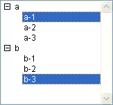

<!--REF #_command_.Selected list items.Syntax-->**Selected list items** ( {* ;} *liste* {; *tabEléments* {; *}} )  : Integer<!-- END REF-->
<!--REF #_command_.Selected list items.Params-->
| Paramètre | Type |  | Description |
| --- | --- | --- | --- |
| * | Opérateur | &#8594;  | Si spécifié, liste est un nom d'objet (chaîne) Si omis, liste est une référence de liste |
| liste | Integer, Text | &#8594;  | Numéro de référence de liste (si * omis) ou Nom d'objet de type liste (si * passé) |
| tabEléments | Integer array | &#8592; | Si 2e * omis : Tableau des positions des éléments sélectionnés dans la ou les liste(s) Si 2e * passé : Tableau des références des éléments sélectionnés dans la ou les liste(s) |
| * | Opérateur | &#8594;  | Si omis : Position(s) d’élément(s) Si passé : Référence(s) d’élément(s) |
| Résultat | Integer | &#8592; | Si 2e * omis : Position de l'élément sélectionné parmi la ou les liste(s) déployée(s)/contractée(s) Si 2e * passé : Référence de l'élément sélectionné |

<!-- END REF-->

#### Description 

<!--REF #_command_.Selected list items.Summary-->La fonction **Selected list items** retourne la **position** ou la **référence** de l'élément sélectionné dans la liste dont vous avez passé le numéro de référence ou le nom d'objet dans *liste*.<!-- END REF--> 

Si vous passez le premier paramètre optionnel *\**, vous indiquez que le paramètre *liste* est un nom d’objet (chaîne) correspondant à une représentation de liste dans le formulaire. Si vous ne passez pas ce paramètre, vous indiquez que le paramètre *liste* est une référence de liste hiérarchique ([RéfListe](# "Expression de type Entier long identifiant de façon unique une liste hiérarchique")). Si vous utilisez une seule représentation de liste ou travaillez avec les références d'éléments (le second *\** est passé), vous pouvez utiliser indifféremment l’une ou l’autre syntaxe. En revanche, si vous utilisez plusieurs représentations d’une même liste et travaillez avec les positions des éléments (le second *\** est omis), la syntaxe basée sur le nom d’objet est requise car chaque représentation peut disposer de sa propre configuration d'éléments déployés/contractés. 

**Note :** Si vous utilisez le caractère @ dans le nom d'objet de la liste et que le formulaire contient plusieurs listes répondant à ce nom, la commande **Selected list items** s'appliquera au premier objet dont le nom correspond. 

En cas de sélection multiple, la fonction peut également retourner dans le tableau *tabEléments* la position ou la référence de chaque élément sélectionné. Cette fonction doit être appliquée à une liste affichée dans un formulaire afin de détecter le ou les élément(s) sélectionné(s) par l'utilisateur. 

Le second paramètre \* permet d’indiquer si vous souhaitez travailler avec des positions courantes d’éléments (dans ce cas, ce paramètre doit être omis) ou des références absolues d’éléments (dans ce cas, il doit être passé). 

Vous pouvez passer dans le paramètre *tabEléments* un tableau d’entiers longs. Si nécessaire, le tableau sera créé et redimensionné par la commande. A l’issue de l’exécution de la commande, *tabEléments* contiendra :

* la position de chaque élément sélectionné relativement à l'état déployé/contracté de la ou des liste(s) si le paramètre \* est omis.
* la référence absolue de chaque élément sélectionné si le paramètre \* est passé.  
Le tableau est retourné vide si aucun élément n’est sélectionné.

**Note :** En cas de sélection multiple, la commande retourne la position ou la référence du premier élément ayant été sélectionné dans *liste*, soit par un clic utilisateur (sélection manuelle) soit par la commande [SELECT LIST ITEMS BY POSITION](select-list-items-by-position.md) ou [SELECT LIST ITEMS BY REFERENCE](select-list-items-by-reference.md) (sélection par programmation). 

Si la liste comporte des sous-listes, appliquez la fonction à la liste principale (celle qui est associée au formulaire), et non à une de ses sous-listes. Les positions sont exprimées relativement à l'élément supérieur de la liste principale, en tenant compte de l'état courant déployé/contracté de la liste et de ses sous-listes.

Dans tous les cas, si aucun élément n'est sélectionné, la fonction retourne 0.

#### Exemple 

Voici la liste *hList* telle qu'elle apparaît en mode Application :


```4d
 $vlItemPos:=Selected list items(hList) // à ce stade, $vlItemPos vaut 2
```


```4d
 $vlItemPos:=Selected list items(hList) // à ce stade, $vlItemPos vaut 5
 $vlItemRef:=Selected list items(hList;*) // $vlItemRef vaut 200 (par exemple)
```


```4d
 $vlItemPos:=Selected list items(hList) // à ce stade, $vlItemPos vaut 8
 $vlItemRef:=Selected list items(hList;*) // $vlItemRef vaut 203 (par exemple)
```


```4d
 $vlItemPos:=Selected list items(hList;$tabPos) // à ce stade, $vlItemPos vaut 3
  // $tabPos{1} vaut 3, $tabPos{2} vaut 4 et $tabPos{3} vaut 5
```



```4d
 $vlItemRef:=Selected list items(hList;$tabRefs;*) // $vlItemRef vaut 101 (par exemple)
  // $tabRefs{1} vaut 101, $tabRefs{2} vaut 203 (par exemple)
```

#### Voir aussi 

[SELECT LIST ITEMS BY POSITION](select-list-items-by-position.md)  
[SELECT LIST ITEMS BY REFERENCE](select-list-items-by-reference.md)  

#### Propriétés

|  |  |
| --- | --- |
| Numéro de commande | 379 |
| Thread safe | &cross; |


