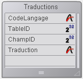

<!--REF #_command_.SET TABLE TITLES.Syntax-->**SET TABLE TITLES** {( *titresTables* ; *numTables* {; *})}<!-- END REF-->
<!--REF #_command_.SET TABLE TITLES.Params-->
| Paramètre | Type |  | Description |
| --- | --- | --- | --- |
| titresTables | Text array | &#8594;  | Noms des tables tels qu'ils doivent apparaître |
| numTables | Integer array | &#8594;  | Numéros des tables |
| * | Opérateur | &#8594;  | Utiliser les noms personnalisés dans l’éditeur de formules |

<!-- END REF-->

#### Description 

<!--REF #_command_.SET TABLE TITLES.Summary-->**SET TABLE TITLES** vous permet de masquer, renommer et réordonner les tables de votre base qui apparaissent dans les éditeurs standard de 4D en mode Application (lorsque le mode de lancement est le mode **Application**, ou après avoir sélectionné "**Tester l'application**" dans le menu **Exécution**) .<!-- END REF-->

Cette commande vous permet également de modifier à la volée les libellés des tables apparaissant dans vos formulaires, si vous avez utilisé des libellés dynamiques. Pour plus d'informations sur l'insertion de libellés de tables et de champs dynamiques dans les formulaires, reportez-vous à la section *Utiliser des références dans les textes statiques* dans le manuel *Mode Développement*.

Les tableaux *titresTables* et *numTables* doivent être synchronisés. Dans le tableau *titresTables*, vous passez les noms des tables tels que vous voulez qu'ils apparaissent. Les tables s'afficheront dans l'ordre défini par ces tableaux. Dans chaque élément du tableau *numTables*, passez le numéro de la table qui correspond au nom, nouveau ou ancien, de la table, et ce dans le même numéro d'élément que dans le tableau *titresTables*.   
Si vous voulez masquer une table, ne la mettez pas dans les tableaux. Vous avez, par exemple, une base comprenant les tables A, B et C, créées dans cet ordre. Vous voulez que ces tables apparaissent sous les noms X, Y et Z. De plus, vous ne voulez pas faire apparaître la table B. Enfin, vous voulez que les tables soient dans l'ordre Z et X. Pour cela, vous passez dans le paramètre *titresTables* un tableau à deux éléments, Z et X, et vous passez dans le paramètre *numTables* un tableau à deux éléments, 3 et 1.

Le paramètre facultatif *\** vous permet d'indiquer si les noms personnalisés définis à l’aide de cette commande ("structure virtuelle") peuvent être ou non utilisés dans les formules de 4D. Par défaut, lorsque ce paramètre est omis, les formules exécutées dans 4D ne peuvent pas utiliser ces noms personnalisés ; il est nécessaire d'utiliser les noms de tables véritables. Vous devez passer ce paramètre si vous souhaitez gérer l'information fournie aux utilisateurs et assurer la cohérence de l'interface lors de l'utilisation de ces formules ou expressions, *i.e* :

* Si votre application fournit un accès à l'éditeur de formules (par exemple via l'éditeur d'états rapides)
* Si votre application affiche des références d'expressions, comme dans les documents 4D Write Pro.

**Note :** Lorsque le paramètre \* est passé, les noms définis par cette commande peuvent être utilisés dans les formules exécutées par 4D. **Attention dans ce cas**, les noms personnalisés ne doivent pas contenir de caractères “interdits” par l’interpréteur du langage de 4D, tels que -?\*! Par exemple, le nom "Rate\_in\_%" ne pourrait pas être utilisé dans une formule (pour plus d'informations, reportez-vous à la section “*Nommer les objets du langage 4D*”). 

**SET TABLE TITLES** ne modifie pas la structure de votre base. Cette commande est conçue pour affecter l'utilisation ultérieure des éditeurs de 4D et des formulaires comportant des libellés dynamiques lorsqu'ils sont utilisés dans l'environnement d'Application. L'aire de validité de la commande **SET TABLE TITLES** est la session. L'avantage, en Client/Serveur, est que plusieurs postes 4D Client peuvent “voir” simultanément votre structure d'une manière différente. Vous pouvez appeler **SET TABLE TITLES** autant de fois que vous voulez.

La commande **SET TABLE TITLES** est utile dans les cas suivants :

* Traduction dynamique de votre base.
* Affichage des tables dans l'ordre et avec les noms que vous voulez, indépendamment de leur définition.
* Affichage des tables d'une façon qui dépend de l'identité ou des privilèges d'un utilisateur.

**Notes :**

* **SET TABLE TITLES** n'annule pas l'effet de la propriété Invisible d'une table. Si vous avez défini une table en tant qu'invisible au niveau de la structure, elle n'apparaîtra pas en mode Application, même si elle est spécifiée dans **SET TABLE TITLES**.
* Les plug-ins accèdent toujours à la structure "virtuelle" telle que définie par cette commande.
* Exécuter la commande **SET TABLE TITLES** sans paramètres réinitialise l'environnement de langage et supprime la totalité de la structure virtuelle pour la session (incluant les noms personnalisés de tables et de champs).

#### Exemple 1 

* Vous développez une application 4D destinée au marché international. Vous avez donc besoin de prendre en compte les nécessités de traduction et de localisation. Pour les éditeurs standard de 4D qui apparaissent en mode Application et vos formulaires utilisant des libellés dynamiques, vous pouvez traiter cette question en utilisant une table *\[Traductions\]* et quelques méthodes pour créer et utiliser les traductions pour chaque langue que vous voulez.
* Dans votre base, vous créez la table suivante :



* Ensuite, créez la méthode projet *traduire\_TABLES\_ET\_CHAMPS* ci-dessous. Cette méthode analyse la structure de votre base dans la table *\[Traductions\]* et crée les enregistrements correspondant à la langue passée comme paramètre.

```4d
    // méthode projet traduire_TABLES_ET_CHAMPS
    // traduire_TABLES_ET_CHAMPS ( Texte)
    // traduire_TABLES_ET_CHAMPS ( CodeLangue )
 
 var $1 : Text //code de la langue
 var $vlTable;$vlChamp : Integer
 var $Langue : Text
 $Langue:=$1
 
 For($vlTable;1;Last table number) // Passer sur chaque table
    If($vlTable#(Table(->[Traductions]))) //Ne pas traduire la table des traductions
  // Vérifier s'il existe une traduction du nom de la table pour la langue spécifiée
       QUERY([Traductions];[Traductions]CodeLangage=$Langue;*)   //langue souhaitée
       QUERY([Traductions]; & ;[Traductions]TableID=$vlTable;*)   //numero de table
       QUERY([Traductions]; & ;[Traductions]ChampID=0)   //numero de champ = 0 signifie que c'est un nom de table
       If(Is table number valid($vlTable))   //vérifier que la table existe encore
          If(Records in selection([Traductions])=0)
  // Else, créer l'enregistrement
             CREATE RECORD([Traductions])
             [Traductions]CodeLangage:=$Langue
             [Traductions]TableID:=$vlTable
             [Traductions]ChampID:=0
  // Le nom de la table traduit aura besoin d'être saisi
             [Traductions]Traduction:=Table name($vlTable)+" en "+$Langue
             SAVE RECORD([Traductions])
          End if
 
          For($vlChamp;1;Last field number($vlTable))
  // Vérifier s'il existe une traduction pour le nom du champ dans la langue spécifiée
             QUERY([Traductions];[Traductions]CodeLangage=$Langue;*)   //langue souhaitée
             QUERY([Traductions]; & ;[Traductions]TableID=$vlTable;*)   //numéro de table
             QUERY([Traductions]; & ;[Traductions]ChampID=$vlChamp)   //numéro de champ
             If(Is field number valid($vlTable;$vlChamp))
                If(Records in selection([Traductions])=0)
  // Else, créer l'enregistrement
                   CREATE RECORD([Traductions])
                   [Traductions]CodeLangage:=$Langue
                   [Traductions]TableID:=$vlTable
                   [Traductions]ChampID:=$vlChamp
  // Le nom du champ traduit aura besoin d'être saisi
                   [Traductions]Traduction:=Field name($vlTable;$vlChamp)+" en "+$Langue
                   SAVE RECORD([Traductions])
                End if
             Else
                If(Records in selection([Traductions])#0)
  // si le champ n'existe plus, on supprime la traduction
                   DELETE RECORD([Traductions])
                End if
             End if
          End for
       Else
          If(Records in selection([Traductions])#0)
  // si la table n'existe plus, on supprime la traduction
             DELETE RECORD([Traductions])
          End if
       End if
    End if
 End for
```

* Si maintenant vous exécutez la ligne suivante, vous pouvez créer autant d'enregistrements qu'il vous faut pour la traduction espagnole de vos tables et champs :

```4d
 traduire_TABLES_ET_CHAMPS("Espagnol")
```

* Une fois que cette ligne de code est appelée, vous pouvez saisir une traduction dans le champ *\[Traductions\]NomTraduit* pour chacun des nouveaux enregistrements.
* Enfin, chaque fois que vous voulez afficher en espagnol les éditeurs standard de 4D ou les formulaires avec libellés dynamiques, vous exécutez la ligne suivante :

```4d
 TABLES_ET_CHAMPS_LOCALISES("Espagnol")
```

La méthode projet TABLES\_ET\_CHAMPS\_LOCALISES est la suivante :

```4d
  // Méthode objet TABLES_ET_CHAMPS_LOCALISES
  // TABLES_ET_CHAMPS_LOCALISES ( Texte)
  // TABLES_ET_CHAMPS_LOCALISES ( CodeLangue )
 
 var $1 : Text //Code de la langue
 var $vlTable;$vlChamp : Integer
 var $Langue : Text
 var $vlNumTable;$vlNumChamp : Integer
 $Langue:=$1
 
  //Mise à jour des noms de table
 ARRAY TEXT($asNoms;0)   // Initialiser les tableaux pour FIXER TITRES TABLES et FIXER TITRES CHAMPS
 ARRAY INTEGER($aiNuméros;0)
 QUERY([Traductions];[Traductions]CodeLangage=$Langue;*)
 QUERY([Traductions]; & ;[Traductions]ChampID=0)   //noms de table donc
 SELECTION TO ARRAY([Traductions]Traduction;$asNoms;[Traductions]TableID;$aiNuméros)
 SET TABLE TITLES($asNoms;$aiNuméros)
 
  //Mise à jour des noms de champs
 $vlNumTable:=Last table number // Obtenir le nombre de tables dans la base
 For($vlTable;1;$vlNumTable)   // Passer sur chaque table
    If(Is table number valid($vlTable))
       QUERY([Traductions];[Traductions]CodeLangage=$Langue;*)
       QUERY([Traductions]; & ;[Traductions]TableID=$vlTable;*)
       QUERY([Traductions]; & ;[Traductions]ChampID#0)   //évite le zero qui sert au nom de la table
       SELECTION TO ARRAY([Traductions]Traduction;$asNoms;[Traductions]ChampID;$aiNuméros)
       SET FIELD TITLES(Table($vlTable)->;$asNoms;$aiNuméros)
    End if
 End for
```

* Notez que de nouvelles traductions peuvent être effectuées dans la base sans modification de code ni recompilation.

#### Exemple 2 

Vous voulez supprimer tous les noms de tables et de champs personnalisés définis pour la session :

```4d
 SET TABLE TITLES //supprimer les noms personnalisés
```

#### Voir aussi 

[Last table number](last-table-number.md)  
[GET TABLE TITLES](get-table-titles.md)  
[Parse formula](parse-formula.md)  
[SET FIELD TITLES](set-field-titles.md)  
[Table name](table-name.md)  

#### Propriétés

|  |  |
| --- | --- |
| Numéro de commande | 601 |
| Thread safe | &cross; |


