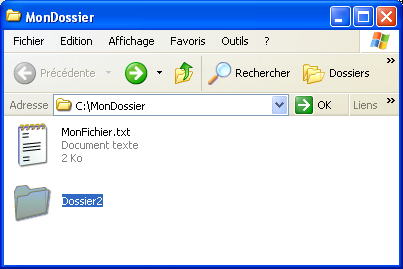
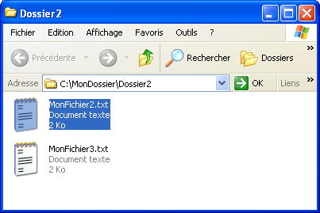

<!--REF #_command_.SHOW ON DISK.Syntax-->**SHOW ON DISK** ( *cheminAccès* {; *} )<!-- END REF-->
<!--REF #_command_.SHOW ON DISK.Params-->
| Paramètre | Type |  | Description |
| --- | --- | --- | --- |
| cheminAccès | Text | &#8594;  | Chemin d’accès de l’élément à montrer |
| * | Opérateur | &#8594;  | Si l’élément est un dossier, montrer son contenu |

<!-- END REF-->

#### Description 

<!--REF #_command_.SHOW ON DISK.Summary-->La commande **SHOW ON DISK** affiche dans une fenêtre standard du système d’exploitation le fichier ou le dossier dont le chemin d’accès est passé dans le paramètre *cheminAccès*.<!-- END REF-->   
Dans le cadre d’une interface utilisateur, cette commande permet à l'utilisateur de visualiser l’emplacement d’un fichier ou d’un dossier spécifique.

Par défaut, si *cheminAccès* désigne un dossier, la commande affiche le niveau du dossier lui-même. Si vous passez le paramètre facultatif *\**, la commande ouvre le dossier et affiche son contenu dans la fenêtre. Si *cheminAccès* désigne un fichier, le paramètre *\** est ignoré. 

#### Exemple 

Ces exemples illustrent le fonctionnement de la commande.

```4d
 SHOW ON DISK("c:\\MonDossier\\MonFichier.txt") //Affiche le fichier désigné
```


```4d
 SHOW ON DISK("c:\\MonDossier\\Dossier2") //Affiche le dossier désigné
```



```4d
 SHOW ON DISK("c:\\MonDossier\\Dossier2";*) //Affiche le contenu du dossier désigné
```



#### Variables et ensembles système 

La variable système OK prend la valeur 1 si la commande est correctement exécutée, sinon elle prend la valeur 0.


#### Propriétés

|  |  |
| --- | --- |
| Numéro de commande | 922 |
| Thread safe | &check; |
| Modifie les variables | OK, error |


