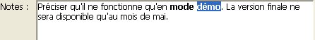
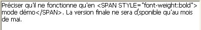
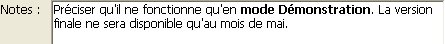
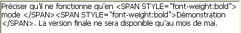

<!--REF #_command_.ST SET TEXT.Syntax-->**ST SET TEXT** ( {* ;} *objet* ; *nouvTexte* {; *débutSél* {; *finSél*}} )<!-- END REF-->
<!--REF #_command_.ST SET TEXT.Params-->
| Paramètre | Type |  | Description |
| --- | --- | --- | --- |
| * | Opérateur | &#8594;  | Si spécifié, objet est un nom d'objet (chaîne) <br/>Si omis, objet est une variable ou un champ |
| objet | any | &#8594;  | Nom d'objet (si * est spécifié) ou <br/>Variable ou champ Texte (si * est omis) |
| nouvText | Text | &#8594;  | Texte multistyle à insérer |
| débutSél | Integer | &#8594;  | Début de la sélection |
| finSél | Integer | &#8594;  | Fin de la sélection |

<!-- END REF-->

#### Description 

<!--REF #_command_.ST SET TEXT.Summary-->La commande **ST SET TEXT** insère le texte passé dans le paramètre *nouvTexte* dans le champ ou la variable de texte multistyle désigné(e) par le paramètre *objet*.<!-- END REF--> Cette commande s’applique uniquement au texte brut du paramètre *objet*, sans modifier les éventuelles balises de style qu’il contient. Elle permet de modifier par programmation du texte multistyle affiché à l’écran. 

##### 

Si vous passez le paramètre optionnel *\**, vous indiquez que le paramètre *objet* est un nom d’objet (une chaîne). A l'exécution, si l'objet a le focus, la commande s'applique uniquement à l'objet en cours d'édition et non à sa source de données (variable ou champ). Les modifications ne sont reportées dans la source (et donc dans les éventuels autres objets utilisant la même source) que lorsque l'objet en cours d'édition est validé via une perte de focus ou la touche **Entrée**. Si l'objet n'a pas le focus, la commande s'applique directement à la source de données et les modifications sont immédiatement répercutées aux éventuels autres objets utilisant la même source.   
Si vous omettez le paramètre *\**, vous indiquez que le paramètre *objet* est un champ ou une variable. Dans ce cas, vous ne passez pas une chaîne mais une référence de champ ou de variable. La commande s'applique directement au champ ou à la variable et les modifications sont répercutées à tous les objets utilisant cette source, y compris l'objet ayant le focus. 

##### 

Passez dans *nouvTexte* le texte à insérer. La commande **ST SET TEXT** est destinée aux manipulations de texte stylé (multistyle), contenant des balises de type <span>. Dans tous les autres cas (notamment en cas de manipulation de texte non stylé mais contenant les caractères <, > ou &), vous devez utiliser la commande [ST SET PLAIN TEXT](st-set-plain-text.md). Si vous passez à la commande **ST SET TEXT** un texte brut contenant des caractères <, > ou &, la commande ne fait rien. Ce principe de fonctionnement est nécessaire car l'insertion directe d'une chaîne telle que "a<b" au sein d'un texte stylé va fausser l'analyse interne des balises <span>. Dans ce cas, le caractère "<" doit être préalablement encodé "&lt;", ce qui est effectué par la commande [ST SET PLAIN TEXT](st-set-plain-text.md) (voir également l'exemple de cette commande). 

Les paramètres optionnels *débutSel* et *finSel* vous permettent de désigner une sélection de texte dans *objet*. Les valeurs *débutSél* et *finSél* expriment une sélection de texte brut, sans tenir compte des balises de style éventuellement présentes dans le texte. L’action de la commande diffère en fonction des paramètres facultatifs *débutSél* et *finSél* :

* si vous omettez *débutSél* et *finSél*, **ST SET TEXT** remplace la totalité du texte de *objet* par *nouvTexte*,
* si vous passez uniquement *débutSél* ou si les valeurs de *débutSél* et *finSél* sont égales, **ST SET TEXT** insère le texte *nouvTexte* dans *objet* à partir de *débutSél*.
* si vous passez *débutSél* et *finSél*, **ST SET TEXT** remplace le texte brut défini par ces bornes avec le texte *nouvTexte*.
* vous pouvez passer 0 dans *finSél* afin de désigner automatiquement le dernier caractère du texte (passez 1 dans *débutSél* pour désigner le premier caractère).

4D propose des constantes prédéfinies afin de désigner automatiquement des bornes de sélection dans les paramètres *débutSél* et *finSél*. Ces constantes sont placées dans le thème "*Texte multistyle*" : 

| Constante          | Type        | Valeur | Comment                                                                          |
| ------------------ | ----------- | ------ | -------------------------------------------------------------------------------- |
| ST End highlight   | Entier long | \-1001 | Désigne le dernier caractère de la sélection courante de texte dans l’objet (\*) |
| ST End text        | Entier long | 0      | Désigne le dernier caractère du texte contenu dans l’objet                       |
| ST Start highlight | Entier long | \-1000 | Désigne le premier caractère de la sélection courante de texte dans l’objet (\*) |
| ST Start text      | Entier long | 1      | Désigne le premier caractère du texte contenu dans l’objet                       |

(\*) Vous devez passer un nom d’objet dans *objet* pour pouvoir utiliser cette constante. Si vous passez une référence de variable ou de champ, la commande s’appliquera à l’ensemble du texte de l’objet.

**Note :** Si *débutSél* est supérieur à *finSél*, le texte n'est pas modifié et la variable OK prend la valeur 0 (hormis lorsque *finSél* vaut 0, cf. ci-dessus). 

#### Variables et ensembles système 

A l’issue de l’exécution de cette commande, la variable OK prend la valeur 1 si aucune erreur n’a été rencontrée et 0 dans le cas contraire. C’est le cas notamment lorsque l’évaluation des balises de style échoue (balise incorrecte ou manquante). 

A noter qu’en cas d’erreur, la variable n’est pas modifiée. Lorsqu’une erreur se produit sur une variable lors de l’évaluation du texte, 4D transforme le texte en texte brut ; par conséquent, les caractères <, > et & seront convertis en entités HTML.

#### Exemple 1 

Vous souhaitez remplacer le texte multistyle sélectionné par l’utilisateur avec le contenu d'une variable.

Voici le texte sélectionné :



Le contenu stocké dans le champ est le suivant :



Après exécution de ce code :

```4d
 vtempo:="Démonstration"
 GET HIGHLIGHT([Produits]Notes;vDebut;vFin)
 ST SET TEXT([Produits]Notes;vtempo;vDebut;vFin)
```

Le champ et son contenu sont les suivants :

 

#### Exemple 2 

Reportez-vous à l'exemple de la commande [ST SET PLAIN TEXT](st-set-plain-text.md). 

#### Voir aussi 

[ST Get plain text](st-get-plain-text.md)  
[ST Get text](st-get-text.md)  
[ST SET PLAIN TEXT](st-set-plain-text.md)  

#### Propriétés

|  |  |
| --- | --- |
| Numéro de commande | 1115 |
| Thread safe | &cross; |
| Modifie les variables | OK |


