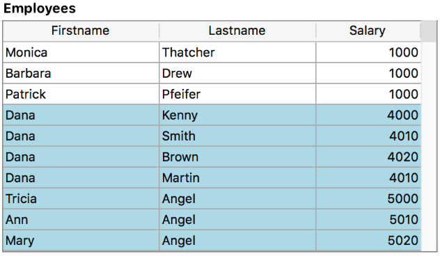

<!--REF #_command_.FORM Event.Syntax-->**FORM Event** : Object<!-- END REF-->

<!--REF #_command_.FORM Event.Params-->

| Paramètres | Type   |                             | Description     |
| ---------- | ------ | --------------------------- | --------------- |
| Résultat   | Object | &#8592; | Objet événement |

<!-- END REF-->

#### Description

<!--REF #_command_.FORM Event.Summary-->**FORM Event** returns an object containing information about the form event that has just occurred.<!-- END REF-->**FORM Event** returns an object containing information about the form event that has just occurred.**FORM Event** returns an object containing information about the form event that has just occurred.**FORM Event** returns an object containing information about the form event that has just occurred.**FORM Event** returns an object containing information about the form event that has just occurred.**FORM Event** returns an object containing information about the form event that has just occurred.**FORM Event** returns an object containing information about the form event that has just occurred.**FORM Event** returns an object containing information about the form event that has just occurred.**FORM Event** returns an object containing information about the form event that has just occurred.**FORM Event** returns an object containing information about the form event that has just occurred.**FORM Event** returns an object containing information about the form event that has just occurred.**FORM Event** retourne un objet contenant des informations sur l'événement formulaire qui vient de se produire. Habituellement, vous utiliserez **FORM Event** à partir d'une méthode formulaire ou objet.

**Objet retourné**

Chaque objet retourné comprend les principales propriétés suivantes :

| **Propriété** | **Type** | **Description**                                                                                                                                                                               |
| ------------- | -------- | --------------------------------------------------------------------------------------------------------------------------------------------------------------------------------------------- |
| objectName    | text     | Nom de l'objet générant l'événement - Non inclus si l'événement est déclenché par le formulaire                                                                                               |
| code          | integer  | Valeur numérique de l'événement formulaire.                                                                                                                                   |
| Description   | text     | Name of the form event (*e.g.* "On After Edit"). See the [**Form Events**](../Events/overview.md) section. |

Par exemple, dans le cas d'un clic sur un bouton, l'objet contient les propriétés suivantes :

```json
{"code":4,"description":"On Clicked","objectName":"Button2"}
```

L'objet événement peut contenir des propriétés supplémentaires, en fonction de l'objet pour lequel l'événement se produit. Pour les objets *eventObj* générés sur:

- List box or list box column objects, see the *list box documentation on developer.4d.com*.
- 4D View Pro areas, see *On VP Ready form event*.

**Note:** If there is no current event, **FORM Event** returns a null object.

#### Exemple 1

You want to handle the On Clicked event on a button:

```4d
 If(FORM Event.code=On Clicked)
    ...
 End if
```

#### Exemple 2

If you set the column object name with a real attribute name of a dataclass like this:


Vous pouvez trier la colonne à l'aide de l'événement On Header Click :

```4d
 Form.event:=FORM Event
 Case of
    :(Form event code=On Header Click)
       if(Form.event.columnName="lastname")
          Form.employees:=Form.employees.orderBy(Form.event.columnName+", firstname")
       End if
 End case
```

#### Exemple 3

Vous voulez gérer On Display Details sur un objet list box avec une méthode définie dans la propriété *Meta info expression* :


La méthode *setColor* :

```4d
 var $event;$0;$meta : Object
 $event:=FORM Event
 $meta:=New object
 
 Case of
    :($event.code=On Display Detail)
       If($event.isRowSelected)
          $meta.fill:="lightblue"
       End if
 End case
 $0:=$meta
```

La zone de liste résultante lorsque des lignes sont sélectionnées :



#### Voir également

[Form Events](../Events/overview.md)
[Form event code](form-event-code.md)

#### Propriétés

|                    |                                                                 |
| ------------------ | --------------------------------------------------------------- |
| Numéro de commande | 1606                                                            |
| Thread safe        | &amp;amp;amp;amp;amp;amp;amp;amp;amp;check; |
