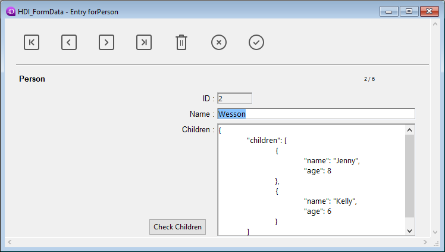

<!--REF #_command_.Form.Syntax-->**Form**  : Object<!-- END REF-->

<!--REF #_command_.Form.Params-->

| Paramètres | Type   |                             | Description                  |
| ---------- | ------ | --------------------------- | ---------------------------- |
| Résultat   | Object | &#8592; | Données du formulaire actuel |

<!-- END REF-->

<details><summary>Historique</summary>

| Release | Modifications                      |
| ------- | ---------------------------------- |
| 20 R8   | Support des classes de formulaires |

</details>

## Description

<!--REF #_command_.Form.Summary-->The **Form** command returns the object associated with the current form (instantiated from the *formData* parameter or the user class assigned in the Form editor).<!-- END REF-->La commande **Form** renvoie l'objet associé au formulaire en cours (instancié à partir du paramètre *formData* ou de la classe utilisateur assignée dans l'éditeur de formulaires). 4D associe automatiquement un objet au formulaire courant dans les cas suivants :

- le formulaire courant a été chargé par l'une des commandes [`DIALOG`](dialog.md), [`Print form`](print-form.md), ou [`FORM LOAD`](form-load.md),
- le formulaire courant est un sous-formulaire,
- un formulaire table est actuellement affiché à l'écran.

### Commandes (DIALOG...)

Si le formulaire courant est affiché ou chargé par un appel aux commandes [DIALOG](dialog.md), [`Print form`](print-form.md) ou [`FORM LOAD`](form-load.md), **Form** renvoie soit :

- l'objet *formData* passé en paramètre à cette commande, le cas échéant,
- ou un objet instancié de la [classe utilisateur associée au formulaire](../FormEditor/properties_FormProperties.md#form-class), le cas échéant,
- ou un objet vide.

### Sous-formulaire

Si le formulaire courant est un sous-formulaire, l'objet renvoyé dépend de la variable du conteneur parent :

- Si la variable associée au conteneur parent a été typée comme objet, **Form** renvoie la valeur de cette variable.\
 Dans ce cas, l'objet renvoyé par **Form** est le même que celui renvoyé par l'expression suivante :

```4d
 (OBJECT Get pointer(Object subform container))->  
```

- Si la variable associée au conteneur parent n'a pas été typée en tant qu'objet, **Form** renvoie un objet vide, géré par 4D dans le contexte du sous-formulaire.

Pour plus d'informations, veuillez vous référer à la section *Sous-formulaires en page*.

### Formulaire table

**Form** retourne l'objet associé au formulaire table affiché à l'écran. Dans le contexte d'un formulaire de saisie affiché à partir d'un formulaire de sortie (c'est-à-dire après un double-clic sur un enregistrement), l'objet retourné contient la propriété suivante :

| **Propriété** | **Type** | **Description**                               |
| ------------- | -------- | --------------------------------------------- |
| parentForm    | object   | Objet **Form** du formulaire de sortie parent |

## Exemple

Dans un formulaire affichant l'enregistrement d'une personne, un bouton ouvre un dialogue permettant de vérifier ou de modifier les noms et âges de ses enfants :



**Note :** Le champ objet "enfants" est représenté uniquement dans cet exemple afin de faire apparaître sa structure.

Dans le formulaire de vérification, vous avez attribué certaines propriétés de l'objet Form aux objets de saisie :


Voici le code du bouton "Check Children" :

```4d
 var $win;$n;$i : Integer
 var $save : Boolean
 ARRAY OBJECT($children;0)
 OB GET ARRAY([Person]Children ; "children" ;$children) //obtient la collection d'enfants
 $save:=False //initialise la variable de sauvegarde
 
 $n:=Size of array($children)
 If($n>0)
    $win:=Open form window("Edit_Children";Movable form dialog box)
    SET WINDOW TITLE("Vérifier les enfants pour "+[Person]Name")
    For($i;1 ;$n) //pour chaque enfant
       DIALOG("Edit_Children" ;$children{$i}) //affiche la boîte de dialogue remplie de valeurs
       If(OK=1) //l'utilisateur a cliqué sur OK
          $save:=True
       End if
    End for
    If($save=True)
       [Person]Children:=[Person]Children //forces object field update
    End if
    CLOSE WINDOW($win)
 Else
    ALERT("No child to check.")
 End if
```

Le formulaire affiche des informations pour chaque enfant :


Si des valeurs sont modifiées et que l'utilisateur clique sur le bouton OK, le champ est mis à jour (bien entendu, l'enregistrement parent devra être sauvegardé par la suite).

## Voir également

[DIALOG](dialog.md)

## Propriétés

|                    |                             |
| ------------------ | --------------------------- |
| Numéro de commande | 1466                        |
| Thread safe        | &cross; |


