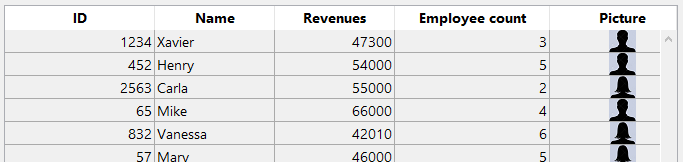
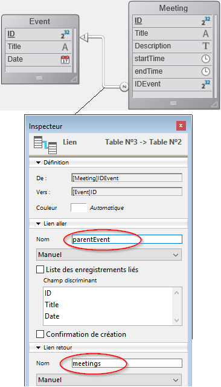

<!--REF #_command_.This.Syntax-->**This** : Object<!-- END REF-->

<!--REF #_command_.This.Params-->

| Paramètres | Type   |   | Description              |
| ---------- | ------ | - | ------------------------ |
| Résultat   | Object | ← | Élément ou objet courant |

<!-- END REF-->

#### Description

La commande `This` <!--REF #_command_.This.Summary-->renvoie une référence à l'objet en cours de traitement.<!-- END REF-->

Dans la plupart des cas, la valeur de `This` est déterminée par la manière dont une fonction est appelée. Elle ne peut pas être définie par affectation lors de l'exécution, et elle peut être différente à chaque fois que la fonction est appelée.

Cette commande peut être utilisée dans différents contextes, décrits ci-dessous. Dans ces contextes, vous accéderez aux propriétés des objets/éléments de collections ou aux attributs des entités par l'intermédiaire de **This.<*propertyPath*\>**. Par exemple, *This.name* ou *This.employer.lastName* sont des chemins d'accès valides vers des propriétés d'objets, d'éléments ou d'entités.

Dans tout autre contexte, la commande renvoie **Null**.

#### Fonction de classe

Quand un [constructeur de classe](#class-constructor) est utilisé (avec la fonction [`new()`](API/ClassClass.md#new)), son `This` est lié au nouvel objet en cours de construction.

```4d
//Class: ob

Class Constructor  

 // Créer des propriétés en
 // les assignant au This
 This.a:=42
```

```4d
// dans une méthode 4D  
$o:=cs.ob.new()
$val:=$o.a //42
```

> En cas d'appel de la superclasse du constructeur depuis le constructeur en utilisant le mot-clé [Super](#super), n'oubliez pas que `This` ne doit pas être appelé avant le constructeur de la superclasse, sinon une erreur est générée. Voir [cet exemple](super.md#example-1).

Dans tous les cas, `This` se réfère à l'objet sur lequel la fonction a été appelée, comme s'il s'agissait d'une fonction de l'objet.

```4d
//Classe : ob

Function f() : Integer
 return This.a+This.b
```

Vous pouvez donc écrire dans une méthode projet :

```4d
$o:=cs.ob.new()
$o.a:=5
$o.b:=3
$val:=$o.f() //8

```

Dans cet exemple, l'objet affecté à la variable $o n'a pas de propriété *f*, il hérite de celle de sa classe. Comme *f* est appelée comme une méthode de $o, son `This` se réfère à $o.

#### Objet formule

Dans le contexte de l'exécution d'un objet formule créé par les commandes [Formula](formula.md) ou [Formula from string](formula-from-string.md), `This` renvoie une référence à l'objet en cours de traitement par la formule.

Par exemple, vous souhaitez utiliser une méthode projet en tant que formule encapsulée dans un objet :

```4d
 var $person : Objet := New object
 $person.firstName:="John"
 $person.lastName:="Smith"
 $person.greeting:=Formula(Greeting)
 $g:=$person.greeting("hello") // retourne "hello John Smith"
 $g:=$person.greeting("hi") // retourne "hi John Smith"
```

Avec la méthode projet *Greeting* :

```4d
 #DECLARE($greeting : Text) : Text
 return $greeting+" "+This.firstName+" "+This.lastName
```

#### List box

Dans le contexte d'une list box associée à une collection ou à une entity selection, pendant les événements [`On Display Detail`](../Events/onDisplayDetail.md) ou [`On Data Change`](../Events/onDataChange.md), `This` retourne une référence à l'élément de collection ou à l'entité auquel accède la list box pour afficher la ligne courante.

:::note

Si vous utilisez une collection de valeurs scalaires dans une list box, 4D crée un objet pour chaque élément avec une propriété **value** unique. Ainsi, la valeur de l'élément est retournée par l'expression non assignable **This.value**.

:::

#### Exemple 1

Une collection d'objets, chacun avec cette structure :

```json
{  
"ID": 1234
"name": "Xavier",  
"revenues": 47300,  
"employees": [  
             "Allan",  
             "Bob", 
             "Charlie"  
            ] 
},{  
"ID": 2563
"name": "Carla",  
"revenues": 55000,  
"isFemale": true
"employees": [  
             "Igor",  
             "Jane"  
            ] 
},...
 
```

Dans la list box, chaque colonne fait référence à l'une des propriétés de l'objet, soit directement (This.name), soit indirectement (This.employees.length), soit par le biais d'une expression (*getPicture*) qui peut être utilisée directement. La list box se présente ainsi :


La méthode projet *GetPicture* est automatiquement exécutée lors de l'événement **On display detail** :

```4d
  //GetPicture Method
 #DECLARE -> $genderPict : Picture
 If(This.isFemale)
    $genderPict:=Form.genericFemaleImage
 Else
    $genderPict:=Form.genericMaleImage
 End if
```

Une fois le formulaire exécuté, vous pouvez voir le résultat :



#### Exemple 2

Vous voulez afficher les entités de la structure suivante dans une list box :



Vous construisez une list box de type "Collection ou entity selection" avec la définition suivante :


A noter que :

- *This.ID*, *This.Title* et *This.Date* référencent directement les attributs correspondants de la dataclass ds.Event.
- *This.meetings* est un attribut relatif (basé sur le nom de relation 1 vers N) qui renvoie une entity selection de la dataclass ds.Meeting .
- **Form.eventList** est l'entity selection attachée à la list box. Le code d'initialisation peut être placé dans l'événement formulaire on load :

```4d
 Case of  
    :(Form event code=On Load)  
       Form.eventList:=ds.Event.all() //retourne une entity selection avec toutes les entités  
 End case  
```

Une fois le formulaire exécuté, la list box est automatiquement remplie avec l'entity selection :


#### Voir également

[Self](../commands-legacy/self.md)\
[Super](super.md)

#### Propriétés

|                    |                                                                 |
| ------------------ | --------------------------------------------------------------- |
| Numéro de commande | 1470                                                            |
| Thread safe        | &amp;amp;amp;amp;amp;amp;amp;amp;amp;check; |
