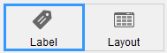
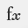

L'éditeur d'étiquettes de 4D offre un moyen pratique d'imprimer une grande variété d'étiquettes. Il vous permet en particulier de :

- construire des étiquettes pour réaliser des mailings, des catalogues,
- créer ou insérer des éléments décoratifs dans un modèle d’étiquettes,
- définir la police, la taille et le style des caractères utilisés,
- déterminer le nombre d’étiquettes pouvant “tenir” sur chaque page,
- définir le nombre d’étiquettes à imprimer par enregistrement,
- fixer les marges de la planche d’étiquettes,
- désigner une méthode à exécuter lors de l’impression de chaque étiquette ou enregistrement,
- créer un aperçu et imprimer les étiquettes.

:::note

Les étiquettes peuvent également être créées à l'aide de l'[Éditeur de formulaires](../FormEditor/formEditor.md). Utilisez l'éditeur de formulaires pour concevoir des étiquettes spécialisées qui incluent des variables ou profitez des outils de dessin disponibles dans l'éditeur de formulaires et imprimez-les en utilisant l'éditeur d'étiquettes ou la commande [`PRINT LABEL`](../commands-legacy/print-label.md).

:::

L'éditeur d'étiquettes permet de créer, de formater et d'imprimer des étiquettes. Il contient des paramètres pour la conception d'étiquettes et le positionnement des étiquettes sur le papier d'étiquette. Par exemple, lorsque vous créez des étiquettes d’adresses pour un mailing, vous voulez que chaque étiquette contienne, sur la première ligne, le prénom et le nom d’une personne, son adresse sur la deuxième ligne, etc. Dans le cadre de la conception, l'éditeur d'étiquettes vous permet de spécifier le nombre d'étiquettes sur la page et les marges du papier d'étiquette afin que le texte de l'étiquette soit centré dans les étiquettes.
Une fois que vous avez terminé un modèle d’étiquette, vous pouvez le sauvegarder sur disque pour pouvoir le réutiliser par la suite.

Pour ouvrir l’éditeur d’étiquettes :

- En mode Développement, sélectionnez **Etiquettes...** dans le menu **Outils** ou dans le menu associé au bouton “Outils” dans la barre d’outils de 4D.
 OU
- En mode Application, utilisez la commande [`PRINT LABEL`](../commands-legacy/print-label.md) .


La page Étiquette permet de spécifier le contenu de l'étiquette et la page Planche permet de définir la taille et la position des étiquettes sur la page.



## Page Etiquette

La page Étiquette contient plusieurs zones de paramétrage pour la conception et la mise en forme des étiquettes.

### Liste des champs

Affiche les noms des champs de la table courante sous forme de liste hiérarchique. Si cette table est liée à d'autres tables, les champs de la clé étrangère ont un signe plus (sous Windows) ou une flèche (sous macOS). Vous pouvez afficher les champs de la table liée en développant les champs liés. Les champs de la table correspondante sont indentés. Pour utiliser un champ de cette liste dans le modèle d'étiquette, il suffit de le faire glisser dans la zone de prévisualisation de l'étiquette à droite de la liste.

:::note Notes

- Seuls les tables et les champs visibles apparaissent dans l'éditeur d'étiquettes.
- Les champs de [type Objet](../Concepts/dt_object.md) ne sont pas pris en charge par l'éditeur d'étiquettes.

:::

La zone de recherche vous permet de limiter la liste des champs affichés à ceux qui contiennent la chaîne de caractères saisie :


### Zone graphique de construction du modèle

Cette zone vous permet d’insérer tous les éléments que vous souhaitez voir figurer sur chaque étiquette et de visualiser précisément le résultat. Le rectangle blanc situé au centre de la zone représente une étiquette (ses dimensions sont paramétrées dans la [page "Planche"](#layout-page)).

- Vous pouvez faire glisser des champs sur l'étiquette.
- Vous pouvez concaténer deux champs en déposant le second sur le premier. Ils seront automatiquement séparés par un espace.<br/>
 <br/>
 Si vous appuyez sur la touche **Maj**, ils seront séparés par un retour chariot. Ce fonctionnement permet par exemple de créer des étiquettes d’adresses utilisant plusieurs champs superposés (Adresse1, Adresse2, etc.) ne générant pas de ligne vide lorsqu’une adresse ne requiert qu’un champ.
- Vous pouvez ajouter une formule à l'étiquette en sélectionnant l'outil **Formule**  (ou en choisissant **Outil>Formule** dans le menu contextuel) et en dessinant une zone. L'**Éditeur de formules** s'affiche alors :
 <br/>
 Par exemple, vous pouvez appliquer un format à un champ à l'aide de la commande [`String`](../commands-legacy/string.md) :<br/>

<br/>

:::note

N'oubliez pas que vous ne pouvez saisir que des méthodes "autorisées" pour la base de données dans l'Editeur de formules. Les méthodes autorisées dépendent des [paramètres du projet](../settings/security.md#options) et de la commande [`SET ALLOWED METHODS`](../commands/set-allowed-methods.md).

:::

- Vous pouvez glisser-déposer des fichiers image ainsi que des fichiers d'étiquettes (fichiers ".4lbp" uniquement) depuis le bureau du système d'exploitation.

- Pour modifier la zone, double-cliquez sur le contenu afin de passer en mode édition. Lorsque vous double-cliquez sur des champs ou des formules, l'**Éditeur de formules** s'affiche, vous permettant de supprimer ou de modifier des éléments :
 

### Formulaire à utiliser

Cette liste déroulante permet de définir un formulaire table comme modèle d'étiquette. Le formulaire choisi doit être spécialement adapté à la création d’étiquettes.
Dans ce cas, l’éditeur d’étiquettes est partiellement désactivé : seules les fonctions de la [page “Planche”](#layout-page) sont utilisables — pour vous permettre de paramétrer la page en fonction du formulaire. L’image du formulaire sélectionné s’affiche toutefois dans la zone de construction du modèle.
Lorsque vous utilisez un formulaire, 4D exécute les méthodes objet et la méthode formulaire qui lui sont éventuellement associées. Lorsque vous utilisez cette option, vous pouvez également désigner une méthode projet à exécuter pour chaque enregistrement ou étiquette et ainsi assigner des variables (voir [cet exemple](#printing-labels-using-forms-and-methods-example) ci-dessous). Si vous souhaitez créer vos étiquettes à l'aide de l'éditeur lui-même, vous devez choisir l'option **Pas de formulaire**.

:::note Notes

- Vous pouvez limiter les formulaires listés dans ce menu à l'aide d'un [fichier json spécifique](#controlling-available-forms-and-methods).
- Si la base ne contient aucun formulaire table, le menu n'est pas affiché.

:::

### Commandes de la zone graphique

La zone graphique de l'éditeur est doté d'une barre d'outils ainsi que d'un menu contextuel vous permettant de configurer votre modèle d'étiquettes.

La partie de gauche de la barre d'outils comporte les commandes de sélection et d'insertion d'objets. Vous pouvez également y accéder via la commande **Outil>** du menu contextuel de la zone.

| Icône                                     | Nom de l'outil        | Description                                                                                                                                                                                                                          |
| ----------------------------------------- | --------------------- | ------------------------------------------------------------------------------------------------------------------------------------------------------------------------------------------------------------------------------------ |
|  | Sélections            | Vous pouvez cliquer sur un objet ou tracer une zone afin de sélectionner plusieurs objets. Pour une sélection discontinue d'objets, appuyez sur **Maj** et cliquez sur chaque objet à sélectionner.  |
|  | Création de ligne     |                                                                                                                                                                                                                                      |
|  | Création de rectangle | Pour création de rectangle ou rectangle arrondi.                                                                                                                                                                     |
|  | Création de cercle    |                                                                                                                                                                                                                                      |
|  | Insertion de texte    | Tracez une zone rectangle et saisissez du texte à l'intérieur de la zone. Vous pouvez éditer toute zone de texte, y compris les zones contenant des références de champs, en double-cliquant dessus. |
|  | Insertion de formule  | Tracez un rectangle pour afficher l'**Éditeur de formules**, où vous pouvez définir le contenu dynamique des étiquettes (champs et formules).                                                     |

Vous disposez de raccourcis permettant de déplacer ou de redimensionner précisément les objets à l'aide des touches de direction du clavier :

- Les touches de direction du clavier permettent de déplacer la sélection d’objets de 1 pixel.
- **Maj** + touches de direction permettent de déplacer la sélection d’objets de 10 pixels.
- **Ctrl** + touches de direction permettent d'agrandir ou de réduire la sélection d’objets de 1 pixel.
- **Ctrl** + **Maj** + touches de direction permettent d'agrandir ou de réduire la sélection d’objets de 10 pixels.

La partie droite de la barre d'outils contient les commandes permettant de modifier les éléments du modèle :

| Icône                                      | Nom de l'outil               | Description                                                                                                                                                                                                                                                                                                                                                            |
| ------------------------------------------ | ---------------------------- | ---------------------------------------------------------------------------------------------------------------------------------------------------------------------------------------------------------------------------------------------------------------------------------------------------------------------------------------------------------------------- |
|   | Couleur de remplissage       | toutes les icônes de couleur affichent la couleur sélectionnée                                                                                                                                                                                                                                                                                                         |
|   | Couleur du trait             |                                                                                                                                                                                                                                                                                                                                                                        |
|   | Epaisseur des lignes         |                                                                                                                                                                                                                                                                                                                                                                        |
|  | Menu de gestion de la police | Permet de définir la police, la taille de police, ainsi que le style, la couleur et l'alignement du texte pour le(s) bloc(s) de texte sélectionné(s).                                                                                                                                         |
|  | Alignement et répartition    | Pour l'alignement, deux objets au moins doivent être sélectionnés. "Répartir" des objets signifie définir automatiquement les intervalles horizontaux ou verticaux entre au moins trois objets, de manière à ce qu’ils soient identiques. L’intervalle obtenu est une moyenne de tous ceux existant dans la sélection. |
|  | Plan des objets              | Permet de faire passer les objets à l’arrière-plan ou au premier plan, ou encore faire passer un ou plusieurs objets sur le plan suivant ou précédent.                                                                                                                                                                                                 |

## Page Planche

Cette page contient des commandes permettant d'imprimer des étiquettes en fonction des exigences de vos paramètres d'impression courants.


- **Ordre étiquettes** : définit si les étiquettes doivent être imprimées dans le sens des lignes ou des colonnes.
- **Lignes** et **Colonnes** : nombre d’étiquettes que vous souhaitez imprimer par “ligne” et par “colonne” sur une planche. Ces paramètres déterminent les dimensions des étiquettes lorsque l’option “Dimensions automatiques” est activée.
- **Etiquettes par enregistrement** : nombre d’étiquettes à imprimer pour chaque enregistrement (les copies seront imprimées les unes à la suite des autres).
- **Format d’impression** : format de la feuille sur laquelle la planche d’étiquettes sera imprimée. Lorsque vous cliquez sur ce bouton, la boîte de dialogue de configuration de l’imprimante sélectionnée dans votre système s’affiche. Par défaut, la planche d’étiquettes est générée sur la base d’une page A4 en mode portrait.
 **Note :** La planche créée par l’éditeur se base sur la page logique de l’imprimante, c’est-à-dire la page physique (par exemple une feuille A4) moins les marges inutilisables de chaque côté de la feuille. Les marges de la page physique sont représentées par les filets bleus dans la zone de prévisualisation de la planche.
- **Unité** : Modifie les unités dans lesquelles vous spécifiez les mesures de l'étiquette et de la page d'étiquette. Vous pouvez utiliser des points, des millimètres, des centimètres ou des pouces.
- **Dimensions automatiques** : indique à 4D de calculer automatiquement la taille des étiquettes (c’est-à-dire les paramètres Largeur et Hauteur) en fonction des valeurs fixées dans tous les autres paramètres. Lorsque cette option est active, la taille des étiquettes est recalculée à chaque fois que vous modifiez un paramètre dans la page. Dans ce cas également, les paramètres Largeur et Hauteur ne peuvent pas être saisis manuellement.
- **Largeur** et **Hauteur** : ces zones permettent de définir manuellement la largeur et la hauteur de chaque étiquette. Ces zones ne sont pas modifiables lorsque l'option **Dimensions automatiques** est cochée.
- **Marges** (Haut , Droite, Gauche, Bas) : permet de saisir les marges de votre planche. Les marges sont symbolisées par des filets de couleur bleue dans la zone de prévisualisation. Vous pouvez cliquer sur **Appliquer les marges de l'imprimante** afin de répliquer dans les zones de marge les informations de marge fournies par l'imprimante sélectionnée (ces valeurs peuvent être modifiées).
- **Intervalles** : définit l’espacement horizontal et/ou vertical entre les étiquettes dans la planche.
- **Méthode** : ce paramètre vous permet de déclencher une méthode particulière lors de l’impression de votre planche d’étiquettes. Par exemple, vous pouvez exécuter une méthode qui enregistre la date et l'heure auxquelles chaque étiquette a été imprimée. Cette fonction est également utile lorsque vous imprimez des étiquettes à l'aide d'un formulaire table dédié, auquel cas vous pouvez remplir des variables à partir d'une méthode.
 Pour être éligible au traitement des étiquettes, une méthode projet doit respecter les conditions suivantes :
 - elle doit être "autorisée" pour la base de données (les méthodes autorisées dépendent des [paramètres du projet](../settings/security.md#options) et de la commande [`SET ALLOWED METHODS`](../commands/set-allowed-methods.md)), sinon elle ne sera pas affichée dans le menu **Appliquer**.
 - elle doit avoir l'option [Partagée entre composants et base hôte](../Project/code-overview.md#shared-by-components-and-host-database) .
  Voir aussi [cet exemple](#printing-labels-using-forms-and-methods-example) ci-dessous.

:::note

Pour des besoins avancés, vous pouvez restreindre la liste des méthodes disponibles à l'aide d'un [fichier json spécifique](#controlling-available-forms-and-methods).
Les options **A chaque : Enregistrement ou Étiquette** permettent de spécifier si la méthode doit être exécutée une fois par étiquette ou une fois par enregistrement. Ce contrôle n'a de sens que si vous imprimez plus d'une copie de chaque étiquette et que vous exécutez également une méthode au moment de l'impression.

:::

- **Zone de prévisualisation de la planche d’étiquettes** : cette zone vous permet de visualiser en temps réel les modifications que vous effectuez dans la fenêtre. L'aperçu de la page reflète également le format de papier sélectionné dans la boîte de dialogue Configuration de l'impression. Elle vous permet enfin de désigner l’étiquette à partir de laquelle débutera l’impression (cette option n’affecte que la première planche lors d’une impression multi-pages). Cette possibilité s’avère utile lorsque, par exemple, vous souhaitez imprimer sur une planche d’étiquettes autocollantes dont une partie a déjà été utilisée. Vous pouvez également sélectionner la première étiquette de la page à imprimer en cliquant dessus :


## Imprimer des étiquettes à l'aide de formulaires et de méthodes (exemple)

Vous pouvez utiliser des formulaires table dédiés et des méthodes projet pour imprimer des étiquettes contenant des variables calculées. Cet exemple simple explique comment configurer l'ensemble.

1. Dans le formulaire table à utiliser, ajoutez le(s) champ(s) et variable(s) souhaité(s).
 Ici, dans le formulaire table nommé "labels", nous ajoutons la variable *myVar* :
 

2. Créez une méthode projet nommée *setMyVar* contenant le code suivant :

```4d
 var myVar+=1
```

3. Appliquez l'option ["Partagée entre composants et projet hôte"](../Project/code-overview.md#shared-by-components-and-host-database) à la méthode projet.

4. Avant d'afficher l'éditeur d'étiquettes, assurez-vous que la méthode projet est autorisée en exécutant ce code :

```4d
 ARRAY TEXT($methods;1)
 $methods{1}:="setMyVar"
 SET ALLOWED METHODS($methods)
```

5. Ouvrez l'éditeur d'étiquettes et sélectionnez votre formulaire :
 

6. Dans la page Planche, sélectionnez la méthode :
 

Vous pouvez alors imprimer vos étiquettes :


## Définition des formulaires et méthodes utilisables

L'éditeur d'étiquettes comporte une fonction permettant de limiter spécifiquement les formulaires et les méthodes projet (parmi les méthodes autorisées du projet) qui peuvent être sélectionnés :

- dans le menu **Formulaire à utiliser** de la page "Etiquette"
- dans le menu **Méthode à appliquer** de la page "Planche".

1. Créez un fichier JSON nommé **labels.json** et placez-le dans le [dossier Resources](../Project/architecture.md#resources) du projet.
2. Dans ce fichier, listez les noms des formulaires et/ou des méthodes projet que vous autorisez dans les menus de l'éditeur d'étiquettes.

Le contenu du fichier **labels.json** devra être du type :

```json
[ 
    {"tableId":2,"forms":[],"methods":["myMethod1","myMethod2"]},
    {"tableId":1,"forms":["Sample Label 1","Sample Label 2"],"methods":[]}
]
```

Si aucun fichier **labels.json** n'a été défini, aucun filtrage n'est appliqué.

## Gestion des fichiers d'étiquettes

4D vous permet de sauvegarder chaque modèle d’étiquettes dans un fichier, que vous pourrez ouvrir par la suite depuis l’éditeur. En sauvegardant vos modèles d’étiquettes, vous pouvez vous constituer une bibliothèque d’étiquettes que vous pourrez utiliser suivant vos besoins. Un modèle conserve les paramètres définis dans les pages Etiquette et Planche.

Vous pouvez glisser-déposer des fichiers d'étiquettes depuis le bureau vers la zone de construction de l'étiquette.

La gestion des fichiers de modèle s'effectue à l'aide des boutons **Import** et **Enregistrer** de la barre d'outils.

- Pour charger un modèle d’étiquettes, cliquez sur bouton **Import** et désignez le modèle à charger dans la boîte de dialogue d'ouverture de fichiers (si un modèle d’étiquettes était présent dans l’éditeur, 4D le remplace par celui que vous avez chargé).
- Pour sauvegarder un modèle d’étiquettes, cliquez sur le bouton **Enregistrer** et indiquez le nom et l'emplacement du modèle à créer.

### Format de fichier

L'extension de fichier des étiquettes 4D sauvegardées par l'éditeur est ".4lbp". A noter que ce format est ouvert puisqu'il utilise en interne du XML.

### Préchargement de fichiers d'étiquettes

L'éditeur d 'étiquettes vous permet de stocker des fichiers d'étiquettes à l'intérieur de votre application, pouvant être directement sélectionnés et ouverts par l'utilisateur via le bouton **Import**.

Pour cela, il vous suffit de créer un sous-dossier "Labels" dans le [dossier Resources du projet](../Project/architecture.md#resources) et d'y copier vos fichiers d'étiquettes :


:::note

Les fichiers ".4lbp" standard ainsi que les fichiers générés par l'ancien éditeur (".4lb") sont pris en charge.

:::

A l'ouverture de l'éditeur d'étiquettes, si ce dossier est détecté et qu'il contient au moins un fichier d'étiquettes valide, une icône de pop up est ajoutée au bouton **Import**. Les modèles d'étiquettes peuvent ensuite être sélectionnés à l'aide d'une ligne de menu :


